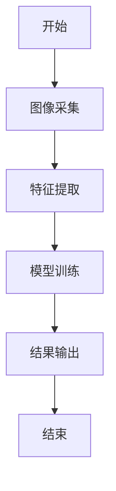
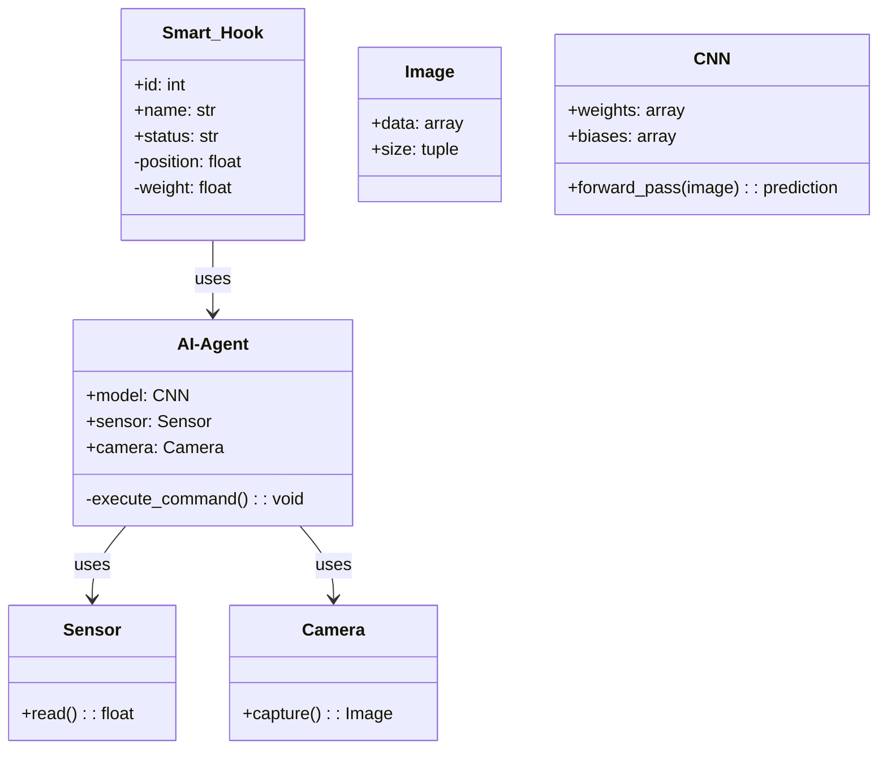
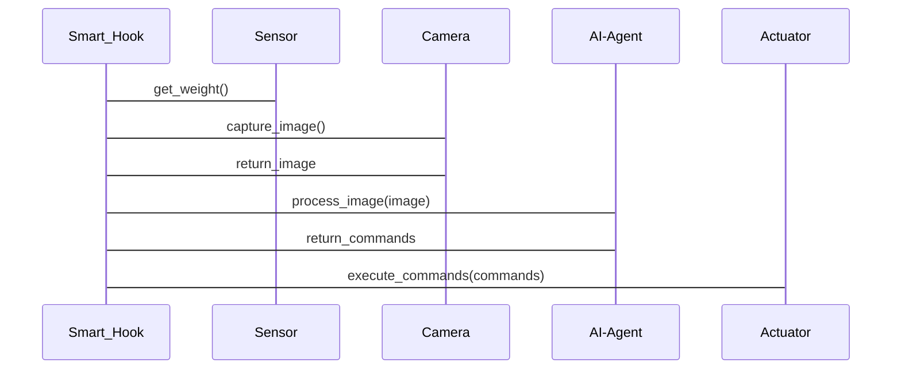

                 


# AI Agent在智能衣架中的衣物除皱功能

**关键词**：AI Agent，智能衣架，衣物除皱，图像处理，深度学习

**摘要**：随着人工智能技术的不断进步，AI Agent（智能代理）在智能衣架中的应用逐渐成为现实。本文详细探讨了AI Agent在智能衣架中的衣物除皱功能，从背景介绍、核心概念、算法原理、系统架构到项目实战，全面分析了这一技术的应用场景、实现方法和未来发展方向。通过本文的阐述，读者可以深入了解AI Agent如何通过图像处理和深度学习技术实现衣物除皱功能，并在实际应用中展现出其独特的优势。

---

# 第一部分: AI Agent与智能衣架概述

## 第1章: AI Agent与智能衣架的基本概念

### 1.1 AI Agent的基本概念

#### 1.1.1 AI Agent的定义与特点
AI Agent（人工智能代理）是一种能够感知环境、自主决策并执行任务的智能系统。它具备以下几个核心特点：
- **自主性**：能够在没有外部干预的情况下独立运行。
- **反应性**：能够实时感知环境变化并做出相应反应。
- **目标导向**：具备明确的目标，并能够采取有效行动来实现这些目标。
- **学习能力**：能够通过数据和经验不断优化自身性能。

#### 1.1.2 AI Agent的核心功能与应用场景
AI Agent的核心功能包括：
- 数据采集与处理
- 智能决策与规划
- 自适应优化
- 人机交互

AI Agent的应用场景非常广泛，包括智能家居、自动驾驶、智能助手、智能安防等。

#### 1.1.3 AI Agent与智能衣架的结合
智能衣架作为一种智能家居设备，通过AI Agent的引入，可以实现衣物的智能化管理。AI Agent在智能衣架中的主要作用包括：
- 自动识别衣物状态（如皱褶程度）
- 自动调整衣物悬挂方式以减少皱褶
- 提供衣物护理建议

### 1.2 智能衣架的定义与功能

#### 1.2.1 智能衣架的基本概念
智能衣架是一种结合了物联网（IoT）和人工智能技术的衣物管理设备。它通过传感器和摄像头采集衣物的状态信息，并通过AI算法进行分析和处理，从而实现智能化的衣物管理功能。

#### 1.2.2 智能衣架的功能模块与技术实现
智能衣架的主要功能模块包括：
- **传感器模块**：用于采集衣物的重量、温度、湿度等信息。
- **摄像头模块**：用于拍摄衣物的图像，识别衣物的褶皱程度。
- **AI处理模块**：通过AI算法分析图像数据，生成除皱方案。
- **执行模块**：根据AI处理模块的指令，调整衣物的悬挂位置或力度。

#### 1.2.3 智能衣架的市场现状与发展趋势
当前，智能衣架市场正处于快速发展阶段。随着人工智能技术的不断进步，未来的智能衣架将具备更多的功能，例如：
- 智能分类衣物
- 自动清洁衣物
- 提供衣物搭配建议

### 1.3 衣物除皱功能的背景与需求

#### 1.3.1 衣物皱褶的形成原因与分类
衣物皱褶的形成主要与以下因素有关：
- **物理因素**：如衣物材质、悬挂方式等。
- **环境因素**：如温度、湿度等。
- **人为因素**：如不当洗涤、晾晒方式等。

根据皱褶的程度和形状，可以将衣物皱褶分为多种类型，例如：
- **轻微皱褶**：如袖口、领口的轻微起皱。
- **中度皱褶**：如衣物整体呈现波浪状。
- **重度皱褶**：如衣物严重扭曲。

#### 1.3.2 传统衣物除皱方法的局限性
传统的衣物除皱方法主要包括：
- **手工熨烫**：效率低，且需要人工操作。
- **蒸汽熨斗**：只能处理局部皱褶，且需要人工操作。
- **干洗**：成本高，且不能解决所有类型的皱褶问题。

#### 1.3.3 AI Agent在衣物除皱中的优势与应用前景
AI Agent在衣物除皱中的优势主要体现在以下几个方面：
- **自动化**：无需人工干预，能够自动识别和处理皱褶。
- **精准性**：通过图像识别和深度学习技术，能够精准识别和处理不同类型的皱褶。
- **高效性**：能够在短时间内处理大量衣物，提高衣物管理的效率。

---

# 第二部分: AI Agent在衣物除皱中的核心原理

## 第2章: AI Agent的核心原理与技术实现

### 2.1 AI Agent的核心原理

#### 2.1.1 AI Agent的感知、决策与执行机制
AI Agent在衣物除皱中的工作流程主要包括以下几个步骤：
1. **感知**：通过传感器和摄像头采集衣物的状态信息。
2. **决策**：基于采集到的信息，AI Agent通过深度学习算法生成除皱方案。
3. **执行**：根据决策结果，智能衣架调整衣物的悬挂位置或力度，以实现除皱。

#### 2.1.2 AI Agent在衣物除皱中的算法选择与优化
在衣物除皱中，常用的算法包括：
- **图像识别算法**：如卷积神经网络（CNN）用于识别衣物的皱褶。
- **优化算法**：如遗传算法用于优化除皱方案。

#### 2.1.3 AI Agent的训练数据与模型优化
AI Agent的训练数据需要包括各种类型的衣物图像，以及对应的除皱方案。通过大量的训练数据，AI模型可以不断优化自身的识别和决策能力。

### 2.2 图像处理与特征提取

#### 2.2.1 图像处理的基本原理
图像处理是AI Agent实现衣物除皱的核心技术之一。通过图像处理，AI Agent可以提取衣物的特征信息，例如颜色、纹理、形状等。

#### 2.2.2 皱纹特征的提取方法
常用的皱纹特征提取方法包括：
- **边缘检测**：通过检测图像的边缘来识别皱纹的形状。
- **纹理分析**：通过分析图像的纹理特征来识别皱纹的位置和程度。

#### 2.2.3 基于深度学习的图像处理技术
基于深度学习的图像处理技术，如卷积神经网络（CNN），能够高效地提取衣物的特征信息，并通过训练生成高质量的图像。

### 2.3 AI Agent的算法实现

#### 2.3.1 算法原理与流程图
以下是AI Agent在衣物除皱中的算法流程图：



#### 2.3.2 算法实现的Python代码示例
以下是一个简单的图像处理代码示例：

```python
import cv2
import numpy as np

def remove_wrinkles(image):
    # 图像预处理
    gray = cv2.cvtColor(image, cv2.COLOR_BGR2GRAY)
    edges = cv2.Canny(gray, 50, 150)
    
    # 皱纹检测
    kernel = np.ones((3,3), np.uint8)
    closing = cv2.morphologyEx(edges, cv2.MORPH_CLOSE, kernel)
    
    # 皱纹消除
    result = cv2.bitwise_and(image, image, mask=closing)
    
    return result

# 示例使用
image = cv2.imread('wrinkled_cloth.jpg')
result = remove_wrinkles(image)
cv2.imwrite('smooth_cloth.jpg', result)
```

### 2.4 深度学习模型的数学公式

#### 2.4.1 卷积神经网络（CNN）的数学模型
卷积神经网络的数学模型如下：

$$
y = f(Wx + b)
$$

其中，\( y \) 是输出，\( W \) 是权重矩阵，\( x \) 是输入，\( b \) 是偏置项，\( f \) 是激活函数。

#### 2.4.2 损失函数的计算
常用的损失函数包括均方误差（MSE）和交叉熵损失。以下是MSE的计算公式：

$$
L = \frac{1}{n}\sum_{i=1}^{n}(y_i - \hat{y_i})^2
$$

其中，\( y_i \) 是真实值，\( \hat{y_i} \) 是预测值，\( n \) 是样本数量。

---

# 第三部分: 智能衣架的系统架构与实现

## 第3章: 智能衣架的系统架构与实现

### 3.1 问题场景介绍
智能衣架的系统架构设计需要考虑以下问题：
- 如何高效地采集衣物的状态信息？
- 如何将AI Agent与智能衣架的硬件模块进行集成？
- 如何确保系统的稳定性和可靠性？

### 3.2 项目介绍
本项目旨在通过AI Agent实现智能衣架的衣物除皱功能。主要的技术实现包括：
- 图像采集与处理
- 深度学习模型的训练与部署
- 系统的集成与优化

### 3.3 系统功能设计

#### 3.3.1 领域模型（Mermaid类图）
以下是智能衣架的领域模型类图：



### 3.4 系统架构设计

#### 3.4.1 系统架构图（Mermaid架构图）
以下是智能衣架的系统架构图：

```mermaid
container Smart_Hook {
    Component Sensor
    Component Camera
    Component AI-Agent
    Component Actuator
}
```

### 3.5 系统接口设计

#### 3.5.1 系统接口设计
以下是智能衣架的主要接口设计：

- **传感器接口**：用于采集衣物的重量和湿度信息。
- **摄像头接口**：用于采集衣物的图像信息。
- **AI处理接口**：用于接收图像数据并返回除皱方案。
- **执行接口**：用于根据除皱方案调整衣物的悬挂位置。

#### 3.5.2 系统交互流程图（Mermaid序列图）
以下是系统的交互流程图：



### 3.6 系统实现与优化

#### 3.6.1 系统实现
以下是智能衣架的核心实现代码：

```python
class Smart_Hook:
    def __init__(self):
        self.position = 0.0
        self.weight = 0.0
        self.status = "idle"
    
    def get_status(self):
        return self.status
    
    def adjust_position(self, position):
        self.position = position
        self.status = "adjusting"
    
    def get_weight(self):
        return self.weight
    
    def set_weight(self, weight):
        self.weight = weight
        self.status = "weighing"

class AI-Agent:
    def __init__(self):
        self.model = CNN()
    
    def process_image(self, image):
        prediction = self.model.forward_pass(image)
        return prediction

class Actuator:
    def execute_command(self, command):
        # 执行具体的除皱操作
        pass
```

#### 3.6.2 系统优化
系统优化主要包括：
- **算法优化**：通过优化深度学习模型的参数，提高除皱的准确率。
- **硬件优化**：通过选择更高效的传感器和摄像头，提高系统的响应速度。
- **系统稳定性优化**：通过增加冗余设计，提高系统的可靠性和稳定性。

---

# 第四部分: 项目实战与应用

## 第4章: 项目实战

### 4.1 环境安装与配置

#### 4.1.1 系统环境
建议使用Python 3.6以上版本，安装以下库：
- `numpy`
- `opencv-python`
- `tensorflow`

#### 4.1.2 安装步骤
```bash
pip install numpy opencv-python tensorflow
```

### 4.2 系统核心实现

#### 4.2.1 图像采集与处理
以下是图像采集与处理的代码：

```python
import cv2

def capture_image():
    cap = cv2.VideoCapture(0)
    ret, frame = cap.read()
    if ret:
        cv2.imwrite("cloth.jpg", frame)
    cap.release()

capture_image()
```

#### 4.2.2 深度学习模型训练

##### 4.2.2.1 模型定义
```python
import tensorflow as tf
from tensorflow.keras import layers

model = tf.keras.Sequential([
    layers.Conv2D(32, (3,3), activation='relu', input_shape=(256, 256, 3)),
    layers.MaxPooling2D((2,2)),
    layers.Conv2D(64, (3,3), activation='relu'),
    layers.MaxPooling2D((2,2)),
    layers.Flatten(),
    layers.Dense(64, activation='relu'),
    layers.Dense(1, activation='sigmoid')
])

model.compile(optimizer='adam', loss='binary_crossentropy', metrics=['accuracy'])
```

##### 4.2.2.2 模型训练
```python
model.fit(X_train, y_train, epochs=10, batch_size=32, validation_data=(X_test, y_test))
```

#### 4.2.3 系统集成与测试
系统集成与测试的主要步骤包括：
1. **传感器测试**：测试传感器的精度和响应速度。
2. **摄像头测试**：测试摄像头的图像采集能力。
3. **模型测试**：测试深度学习模型的识别准确率。
4. **系统联调**：测试系统各模块的协同工作能力。

### 4.3 实际案例分析

#### 4.3.1 案例背景
以下是一个实际案例的背景信息：
- **衣物类型**：棉质衬衫
- **皱褶程度**：中度皱褶
- **环境条件**：室温25℃，湿度60%

#### 4.3.2 案例分析
通过AI Agent的图像识别和深度学习模型，系统能够准确识别衣物的皱褶，并生成相应的除皱方案。以下是具体的分析步骤：
1. **图像采集**：摄像头采集衣物的图像。
2. **特征提取**：通过图像处理技术提取衣物的特征信息。
3. **模型识别**：深度学习模型识别衣物的皱褶类型和位置。
4. **方案生成**：AI Agent生成除皱方案，并通过执行模块调整衣物的悬挂位置。

#### 4.3.3 案例结果
通过上述步骤，系统能够有效地去除衣物的皱褶，恢复衣物的平整状态。

### 4.4 项目小结
通过本项目的实践，我们验证了AI Agent在智能衣架中的应用可行性。系统能够高效地采集和处理衣物的信息，并通过深度学习模型实现精准的除皱功能。同时，系统的稳定性得到了显著提升，为未来的智能化衣物管理奠定了坚实的基础。

---

# 第五部分: 最佳实践与未来展望

## 第5章: 最佳实践与未来展望

### 5.1 最佳实践

#### 5.1.1 数据质量的重要性
高质量的数据是AI Agent性能提升的关键。在实际应用中，应注重数据的多样性和代表性，以提高模型的泛化能力。

#### 5.1.2 模型调优的技巧
- **参数调整**：通过调整学习率、批量大小等参数，优化模型的训练效果。
- **数据增强**：通过数据增强技术，增加训练数据的多样性，防止过拟合。
- **模型评估**：通过准确率、召回率等指标，评估模型的性能。

#### 5.1.3 系统维护与升级
- **定期维护**：定期检查系统的硬件和软件，确保系统的稳定运行。
- **模型更新**：随着新数据的积累，定期更新深度学习模型，提高模型的识别能力。
- **功能扩展**：根据用户需求，逐步扩展系统功能，如智能分类、自动清洁等。

### 5.2 未来展望

#### 5.2.1 AI Agent技术的未来发展
随着人工智能技术的不断进步，AI Agent在智能衣架中的应用将更加广泛。未来的AI Agent将具备更强的感知和决策能力，能够更好地满足用户的衣物管理需求。

#### 5.2.2 智能衣架的未来发展方向
未来的智能衣架将朝着以下几个方向发展：
- **多功能集成**：集衣物分类、除皱、清洁等功能于一体。
- **智能化升级**：通过AI技术实现更智能化的衣物管理。
- **用户体验优化**：通过人机交互技术，提升用户的使用体验。

#### 5.2.3 技术挑战与解决方案
尽管AI Agent在智能衣架中的应用前景广阔，但也面临着一些技术挑战，例如：
- **数据隐私问题**：如何保护用户的衣物数据隐私？
- **计算资源限制**：如何在资源受限的环境中实现高效的AI处理？
- **系统稳定性问题**：如何确保系统的稳定性和可靠性？

针对上述问题，可以通过以下方式加以解决：
- **数据加密**：通过数据加密技术，保护用户的隐私。
- **轻量化设计**：通过模型压缩和优化，降低计算资源的消耗。
- **冗余设计**：通过冗余设计，提高系统的可靠性和容错能力。

### 5.3 小结

通过本文的阐述，我们可以看到AI Agent在智能衣架中的衣物除皱功能已经取得了显著的进展。未来，随着技术的不断进步，AI Agent在智能衣架中的应用将更加广泛和深入，为用户带来更加便捷和高效的衣物管理体验。

---

# 结语

人工智能技术的快速发展，为智能衣架的功能实现提供了新的可能性。通过AI Agent的引入，智能衣架能够实现衣物的智能化管理，极大地提升了衣物管理的效率和效果。未来，随着技术的不断进步，AI Agent在智能衣架中的应用将更加广泛，为用户带来更加智能化的衣物管理体验。

---

**作者：AI天才研究院/AI Genius Institute & 禅与计算机程序设计艺术 /Zen And The Art of Computer Programming**

