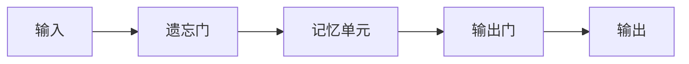
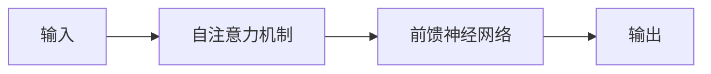

                 


# AI Agent的长短期记忆管理

> 关键词：AI Agent, 长期记忆, 短期记忆, 记忆管理, LSTM, Transformer

> 摘要：AI Agent的长短期记忆管理是实现智能体高效信息处理和决策能力的关键技术。本文从基本概念出发，详细分析了长短期记忆管理的核心原理、算法实现、系统架构，并结合实际案例，深入探讨了AI Agent在长短期记忆管理中的应用与优化。通过本文的阐述，读者将能够全面理解长短期记忆管理的技术细节，并能够将其应用于实际项目中。

---

## 第1章: AI Agent的基本概念与背景介绍

### 1.1 AI Agent的基本概念

#### 1.1.1 AI Agent的定义与特点

AI Agent（人工智能代理）是指能够感知环境、自主决策并执行任务的智能实体。AI Agent具有以下特点：
- **自主性**：能够在没有外部干预的情况下独立运作。
- **反应性**：能够实时感知环境并做出响应。
- **目标导向性**：具有明确的目标，并能够为实现目标而行动。
- **学习能力**：能够通过经验改进自身的性能。

#### 1.1.2 AI Agent的应用场景

AI Agent广泛应用于多个领域，包括：
- **自动驾驶**：如自动驾驶汽车中的路径规划和决策系统。
- **智能助手**：如Siri、Alexa等智能语音助手。
- **游戏AI**：如电子游戏中智能NPC的行为控制。
- **推荐系统**：如电商平台上基于用户行为的个性化推荐。

#### 1.1.3 AI Agent的长短期记忆管理的重要性

AI Agent需要处理大量信息，并根据这些信息做出决策。长短期记忆管理是AI Agent高效运作的核心技术，它能够帮助AI Agent：
- **高效存储**：合理存储信息，避免信息过载。
- **快速检索**：快速获取所需信息，提高决策效率。
- **智能更新**：根据环境变化动态更新记忆内容，确保记忆的有效性。

---

## 第2章: 长短期记忆管理的核心概念

### 2.1 长期记忆管理的原理

#### 2.1.1 长期记忆的存储机制

长期记忆是指AI Agent在长时间跨度内存储的重要信息。这些信息通常与AI Agent的核心目标和长期任务相关。长期记忆的存储机制包括：
- **持久化存储**：将信息持久化存储在数据库或文件系统中。
- **结构化存储**：将信息组织成结构化的数据格式，便于后续检索和分析。

#### 2.1.2 长期记忆的检索机制

长期记忆的检索机制包括：
- **基于关键词的检索**：通过关键词快速定位所需信息。
- **基于上下文的检索**：根据当前环境和任务需求，智能检索相关记忆内容。

#### 2.1.3 长期记忆的更新机制

长期记忆的更新机制包括：
- **定期更新**：定期对长期记忆进行更新，确保信息的时效性。
- **事件驱动更新**：当发生重要事件时，触发长期记忆的更新。

### 2.2 短期记忆管理的原理

#### 2.2.1 短期记忆的存储机制

短期记忆是指AI Agent在短时间内需要处理的信息。这些信息通常与当前任务直接相关。短期记忆的存储机制包括：
- **临时存储**：将短期记忆存储在内存中，任务完成后自动清除。
- **基于优先级的存储**：根据信息的重要性进行分类存储，优先处理高优先级信息。

#### 2.2.2 短期记忆的检索机制

短期记忆的检索机制包括：
- **基于优先级的检索**：优先检索高优先级信息。
- **基于时间的检索**：根据信息的有效期进行检索，确保信息的实时性。

#### 2.2.3 短期记忆的更新机制

短期记忆的更新机制包括：
- **动态更新**：实时更新短期记忆内容，确保信息的准确性。
- **基于反馈的更新**：根据任务执行结果，动态调整短期记忆内容。

### 2.3 长短期记忆管理的联系与协同

#### 2.3.1 长短期记忆的协同机制

长短期记忆的协同机制包括：
- **信息共享**：长期记忆和短期记忆之间可以共享信息，确保信息的一致性。
- **协同更新**：长期记忆和短期记忆可以根据任务需求协同更新，确保信息的完整性。

#### 2.3.2 长短期记忆的整合策略

长短期记忆的整合策略包括：
- **基于任务的整合**：根据任务需求，动态调整长短期记忆的权重。
- **基于上下文的整合**：根据当前环境和上下文信息，智能整合长短期记忆内容。

#### 2.3.3 长短期记忆管理的动态平衡

长短期记忆管理的动态平衡包括：
- **记忆容量的动态调整**：根据任务需求和环境变化，动态调整长短期记忆的容量。
- **记忆权重的动态调整**：根据信息的重要性和时效性，动态调整长短期记忆中信息的权重。

---

## 第3章: 长短期记忆管理的算法原理

### 3.1 长期记忆管理的算法原理

#### 3.1.1 基于LSTM的长期记忆管理

LSTM（长短期记忆网络）是一种广泛应用于长期记忆管理的算法。其核心思想是通过遗忘门和输出门来控制信息的流动。



#### 3.1.2 LSTM的数学模型与公式

LSTM的数学模型包括遗忘门、记忆单元和输出门的计算公式：

$$ \text{遗忘门: } f_t = \sigma(W_f x_t + U_f h_{t-1} + b_f) $$
$$ \text{记忆单元: } g_t = \tanh(W_g x_t + U_g h_{t-1} + b_g) $$
$$ \text{输出门: } o_t = \sigma(W_o x_t + U_o h_{t-1} + b_o) $$
$$ \text{最终输出: } h_t = o_t \cdot g_t $$

#### 3.1.3 LSTM的Python实现

以下是一个简单的LSTM实现示例：

```python
import numpy as np

class LSTM:
    def __init__(self, input_size, hidden_size):
        self.W_f = np.random.randn(input_size, hidden_size)
        self.U_f = np.random.randn(hidden_size, hidden_size)
        self.b_f = np.zeros(hidden_size)
        self.W_g = np.random.randn(input_size, hidden_size)
        self.U_g = np.random.randn(hidden_size, hidden_size)
        self.b_g = np.zeros(hidden_size)
        self.W_o = np.random.randn(input_size, hidden_size)
        self.U_o = np.random.randn(hidden_size, hidden_size)
        self.b_o = np.zeros(hidden_size)

    def forward(self, x, h_prev, c_prev):
        f = sigmoid(np.dot(x, self.W_f) + np.dot(h_prev, self.U_f) + self.b_f)
        g = tanh(np.dot(x, self.W_g) + np.dot(h_prev, self.U_g) + self.b_g)
        o = sigmoid(np.dot(x, self.W_o) + np.dot(h_prev, self.U_o) + self.b_o)
        c = f * c_prev + o * g
        h = o * c
        return h, c

def sigmoid(x):
    return 1 / (1 + np.exp(-x))

def tanh(x):
    return (np.exp(x) - np.exp(-x)) / (np.exp(x) + np.exp(-x))
```

---

## 第4章: 短期记忆管理的算法原理

### 4.1 短期记忆管理的算法原理

#### 4.1.1 基于Transformer的短期记忆管理

Transformer是一种广泛应用于短期记忆管理的算法。其核心思想是通过自注意力机制来捕捉信息之间的关系。



#### 4.1.2 Transformer的数学模型与公式

Transformer的数学模型包括自注意力机制和前馈神经网络的计算公式：

$$ \text{自注意力机制: } \text{Attention}(Q, K, V) = \text{softmax}\left(\frac{QK^T}{\sqrt{d_k}}\right)V $$
$$ \text{前馈神经网络: } f(x) = \text{ReLU}(Wx + b) $$

#### 4.1.3 Transformer的Python实现

以下是一个简单的Transformer实现示例：

```python
import numpy as np

class Transformer:
    def __init__(self, input_size, hidden_size):
        self.W_q = np.random.randn(input_size, hidden_size)
        self.W_k = np.random.randn(input_size, hidden_size)
        self.W_v = np.random.randn(input_size, hidden_size)
        self.W_f = np.random.randn(hidden_size, input_size)
        self.b_f = np.zeros(input_size)

    def forward(self, x):
        q = np.dot(x, self.W_q)
        k = np.dot(x, self.W_k)
        v = np.dot(x, self.W_v)
        attention = np.softmax((q @ k.T) / np.sqrt(q.shape[1])) * v
        output = np.dot(attention, self.W_f) + self.b_f
        return output

def np.softmax(x):
    return np.exp(x) / np.sum(np.exp(x), axis=1, keepdims=True)
```

---

## 第5章: 长短期记忆管理的系统架构设计

### 5.1 系统功能设计

长短期记忆管理的系统功能设计包括：
- **记忆存储模块**：负责存储长短期记忆内容。
- **记忆检索模块**：负责根据需求检索长短期记忆内容。
- **记忆更新模块**：负责根据任务需求动态更新长短期记忆内容。

### 5.2 系统架构设计

长短期记忆管理的系统架构设计包括：
- **分层架构**：将系统划分为输入层、处理层和输出层。
- **模块化设计**：将系统划分为多个模块，每个模块负责特定功能。

---

## 第6章: 项目实战与案例分析

### 6.1 项目实战

#### 6.1.1 环境安装

```bash
pip install numpy matplotlib
```

#### 6.1.2 核心代码实现

```python
class MemoryManager:
    def __init__(self):
        self.long_term_memory = {}
        self.short_term_memory = {}

    def store长期记忆(self, key, value):
        self.long_term_memory[key] = value

    def retrieve长期记忆(self, key):
        return self.long_term_memory.get(key, None)

    def store短期记忆(self, key, value):
        self.short_term_memory[key] = value

    def retrieve短期记忆(self, key):
        return self.short_term_memory.get(key, None)

    def update记忆(self, key, value):
        self.long_term_memory[key] = value
        self.short_term_memory[key] = value
```

#### 6.1.3 案例分析

以下是一个简单的长短期记忆管理案例：

```python
memory_manager = MemoryManager()
memory_manager.store长期记忆('user_name', 'Alice')
memory_manager.store短期记忆('current_task', 'process_documents')
print(memory_manager.retrieve长期记忆('user_name'))  # 输出: Alice
print(memory_manager.retrieve短期记忆('current_task'))  # 输出: process_documents
memory_manager.update记忆('current_task', 'complete_task')
print(memory_manager.retrieve短期记忆('current_task'))  # 输出: complete_task
```

---

## 第7章: 总结与展望

### 7.1 总结

本文详细探讨了AI Agent的长短期记忆管理技术，包括长短期记忆管理的核心概念、算法原理、系统架构设计以及项目实战。通过本文的阐述，读者可以全面理解长短期记忆管理的技术细节，并能够将其应用于实际项目中。

### 7.2 展望

未来，长短期记忆管理技术将在以下几个方面得到进一步发展：
- **更高效的存储技术**：研究更高效的存储技术，以提高记忆管理的效率。
- **更智能的检索算法**：研究更智能的检索算法，以提高记忆管理的准确性。
- **更动态的更新机制**：研究更动态的更新机制，以提高记忆管理的实时性。

---

## 作者：AI天才研究院/AI Genius Institute & 禅与计算机程序设计艺术 /Zen And The Art of Computer Programming

