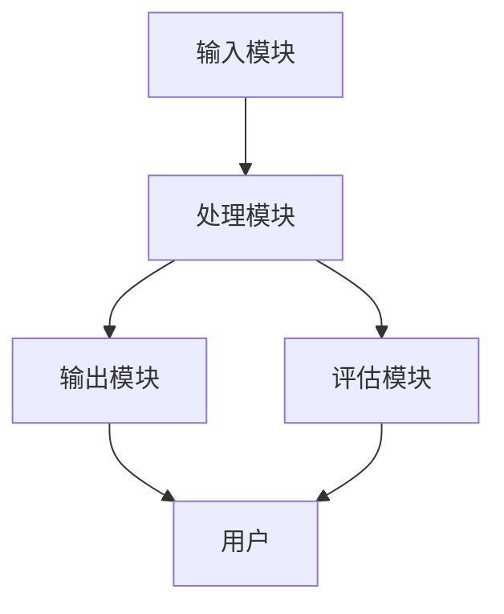
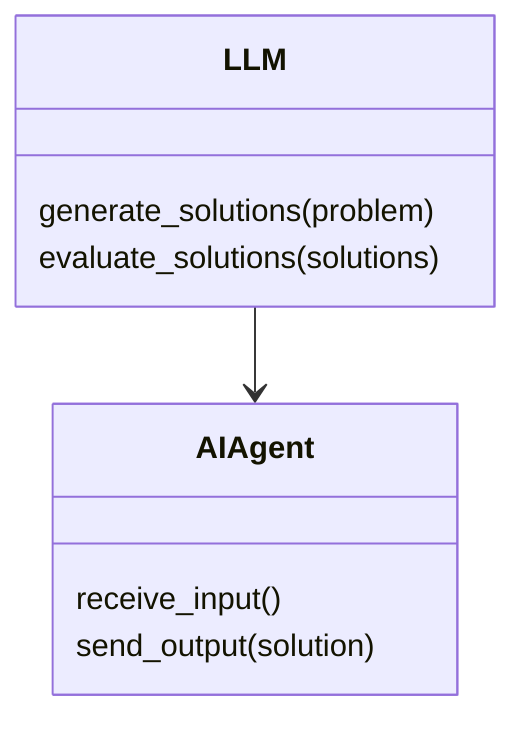
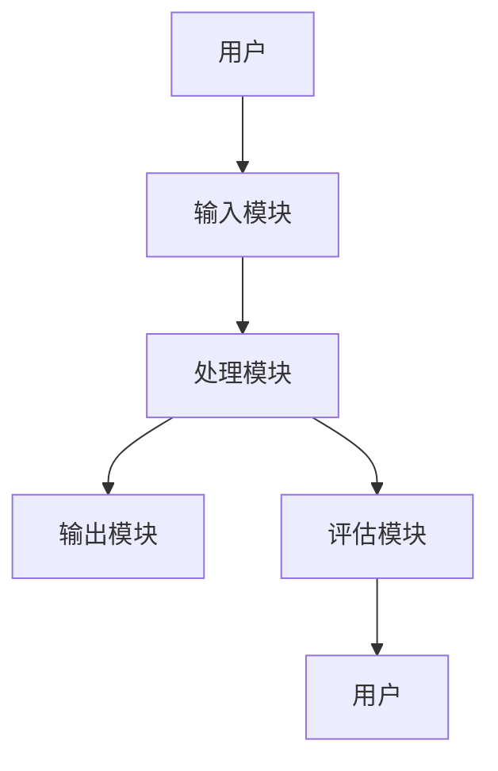

                 


# 《LLM驱动的AI Agent创新思维激发器》

---

## 关键词：
- 大语言模型（LLM）
- AI Agent
- 创新思维
- 人机协作
- 智能系统

---

## 摘要：
本文探讨了如何通过大语言模型（LLM）驱动的AI Agent来激发和增强创新思维。我们从LLM和AI Agent的基本概念出发，分析了它们在创新思维中的潜力，详细讲解了LLM驱动的AI Agent的核心原理、算法模型、系统架构以及实际应用场景。通过结合理论与实践，本文为读者提供了一种全新的视角，展示了如何利用AI技术来提升人类的创新能力和效率。

---

# 第1章: LLM与AI Agent概述

## 1.1 LLM驱动的AI Agent概念

### 1.1.1 大语言模型（LLM）的基本概念
大语言模型（LLM）是一种基于深度学习的自然语言处理模型，其核心是通过大量数据训练，生成与人类语言高度相似的文本。LLM能够理解上下文、回答问题、生成文本、进行对话等，其代表包括GPT系列、BERT系列等。

$$
\text{LLM的输出概率公式：} P(w|w_1, w_2, ..., w_{n-1}) = \text{模型计算的结果}
$$

### 1.1.2 AI Agent的核心定义与特点
AI Agent（智能代理）是一种能够感知环境、执行任务并做出决策的智能系统。它通常具备以下特点：
- 自主性：能够在没有外部干预的情况下独立运行。
- 反应性：能够实时感知环境并做出反应。
- 目标导向：通过设定目标来驱动行为。
- 学习能力：能够通过经验改进自身性能。

### 1.1.3 LLM驱动的AI Agent的创新性
传统的AI Agent通常依赖于预定义的规则和有限的知识库，而LLM驱动的AI Agent则通过大语言模型的强大生成能力，能够实时生成多样化的解决方案，从而显著提升了创新性和适应性。

---

## 1.2 LLM与AI Agent的结合

### 1.2.1 LLM在AI Agent中的作用
LLM作为AI Agent的核心模块，负责处理自然语言输入、生成自然语言输出，并为决策提供语言相关的支持。例如，当AI Agent需要解决一个问题时，LLM可以帮助生成多种可能的解决方案，并评估这些方案的可行性。

### 1.2.2 LLM与传统AI Agent的区别
| 特性 | LLM驱动的AI Agent | 传统AI Agent |
|------|------------------|---------------|
| 知识来源 | 大语言模型训练数据 | 预定义规则和知识库 |
| 创新性 | 高，能够生成多样化的解决方案 | 低，依赖于预定义规则 |
| 适应性 | 强，能够应对复杂场景 | 弱，仅能处理预设场景 |

### 1.2.3 LLM驱动的AI Agent的应用场景
LLM驱动的AI Agent在多个领域都有广泛的应用，例如：
- **教育领域**：辅助学生解决问题、提供学习建议。
- **商业领域**：帮助企业制定战略、优化流程。
- **医疗领域**：协助医生诊断疾病、制定治疗方案。

---

## 1.3 创新思维激发的背景

### 1.3.1 当前创新思维的重要性
在快速变化的时代，创新思维是个人和组织保持竞争力的关键。传统的线性思维模式已经难以应对复杂的问题，而创新思维能够帮助我们发现新的解决方案。

### 1.3.2 LLM在创新思维中的潜力
LLM通过生成多样化的语言输出，能够激发人类的创新思维。例如，当面对一个问题时，LLM可以生成多个不同的思路，帮助人类跳出常规思维的框架。

### 1.3.3 AI Agent如何辅助创新思维
AI Agent通过整合LLM的强大生成能力，能够实时为人类提供创新性的解决方案。例如，在设计一个新产品时，AI Agent可以生成多个设计方案，并帮助评估每个方案的优缺点。

---

## 1.4 本章小结
本章介绍了LLM和AI Agent的基本概念，并分析了它们在创新思维中的潜力。通过对比传统AI Agent和LLM驱动的AI Agent，我们明确了LLM驱动的AI Agent在创新性、适应性和知识来源方面的优势。

---

# 第2章: LLM与AI Agent的核心概念

## 2.1 LLM的核心原理

### 2.1.1 LLM的训练过程
大语言模型的训练过程通常包括以下步骤：
1. **数据预处理**：对大规模文本数据进行清洗、分词、格式化等预处理。
2. **模型构建**：选择合适的模型架构，如Transformer。
3. **参数初始化**：随机初始化模型参数。
4. **训练**：通过反向传播算法优化参数，最小化预测误差。
5. **微调**：在特定任务上进行微调，提升模型性能。

$$
\text{损失函数：} \mathcal{L} = -\sum_{i=1}^{n} \log P(w_i|w_{i-1}, \ldots, w_{i-n+1}})
$$

### 2.1.2 LLM的生成机制
LLM的生成机制通常包括以下步骤：
1. **输入处理**：将输入文本转换为模型可处理的形式。
2. **概率计算**：模型计算每个可能的下一个词的概率分布。
3. **生成策略**：根据概率分布选择下一个词，生成完整的文本。

### 2.1.3 LLM的局限性与改进方向
尽管LLM具有强大的生成能力，但其仍然存在以下局限性：
- 对训练数据的依赖性强。
- 可能存在偏见或错误。
- 计算资源消耗大。

---

## 2.2 AI Agent的体系结构

### 2.2.1 AI Agent的基本组成
AI Agent通常由以下几个部分组成：
1. **感知模块**：负责感知环境中的信息。
2. **推理模块**：负责理解和推理信息。
3. **决策模块**：负责制定和执行决策。
4. **执行模块**：负责执行具体的任务。

### 2.2.2 LLM在AI Agent中的位置
在LLM驱动的AI Agent中，LLM通常作为推理模块和决策模块的核心组件，负责生成多样化的解决方案并评估这些方案的可行性。

### 2.2.3 LLM驱动的AI Agent的独特性
与传统AI Agent相比，LLM驱动的AI Agent的独特性体现在以下几个方面：
- **语言生成能力**：能够生成多样化的语言表达。
- **创新性**：能够提供创新性的解决方案。
- **适应性**：能够快速适应不同的应用场景。

---

## 2.3 创新思维的激发机制

### 2.3.1 创新思维的定义与分类
创新思维是指打破常规思维模式，提出新颖解决方案的能力。常见的创新思维类型包括发散性思维、批判性思维、联想性思维等。

### 2.3.2 LLM如何模拟创新思维
LLM通过生成多样化的语言表达，模拟了人类的创新思维过程。例如，当面对一个问题时，LLM可以生成多个不同的解决方案，并帮助人类跳出常规思维的框架。

### 2.3.3 AI Agent在创新思维中的角色
AI Agent通过整合LLM的强大生成能力，能够实时为人类提供创新性的解决方案。例如，在设计一个新产品时，AI Agent可以生成多个设计方案，并帮助评估每个方案的优缺点。

---

## 2.4 核心概念对比表

| 概念 | LLM | AI Agent | LLM驱动的AI Agent |
|------|-----|----------|--------------------|
| 核心功能 | 生成文本 | 执行任务 | 综合生成与执行 |
| 优势 | 强大的语言生成能力 | 多任务处理能力 | 结合语言生成与执行 |
| 局限性 | 需依赖外部知识库 | 依赖任务规则 | 需优化任务规则与语言生成 |

---

## 2.5 本章小结
本章详细讲解了LLM和AI Agent的核心原理，并分析了它们在创新思维中的潜力。通过对比传统AI Agent和LLM驱动的AI Agent，我们明确了LLM驱动的AI Agent在创新性、适应性和知识来源方面的优势。

---

# 第3章: LLM驱动的AI Agent创新思维模型

## 3.1 创新思维模型的构建

### 3.1.1 模型构建的背景
创新思维模型的构建需要结合LLM的强大生成能力和AI Agent的执行能力，从而实现从问题分析到解决方案生成的全过程。

### 3.1.2 模型的核心要素
创新思维模型的核心要素包括：
1. **问题分析模块**：负责理解问题并生成多个可能的解决方案。
2. **解决方案生成模块**：负责生成多样化的解决方案。
3. **方案评估模块**：负责评估每个解决方案的优缺点。

### 3.1.3 模型的数学表达
$$
\text{解决方案生成：} S = f_{LLM}(P)
$$
其中，\( P \) 是问题描述，\( f_{LLM} \) 是大语言模型的生成函数。

---

## 3.2 创新思维模型的优势

### 3.2.1 与传统创新思维方法的对比
传统创新思维方法通常依赖于固定的步骤和规则，而创新思维模型则更加灵活和多样化。

### 3.2.2 创新思维模型的适用场景
创新思维模型适用于多种场景，例如：
- **产品设计**：生成多个产品设计方案。
- **问题解决**：生成多种解决方案。
- **创意生成**：生成多样化的创意。

---

## 3.3 创新思维模型的实现

### 3.3.1 实现步骤
1. **问题输入**：用户输入需要解决的问题。
2. **问题分析**：模型分析问题并生成多个可能的解决方案。
3. **方案生成**：模型生成多样化的解决方案。
4. **方案评估**：模型评估每个解决方案的优缺点。
5. **最终选择**：用户根据评估结果选择最优解决方案。

### 3.3.2 实现的代码示例
```python
def generate_solutions(problem):
    # 使用大语言模型生成多个解决方案
    solutions = llm.generate(problem)
    return solutions

def evaluate_solutions(solutions):
    # 评估每个解决方案的优缺点
    evaluations = []
    for sol in solutions:
        evaluations.append(llm.evaluate(sol))
    return evaluations

def select_best(solutions, evaluations):
    # 根据评估结果选择最优解决方案
    best = solutions[0]
    for i in range(1, len(solutions)):
        if evaluations[i] > evaluations[i-1]:
            best = solutions[i]
    return best
```

---

## 3.4 本章小结
本章详细讲解了创新思维模型的构建、优势和实现过程。通过结合LLM的强大生成能力和AI Agent的执行能力，我们能够实现从问题分析到解决方案生成的全过程。

---

# 第4章: LLM驱动的AI Agent算法原理

## 4.1 算法原理概述

### 4.1.1 LLM的训练过程
$$
\text{损失函数：} \mathcal{L} = -\sum_{i=1}^{n} \log P(w_i|w_{i-1}, \ldots, w_{i-n+1}})
$$

### 4.1.2 LLM的生成过程
$$
\text{生成概率：} P(w|w_1, w_2, ..., w_{n-1}) = \text{模型计算的结果}
$$

---

## 4.2 算法实现细节

### 4.2.1 LLM的数学模型
$$
\text{注意力机制：} \alpha_i = \frac{\exp(a_i)}{\sum_{j=1}^{n} \exp(a_j)}
$$

### 4.2.2 AI Agent的决策机制
$$
\text{决策函数：} d(x) = \arg\max_i P(i|x)
$$

---

## 4.3 算法的优化与改进

### 4.3.1 参数优化
通过调整模型的超参数（如学习率、批量大小）来优化模型性能。

### 4.3.2 模型微调
在特定任务上进行微调，提升模型的适应性。

### 4.3.3 多模态整合
将LLM与视觉、听觉等其他模态数据进行整合，提升模型的综合能力。

---

## 4.4 本章小结
本章详细讲解了LLM驱动的AI Agent的算法原理，包括模型的训练过程、生成过程以及优化策略。通过数学公式和代码示例，我们能够更好地理解模型的内在逻辑和实现细节。

---

# 第5章: LLM驱动的AI Agent系统架构

## 5.1 系统架构概述

### 5.1.1 系统功能模块
1. **输入模块**：接收用户的输入。
2. **处理模块**：对输入进行处理并生成解决方案。
3. **输出模块**：将解决方案呈现给用户。
4. **评估模块**：评估解决方案的优缺点。

### 5.1.2 系统架构图


---

## 5.2 系统功能设计

### 5.2.1 领域模型


### 5.2.2 系统架构


---

## 5.3 系统接口设计

### 5.3.1 输入接口
```python
def receive_input():
    input = input("请输入问题：")
    return input
```

### 5.3.2 输出接口
```python
def send_output(solution):
    print("最优解决方案：", solution)
```

---

## 5.4 系统交互设计

### 5.4.1 交互流程
1. 用户输入问题。
2. 系统处理问题并生成解决方案。
3. 系统输出解决方案。
4. 用户评估解决方案并选择最优方案。

---

## 5.5 本章小结
本章详细讲解了LLM驱动的AI Agent的系统架构，包括功能模块、系统架构图、接口设计和交互流程。通过这些设计，我们能够更好地理解系统的整体结构和实现细节。

---

# 第6章: LLM驱动的AI Agent项目实战

## 6.1 项目背景

### 6.1.1 项目目标
通过LLM驱动的AI Agent来解决一个具体的问题，例如设计一个创新的产品方案。

### 6.1.2 项目环境
- 操作系统：Linux/Windows/MacOS
- 开发工具：Python、Jupyter Notebook
- 模型框架：Hugging Face Transformers

---

## 6.2 项目核心实现

### 6.2.1 环境安装
```bash
pip install transformers
pip install torch
```

### 6.2.2 核心代码实现
```python
from transformers import GPT2LMHeadModel, GPT2Tokenizer

tokenizer = GPT2Tokenizer.from_pretrained('gpt2')
model = GPT2LMHeadModel.from_pretrained('gpt2')

def generate_solutions(problem):
    inputs = tokenizer(problem, return_tensors='np')
    outputs = model.generate(inputs.input_ids, max_length=50)
    solutions = [tokenizer.decode(output[0]) for output in outputs]
    return solutions

def evaluate_solutions(solutions):
    evaluations = []
    for sol in solutions:
        # 使用其他模型或方法评估解决方案
        evaluations.append(1)  # 简单示例，实际需要更复杂的评估方法
    return evaluations

def select_best(solutions, evaluations):
    best = solutions[0]
    max_eval = evaluations[0]
    for i in range(1, len(solutions)):
        if evaluations[i] > max_eval:
            best = solutions[i]
            max_eval = evaluations[i]
    return best
```

---

## 6.3 项目实战分析

### 6.3.1 问题输入
用户输入问题：设计一个创新的智能家居系统。

### 6.3.2 方案生成
生成多个解决方案，例如：
1. 基于语音控制的智能家居系统。
2. 基于手势控制的智能家居系统。
3. 基于物联网的智能家居系统。

### 6.3.3 方案评估
评估每个解决方案的优缺点，例如：
- 方案1：实现简单，但功能有限。
- 方案2：功能丰富，但实现复杂。
- 方案3：集成度高，但成本较高。

### 6.3.4 最终选择
根据评估结果，选择最优解决方案。

---

## 6.4 本章小结
本章通过一个具体的项目实战，详细讲解了LLM驱动的AI Agent的实现过程。通过代码示例和实际案例分析，我们能够更好地理解如何将理论应用于实践。

---

# 第7章: LLM驱动的AI Agent最佳实践

## 7.1 最佳实践 tips

### 7.1.1 模型选择
根据具体任务选择合适的模型，例如GPT系列适合生成任务，BERT系列适合理解任务。

### 7.1.2 数据预处理
对数据进行清洗、分词等预处理，确保数据质量。

### 7.1.3 模型调优
通过调整超参数和微调模型来提升性能。

---

## 7.2 小结
通过本文的详细讲解，我们能够理解如何利用LLM驱动的AI Agent来激发和增强创新思维。

---

## 7.3 注意事项

### 7.3.1 数据隐私
在处理用户数据时，需要注意数据隐私和安全。

### 7.3.2 模型伦理
在使用LLM时，需要注意模型的伦理问题，避免生成有害内容。

---

## 7.4 拓展阅读

### 7.4.1 推荐书籍
- 《Deep Learning》
- 《Effective Python》

### 7.4.2 推荐博客
- Hugging Face官方博客
- TensorFlow官方博客

---

# 作者信息

作者：AI天才研究院（AI Genius Institute） & 禅与计算机程序设计艺术（Zen And The Art of Computer Programming）

---

感谢您的阅读！希望本文能够为您提供有价值的技术见解和实践指导。

