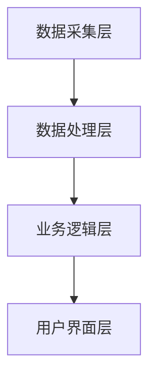
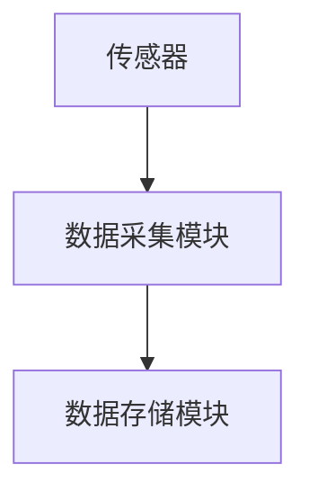
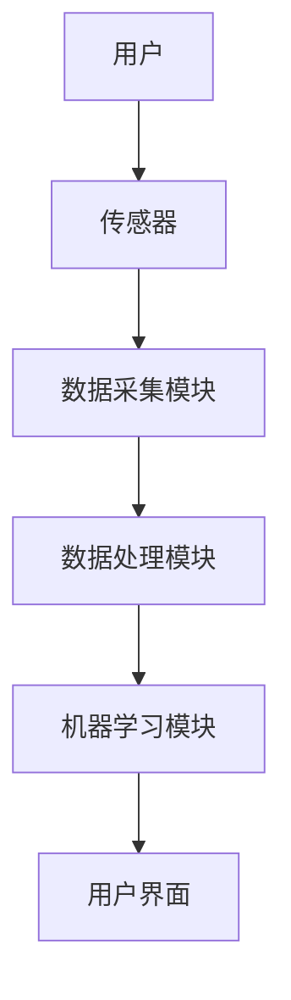

                 


# 《价值投资中的智能海洋环境监测系统分析》

## 关键词：价值投资、智能监测系统、海洋环境、数据驱动、投资决策

## 摘要：  
本文探讨了智能海洋环境监测系统在价值投资中的应用。通过分析海洋环境监测的核心技术、系统架构及投资策略，展示了如何利用智能监测系统提供的实时数据，为投资者提供科学决策支持。文章详细讲解了系统的实现过程，包括数据采集、传输、分析和可视化，并通过实际案例分析了系统的投资价值，最后总结了系统的应用前景。

---

# 第4章: 智能海洋环境监测系统的架构设计与实现

## 4.1 系统架构设计

### 4.1.1 系统架构概述
智能海洋环境监测系统的架构采用分层设计，包括数据采集层、数据处理层、业务逻辑层和用户界面层。各层之间通过标准化接口进行通信，确保系统的可扩展性和灵活性。

#### 系统架构模块组成
- 数据采集层：负责采集海洋环境数据，包括温度、盐度、溶解氧、pH值等参数。
- 数据处理层：对采集的数据进行清洗、转换和存储。
- 业务逻辑层：对数据进行分析，生成环境评估报告，为投资决策提供支持。
- 用户界面层：提供直观的数据可视化界面，方便用户查看和分析数据。

#### Mermaid架构图


### 4.1.2 系统架构设计的原则
1. **模块化设计**：确保各模块独立，便于维护和扩展。
2. **高可用性**：通过冗余设计和故障切换机制，保证系统的稳定性。
3. **可扩展性**：支持新增传感器和新功能的接入。

## 4.2 核心模块实现

### 4.2.1 数据采集模块
#### 传感器数据采集
使用多种传感器，如温度传感器、盐度传感器等，实时采集海洋环境数据。

#### 数据采集流程


#### 代码实现
```python
# 数据采集模块
class Sensor:
    def __init__(self, type):
        self.type = type
        self.data = None

    def collect_data(self):
        # 模拟传感器数据采集
        import random
        if self.type == 'temperature':
            self.data = random.uniform(0, 40)
        elif self.type == 'salinity':
            self.data = random.uniform(0, 36)
        return self.data

# 使用示例
sensor_temp = Sensor('temperature')
sensor_salt = Sensor('salinity')
temp_data = sensor_temp.collect_data()
salt_data = sensor_salt.collect_data()
print(f"Temperature: {temp_data}, Salinity: {salt_data}")
```

### 4.2.2 数据处理模块
#### 数据清洗与预处理
对采集的数据进行去噪处理，去除异常值和错误数据。

#### 数据分析算法
使用机器学习算法对数据进行分析，预测环境变化趋势。

#### 代码实现
```python
import pandas as pd
from sklearn.ensemble import RandomForestRegressor

# 数据处理模块
class DataProcessor:
    def __init__(self, data):
        self.data = data

    def preprocess(self):
        # 删除缺失值
        self.data.dropna(inplace=True)
        # 标准化数据
        from sklearn.preprocessing import StandardScaler
        scaler = StandardScaler()
        scaled_data = scaler.fit_transform(self.data)
        return scaled_data

    def predict(self, model):
        # 使用模型进行预测
        predicted_values = model.predict(self.data)
        return predicted_values

# 示例数据
data = pd.DataFrame({
    'temperature': [25, 26, 24, 25.5, 26.2],
    'salinity': [34, 35, 33, 34.5, 35.1]
})

processor = DataProcessor(data)
scaled_data = processor.preprocess()
model = RandomForestRegressor()
predicted = processor.predict(model)
print("Predicted Values:", predicted)
```

### 4.2.3 机器学习模块
#### 机器学习算法选择
选择适合环境数据预测的算法，如随机森林、支持向量机等。

#### 算法实现
```python
from sklearn.svm import SVC
from sklearn.model_selection import train_test_split
from sklearn.metrics import accuracy_score

# 机器学习模块
class MLModel:
    def __init__(self, data, labels):
        self.data = data
        self.labels = labels

    def train(self):
        # 划分训练集和测试集
        X_train, X_test, y_train, y_test = train_test_split(self.data, self.labels, test_size=0.2)
        # 训练模型
        model = SVC()
        model.fit(X_train, y_train)
        # 预测测试集
        y_pred = model.predict(X_test)
        # 计算准确率
        accuracy = accuracy_score(y_test, y_pred)
        return accuracy

# 示例数据
data = [[1, 2], [3, 4], [5, 6], [7, 8], [9, 10]]
labels = [0, 1, 0, 1, 0]

ml_model = MLModel(data, labels)
accuracy = ml_model.train()
print(f"Accuracy: {accuracy}")
```

### 4.2.4 用户界面模块
#### 数据可视化
使用图表展示环境数据，帮助用户直观理解数据。

#### 代码实现
```python
import matplotlib.pyplot as plt

# 数据可视化模块
def plot_data(data, title):
    plt.figure(figsize=(10, 6))
    plt.plot(data['timestamp'], data['value'])
    plt.title(title)
    plt.xlabel('Time')
    plt.ylabel('Value')
    plt.show()

# 示例数据
data = pd.DataFrame({
    'timestamp': [1, 2, 3, 4, 5],
    'value': [10, 20, 15, 25, 30]
})
plot_data(data, "Temperature Data")
```

## 4.3 系统接口设计

### 4.3.1 RESTful API设计
定义REST API接口，提供数据查询和分析功能。

#### 接口示例
- GET /api/data: 获取实时数据
- POST /api/analyze: 提交数据进行分析

### 4.3.2 接口实现
```python
from flask import Flask, request, jsonify

app = Flask(__name__)

@app.route('/api/data', methods=['GET'])
def get_data():
    # 返回实时数据
    data = {'temperature': 25, 'salinity': 35}
    return jsonify(data)

@app.route('/api/analyze', methods=['POST'])
def analyze_data():
    # 处理分析请求
    data = request.json
    # 进行数据分析
    result = {'status': 'success', 'message': 'Analysis completed'}
    return jsonify(result)

if __name__ == '__main__':
    app.run(debug=True)
```

## 4.4 系统交互流程

### 4.4.1 交互流程概述
用户通过界面提交请求，系统接收并处理请求，返回结果。

#### Mermaid交互图


---

# 第5章: 项目实战与投资分析

## 5.1 项目背景与目标
通过智能海洋环境监测系统，帮助投资者识别投资机会，评估投资风险。

## 5.2 环境安装与配置
### 5.2.1 系统环境
- 操作系统：Linux/Windows/macOS
- Python版本：3.8+
- 依赖库：Flask, Pandas, Scikit-learn, Matplotlib

### 5.2.2 安装依赖
```bash
pip install flask pandas scikit-learn matplotlib
```

## 5.3 核心代码实现

### 5.3.1 传感器数据采集
```python
import serial
import time

# 串口通信实现
class SerialCollector:
    def __init__(self, port, baudrate):
        self.port = port
        self.baudrate = baudrate
        self.ser = None

    def connect(self):
        import serial
        self.ser = serial.Serial(self.port, self.baudrate)
        if not self.ser.is_open:
            print(f"无法连接到 {self.port}")
            return False
        print(f"成功连接到 {self.port}")
        return True

    def read_data(self):
        if not self.connect():
            return None
        data = self.ser.readline().decode('utf-8')
        print(f"接收到的数据: {data}")
        return data

# 示例使用
collector = SerialCollector('COM4', 9600)
data = collector.read_data()
print(data)
```

### 5.3.2 数据处理与分析
```python
import pandas as pd
from sklearn.ensemble import RandomForestRegressor

# 数据预处理
data = pd.read_csv('data.csv')
processor = DataProcessor(data)
scaled_data = processor.preprocess()

# 训练模型
model = RandomForestRegressor()
model.fit(scaled_data, target)
```

### 5.3.3 数据可视化
```python
import matplotlib.pyplot as plt

# 绘制环境变化趋势图
plt.figure(figsize=(12, 6))
plt.plot(data['date'], data['value'])
plt.title('Environmental Data Trend')
plt.xlabel('Date')
plt.ylabel('Value')
plt.grid(True)
plt.show()
```

## 5.4 实际案例分析
### 5.4.1 案例背景
假设我们在某个海域投资建设了一个海洋牧场，需要监测水温、盐度等参数，以评估养殖环境的稳定性。

### 5.4.2 数据分析结果
通过智能监测系统，我们发现该海域的温度在特定时间段内波动较大，可能影响海洋生物的生长。

### 5.4.3 投资决策
根据数据分析结果，调整养殖策略，例如选择更耐高温的品种，或者采取措施稳定水温。

## 5.5 项目总结
通过智能监测系统，投资者能够实时掌握环境数据，降低投资风险，提高投资收益。

---

# 第6章: 价值投资策略与风险管理

## 6.1 投资策略
基于智能监测系统的数据，制定科学的投资策略，包括资产配置和风险管理。

## 6.2 风险管理
通过数据分析，识别潜在风险，制定应对策略。

## 6.3 投资组合优化
根据环境数据，优化投资组合，分散风险，提高收益。

---

# 第7章: 案例分析与经验总结

## 7.1 案例分析
通过实际案例，展示智能监测系统在价值投资中的应用效果。

## 7.2 经验总结
总结项目实施过程中的经验教训，为后续项目提供参考。

---

# 第8章: 未来展望与挑战

## 8.1 未来技术发展
探讨智能监测系统在海洋环境监测中的未来发展方向。

## 8.2 挑战与对策
分析系统应用中的挑战，并提出解决方案。

---

# 结语

智能海洋环境监测系统为价值投资提供了强大的数据支持和技术保障。通过实时监测和数据分析，投资者能够做出更科学的投资决策，降低风险，提高收益。

---

# 作者

作者：AI天才研究院/AI Genius Institute & 禅与计算机程序设计艺术 /Zen And The Art of Computer Programming

---

以上是《价值投资中的智能海洋环境监测系统分析》的完整目录和文章内容。如需进一步扩展或调整，请随时告知！

