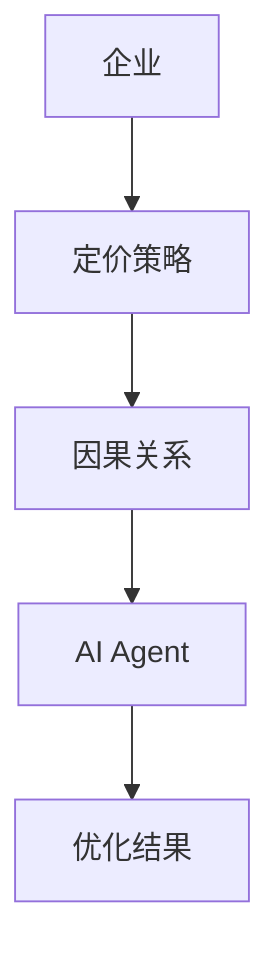
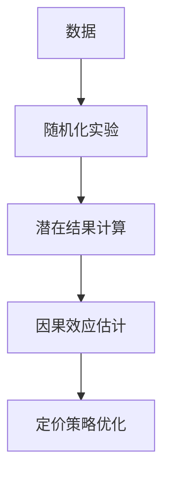
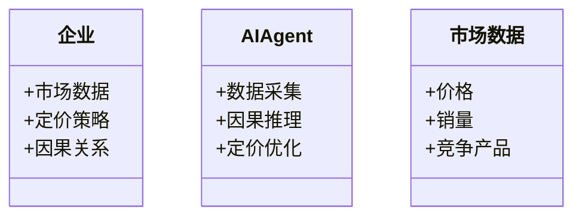
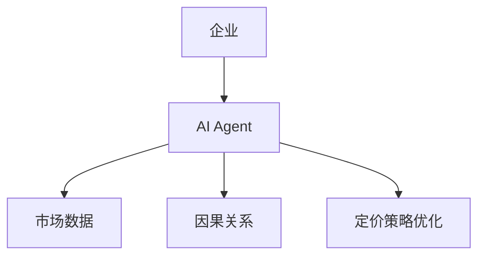

                 


# 企业AI Agent的因果推理在产品定价策略优化中的应用

> 关键词：企业AI Agent，因果推理，产品定价策略，定价策略优化，AI驱动定价

> 摘要：本文探讨了企业AI Agent如何通过因果推理技术优化产品定价策略。文章从问题背景出发，详细分析了因果推理的核心概念、算法原理、系统架构，并结合实际案例展示了AI Agent在定价策略优化中的应用。最后，文章总结了当前的研究成果，并展望了未来的发展方向。

---

# 第一部分: 企业AI Agent与因果推理概述

## 第1章: 问题背景与核心概念

### 1.1 问题背景

#### 1.1.1 企业定价策略的重要性
定价策略是企业核心竞争力的重要组成部分。合理的定价策略能够最大化企业利润，同时满足市场需求和消费者价值。然而，传统的定价策略往往依赖于经验判断和简单的统计分析，难以应对市场环境的快速变化。

#### 1.1.2 当前定价策略的局限性
传统的定价策略存在以下问题：
1. **缺乏数据驱动**：定价决策往往基于主观判断，缺乏系统的数据支持。
2. **因果关系不明确**：传统定价模型更多关注相关性，而非因果关系，难以准确预测价格变化对销量和利润的实际影响。
3. **动态适应性不足**：市场环境不断变化，传统定价策略难以快速调整以适应新的市场条件。

#### 1.1.3 AI Agent在定价优化中的潜力
AI Agent（人工智能代理）是一种能够感知环境、自主决策并执行任务的智能系统。通过结合因果推理，AI Agent能够帮助企业实现动态、精准的定价策略优化。

### 1.2 问题描述

#### 1.2.1 传统定价策略的挑战
传统定价策略依赖于历史数据和统计分析，但这些方法难以捕捉价格变化与销量之间的因果关系。例如，降价是否能显著提高销量？这个问题需要通过因果推理来解答。

#### 1.2.2 数据驱动定价的现状
随着大数据技术的发展，越来越多的企业开始采用数据驱动的定价策略。然而，现有的数据驱动定价方法主要基于相关性分析，难以准确估计价格变化对销量和利润的具体影响。

#### 1.2.3 因果推理在定价中的应用需求
因果推理是一种分析方法，能够识别变量之间的因果关系，从而帮助企业制定更加科学的定价策略。通过因果推理，企业可以明确价格变化如何影响销量、利润和其他相关指标。

### 1.3 核心概念

#### 1.3.1 因果推理的定义
因果推理是通过分析数据，识别变量之间的因果关系，从而推断因果关系的过程。例如，价格变化是否导致销量变化，这就是一个因果推理问题。

#### 1.3.2 AI Agent的定义
AI Agent是一种能够感知环境、自主决策并执行任务的智能系统。它可以在不需要人工干预的情况下，根据环境变化调整其行为。

#### 1.3.3 因果推理与AI Agent的结合
通过将因果推理技术集成到AI Agent中，企业可以实现动态、精准的定价策略优化。AI Agent能够实时分析市场数据，识别因果关系，并根据这些关系调整定价策略。

---

## 第2章: 因果推理与AI Agent的核心概念

### 2.1 因果推理的基本原理

#### 2.1.1 随机化实验
随机化实验是因果推理的重要方法。通过随机分配实验组和对照组，可以有效控制其他变量的影响，从而准确估计因果关系。

#### 2.1.2 调节变量与中介变量
- **调节变量**：影响因果关系的变量，例如地理位置可能调节价格变化对销量的影响。
- **中介变量**：位于因果链中的变量，例如价格变化可能通过影响消费者的购买意愿来影响销量。

### 2.2 AI Agent的核心功能

#### 2.2.1 数据采集与处理
AI Agent能够实时采集市场数据，包括价格、销量、竞争产品信息等，并对这些数据进行清洗和预处理。

#### 2.2.2 因果推理与决策
通过因果推理算法，AI Agent能够识别价格变化与销量之间的因果关系，并根据这些关系制定定价策略。

#### 2.2.3 智能优化与调整
AI Agent可以根据市场反馈实时调整定价策略，确保定价策略始终最优。

### 2.3 因果推理与AI Agent的结合

#### 2.3.1 因果推理在定价中的作用
因果推理可以帮助企业准确估计价格变化对销量和利润的影响，从而制定更加科学的定价策略。

#### 2.3.2 AI Agent如何实现因果推理
AI Agent可以通过集成因果推理算法，例如潜在结果框架（Propensity Score Matching）或因果树（Causal Tree），来实现因果推理。

#### 2.3.3 因果推理与定价策略优化的关系
因果推理是定价策略优化的核心，通过因果推理，AI Agent能够制定出更加精准、动态的定价策略。

---

## 第3章: 核心概念的属性对比与实体关系图

### 3.1 因果推理与相关概念的对比

| 概念       | 描述                                                                 |
|------------|--------------------------------------------------------------------|
| 相关性分析 | 研究变量之间的相关性，无法确定因果关系                                   |
| 预测模型   | 基于历史数据预测未来结果，不关注因果关系                               |
| 机器学习   | 通过数据训练模型，可以是相关性分析或因果推理                           |

### 3.2 实体关系图



---

# 第二部分: 因果推理算法原理

## 第4章: 因果推理算法概述

### 4.1 潜在结果框架

#### 4.1.1 潜在结果的定义
潜在结果是指在给定一组变量的情况下，某个变量（例如价格）变化后，其他变量（例如销量）的结果。

#### 4.1.2 潜在结果的计算方法
通过随机化实验或匹配分析，可以估计潜在结果。例如，通过匹配价格变化的实验组和对照组，可以估计价格变化对销量的潜在影响。

#### 4.1.3 潜在结果在定价中的应用
企业可以通过潜在结果框架，估计不同价格策略对销量和利润的潜在影响，从而制定最优定价策略。

### 4.2 随机森林与因果树

#### 4.2.1 随机森林的基本原理
随机森林是一种基于决策树的集成学习方法，可以通过投票或平均的方式提高模型的准确性和稳定性。

#### 4.2.2 因果树的构建过程
因果树是一种基于潜在结果框架的因果推理方法，通过构建决策树，可以识别因果关系。

#### 4.2.3 因果树在定价中的应用
通过因果树，企业可以识别价格变化对销量的关键影响因素，并制定相应的定价策略。

### 4.3 因果网络

#### 4.3.1 因果网络的定义
因果网络是一种用于表示变量之间因果关系的图模型。

#### 4.3.2 因果网络的构建方法
通过观察数据和领域知识，可以构建因果网络，并通过算法（例如贝叶斯网络）进行推理。

#### 4.3.3 因果网络在定价中的应用
企业可以通过因果网络识别价格变化与其他变量之间的因果关系，并制定更加科学的定价策略。

---

## 第5章: 算法实现与代码示例

### 5.1 潜在结果框架的实现

#### 5.1.1 Python代码示例

```python
import numpy as np
import pandas as pd

# 生成数据
n = 1000
price = np.random.uniform(10, 50, n)
sales = 100 - 2 * price + np.random.normal(0, 10, n)
data = pd.DataFrame({'price': price, 'sales': sales})

# 随机化实验
treatment = np.random.binomial(1, 0.5, n)
treated_data = data[treatment == 1]
control_data = data[treatment == 0]

# 估计潜在结果
treated_mean = treated_data['sales'].mean()
control_mean = control_data['sales'].mean()

# 估计因果效应
ate = treated_mean - control_mean
print(f'Average Treatment Effect (ATE): {ate}')
```

#### 5.1.2 算法流程图



#### 5.1.3 数学模型与公式

潜在结果框架的核心公式是：

$$
ATE = E[Y^{treated}] - E[Y^{control}]
$$

其中，\(Y^{treated}\) 表示实验组的潜在结果，\(Y^{control}\) 表示对照组的潜在结果。

---

## 第6章: 系统分析与架构设计

### 6.1 问题场景介绍

企业需要优化其产品定价策略，以最大化利润和市场份额。为了实现这一目标，企业需要实时分析市场数据，识别价格变化对销量和利润的影响，并根据这些分析结果调整定价策略。

### 6.2 系统功能设计

#### 6.2.1 领域模型



#### 6.2.2 系统架构



---

## 第7章: 项目实战

### 7.1 环境安装与配置

#### 7.1.1 安装依赖
```bash
pip install numpy pandas scikit-learn
```

### 7.2 系统核心实现

#### 7.2.1 AI Agent代码实现

```python
class AIAgent:
    def __init__(self):
        self.data = None
        self.treatment = None
        self.potential_outcomes = None

    def collect_data(self):
        # 采集市场数据
        self.data = pd.DataFrame({'price': np.random.uniform(10, 50, 1000),
                                   'sales': 100 - 2 * np.random.uniform(10, 50, 1000) + np.random.normal(0, 10, 1000)})

    def run_randomized_experiment(self):
        # 随机化实验
        self.treatment = np.random.binomial(1, 0.5, len(self.data))
        self.potential_outcomes = self.data['sales'] * (1 - self.treatment) + (100 - 2 * self.data['price'] + np.random.normal(0, 10, len(self.data))) * self.treatment

    def estimate_ate(self):
        # 估计因果效应
        treated_mean = self.potential_outcomes[self.treatment == 1].mean()
        control_mean = self.potential_outcomes[self.treatment == 0].mean()
        self.ate = treated_mean - control_mean
        return self.ate

    def optimize_pricing(self):
        # 定价策略优化
        pass
```

### 7.3 案例分析与结果解读

#### 7.3.1 案例分析
通过上述代码实现的AI Agent，企业可以实时分析市场数据，识别价格变化对销量的因果关系，并根据这些关系调整定价策略。

#### 7.3.2 结果解读
通过潜在结果框架，企业可以准确估计价格变化对销量的潜在影响，并根据这些影响制定最优定价策略。

---

## 第8章: 总结与展望

### 8.1 最佳实践 tips

- **数据质量**：确保市场数据的准确性和完整性。
- **模型选择**：根据具体场景选择合适的因果推理算法。
- **实时反馈**：建立实时反馈机制，确保定价策略的动态优化。

### 8.2 小结
本文详细探讨了企业AI Agent如何通过因果推理技术优化产品定价策略。通过潜在结果框架和随机化实验，企业可以准确估计价格变化对销量的因果关系，并根据这些关系制定最优定价策略。

### 8.3 注意事项
- **数据隐私**：在采集和处理市场数据时，需要注意数据隐私问题。
- **模型解释性**：确保因果推理模型的解释性，以便企业能够理解定价策略优化的原因。

### 8.4 拓展阅读
- **因果推理经典文献**：建议阅读因果推理领域的经典文献，例如《因果学导论》。
- **AI Agent相关书籍**：推荐阅读AI Agent领域的相关书籍，例如《AI Agent原理与应用》。

---

作者：AI天才研究院/AI Genius Institute & 禅与计算机程序设计艺术/Zen And The Art of Computer Programming

