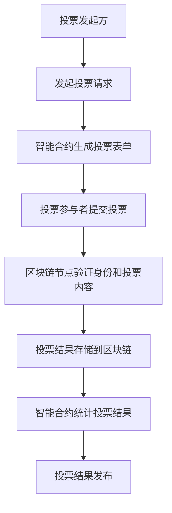
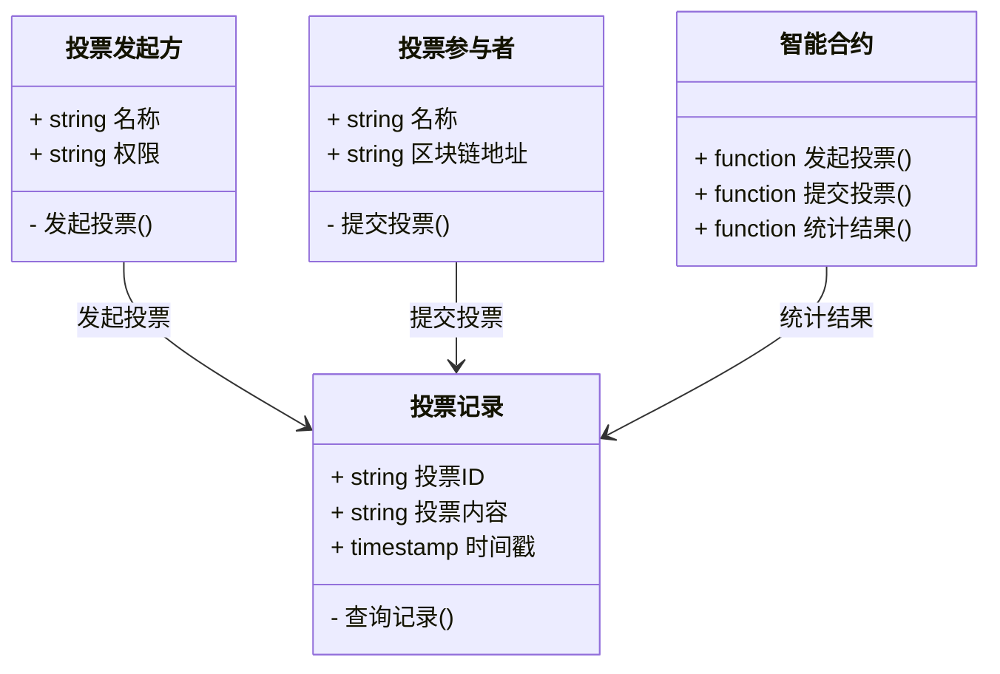
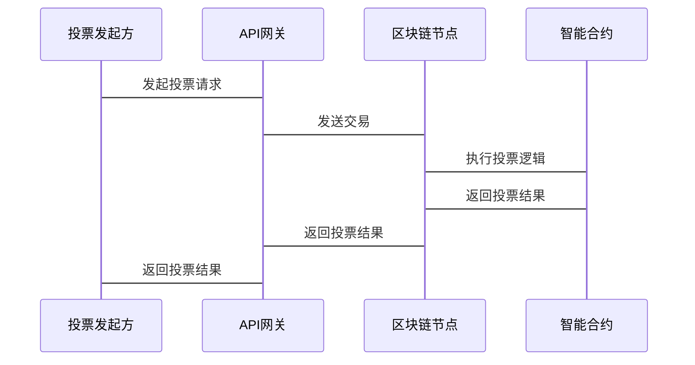

                 


```markdown
# 区块链数字投票系统评估：企业估值中的应用

## 关键词：区块链、数字投票系统、企业估值、智能合约、共识机制

## 摘要：  
区块链技术在企业估值中的应用正变得越来越重要，特别是区块链数字投票系统在提升企业治理和决策过程透明性方面的潜力。本文将深入探讨区块链数字投票系统的原理、实现及其在企业估值中的应用，通过技术分析和实际案例，揭示其在提升企业治理效率和确保决策透明性方面的独特优势。

---

# 第一部分: 区块链数字投票系统概述

# 第1章: 区块链与数字投票系统概述

## 1.1 区块链技术的基本概念

### 1.1.1 区块链的定义与特点  
区块链是一种去中心化的分布式账本技术，通过密码学保证数据的安全性，具有去中心化、不可篡改和透明性等特点。区块链的核心在于其数据结构和共识机制，确保数据在多个节点上一致且不可篡改。

### 1.1.2 区块链的核心技术原理  
区块链通过将数据以区块形式存储，并通过链式结构连接，每个区块包含交易数据和时间戳。共识机制（如PoW、PoS）确保所有节点达成一致，保证数据的可靠性和一致性。

### 1.1.3 区块链的分类与应用场景  
区块链主要分为公链、私链和联盟链。公链如比特币和以太坊适用于去中心化应用，私链适用于企业内部应用，联盟链则适用于特定机构之间的协作。区块链在金融、供应链、医疗等领域有广泛应用。

## 1.2 数字投票系统的概念与特点

### 1.2.1 数字投票的定义  
数字投票系统是通过数字化手段进行投票的系统，利用信息技术实现投票的发起、收集和统计。数字投票系统可以提高投票的效率和准确性。

### 1.2.2 数字投票系统的核心要素  
数字投票系统的核心要素包括投票发起方、投票参与者、投票记录和结果统计。投票发起方负责设计投票方案，投票参与者进行投票，投票记录确保透明性，结果统计保证准确性。

### 1.2.3 数字投票系统的优缺点  
优点：高效、透明、难以篡改；缺点：技术复杂、成本较高、需要依赖技术基础设施。

## 1.3 区块链在数字投票系统中的应用背景

### 1.3.1 传统投票系统的局限性  
传统投票系统可能存在信息不对称、容易被操控、透明性不足等问题，特别是在企业估值中，传统投票系统可能无法准确反映股东的真实意愿。

### 1.3.2 区块链技术如何解决投票系统的痛点  
区块链通过去中心化和不可篡改的特性，解决了传统投票系统中的信任问题。区块链数字投票系统能够确保投票的真实性和透明性，避免人为操控。

### 1.3.3 区块链数字投票系统的潜在价值  
区块链数字投票系统在企业治理、股权分配、决策制定等领域具有重要价值，能够提升企业的治理效率和决策的透明性。

## 1.4 企业估值中的数字投票系统需求

### 1.4.1 企业估值的基本概念  
企业估值是指对企业价值的评估，通常用于企业融资、并购等场景。传统的估值方法依赖于财务数据和市场分析，可能存在主观性和不准确性。

### 1.4.2 数字投票系统在企业估值中的应用场景  
数字投票系统可以用于股东投票、股权分配、决策制定等场景。通过区块链技术，确保投票的透明性和不可篡改性，提高估值的准确性和公信力。

### 1.4.3 区块链数字投票系统在企业估值中的优势  
区块链数字投票系统能够实时记录和统计投票结果，确保数据的真实性和透明性。这不仅提高了估值的效率，还增强了各方的信任。

---

# 第二部分: 区块链数字投票系统的核心概念与联系

# 第2章: 区块链数字投票系统的原理与核心要素

## 2.1 区块链数字投票系统的原理

### 2.1.1 区块链分布式账本的实现  
区块链通过分布式账本记录投票数据，每个区块包含投票信息和时间戳，确保数据的完整性和不可篡改性。

### 2.1.2 智能合约在投票系统中的应用  
智能合约是区块链上的自动执行程序，用于自动执行投票规则和结果统计。通过智能合约，可以实现投票流程的自动化和透明化。

### 2.1.3 区块链共识机制对投票系统的影响  
共识机制如PoW、PoS确保所有节点对投票结果的一致性，保证投票的公平性和真实性。

## 2.2 数字投票系统的核心要素

### 2.2.1 投票发起方的权限管理  
投票发起方需要具备相应的权限才能发起投票，通过智能合约实现权限控制。

### 2.2.2 投票参与者的身份验证  
通过区块链的公钥机制，确保投票参与者的身份真实性和唯一性。

### 2.2.3 投票结果的记录与查询  
投票结果通过区块链记录，确保不可篡改。参与者可以随时查询投票结果，提高透明性。

## 2.3 区块链数字投票系统的核心概念对比

### 2.3.1 区块链与传统投票系统的对比分析  
| 特性           | 区块链投票系统       | 传统投票系统       |
|----------------|----------------------|--------------------|
| 中心化/去中心化| 去中心化             | 中心化             |
| 数据安全性     | 高                  | 低                |
| 透明性         | 高                  | 低                |
| 操作成本       | 较低                | 较高              |

### 2.3.2 数字投票系统与传统投票系统的对比分析  
| 特性           | 数字投票系统         | 传统投票系统       |
|----------------|----------------------|--------------------|
| 票数统计效率   | 高                  | 低                |
| 数据透明性     | 高                  | 低                |
| 安全性         | 高                  | 低                |

### 2.3.3 区块链数字投票系统  
通过区块链技术实现的数字投票系统，结合去中心化和智能合约，确保投票的公平性和透明性。

## 2.4 区块链数字投票系统的ER实体关系图

```mermaid
er
    actor 投票参与者
    actor 投票发起方
    actor 区块链节点
    database 区块链账本
    process 投票过程
    process 结果统计
    process 权限管理
    process 身份验证
    process 数据存储
    process 数据查询
    process 共识达成

    投票参与者 --> 投票过程: 提交投票
    投票发起方 --> 投票过程: 发起投票
    投票过程 --> 数据存储: 存储投票数据
    数据存储 --> 区块链账本: 更新账本
    区块链节点 --> 共识达成: 确认交易
    结果统计 --> 数据查询: 获取投票结果
    权限管理 --> 身份验证: 验证参与者身份
```

---

# 第三部分: 区块链数字投票系统的算法原理

# 第3章: 区块链数字投票系统的算法与实现

## 3.1 区块链数字投票系统的共识机制

### 3.1.1 共识机制的分类  
区块链常用的共识机制包括PoW、PoS、DPoS等。每种机制有不同的优缺点，适用于不同的场景。

### 3.1.2 PoW共识机制的实现原理  
PoW（工作量证明）通过解决数学难题来验证交易的有效性，确保区块链的安全性。

### 3.1.3 PoS共识机制的实现原理  
PoS（权益证明）通过质押代币的方式选择验证节点，降低能源消耗，提高效率。

## 3.2 数字投票系统的加密算法

### 3.2.1 RSA加密算法的原理  
RSA是一种公钥加密算法，通过公钥加密和私钥解密实现数据的安全传输。

### 3.2.2 椭圆曲线加密算法的原理  
椭圆曲线加密是一种更高效的公钥加密算法，适用于资源受限的环境。

### 3.2.3 加密算法在投票系统中的应用  
通过加密算法确保投票数据的安全性，防止数据被篡改和泄露。

## 3.3 区块链数字投票系统的实现流程

### 3.3.1 投票发起流程  
1. 投票发起方发起投票请求，智能合约生成投票表单。
2. 投票参与者通过区块链地址提交投票。
3. 区块链节点验证投票参与者的身份和投票内容。

### 3.3.2 投票统计流程  
1. 智能合约自动统计投票结果。
2. 区块链节点验证投票结果，确保结果的准确性和一致性。

## 3.4 区块链数字投票系统的流程图



---

# 第四部分: 区块链数字投票系统的系统分析与架构设计

# 第4章: 区块链数字投票系统的系统分析与架构设计

## 4.1 系统应用场景分析

### 4.1.1 股东大会投票  
区块链数字投票系统可以用于股东大会中的投票，确保投票的真实性和透明性。

### 4.1.2 项目评估与决策  
企业可以通过区块链数字投票系统进行项目评估和决策，确保评估过程的公正性和透明性。

### 4.1.3 股权分配与管理  
区块链数字投票系统可以用于股权分配和管理，确保股权分配的公平性和透明性。

## 4.2 系统功能设计

### 4.2.1 领域模型设计  


### 4.2.2 系统架构设计  


### 4.2.3 接口设计与交互流程图  


---

# 第五部分: 区块链数字投票系统的项目实战

# 第5章: 区块链数字投票系统的项目实战

## 5.1 项目环境搭建

### 5.1.1 安装区块链框架  
选择合适的区块链框架，如Hyperledger Fabric或以太坊，并按照官方文档进行安装和配置。

### 5.1.2 安装开发工具  
安装必要的开发工具，如IDE、区块链钱包、命令行工具等。

## 5.2 系统核心实现

### 5.2.1 智能合约实现  
编写智能合约代码，实现投票发起、投票提交和结果统计功能。

```solidity
// 投票系统智能合约
contract VotingSystem {
    mapping(address => uint256) voteCount;

    function initiateVote(uint256 proposalId) public {
        // 发起投票
        voteCount[proposalId] = 0;
    }

    function submitVote(uint256 proposalId, uint256 vote) public {
        // 提交投票
        voteCount[proposalId] += vote;
    }

    function getResult(uint256 proposalId) public view returns (uint256) {
        // 获取投票结果
        return voteCount[proposalId];
    }
}
```

### 5.2.2 投票系统后端接口  
编写后端接口代码，实现与智能合约的交互和投票结果的展示。

```python
# 投票系统后端接口
from web3 import Web3

def submit_vote(proposal_id, vote):
    contract = w3.eth.contract(address=contract_address, abi=abi)
    transaction = contract.functions.submitVote(proposal_id, vote).transact()
    receipt = w3.eth.waitForTransactionReceipt(transaction)
    return receipt

def get_result(proposal_id):
    contract = w3.eth.contract(address=contract_address, abi=abi)
    result = contract.functions.getResult(proposal_id).call()
    return result
```

## 5.3 项目实战案例分析

### 5.3.1 项目介绍  
某企业使用区块链数字投票系统进行股东大会投票，确保投票的透明性和公正性。

### 5.3.2 系统实现  
通过智能合约实现投票发起、提交和结果统计功能，确保投票过程的透明性和不可篡改性。

### 5.3.3 案例分析  
通过实际案例分析，验证区块链数字投票系统的有效性和优势。

## 5.4 项目总结

### 5.4.1 成功经验  
通过区块链数字投票系统实现了投票的透明性和公正性，提高了企业的治理效率。

### 5.4.2 可能遇到的问题  
技术复杂性较高，需要专业的技术团队进行开发和维护。

### 5.4.3 未来优化方向  
优化智能合约的性能，降低开发和运行成本，进一步提升系统的可扩展性。

---

# 第六部分: 区块链数字投票系统的最佳实践

# 第6章: 区块链数字投票系统的最佳实践

## 6.1 最佳实践 Tips

### 6.1.1 确保系统的安全性  
通过多重签名和权限管理，确保系统的安全性，防止恶意攻击。

### 6.1.2 提高系统的可扩展性  
优化智能合约的设计，提高系统的处理能力，满足大规模应用的需求。

### 6.1.3 注重用户体验  
简化用户的操作流程，提高系统的易用性，提升用户体验。

## 6.2 项目小结

### 6.2.1 全书内容回顾  
总结全书的核心内容，回顾区块链数字投票系统的原理、实现和应用。

### 6.2.2 关键点总结  
强调区块链数字投票系统在企业估值中的重要性，总结其优势和潜力。

## 6.3 注意事项

### 6.3.1 技术风险  
区块链技术可能存在安全隐患，需要注意防范技术风险。

### 6.3.2 法律合规性  
确保系统的法律合规性，遵守相关法律法规。

### 6.3.3 系统维护  
定期维护和更新系统，确保系统的稳定性和安全性。

## 6.4 拓展阅读

### 6.4.1 区块链技术的深入学习  
推荐阅读《区块链技术及应用》等书籍，深入学习区块链技术。

### 6.4.2 数字投票系统的进一步研究  
研究数字投票系统的最新技术和应用案例，了解行业发展趋势。

### 6.4.3 企业估值的其他技术手段  
探索其他技术手段在企业估值中的应用，如大数据分析、人工智能等。

---

# 作者：AI天才研究院 & 禅与计算机程序设计艺术
```

