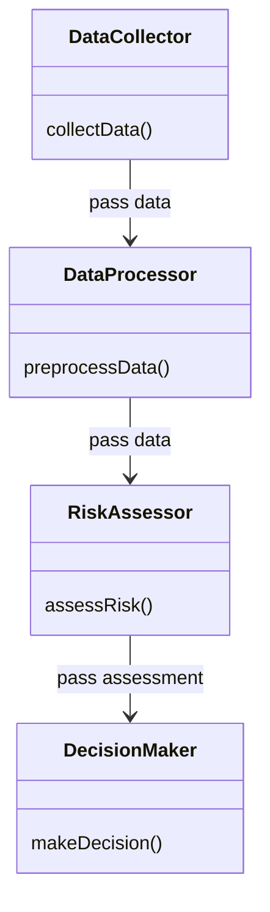
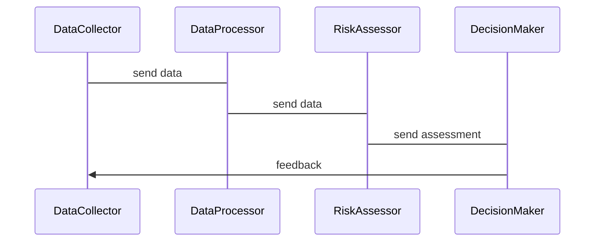

                 


```markdown
# 多智能体系统在全球地缘政治风险分析中的角色

> 关键词：多智能体系统, 地缘政治风险, 风险分析, 智能体协作, 系统架构

> 摘要：多智能体系统（MAS）在地缘政治风险分析中发挥着越来越重要的作用。本文详细探讨了MAS的核心概念、算法原理、系统架构设计以及在地缘政治风险分析中的实际应用，通过项目实战和最佳实践，全面展示MAS如何帮助我们更好地理解和应对全球地缘政治风险。

---

## 第一部分: 多智能体系统的背景与概念

### 第1章: 多智能体系统概述

#### 1.1 多智能体系统的定义与特点
##### 1.1.1 多智能体系统的定义
多智能体系统（Multi-Agent Systems, MAS）是由多个智能体（Agent）组成的分布式系统，这些智能体能够自主地感知环境、做出决策并进行协作，以实现共同目标。

##### 1.1.2 多智能体系统的特性
- **自主性**：智能体能够自主决策，无需外部干预。
- **反应性**：智能体能够实时感知环境变化并做出反应。
- **协作性**：多个智能体之间能够通过通信和协作完成复杂任务。
- **分布式性**：系统中的智能体是分布式的，不存在集中控制节点。

##### 1.1.3 多智能体系统与传统单智能体系统的区别
| 特性         | 单智能体系统       | 多智能体系统       |
|--------------|--------------------|--------------------|
| 结构         | 集中式结构         | 分布式结构         |
| 控制方式     | 单一控制中心       | 分布式控制         |
| 协作能力     | 无协作能力         | 高协作能力         |
| 灵活性       | 较低               | 较高               |

#### 1.2 地缘政治风险分析的背景与重要性
##### 1.2.1 地缘政治风险的基本概念
地缘政治风险是指由于地理、政治、经济和社会等因素的变化，可能导致的国家间冲突、经济波动或其他潜在风险。

##### 1.2.2 全球化背景下的地缘政治挑战
全球化使得国家间的依赖性增强，同时也带来了更多的不确定性。地缘政治风险的复杂性不断提高，传统的分析方法已难以应对。

##### 1.2.3 地缘政治风险分析的意义
准确的地缘政治风险分析可以帮助政府和企业做出更明智的决策，减少潜在损失，提高应对危机的能力。

---

### 第2章: 多智能体系统在地缘政治风险分析中的角色

#### 2.1 多智能体系统的核心功能
##### 2.1.1 数据收集与处理
智能体可以通过多种渠道（如新闻、社交媒体、经济指标等）收集数据，并进行预处理和分析。

##### 2.1.2 智能体之间的协作与通信
通过通信协议，智能体之间可以共享信息，协同完成复杂的分析任务。

##### 2.1.3 风险预测与评估
基于收集的数据，智能体可以利用机器学习算法进行风险预测，并评估其影响程度。

#### 2.2 多智能体系统的优势与挑战
##### 2.2.1 优势分析
- **分布式计算**：能够处理大规模数据，提高计算效率。
- **高容错性**：单个智能体故障不会导致整个系统崩溃。
- **灵活性**：能够适应复杂多变的地缘政治环境。

##### 2.2.2 挑战与局限性
- **通信延迟**：智能体之间的通信可能会引入延迟。
- **协调困难**：多个智能体之间的协作需要复杂的协调机制。
- **数据隐私**：数据的收集和共享可能涉及隐私问题。

---

## 第二部分: 多智能体系统的原理与技术

### 第3章: 多智能体系统的原理

#### 3.1 多智能体系统的体系结构
##### 3.1.1 分层结构
- **感知层**：负责数据的收集和初步处理。
- **决策层**：负责风险评估和决策制定。
- **执行层**：负责执行决策并反馈结果。

##### 3.1.2 分布式结构
- 智能体分布在网络的不同节点，通过通信协议进行协作。

#### 3.2 多智能体系统的通信机制
##### 3.2.1 通信协议设计
智能体之间需要通过特定的协议进行信息交换，例如使用JSON-RPC或HTTP协议。

##### 3.2.2 消息队列与事件驱动
通过消息队列（如RabbitMQ）实现异步通信，事件驱动机制能够快速响应环境变化。

#### 3.3 多智能体系统的协作算法
##### 3.3.1 分布式协作算法
- **一致性算法**：如Paxos算法，用于确保系统中各智能体的状态一致性。
- **共识算法**：如拜占庭共识算法，用于在不可信网络中达成共识。

##### 3.3.2 协作流程
1. 数据收集：智能体从不同来源收集数据。
2. 数据处理：对收集的数据进行清洗和预处理。
3. 风险评估：利用机器学习模型进行风险预测。
4. 协作决策：智能体之间协作，制定应对策略。
5. 反馈与优化：根据实际结果优化协作流程。

---

### 第4章: 多智能体系统的算法实现

#### 4.1 算法原理
##### 4.1.1 基于协作的多智能体算法
该算法通过智能体之间的协作，实现对地缘政治风险的实时监测和评估。

##### 4.1.2 算法流程
1. 数据收集：智能体从多个来源收集相关数据。
2. 数据预处理：清洗数据，提取特征。
3. 风险预测：使用机器学习模型进行预测。
4. 协作决策：智能体之间协作，制定应对策略。
5. 反馈优化：根据实际结果优化算法。

#### 4.2 算法实现代码
##### 4.2.1 数据收集与预处理
```python
import requests
import json

def collect_data(sources):
    data = []
    for source in sources:
        response = requests.get(source)
        if response.status_code == 200:
            data.append(response.json())
    return data

# 示例数据来源
sources = [
    'https://api.example.com/news',
    'https://api.example.com/social_media'
]
data = collect_data(sources)
```

##### 4.2.2 风险预测模型
```python
from sklearn.linear_model import LogisticRegression

def train_model(data):
    X = []
    y = []
    for d in data:
        # 提取特征
        features = [d['economic_indicator'], d['political_stability']]
        X.append(features)
        y.append(d['risk_level'])
    model = LogisticRegression()
    model.fit(X, y)
    return model

model = train_model(data)
```

##### 4.2.3 协作决策
```python
from agent_communication import Agent

class RiskAssessmentAgent(Agent):
    def __init__(self, id):
        super().__init__(id)
    
    def assess_risk(self, data):
        # 调用风险预测模型
        prediction = self.model.predict(data)
        return prediction

agent = RiskAssessmentAgent(1)
result = agent.assess_risk(data)
```

---

## 第三部分: 系统分析与架构设计

### 第5章: 系统分析与架构设计

#### 5.1 项目背景
本项目旨在利用多智能体系统对地缘政治风险进行实时监测和评估，帮助决策者制定有效的应对策略。

#### 5.2 系统功能设计
##### 5.2.1 功能模块
- **数据采集模块**：负责从多个来源收集数据。
- **数据处理模块**：对数据进行清洗和预处理。
- **风险评估模块**：利用机器学习模型进行风险预测。
- **协作决策模块**：智能体之间协作，制定应对策略。

##### 5.2.2 领域模型


#### 5.3 系统架构设计
##### 5.3.1 架构图
```mermaid
containerDiagram
    container Web Service {
        DataCollector
        DataProcessor
        RiskAssessor
        DecisionMaker
    }
```

##### 5.3.2 接口设计
- **数据接口**：提供REST API用于数据的收集和处理。
- **协作接口**：提供通信协议用于智能体之间的协作。

##### 5.3.3 交互设计


---

## 第四部分: 项目实战

### 第6章: 项目实战

#### 6.1 环境安装
- **安装Python**：确保安装了Python 3.8或更高版本。
- **安装依赖库**：使用pip安装必要的库，如`requests`, `scikit-learn`, `mermaid`。

#### 6.2 核心代码实现
##### 6.2.1 数据采集模块
```python
import requests

def collect_data(sources):
    data = []
    for source in sources:
        response = requests.get(source)
        if response.status_code == 200:
            data.append(response.json())
    return data

sources = [
    'https://api.example.com/news',
    'https://api.example.com/social_media'
]
data = collect_data(sources)
```

##### 6.2.2 数据处理模块
```python
from sklearn.preprocessing import StandardScaler

def preprocess_data(data):
    scaler = StandardScaler()
    features = [d['economic_indicator'] for d in data]
    scaled_features = scaler.fit_transform(features)
    return scaled_features

processed_data = preprocess_data(data)
```

##### 6.2.3 风险评估模块
```python
from sklearn.linear_model import LogisticRegression

def train_model(features, labels):
    model = LogisticRegression()
    model.fit(features, labels)
    return model

model = train_model(processed_data, [d['risk_level'] for d in data])
```

##### 6.2.4 协作决策模块
```python
from agent_communication import Agent

class RiskAssessmentAgent(Agent):
    def __init__(self, id):
        super().__init__(id)
    
    def assess_risk(self, data):
        prediction = self.model.predict(data)
        return prediction

agent = RiskAssessmentAgent(1)
result = agent.assess_risk(processed_data)
```

#### 6.3 实际案例分析
通过分析实际的地缘政治事件，展示多智能体系统如何帮助识别潜在风险并制定应对策略。

#### 6.4 项目小结
总结项目实现的关键点，分析遇到的问题及解决方案，展望未来的发展方向。

---

## 第五部分: 最佳实践与总结

### 第7章: 最佳实践

#### 7.1 最佳实践 tips
- **数据隐私**：在数据收集和共享过程中，需注意隐私保护。
- **系统优化**：定期优化算法和架构，提高系统的效率和准确性。
- **团队协作**：多智能体系统的开发需要团队协作，确保各模块的协调统一。

#### 7.2 小结
多智能体系统在地缘政治风险分析中的应用前景广阔，通过不断的技术创新和实践积累，可以进一步提升系统的性能和应用效果。

#### 7.3 注意事项
- **数据质量**：确保数据的准确性和完整性。
- **系统安全性**：加强系统的安全性，防止数据泄露和攻击。
- **可扩展性**：设计系统时考虑可扩展性，以便未来扩展和升级。

#### 7.4 拓展阅读
- 推荐阅读相关书籍和论文，深入理解多智能体系统的理论和应用。

---

## 作者信息

作者：AI天才研究院/AI Genius Institute & 禅与计算机程序设计艺术 /Zen And The Art of Computer Programming
```

