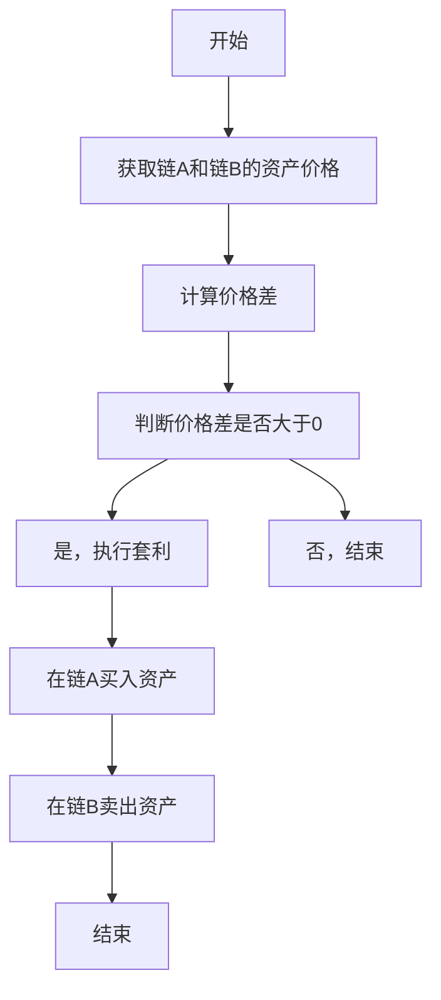
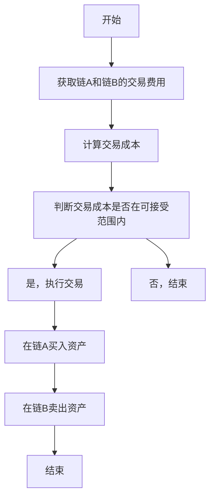
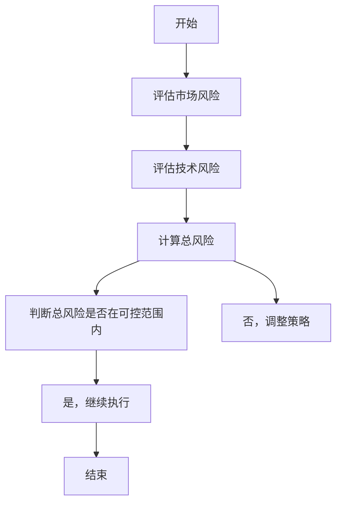
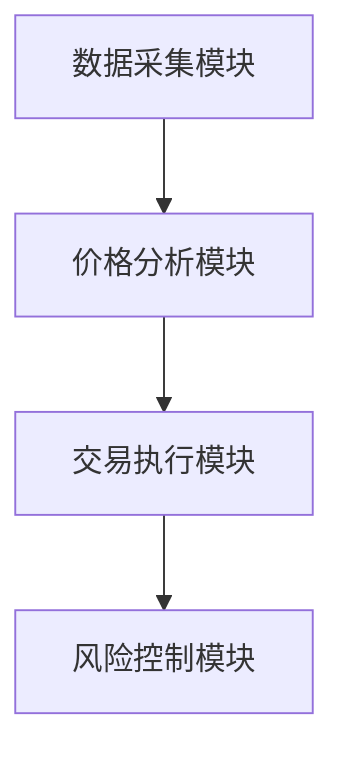
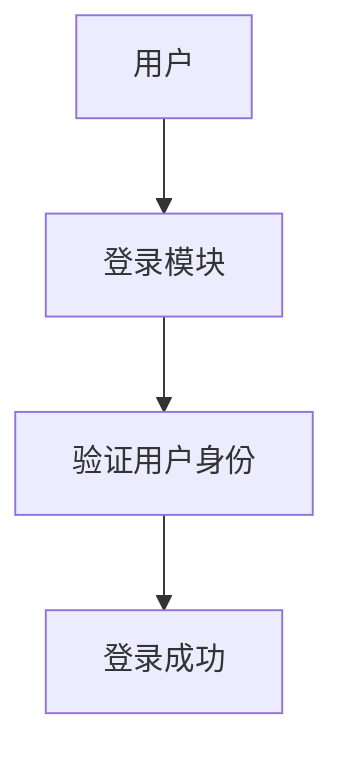
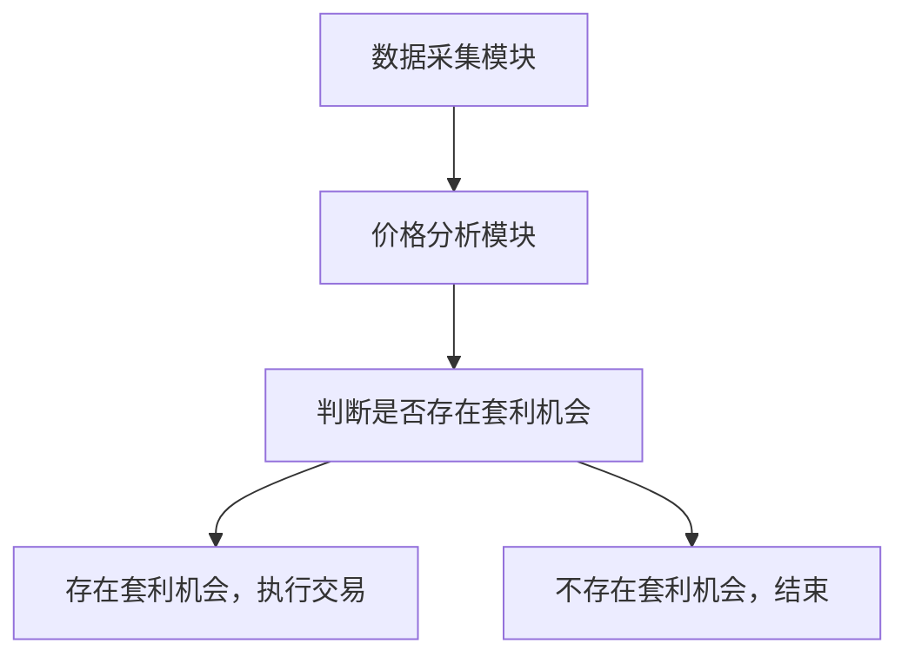
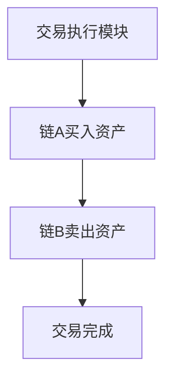

                 


# 如何构建基于特价股票的跨链套利系统

> 关键词：跨链套利、特价股票、区块链技术、DeFi协议、智能合约、算法原理、系统架构设计

> 摘要：本文将详细讲解如何构建基于特价股票的跨链套利系统，从背景介绍、核心概念、算法原理、系统架构设计到项目实战，全面解析跨链套利的实现方法。通过本文，读者将掌握从理论到实践的完整流程，包括如何利用区块链技术和DeFi协议实现特价股票的跨链套利，如何设计和实现套利算法，如何进行系统架构设计，以及如何进行项目实战。本文还提供丰富的代码示例和实际案例分析，帮助读者深入理解跨链套利的核心原理和实现方法。

---

# 第一部分: 特价股票与跨链套利概述

## 第1章: 特价股票与跨链套利的背景介绍

### 1.1 特价股票的定义与特点

#### 1.1.1 特价股票的定义
特价股票是指在特定条件下，股票价格低于其面值或具有特别优惠的股票。其特点包括价格波动大、交易机会多、风险较高。

#### 1.1.2 特价股票的特点
- 价格波动大：特价股票的价格受市场供需影响，波动剧烈。
- 交易机会多：特价股票通常在特定时间段内开放，提供套利机会。
- 风险较高：由于价格波动大，特价股票的交易风险较高。

#### 1.1.3 特价股票的分类与应用场景
- 分类：特价股票可以分为短期特价股票和长期特价股票。
- 应用场景：特价股票常用于吸引投资者，或在特定市场条件下进行市场调节。

### 1.2 跨链套利的定义与原理

#### 1.2.1 跨链套利的定义
跨链套利是指在不同区块链之间，利用同一资产在不同链上的价格差异进行套利交易。跨链套利的核心在于利用价格差异，通过在不同链上买卖资产，实现利润最大化。

#### 1.2.2 跨链套利的原理
- 区块链技术：跨链套利利用区块链技术实现不同链之间的资产转移。
- DeFi协议：去中心化金融协议为跨链套利提供了技术基础，如跨链桥接。
- 智能合约：智能合约用于自动执行跨链交易，确保交易的安全性和可靠性。

#### 1.2.3 跨链套利的边界与外延
- 边界：跨链套利仅限于同一资产在不同链上的价格差异，且需满足交易条件。
- 外延：跨链套利可以扩展到更多类型的资产，如代币、NFT等。

### 1.3 特价股票跨链套利的背景与现状

#### 1.3.1 特价股票市场的现状
- 市场规模：特价股票市场逐渐扩大，吸引了更多投资者。
- 市场特点：特价股票的价格波动大，套利机会多。

#### 1.3.2 跨链技术的发展与应用
- 跨链技术的发展：跨链技术不断完善，支持更多链之间的资产转移。
- 跨链技术的应用：跨链技术广泛应用于DeFi领域，支持跨链借贷、交易等。

#### 1.3.3 特价股票跨链套利的市场需求
- 市场需求：投资者希望通过跨链套利实现更高收益。
- 市场潜力：特价股票跨链套利市场潜力巨大，吸引众多参与者。

### 1.4 本章小结
本章介绍了特价股票和跨链套利的基本概念、特点以及市场背景。通过本章，读者可以了解特价股票跨链套利的市场需求和潜在机会。

---

# 第二部分: 特价股票跨链套利的核心概念与联系

## 第2章: 特价股票跨链套利的核心概念

### 2.1 区块链技术基础

#### 2.1.1 区块链的定义与特点
- 区块链是一种分布式账本技术，具有去中心化、不可篡改、透明性等特点。

#### 2.1.2 区块链的共识机制
- 共识机制：包括工作量证明（PoW）、权益证明（PoS）等，确保区块链的安全性和一致性。

#### 2.1.3 智能合约的原理与应用
- 智能合约：智能合约是基于区块链的自动执行程序，用于实现资产转移、交易等。

### 2.2 DeFi协议与跨链技术

#### 2.2.1 DeFi协议的定义与特点
- DeFi协议：去中心化金融协议，支持去中心化借贷、交易等。

#### 2.2.2 跨链技术的实现方式
- 跨链技术：通过跨链桥接实现不同链之间的资产转移。

#### 2.2.3 跨链桥接的原理与应用
- 跨链桥接：通过中继链或侧链实现不同链之间的资产转移。

### 2.3 特价股票的跨链套利机会分析

#### 2.3.1 特价股票的价格波动特性
- 特价股票的价格波动大，为套利提供了机会。

#### 2.3.2 跨链套利的机会识别
- 机会识别：通过分析不同链上同一资产的价格差异，识别套利机会。

#### 2.3.3 特价股票跨链套利的可行性分析
- 可行性分析：通过技术可行性、市场可行性、风险可控性等进行分析。

### 2.4 核心概念的对比分析

#### 2.4.1 区块链技术与传统金融的对比
- 对比：区块链技术具有去中心化、透明性，传统金融具有中心化、监管严格。

#### 2.4.2 跨链套利与传统套利的对比
- 对比：跨链套利利用区块链技术实现，传统套利依赖市场价差。

#### 2.4.3 特价股票与其他金融产品的对比
- 对比：特价股票价格波动大，风险高，收益潜力大。

### 2.5 本章小结
本章详细讲解了区块链技术、DeFi协议、智能合约等核心概念，以及特价股票跨链套利的机会分析和核心概念的对比分析。

---

## 3.1 套利机会识别算法

### 3.1.1 套利机会识别的数学模型
$$ \text{价格差} = \text{链A价格} - \text{链B价格} $$

### 3.1.2 套利机会识别的算法流程


### 3.1.3 套利机会识别的实现代码
```python
def identify_arbitrage_opportunity(chain_a_price, chain_b_price):
    price_diff = chain_a_price - chain_b_price
    if price_diff > 0:
        return "Arbitrage opportunity exists"
    else:
        return "No arbitrage opportunity"
```

## 3.2 跨链交易执行算法

### 3.2.1 跨链交易执行的数学模型
$$ \text{交易成本} = \text{链A交易费用} + \text{链B交易费用} $$

### 3.2.2 跨链交易执行的算法流程


### 3.2.3 跨链交易执行的实现代码
```python
def execute_cross_chain_transaction(chain_a_buy, chain_b_sell):
    chain_a_buy.execute()
    chain_b_sell.execute()
```

## 3.3 套利风险控制算法

### 3.3.1 套利风险控制的数学模型
$$ \text{风险评估} = \text{市场风险} + \text{技术风险} $$

### 3.3.2 套利风险控制的算法流程


### 3.3.3 套利风险控制的实现代码
```python
def assess_risk市场风险, 技术风险):
    total_risk = 市场风险 + 技术风险
    if total_risk <= acceptable_risk:
        return "Low risk, proceed"
    else:
        return "High risk, adjust strategy"
```

## 3.4 本章小结
本章详细讲解了套利机会识别、跨链交易执行和套利风险控制的算法原理和实现方法。通过本章，读者可以掌握如何利用算法实现跨链套利。

---

## 第四部分: 特价股票跨链套利的系统分析与架构设计

## 第4章: 特价股票跨链套利系统分析

### 4.1 系统功能模块设计

#### 4.1.1 数据采集模块
- 功能：采集不同链上的资产价格数据。
- 实现：通过API接口获取链A和链B的资产价格数据。

#### 4.1.2 价格分析模块
- 功能：分析价格数据，识别套利机会。
- 实现：基于价格差模型，判断是否存在套利机会。

#### 4.1.3 交易执行模块
- 功能：执行跨链交易，实现套利。
- 实现：通过智能合约在链A买入资产，在链B卖出资产。

#### 4.1.4 风险控制模块
- 功能：评估和控制套利风险。
- 实现：通过风险评估模型，调整套利策略。

### 4.2 系统架构设计

#### 4.2.1 系统架构图


#### 4.2.2 模块间交互关系
- 数据采集模块向价格分析模块提供资产价格数据。
- 价格分析模块向交易执行模块提供套利机会信息。
- 交易执行模块向风险控制模块提供交易风险信息。

#### 4.2.3 系统扩展性设计
- 支持更多链的接入。
- 支持更多资产类型的套利。

### 4.3 系统接口设计

#### 4.3.1 数据接口设计
- 数据接口：提供链A和链B的资产价格数据。
- 接口格式：JSON格式。

#### 4.3.2 交易接口设计
- 交易接口：支持链A和链B的资产交易。
- 接口格式：JSON-RPC格式。

#### 4.3.3 风险控制接口设计
- 风险控制接口：提供风险评估结果。
- 接口格式：JSON格式。

### 4.4 系统交互流程设计

#### 4.4.1 用户登录流程


#### 4.4.2 套利机会识别流程


#### 4.4.3 交易执行流程


### 4.5 本章小结
本章详细讲解了系统功能模块设计、系统架构设计、系统接口设计和系统交互流程设计。通过本章，读者可以了解如何设计和实现基于特价股票的跨链套利系统。

---

## 第五部分: 特价股票跨链套利的项目实战

## 第5章: 特价股票跨链套利项目实战

### 5.1 环境搭建与配置

#### 5.1.1 开发环境
- 操作系统：Windows/Mac/Linux
- 开发工具：Python、IDE、区块链开发框架。

#### 5.1.2 区块链网络配置
- 链A：以太坊测试网。
- 链B：波卡测试网。

### 5.2 智能合约开发

#### 5.2.1 智能合约实现
- 智能合约功能：实现资产转移、交易执行。

#### 5.2.2 智能合约部署
- 部署链A和链B的智能合约。

### 5.3 后端接口开发

#### 5.3.1 数据接口实现
- 实现链A和链B的资产价格数据接口。

#### 5.3.2 交易接口实现
- 实现链A和链B的交易接口。

### 5.4 项目实战案例分析

#### 5.4.1 案例背景
- 案例：链A上的特价股票价格为10美元，链B上的特价股票价格为9美元。

#### 5.4.2 案例分析
- 通过跨链套利，可以在链A买入特价股票，在链B卖出特价股票，实现套利收益。

#### 5.4.3 案例实现
- 使用智能合约在链A买入特价股票，链B卖出特价股票，实现套利。

### 5.5 项目小结
本章通过实际案例分析，详细讲解了如何实现基于特价股票的跨链套利系统。通过本章，读者可以掌握从理论到实践的完整流程。

---

## 附录: 代码实现与详细解析

### 附录A: 智能合约实现代码

```solidity
// SPDX-License-Identifier: MIT
pragma solidity ^0.8.0;

contract ArbitrageSystem {
    // 链A的智能合约地址
    address chainAContract = 0x123456789;
    // 链B的智能合约地址
    address chainBContract = 0xabcd12345;

    function executeArbitrage() public {
        // 在链A买入资产
        ChainA(chainAContract).buyAsset();
        // 在链B卖出资产
        ChainB(chainBContract).sellAsset();
    }
}
```

### 附录B: 后端接口实现代码

```python
import requests

def get_asset_price(chain):
    if chain == 'A':
        response = requests.get('https://api.chainA.com/price')
        return response.json()['price']
    elif chain == 'B':
        response = requests.get('https://api.chainB.com/price')
        return response.json()['price']
    return None
```

---

## 作者：AI天才研究院/AI Genius Institute & 禅与计算机程序设计艺术 /Zen And The Art of Computer Programming

