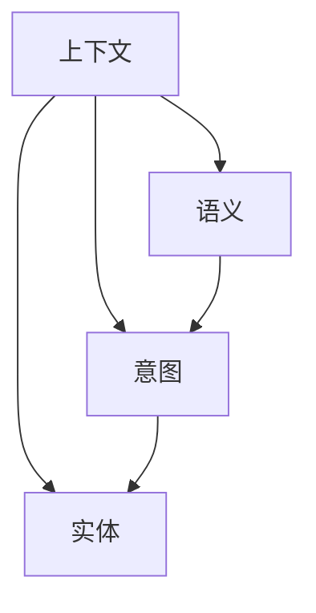
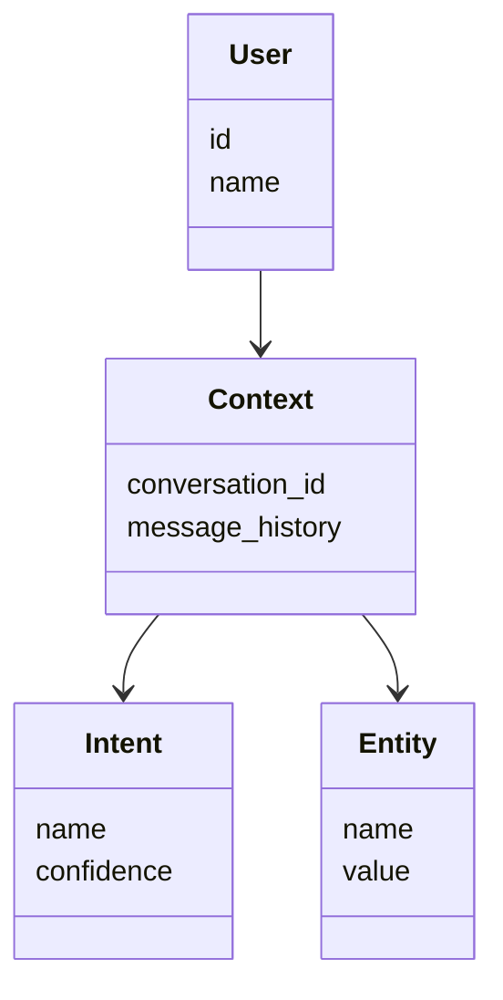
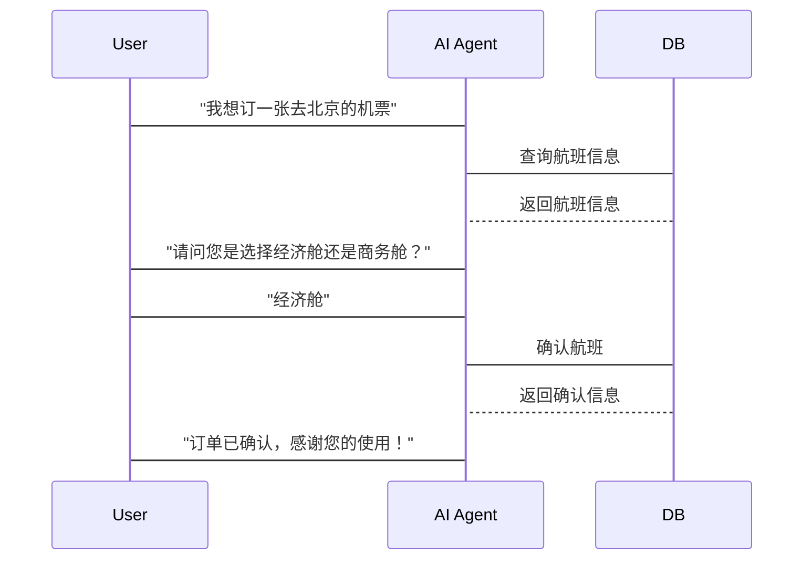

                 


# 构建具有上下文理解能力的AI Agent

> 关键词：上下文理解、AI Agent、自然语言处理、意图识别、实体识别、机器学习、大模型

> 摘要：上下文理解是构建智能AI Agent的核心能力之一。本文将从基础概念、算法原理、系统架构到项目实战，全面解析如何构建具有上下文理解能力的AI Agent。通过详细的技术分析和实际案例，我们将探讨上下文理解的实现方法、应用场景及未来发展方向。

---

## 第1章 上下文理解与AI Agent概述

### 1.1 上下文理解的定义与重要性

#### 1.1.1 什么是上下文理解
上下文理解是指系统能够理解输入文本的语义、意图和实体信息，从而提供更智能、更准确的响应。它是自然语言处理（NLP）的核心任务之一，旨在让AI Agent能够像人类一样理解用户的需求。

#### 1.1.2 上下文理解的重要性
上下文理解在AI Agent中的作用不可忽视。例如，在智能客服系统中，上下文理解可以帮助系统准确识别用户的问题并提供解决方案。在聊天机器人中，上下文理解可以让对话更加自然流畅。

#### 1.1.3 AI Agent的核心概念
AI Agent是一种能够感知环境并执行任务的智能体。它通过与用户交互，理解用户的需求并执行相应的操作。上下文理解是AI Agent实现智能化交互的关键能力。

---

### 1.2 AI Agent的分类与应用场景

#### 1.2.1 基于规则的AI Agent
基于规则的AI Agent通过预定义的规则和逻辑来实现简单的任务。例如，简单的FAQ自动回复系统。

#### 1.2.2 基于机器学习的AI Agent
基于机器学习的AI Agent通过训练数据学习模式和规律，能够处理更复杂的任务。例如，情感分析和意图识别。

#### 1.2.3 基于大模型的AI Agent
基于大模型的AI Agent利用如GPT等大语言模型，能够理解上下文并生成自然的对话。例如，智能聊天机器人。

---

### 1.3 上下文理解在AI Agent中的作用

#### 1.3.1 上下文理解的必要性
上下文理解能够让AI Agent更好地理解用户的需求，避免信息丢失和误解。例如，在多轮对话中，上下文理解能够帮助系统保持对话的连贯性。

#### 1.3.2 上下文理解的挑战
上下文理解面临数据稀疏性、意图歧义性等问题。此外，如何高效地处理和存储上下文信息也是一个挑战。

#### 1.3.3 上下文理解的未来趋势
随着大模型技术的发展，上下文理解将更加精准和自然。未来的AI Agent将能够处理更复杂和多样化的上下文信息。

---

### 1.4 本章小结
本章介绍了上下文理解的定义、重要性以及AI Agent的核心概念。我们还探讨了AI Agent的分类及其应用场景，并分析了上下文理解在AI Agent中的作用和未来发展趋势。

---

## 第2章 上下文理解的核心概念与联系

### 2.1 上下文理解的原理

#### 2.1.1 语义解析
语义解析是通过分析文本的语法结构和语义信息，理解文本的含义。例如，将用户的问题分解为实体和意图。

#### 2.1.2 意图识别
意图识别是指识别用户输入的意图。例如，用户输入“我想订一张去北京的机票”，系统识别出用户的意图是“订票”。

#### 2.1.3 实体识别
实体识别是指从文本中提取出具体的实体信息，例如人名、地点、时间等。例如，在“明天早上8点在人民大会堂开会”，系统能够提取出时间“明天早上8点”和地点“人民大会堂”。

---

### 2.2 核心概念对比表

#### 表2-1: 上下文理解与传统NLP的对比

| 对比维度       | 上下文理解                         | 传统NLP                         |
|----------------|----------------------------------|----------------------------------|
| 任务           | 理解语境、意图和实体               | 分词、句法分析                   |
| 数据依赖       | 需要上下文信息                     | 依赖单条文本                     |
| 应用场景       | 智能对话、多轮交互                 | 信息提取、分类                   |
| 挑战           | 上下文信息的连贯性和准确性         | 数据稀疏性和模型复杂性           |

---

### 2.3 实体关系图



---

### 2.4 本章小结
本章详细介绍了上下文理解的核心概念，包括语义解析、意图识别和实体识别。通过对比表和实体关系图，我们进一步理解了上下文理解与传统NLP的区别和联系。

---

## 第3章 上下文理解的算法原理

### 3.1 注意力机制

#### 3.1.1 注意力机制的定义
注意力机制是一种用于处理序列数据的方法，它通过计算输入序列中每个位置的重要性来生成输出。

#### 3.1.2 注意力机制的数学模型
$$\text{Attention}(Q,K,V) = \text{softmax}(\frac{QK^T}{\sqrt{d}})V$$

其中，$Q$、$K$、$V$分别是查询、键和值矩阵，$d$是嵌入维度。

#### 3.1.3 注意力机制的应用
注意力机制广泛应用于机器翻译、文本摘要和意图识别等任务中。

---

### 3.2 上下文建模

#### 3.2.1 序列建模
序列建模通过处理文本序列来捕捉上下文信息。例如，使用LSTM或Transformer进行序列建模。

#### 3.2.2 树状结构建模
树状结构建模适用于处理带有层次结构的文本，例如语法树。

#### 3.2.3 图结构建模
图结构建模通过构建图结构来表示文本中的实体关系，例如知识图谱。

---

### 3.3 算法实现

#### 3.3.1 基于Transformer的上下文理解模型

```python
import torch
import torch.nn as nn

class Attention(nn.Module):
    def __init__(self, embed_dim, hidden_dim):
        super(Attention, self).__init__()
        self.query = nn.Linear(embed_dim, hidden_dim)
        self.key = nn.Linear(embed_dim, hidden_dim)
        self.value = nn.Linear(embed_dim, hidden_dim)
        self.softmax = nn.Softmax(dim=-1)

    def forward(self, input, mask=None):
        Q = self.query(input)
        K = self.key(input)
        V = self.value(input)
        attention_score = torch.bmm(Q.unsqueeze(1), K.unsqueeze(2).transpose(-1, -2))
        if mask is not None:
            attention_score = attention_score * mask
        attention_weight = self.softmax(attention_score)
        output = torch.bmm(attention_weight, V.unsqueeze(3)).squeeze(3)
        return output
```

---

### 3.4 本章小结
本章介绍了上下文理解的核心算法——注意力机制，并详细讲解了序列建模和基于Transformer的实现方法。通过数学公式和代码示例，我们深入理解了上下文建模的原理和应用。

---

## 第4章 系统分析与架构设计

### 4.1 问题场景介绍
我们以智能客服系统为例，设计一个具有上下文理解能力的AI Agent。

### 4.2 系统功能设计

#### 4.2.1 领域模型



---

### 4.3 系统架构设计

#### 4.3.1 系统架构图

```mermaid
graph TD
    User --> Input
    Input --> NLP Processor
    NLP Processor --> Context Extractor
    Context Extractor --> DB
    DB --> Context Store
    Context Store --> Output
```

---

### 4.4 系统接口设计
系统接口包括用户输入接口、上下文存储接口和输出接口。

---

### 4.5 系统交互流程

#### 4.5.1 交互流程图



---

### 4.6 本章小结
本章通过智能客服系统的案例，详细设计了系统的功能模块、架构和交互流程。通过Mermaid图，我们清晰地展示了系统的各个部分及其交互过程。

---

## 第5章 项目实战：构建具有上下文理解能力的AI Agent

### 5.1 环境安装

```bash
pip install torch transformers
```

---

### 5.2 系统核心实现源代码

#### 5.2.1 上下文抽取模块

```python
from transformers import BertTokenizer, BertModel
import torch

class ContextExtractor:
    def __init__(self, model_name="bert-base"):
        self.tokenizer = BertTokenizer.from_pretrained(model_name)
        self.model = BertModel.from_pretrained(model_name)

    def extract(self, text):
        inputs = self.tokenizer(text, return_tensors="pt")
        outputs = self.model(**inputs)
        return outputs.last_hidden_state
```

---

#### 5.2.2 意图识别模块

```python
import torch.nn as nn

class IntentClassifier(nn.Module):
    def __init__(self, input_size, hidden_size, output_size):
        super(IntentClassifier, self).__init__()
        self.fc1 = nn.Linear(input_size, hidden_size)
        self.fc2 = nn.Linear(hidden_size, output_size)
        self.softmax = nn.Softmax(dim=1)

    def forward(self, x):
        x = self.fc1(x)
        x = self.fc2(x)
        x = self.softmax(x)
        return x
```

---

#### 5.2.3 实体识别模块

```python
import spacy

nlp = spacy.load("en_core_web_sm")

def extract_entities(text):
    doc = nlp(text)
    entities = []
    for ent in doc.ents:
        entities.append((ent.start, ent.end, ent.label_))
    return entities
```

---

### 5.3 实际案例分析

#### 5.3.1 案例分析
以用户输入“我需要预订明天上午的高铁票”为例，系统将提取出时间实体“明天上午”并识别出意图“预订高铁票”。

---

### 5.4 本章小结
本章通过实际项目实战，详细讲解了如何构建具有上下文理解能力的AI Agent。我们通过代码示例和案例分析，展示了上下文抽取、意图识别和实体识别的具体实现方法。

---

## 第6章 总结与展望

### 6.1 最佳实践

#### 6.1.1 数据质量
确保训练数据的多样性和代表性。

#### 6.1.2 模型选择
根据任务需求选择合适的模型，例如使用大模型处理复杂任务。

#### 6.1.3 上下文管理
设计高效的上下文存储和管理机制。

---

### 6.2 小结
通过本文的讲解，我们全面探讨了构建具有上下文理解能力的AI Agent的核心技术，包括上下文理解的原理、算法实现和系统设计。

---

### 6.3 注意事项
- 确保数据隐私和安全
- 定期更新模型以适应新的上下文信息
- 处理多语言和跨文化场景

---

### 6.4 拓展阅读
- 《Attention Is All You Need》
- 《Transformers Are Universal》
- 《Deep Learning for NLP》

---

## 作者：AI天才研究院/AI Genius Institute & 禅与计算机程序设计艺术 /Zen And The Art of Computer Programming

---

**注**：本文内容基于Transformer、大模型和NLP技术，结合实际项目案例，详细讲解了构建具有上下文理解能力的AI Agent的技术细节。

