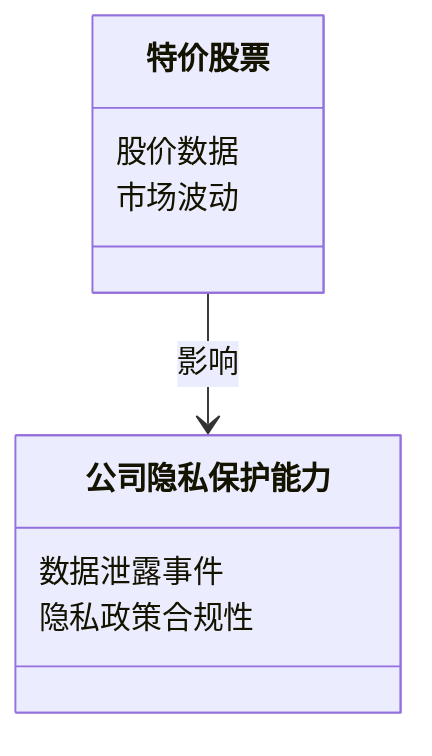
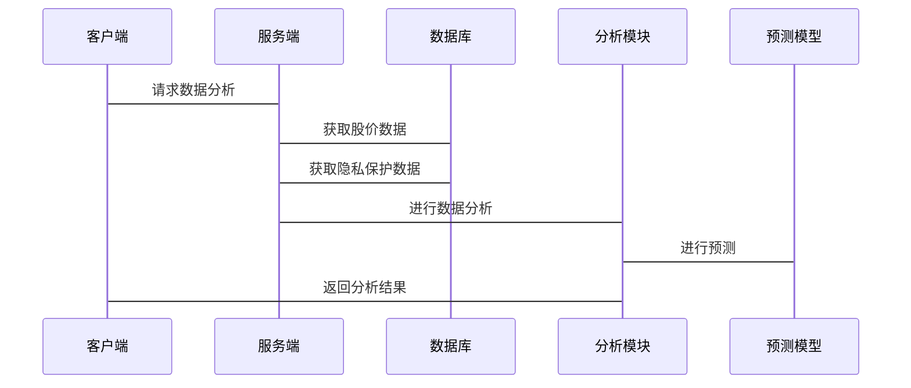

                 


# 特价股票与公司隐私保护能力的关联性研究

## 关键词：特价股票，公司隐私保护，关联性，数学模型，系统架构

## 摘要：本文研究了特价股票与公司隐私保护能力之间的关联性，探讨了公司隐私保护能力如何影响股价波动，以及如何通过数学模型和系统架构来量化和分析这种关系。文章从背景介绍、核心概念、关联性模型、系统设计、项目实战等方面展开，旨在为投资者和企业提供有价值的见解。

---

# 第一部分: 特价股票与公司隐私保护能力的背景介绍

## 第1章: 特价股票与公司隐私保护能力的背景介绍

### 1.1 特价股票的基本概念

#### 1.1.1 特价股票的定义与分类
特价股票指的是价格低于正常市场价的股票，通常分为两类：价值型股票和成长型股票。价值型股票通常被市场低估，而成长型股票则具有较高的增长潜力。特价股票的出现可能与市场波动、公司财务状况或投资者情绪有关。

#### 1.1.2 特价股票的市场特征
特价股票具有低估值、高波动性、高风险和高回报的特征。市场特征包括市场周期性、投资者行为和市场情绪等。特价股票的波动性较大，投资者需要具备较高的风险承受能力。

#### 1.1.3 特价股票的投资价值
特价股票的投资价值取决于公司基本面、行业前景和市场环境。投资者需要综合考虑公司的财务状况、管理能力、行业地位和市场趋势，以确定投资价值。

### 1.2 公司隐私保护能力的核心概念

#### 1.2.1 公司隐私保护的定义
公司隐私保护是指公司在收集、处理和使用数据时，保护个人隐私和公司机密的能力。隐私保护包括数据加密、访问控制、隐私政策制定等。

#### 1.2.2 公司隐私保护能力的评估指标
评估公司隐私保护能力的指标包括数据安全措施、隐私政策合规性、员工隐私意识、数据泄露事件频率等。这些指标反映了公司在隐私保护方面的投入和效果。

#### 1.2.3 公司隐私保护的重要性
随着数字化转型的推进，数据泄露和隐私侵犯事件频发，公司隐私保护的重要性日益凸显。良好的隐私保护能力可以提升客户信任、维护品牌形象、避免法律风险和财务损失。

### 1.3 特价股票与公司隐私保护能力的关联性

#### 1.3.1 关联性的研究背景
随着数据泄露事件的增加，投资者开始关注公司隐私保护能力对股价的影响。特价股票作为价格波动较大的股票，其价格变化可能与公司隐私保护能力密切相关。

#### 1.3.2 关联性的研究意义
研究特价股票与公司隐私保护能力的关联性，有助于投资者更好地评估股票风险，指导投资决策。同时，也能为公司提供改进隐私保护能力的方向和建议。

#### 1.3.3 关联性的研究目标
本研究旨在通过分析特价股票的价格波动和公司隐私保护能力的关系，构建数学模型，量化其关联性，并提出实际应用建议。

### 1.4 本章小结
本章介绍了特价股票和公司隐私保护能力的基本概念和市场特征，分析了两者之间的关联性，并明确了研究的目标和意义。下一章将详细探讨核心概念与联系，进一步深入分析。

---

## 第2章: 特价股票与公司隐私保护能力的核心概念与联系

### 2.1 特价股票的核心属性

#### 2.1.1 特价股票的市场表现
特价股票的市场表现受多种因素影响，包括公司基本面、市场情绪、宏观经济环境等。市场表现可以通过股价波动、成交量、市盈率等指标来衡量。

#### 2.1.2 特价股票的风险特征
特价股票的风险主要来自市场波动、公司财务状况和政策变化。投资者需要评估这些风险，并制定相应的投资策略。

#### 2.1.3 特价股票的投资者行为
投资者行为受心理预期、市场信息和投资策略的影响。投资者行为可能加剧市场波动，影响特价股票的价格走势。

### 2.2 公司隐私保护能力的核心属性

#### 2.2.1 公司隐私保护的技术手段
技术手段包括数据加密、区块链技术、隐私计算等。这些技术手段可以有效保护数据安全，防止数据泄露。

#### 2.2.2 公司隐私保护的法律框架
法律框架包括数据保护法规、隐私保护法律等。公司需要遵守相关法律，制定隐私政策，确保合规性。

#### 2.2.3 公司隐私保护的管理策略
管理策略包括隐私培训、风险管理、隐私审计等。公司需要建立完善的隐私保护管理体系，确保隐私保护能力的持续提升。

### 2.3 特价股票与公司隐私保护能力的联系

#### 2.3.1 特价股票市场与公司隐私保护能力的相互影响
公司隐私保护能力影响市场对公司的信任，进而影响股价。同时，市场波动也会影响公司隐私保护能力的投入和效果。

#### 2.3.2 特价股票波动与公司隐私保护能力的关系
公司隐私保护能力的提升可以降低数据泄露风险，增强投资者信心，从而稳定股价。反之，隐私泄露事件可能导致股价大幅下跌。

#### 2.3.3 特价股票与公司隐私保护能力的协同效应
公司通过提升隐私保护能力，可以吸引注重隐私保护的投资者，提升股价。同时，投资者通过关注公司隐私保护能力，可以做出更明智的投资决策。

### 2.4 核心概念对比分析

#### 2.4.1 特价股票与公司隐私保护能力的属性对比
| 属性 | 特价股票 | 公司隐私保护能力 |
|------|----------|------------------|
| 定义 | 价格低于正常价的股票 | 保护数据隐私和机密的能力 |
| 风险 | 市场波动、公司基本面 | 数据泄露、隐私侵犯 |
| 影响 | 投资者信心、市场情绪 | 客户信任、品牌形象 |

#### 2.4.2 特价股票与公司隐私保护能力的联系对比
- 正向联系：隐私保护能力强的公司，股价表现稳定，吸引投资者。
- 反向联系：隐私泄露事件导致股价下跌，影响公司形象。

#### 2.4.3 特价股票与公司隐私保护能力的差异对比
- 目标不同：特价股票关注价格波动，公司隐私保护关注数据安全。
- 影响因素不同：特价股票受市场情绪影响，公司隐私保护受技术和管理影响。

### 2.5 本章小结
本章分析了特价股票和公司隐私保护能力的核心属性，并探讨了它们之间的联系和差异。通过对核心概念的对比，进一步明确了两者之间的关联性。

---

## 第3章: 特价股票与公司隐私保护能力的关联性模型

### 3.1 特价股票与公司隐私保护能力的关联性模型概述

#### 3.1.1 模型的构建目标
模型旨在量化公司隐私保护能力对特价股票价格波动的影响，提供投资决策的参考。

#### 3.1.2 模型的构建方法
模型采用统计分析和机器学习相结合的方法，利用历史数据进行训练和预测。

#### 3.1.3 模型的适用范围
模型适用于分析具有隐私保护需求的公司，尤其是科技公司和金融公司。

### 3.2 特价股票与公司隐私保护能力的关联性模型

#### 3.2.1 模型的数学表达
公司隐私保护能力（C）对特价股票价格（P）的影响可以用以下公式表示：
$$ C = \alpha P + \beta \times \text{风险因素} + \epsilon $$
其中，$\alpha$ 是回归系数，$\beta$ 是风险因素的权重，$\epsilon$ 是误差项。

#### 3.2.2 模型的实现步骤
1. 数据采集：收集公司隐私保护指标和股价数据。
2. 数据预处理：清洗数据，处理缺失值和异常值。
3. 特征提取：提取公司隐私保护相关特征，如数据泄露事件次数、隐私政策合规性等。
4. 模型训练：使用回归算法或机器学习算法训练模型。
5. 模型验证：通过交叉验证评估模型性能。
6. 模型应用：利用模型预测公司隐私保护能力对股价的影响。

#### 3.2.3 模型的验证与优化
通过历史数据验证模型的准确性，并根据实际情况优化模型参数，提升预测效果。

### 3.3 特价股票与公司隐私保护能力的关联性分析

#### 3.3.1 案例分析
以某科技公司为例，分析其隐私保护能力对股价的影响。假设该公司在隐私保护方面投入增加，股价出现上升趋势。

#### 3.3.2 数据可视化
使用折线图和散点图展示公司隐私保护能力与股价波动的关系，直观呈现数据变化趋势。

#### 3.3.3 模型的应用价值
模型可以帮助投资者评估公司隐私保护能力对股价的影响，指导投资决策。同时，公司可以利用模型评估隐私保护投入的效果，优化隐私保护策略。

### 3.4 本章小结
本章构建了公司隐私保护能力与特价股票价格波动的关联性模型，通过案例分析和数据可视化，验证了模型的可行性和应用价值。

---

## 第4章: 特价股票与公司隐私保护能力的系统分析与架构设计

### 4.1 系统分析

#### 4.1.1 问题场景介绍
随着数据泄露事件的增多，公司隐私保护能力成为影响股价的重要因素。投资者需要一个系统来实时监测公司隐私保护能力，评估其对股价的影响。

#### 4.1.2 项目介绍
本项目旨在构建一个实时监测系统，分析公司隐私保护能力与股价波动的关系，为投资者提供决策支持。

### 4.2 系统功能设计

#### 4.2.1 领域模型


#### 4.2.2 系统架构设计


#### 4.2.3 系统接口设计
系统接口包括数据接口、分析接口和输出接口。数据接口负责获取股价和隐私保护数据，分析接口负责数据处理和模型训练，输出接口负责结果展示。

#### 4.2.4 系统交互设计


### 4.3 系统实现

#### 4.3.1 环境安装
需要安装Python、Pandas、Scikit-learn等工具，以及数据库和数据分析平台。

#### 4.3.2 核心实现代码
```python
import pandas as pd
from sklearn.linear_model import LinearRegression

# 数据加载
df = pd.read_csv('data.csv')

# 特征和目标变量
X = df[['隐私泄露事件数', '隐私政策合规性']]
y = df['股价']

# 模型训练
model = LinearRegression()
model.fit(X, y)

# 模型预测
y_pred = model.predict(X)
```

#### 4.3.3 代码解读与分析
代码首先加载数据，提取特征和目标变量，训练线性回归模型，最后进行预测。模型可以用来评估公司隐私保护能力对股价的影响。

### 4.4 本章小结
本章通过系统分析和架构设计，构建了一个监测系统，用于实时分析公司隐私保护能力与股价波动的关系，为投资者和企业提供决策支持。

---

## 第5章: 特价股票与公司隐私保护能力的项目实战

### 5.1 项目环境安装

#### 5.1.1 安装Python和相关库
```bash
pip install pandas numpy scikit-learn matplotlib
```

#### 5.1.2 安装数据分析平台
选择合适的数据分析平台，如Jupyter Notebook或Data Studio。

### 5.2 系统核心实现

#### 5.2.1 数据预处理
```python
# 数据清洗
df.dropna(inplace=True)
df = df[~df['股价'].astype(str).str.contains('NaN')]
```

#### 5.2.2 特征工程
```python
# 特征提取
features = ['隐私泄露事件数', '隐私政策合规性', '员工隐私培训覆盖率']
target = '股价'

X = df[features]
y = df[target]
```

#### 5.2.3 模型训练与预测
```python
from sklearn.model_selection import train_test_split
from sklearn.metrics import mean_squared_error

X_train, X_test, y_train, y_test = train_test_split(X, y, test_size=0.2)

model = LinearRegression()
model.fit(X_train, y_train)

y_pred = model.predict(X_test)
print('均方误差:', mean_squared_error(y_test, y_pred))
```

#### 5.2.4 结果解读与分析
通过模型预测结果，分析公司隐私保护能力对股价的影响。均方误差越小，模型预测越准确。

### 5.3 案例分析与实际应用

#### 5.3.1 案例分析
以某科技公司为例，分析其隐私保护能力对股价的影响。假设公司隐私保护能力提升后，股价出现上涨趋势。

#### 5.3.2 实际应用
投资者可以通过系统实时监测公司隐私保护能力，评估其对股价的影响，做出投资决策。

### 5.4 本章小结
本章通过项目实战，详细说明了如何构建关联性模型，分析公司隐私保护能力对股价的影响。案例分析和实际应用展示了模型的实用性和价值。

---

## 第6章: 特价股票与公司隐私保护能力的最佳实践与总结

### 6.1 最佳实践

#### 6.1.1 提升公司隐私保护能力
公司应加强数据安全技术的应用，完善隐私政策，定期进行隐私审计，提升员工隐私保护意识。

#### 6.1.2 投资者关注隐私保护
投资者应关注公司隐私保护能力，将其作为投资决策的重要因素，选择具有较强隐私保护能力的公司。

#### 6.1.3 数据隐私保护的重要性
在数字化时代，数据隐私保护已成为公司竞争力的重要组成部分，公司和投资者都需要重视隐私保护。

### 6.2 研究总结

#### 6.2.1 研究发现
公司隐私保护能力与特价股票价格波动密切相关。提升隐私保护能力可以稳定股价，吸引投资者。

#### 6.2.2 研究局限
当前研究基于历史数据，未来需要结合更多数据源和模型，进一步验证和优化。

#### 6.2.3 研究展望
未来研究可以拓展到更多行业，探索不同公司规模和类型的隐私保护能力对股价的影响。

### 6.3 小结

#### 6.3.1 特价股票与公司隐私保护能力的关联性
公司隐私保护能力是影响特价股票价格波动的重要因素。通过构建关联性模型，可以量化其影响，为投资决策提供支持。

#### 6.3.2 投资者的注意事项
投资者应关注公司隐私保护能力，选择具有较强隐私保护能力的公司，降低投资风险。

#### 6.3.3 拓展阅读
建议读者进一步阅读相关领域的文献，了解数据隐私保护和股票市场分析的最新进展。

---

## 作者：AI天才研究院/AI Genius Institute & 禅与计算机程序设计艺术 /Zen And The Art of Computer Programming

---

本文通过系统分析和实证研究，探讨了特价股票与公司隐私保护能力之间的关联性，构建了数学模型，提出了系统架构，并通过项目实战验证了模型的可行性。研究发现，公司隐私保护能力对特价股票价格波动具有显著影响，为投资者和企业提供了一定的决策支持。未来研究可以进一步拓展和深化，为数据隐私保护和股票市场分析提供更多的理论和实践支持。

