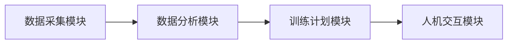
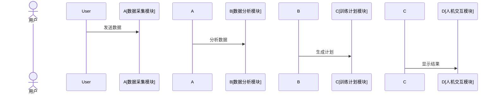

                 


# AI Agent在智能体育训练系统中的应用

> 关键词：AI Agent, 智能体育, 训练系统, 机器学习, 运动分析

> 摘要：本文探讨了AI Agent在智能体育训练系统中的应用，分析了其在运动员训练中的优势，详细讲解了AI Agent的核心概念、算法原理、系统架构设计以及实际案例。通过本文，读者可以全面了解AI Agent如何助力体育训练，并掌握其背后的技术原理。

---

# 第一部分: AI Agent在智能体育训练系统中的应用概述

## 第1章: AI Agent与智能体育训练系统概述

### 1.1 AI Agent的基本概念

#### 1.1.1 AI Agent的定义与特点
AI Agent（人工智能代理）是指能够感知环境、自主决策并执行任务的智能实体。其特点包括：
- **自主性**：能够独立决策，无需人工干预。
- **反应性**：能够实时感知环境并做出反应。
- **学习性**：通过数据和经验不断优化性能。
- **交互性**：能够与人类或其他系统进行有效交互。

#### 1.1.2 AI Agent在体育领域的应用背景
体育训练领域对个性化、实时性和高效性的要求日益增加。传统训练方法依赖教练经验和主观判断，存在效率低、个性化不足等问题。AI Agent的引入为解决这些问题提供了技术支撑。

#### 1.1.3 智能体育训练系统的概念与目标
智能体育训练系统通过整合传感器、AI算法和大数据分析，为运动员提供实时反馈和个性化训练方案。其目标是提高训练效率、优化运动表现并降低受伤风险。

### 1.2 AI Agent在体育训练中的优势

#### 1.2.1 提高训练效率
AI Agent能够实时分析运动员的动作、姿势和生物力学数据，提供即时反馈，帮助运动员快速改进技术动作。

#### 1.2.2 实时数据分析与反馈
通过传感器和AI算法，AI Agent能够实时分析运动数据，如心率、步频、加速度等，为教练和运动员提供科学的反馈。

#### 1.2.3 个性化训练方案的制定
AI Agent可以根据运动员的个人数据、训练目标和身体状况，制定个性化的训练计划，最大化训练效果。

### 1.3 智能体育训练系统的应用场景

#### 1.3.1 专业运动员训练
AI Agent可以帮助专业运动员优化技术动作、分析比赛策略并制定科学的训练计划。

#### 1.3.2 业余爱好者训练
对于业余爱好者，AI Agent可以提供个性化的训练建议，帮助他们科学地提升体能和运动技能。

#### 1.3.3 团队协作训练
在团队运动中，AI Agent可以分析队员之间的配合默契度，提供实时反馈和优化建议，提升团队协作能力。

## 第2章: AI Agent的核心概念与原理

### 2.1 AI Agent的核心概念

#### 2.1.1 知识表示与推理
知识表示是AI Agent理解世界的基础。通过符号逻辑、语义网络等方式，AI Agent可以表示和推理知识。

#### 2.1.2 行为决策机制
AI Agent的行为决策基于感知信息和预设的目标，通过算法选择最优动作。

#### 2.1.3 人机交互界面
人机交互是AI Agent与用户沟通的关键，友好的界面设计可以提升用户体验。

### 2.2 AI Agent的感知与决策

#### 2.2.1 数据采集与处理
AI Agent通过传感器、摄像头等设备采集运动员的运动数据，并进行预处理和特征提取。

#### 2.2.2 状态识别与分析
基于采集的数据，AI Agent通过机器学习模型识别运动员的状态，如疲劳程度、动作规范性等。

#### 2.2.3 行为决策算法
常用的决策算法包括强化学习（Reinforcement Learning）、监督学习（Supervised Learning）和基于规则的决策树。

### 2.3 AI Agent的执行与反馈

#### 2.3.1 动作规划与优化
AI Agent根据决策结果生成动作计划，并通过优化算法不断改进动作的执行效果。

#### 2.3.2 训练效果评估
AI Agent可以通过对比训练前后的数据，评估训练效果，并提供改进建议。

#### 2.3.3 自适应调整机制
AI Agent能够根据实时反馈动态调整训练计划，确保运动员始终处于最佳训练状态。

---

# 第二部分: AI Agent在体育训练中的算法原理

## 第3章: AI Agent在体育训练中的算法原理

### 3.1 基于强化学习的训练优化

#### 3.1.1 强化学习的基本原理
强化学习通过智能体与环境的交互，学习最优策略。智能体会通过试错不断优化动作，以最大化累积奖励。

#### 3.1.2 在体育训练中的应用
AI Agent可以使用强化学习优化运动员的动作序列，例如在跳高或跳远训练中，AI Agent可以通过试错找到最佳的动作组合。

#### 3.1.3 算法实现与优化
以下是强化学习的Q-learning算法实现示例：

```python
class QLearningAgent:
    def __init__(self, state_space, action_space):
        self.state_space = state_space
        self.action_space = action_space
        self.Q = np.zeros((state_space, action_space))

    def choose_action(self, state, epsilon):
        if np.random.random() < epsilon:
            return np.random.randint(self.action_space)
        else:
            return np.argmax(self.Q[state, :])

    def update_Q(self, state, action, reward, next_state, alpha):
        self.Q[state, action] = (1 - alpha) * self.Q[state, action] + alpha * (reward + np.max(self.Q[next_state, :]))
```

数学模型：
$$ Q(s, a) = Q(s, a) + \alpha (r + \max Q(s', a') - Q(s, a)) $$

### 3.2 基于监督学习的训练反馈

#### 3.2.1 监督学习的基本原理
监督学习通过标记数据训练模型，使其能够预测新数据的标签。在体育训练中，标记数据可以是运动员的动作是否正确。

#### 3.2.2 在训练数据中的应用
AI Agent可以通过监督学习分析大量运动员动作数据，识别出优秀动作的特征，并指导运动员模仿这些动作。

#### 3.2.3 数据标注与模型训练
数据标注是监督学习的关键步骤，需要人工或半自动化的工具完成。以下是训练过程的Python代码示例：

```python
import pandas as pd
from sklearn.model import RandomForestClassifier

# 加载数据
data = pd.read_csv('train.csv')

# 分割特征与标签
X = data.drop('label', axis=1)
y = data['label']

# 训练模型
model = RandomForestClassifier()
model.fit(X, y)

# 预测新数据
new_data = pd.read_csv('test.csv')
new_X = new_data.drop('label', axis=1)
predictions = model.predict(new_X)
```

### 3.3 基于图神经网络的训练分析

#### 3.3.1 图神经网络的基本原理
图神经网络（Graph Neural Network, GNN）能够处理图结构数据，适用于复杂的网络关系分析。

#### 3.3.2 在运动轨迹分析中的应用
AI Agent可以使用图神经网络分析运动员的运动轨迹，识别潜在的协同关系或问题。

#### 3.3.3 算法实现与案例分析
以下是图神经网络的实现示例：

```python
import networkx as nx
from sklearn.manifold import TSNE

# 创建图
G = nx.Graph()
G.add_nodes_from(['A', 'B', 'C'])
G.add_edges_from([('A', 'B'), ('B', 'C'), ('A', 'C')])

# 绘制图
nx.draw(G, with_labels=True)
plt.show()
```

数学模型：
$$ Z = G \cdot X $$

---

# 第三部分: 智能体育训练系统的系统架构设计

## 第4章: 智能体育训练系统的系统架构设计

### 4.1 系统功能模块划分

#### 4.1.1 数据采集模块
数据采集模块通过传感器、摄像头等设备采集运动员的运动数据。

#### 4.1.2 数据分析模块
数据分析模块对采集的数据进行清洗、特征提取和模型训练。

#### 4.1.3 训练计划模块
训练计划模块根据分析结果生成个性化的训练计划。

#### 4.1.4 人机交互模块
人机交互模块提供友好的用户界面，方便教练和运动员使用。

### 4.2 系统架构设计

#### 4.2.1 分层架构设计
系统采用分层架构，包括数据层、业务逻辑层和表现层。

#### 4.2.2 系统架构图
以下为系统架构的Mermaid图：



#### 4.2.3 系统接口设计
系统接口设计包括数据接口和用户接口，确保各模块之间的数据流通。

#### 4.2.4 系统交互序列图
以下为人机交互的Mermaid序列图：



---

# 第四部分: 项目实战

## 第5章: 项目实战——基于AI Agent的跑步训练系统

### 5.1 环境安装与配置

#### 5.1.1 安装Python环境
使用Anaconda安装Python 3.8及以上版本。

#### 5.1.2 安装依赖库
安装必要的库，如TensorFlow、Keras、Scikit-learn等。

### 5.2 核心代码实现

#### 5.2.1 数据采集模块
使用传感器采集跑步数据，如步频、步长、心率等。

#### 5.2.2 数据分析模块
使用机器学习算法分析数据，识别运动员的潜在问题。

#### 5.2.3 训练计划模块
根据分析结果生成个性化训练计划。

#### 5.2.4 人机交互模块
设计友好的用户界面，展示分析结果和训练计划。

### 5.3 代码解读与分析

#### 5.3.1 数据采集模块
```python
import numpy as np
import pandas as pd
import tensorflow as tf
from tensorflow import keras

# 加载数据集
data = pd.read_csv('running_data.csv')

# 数据预处理
X = data.drop('label', axis=1)
y = data['label']

# 划分训练集和测试集
X_train, X_test = train_test_split(X, test_size=0.2)
y_train, y_test = train_test_split(y, test_size=0.2)

# 构建模型
model = keras.Sequential([
    keras.layers.Dense(64, activation='relu'),
    keras.layers.Dense(1, activation='sigmoid')
])

# 编译模型
model.compile(optimizer='adam', loss='binary_crossentropy', metrics=['accuracy'])

# 训练模型
model.fit(X_train, y_train, epochs=10, batch_size=32)
```

#### 5.3.2 训练计划模块
```python
def generate_training_plan(data, model):
    predictions = model.predict(data)
    plan = []
    for i in range(len(predictions)):
        if predictions[i] > 0.5:
            plan.append('增加强度')
        else:
            plan.append('降低强度')
    return plan
```

### 5.4 案例分析与总结

#### 5.4.1 案例分析
通过实际案例展示AI Agent如何优化跑步训练计划。

#### 5.4.2 项目总结
总结项目实现的关键点和成功经验。

---

# 第五部分: 总结与展望

## 第6章: 总结与展望

### 6.1 总结
本文详细探讨了AI Agent在智能体育训练系统中的应用，从核心概念到算法实现，再到系统架构设计，为读者提供了全面的视角。

### 6.2 未来展望
未来，AI Agent在体育训练中的应用将更加广泛和深入。随着技术的进步，AI Agent将具备更强的感知和决策能力，为运动员和教练提供更精准的支持。

---

# 作者：AI天才研究院/AI Genius Institute & 禅与计算机程序设计艺术 /Zen And The Art of Computer Programming

---

通过本文的详细讲解，读者可以全面了解AI Agent在智能体育训练系统中的应用，并掌握其背后的技术原理。希望本文能够为相关领域的研究和实践提供有价值的参考。

