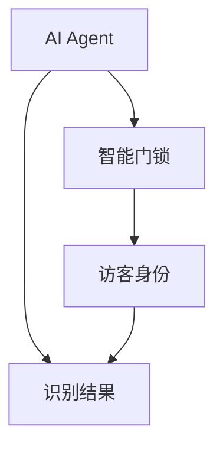
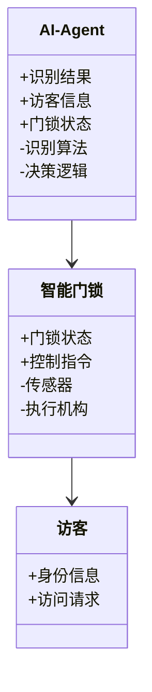
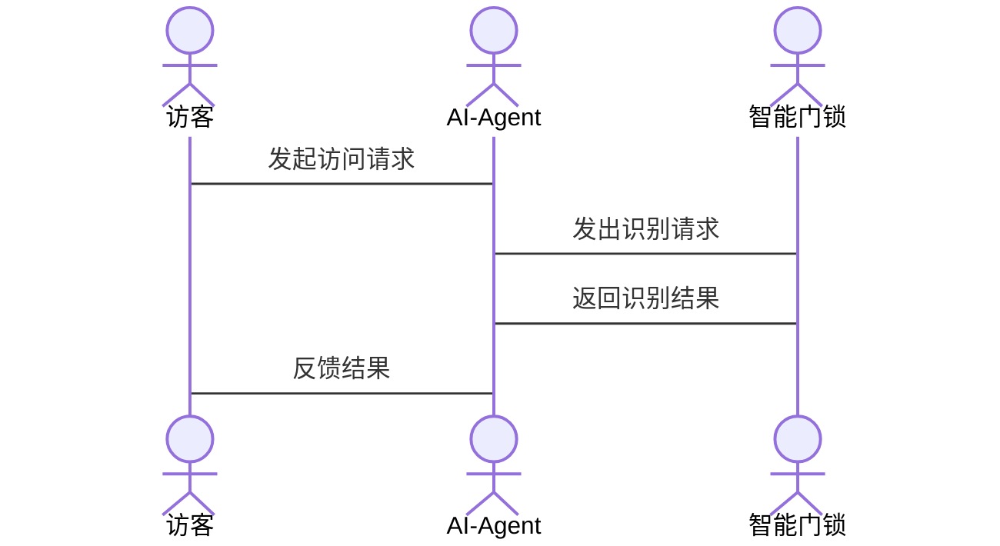

                 


# AI Agent在智能门把手中的访客身份识别

> 关键词：AI Agent, 智能门锁, 访客身份识别, 算法原理, 系统架构

> 摘要：本文将详细探讨AI Agent在智能门把手中访客身份识别的应用，从背景介绍、核心概念、算法原理到系统架构和项目实战，全面解析如何通过AI技术实现智能门锁的访客身份识别功能。

---

# 第一部分: AI Agent与智能门锁的背景介绍

# 第1章: AI Agent与智能门锁的背景概述

## 1.1 AI Agent的基本概念

### 1.1.1 AI Agent的定义与特点

AI Agent（人工智能代理）是一种能够感知环境、自主决策并执行任务的智能实体。它具有以下特点：

- **自主性**：能够在没有外部干预的情况下自主运作。
- **反应性**：能够实时感知环境并做出相应的反应。
- **目标导向**：以特定目标为导向，优化决策过程。
- **学习能力**：能够通过数据学习和优化自身的性能。

### 1.1.2 AI Agent的核心功能与优势

AI Agent的核心功能包括：

- **感知环境**：通过传感器、摄像头等设备获取环境信息。
- **决策与推理**：基于感知信息进行推理和决策。
- **执行任务**：根据决策结果执行具体的操作。

AI Agent的优势在于其智能化和自动化能力，能够显著提升系统的效率和用户体验。

### 1.1.3 AI Agent在智能门锁中的应用价值

AI Agent在智能门锁中的应用主要体现在以下几个方面：

- **访客识别**：通过AI算法识别访客身份，实现智能化的门禁控制。
- **异常检测**：实时监测门锁状态，发现异常行为并及时报警。
- **远程控制**：通过AI Agent实现远程门锁控制，提升用户便利性。

## 1.2 智能门锁的发展历程

### 1.2.1 传统门锁的功能与局限性

传统门锁的主要功能是通过钥匙开启门锁，其局限性包括：

- **安全性低**：钥匙容易被复制，且一旦丢失，难以及时处理。
- **管理复杂**：需要手动管理钥匙的发放和回收。
- **智能化程度低**：无法实现远程控制和智能化管理。

### 1.2.2 智能门锁的兴起与技术革新

随着物联网和人工智能技术的发展，智能门锁应运而生。智能门锁通过集成传感器、无线通信和AI算法，实现了智能化的门禁控制。

### 1.2.3 智能门锁的市场现状与发展趋势

当前，智能门锁市场呈现快速增长态势，主要得益于以下因素：

- **技术进步**：AI、物联网等技术的快速发展推动了智能门锁的普及。
- **用户需求**：用户对智能化、便捷化的门锁需求日益增加。
- **政策支持**：政府对智能家居的支持政策进一步促进了智能门锁的推广。

## 1.3 访客身份识别的必要性与挑战

### 1.3.1 访客身份识别的核心问题

访客身份识别的核心问题是如何准确、快速地识别访客身份，确保门锁的安全性和便利性。

### 1.3.2 智能门锁中访客识别的主要挑战

在智能门锁中，访客识别面临以下挑战：

- **数据隐私**：访客信息的存储和传输需要确保隐私安全。
- **识别精度**：需要在复杂环境下保证识别的准确性。
- **实时性**：访客识别需要在短时间内完成，以提升用户体验。

### 1.3.3 解决方案的初步探讨

针对上述挑战，可以通过以下方案进行解决：

- **数据加密**：采用加密技术保护访客信息。
- **多模态识别**：结合人脸、指纹等多种识别方式提高精度。
- **优化算法**：通过优化AI算法提升识别速度和准确性。

## 1.4 本章小结

### 1.4.1 AI Agent与智能门锁的结合点

AI Agent与智能门锁的结合点在于访客身份识别和门锁控制。

### 1.4.2 访客身份识别的关键技术

访客身份识别的关键技术包括AI算法、传感器技术和通信技术。

### 1.4.3 本书的研究目标与意义

本书旨在探讨AI Agent在智能门锁中的应用，特别是访客身份识别技术的研究与实现。

---

# 第二部分: AI Agent与智能门锁的核心概念与联系

# 第2章: AI Agent与智能门锁的核心概念

## 2.1 AI Agent的原理与实现

### 2.1.1 AI Agent的感知与决策机制

AI Agent的感知机制通过传感器和摄像头获取环境信息，决策机制基于感知信息进行推理和决策。

### 2.1.2 AI Agent的交互与执行流程

AI Agent通过与智能门锁的交互，实现访客身份识别和门锁控制。

### 2.1.3 AI Agent的自适应与学习能力

AI Agent能够通过学习优化自身的识别和决策能力。

## 2.2 智能门锁的系统架构

### 2.2.1 智能门锁的功能模块划分

智能门锁的功能模块包括：

- **感知模块**：负责采集环境信息。
- **识别模块**：负责访客身份的识别。
- **控制模块**：负责门锁的开启和关闭。
- **通信模块**：负责与外部系统通信。

### 2.2.2 智能门锁的硬件与软件组成

智能门锁的硬件组成包括传感器、摄像头、微控制器和通信模块。软件组成包括操作系统、AI算法和应用软件。

### 2.2.3 智能门锁的通信协议与数据流

智能门锁采用蓝牙、Wi-Fi等通信协议，数据流包括访客信息、识别结果和控制指令。

## 2.3 AI Agent与智能门锁的实体关系图



## 2.4 本章小结

### 2.4.1 AI Agent与智能门锁的核心概念对比

AI Agent与智能门锁在功能和实现上有显著差异，但AI Agent是智能门锁的核心驱动力。

### 2.4.2 实体关系图的应用价值

实体关系图清晰地展示了AI Agent与智能门锁之间的交互关系。

### 2.4.3 本章内容的总结与思考

通过本章的分析，我们明确了AI Agent与智能门锁的核心概念及其相互关系。

---

# 第三部分: AI Agent在访客身份识别中的算法原理

# 第3章: 基于AI Agent的访客身份识别算法

## 3.1 算法原理概述

### 3.1.1 基于卷积神经网络的图像识别

卷积神经网络（CNN）是一种常用的图像识别算法，通过多层卷积操作提取图像特征。

### 3.1.2 基于自然语言处理的访客信息分析

自然语言处理（NLP）技术用于分析访客的文本信息，如门禁卡上的文字。

### 3.1.3 算法的整体流程与步骤

1. **数据采集**：通过摄像头和传感器采集访客信息。
2. **数据预处理**：对采集的数据进行清洗和归一化处理。
3. **特征提取**：通过卷积神经网络提取图像特征。
4. **模型训练**：训练卷积神经网络模型。
5. **识别与决策**：基于模型输出识别结果并进行门锁控制。

## 3.2 算法实现细节

### 3.2.1 数据预处理与特征提取

数据预处理包括图像的灰度化、归一化等操作。特征提取通过卷积层实现。

### 3.2.2 神经网络模型的构建与训练

使用Keras框架构建卷积神经网络模型，并通过训练数据进行模型训练。

### 3.2.3 模型的优化与调参

通过调整学习率、批量大小等参数优化模型性能。

## 3.3 算法的数学模型与公式

### 3.3.1 卷积神经网络的数学表达

卷积操作的数学表达式为：

$$ (W \ast x) = \sum_{i=1}^{n} w_i x_i $$

其中，\( W \) 是卷积核，\( x \) 是输入图像的像素值。

### 3.3.2 激活函数的选择与应用

常用的激活函数包括ReLU、sigmoid等。ReLU的数学表达式为：

$$ f(x) = \max(0, x) $$

### 3.3.3 池化操作的原理

池化操作用于降低特征图的维度，常用最大池化和平均池化。最大池化的数学表达式为：

$$ f(x) = \max_{i} x_i $$

---

# 第四部分: 系统分析与架构设计方案

# 第4章: 系统分析与架构设计

## 4.1 问题场景介绍

### 4.1.1 访客身份识别的场景描述

访客通过智能门锁的摄像头和传感器进行身份识别，系统根据识别结果控制门锁的开启。

### 4.1.2 系统需求分析

系统需要实现访客身份识别、门锁控制、数据存储和用户交互等功能。

## 4.2 项目介绍

### 4.2.1 项目目标

项目目标是实现基于AI Agent的智能门锁访客身份识别系统。

### 4.2.2 项目范围

项目范围包括硬件设计、算法实现、系统集成和用户界面设计。

## 4.3 系统功能设计

### 4.3.1 领域模型类图



### 4.3.2 系统架构设计


## 4.4 系统接口设计

### 4.4.1 接口描述

系统接口包括：

- **AI Agent接口**：与智能门锁和访客交互的接口。
- **智能门锁接口**：与传感器和执行机构交互的接口。
- **用户界面接口**：与用户交互的接口。

### 4.4.2 接口交互流程

1. 访客发起访问请求。
2. AI Agent接收请求并进行身份识别。
3. 智能门锁根据识别结果控制门锁的开启或关闭。
4. 系统记录访问日志并反馈结果。

## 4.5 系统交互流程

### 4.5.1 交互流程描述

1. 访客通过摄像头和传感器采集身份信息。
2. AI Agent对采集的信息进行识别和分析。
3. 智能门锁根据识别结果控制门锁的开启或关闭。
4. 系统记录访问日志并反馈结果。

### 4.5.2 交互流程图



---

# 第五部分: 项目实战

# 第5章: 项目实战

## 5.1 环境安装

### 5.1.1 安装Python环境

安装Python 3.8及以上版本，并安装必要的库，如Keras、TensorFlow、OpenCV等。

### 5.1.2 安装AI Agent框架

安装AI Agent框架，如安装Keras和TensorFlow。

### 5.1.3 安装智能门锁硬件

安装智能门锁硬件，包括摄像头、传感器和执行机构。

## 5.2 系统核心实现

### 5.2.1 AI Agent的核心代码实现

```python
import keras
from keras.layers import Conv2D, MaxPooling2D, Flatten, Dense
from keras.models import Sequential

# 定义卷积神经网络模型
model = Sequential()
model.add(Conv2D(32, (3,3), activation='relu', input_shape=(64,64,3)))
model.add(MaxPooling2D((2,2)))
model.add(Flatten())
model.add(Dense(128, activation='relu'))
model.add(Dense(1, activation='sigmoid'))
model.compile(optimizer='adam', loss='binary_crossentropy', metrics=['accuracy'])
```

### 5.2.2 智能门锁的硬件集成

在智能门锁中集成摄像头、传感器和执行机构，实现访客信息的采集和门锁的控制。

### 5.2.3 系统接口实现

实现AI Agent与智能门锁之间的通信接口，确保数据的实时传输和交互。

## 5.3 代码应用解读与分析

### 5.3.1 代码功能解读

上述代码实现了一个简单的卷积神经网络模型，用于图像识别任务。

### 5.3.2 代码实现分析

通过训练数据优化模型性能，提升识别精度。

## 5.4 实际案例分析

### 5.4.1 案例背景介绍

某小区的智能门锁系统采用AI Agent进行访客身份识别。

### 5.4.2 系统实现与分析

通过AI Agent实现访客身份识别，提升门锁的安全性和便利性。

## 5.5 项目小结

### 5.5.1 项目实现的主要成果

成功实现了基于AI Agent的智能门锁访客身份识别系统。

### 5.5.2 项目实施中的关键点

数据采集、模型优化和系统集成是项目实施的关键。

### 5.5.3 项目实施的经验总结

通过项目实施，我们掌握了AI Agent在智能门锁中的应用技术，提升了系统的智能化水平。

---

# 第六部分: 总结与展望

# 第6章: 总结与展望

## 6.1 本章总结

### 6.1.1 AI Agent与智能门锁的核心技术

AI Agent与智能门锁的核心技术包括AI算法、传感器技术和通信技术。

### 6.1.2 访客身份识别的主要实现方法

访客身份识别的主要实现方法包括图像识别和自然语言处理。

### 6.1.3 项目实施的成果与意义

项目成功实现了基于AI Agent的智能门锁访客身份识别系统，提升了系统的智能化和安全性。

## 6.2 未来展望

### 6.2.1 技术发展与优化方向

未来可以进一步优化AI算法，提升识别精度和实时性。

### 6.2.2 AI Agent在智能门锁中的潜在应用

AI Agent在智能门锁中的潜在应用包括智能门禁管理、远程控制和异常检测。

### 6.2.3 人工智能技术的进一步融合

未来可以进一步融合其他人工智能技术，如深度学习和强化学习，提升系统的智能化水平。

## 6.3 最佳实践 tips

### 6.3.1 项目实施中的注意事项

在项目实施中，需要注意数据隐私保护和系统稳定性。

### 6.3.2 系统优化建议

建议采用多模态识别技术和加密算法，提升系统的安全性和识别精度。

### 6.3.3 未来研究方向

未来可以研究AI Agent在智能门锁中的多场景应用，如智能家居、公共安全等。

---

作者：AI天才研究院/AI Genius Institute & 禅与计算机程序设计艺术/Zen And The Art of Computer Programming

---

以上就是《AI Agent在智能门把手中的访客身份识别》的技术博客文章内容，希望对您有所帮助！

