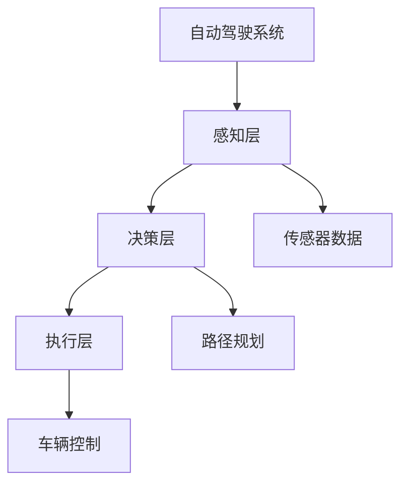
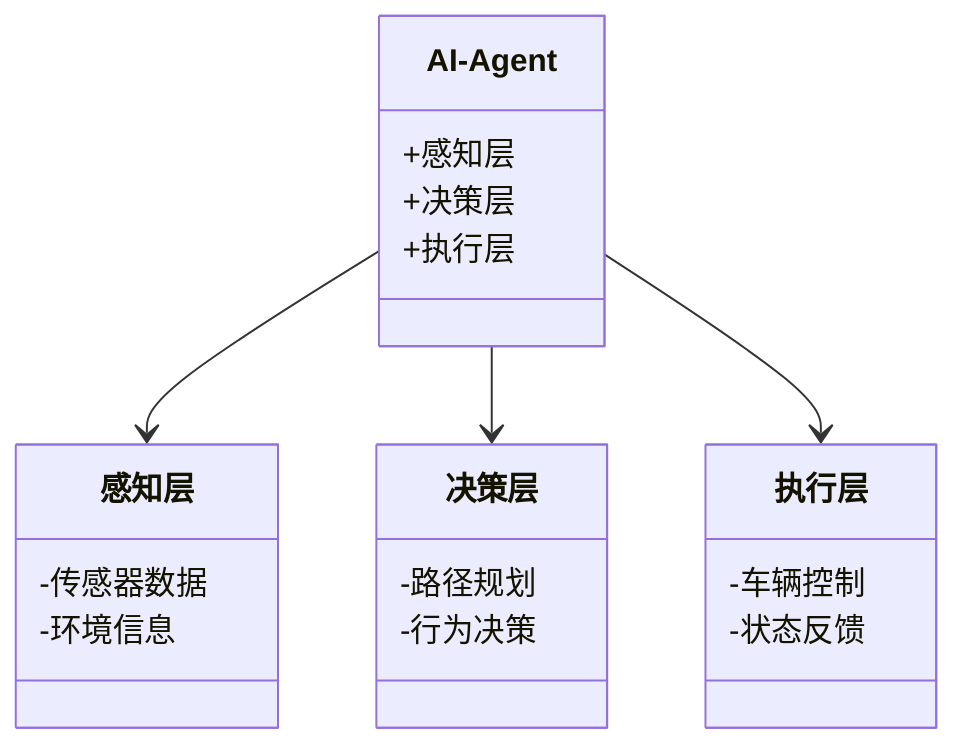
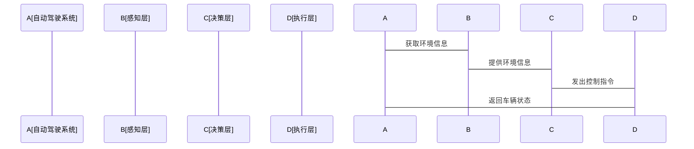

                 


# AI Agent在自动驾驶决策中的应用

## 关键词：自动驾驶，AI Agent，决策模型，强化学习，系统架构

## 摘要：本文将深入探讨AI Agent在自动驾驶决策中的应用，从自动驾驶的背景与发展开始，逐步分析AI Agent的核心概念与算法原理，结合数学模型和系统架构设计方案，最后通过项目实战案例详细讲解AI Agent在自动驾驶中的具体应用。本文将帮助读者全面理解AI Agent在自动驾驶中的重要作用，并掌握其背后的算法原理与实现方法。

---

# 第1章: 自动驾驶的背景与发展

## 1.1 自动驾驶的定义与分类

### 1.1.1 自动驾驶的定义

自动驾驶（Autonomous Driving）是指车辆在没有人类驾驶员干预的情况下，能够完成从一个地点到另一个地点的行驶任务。它通过传感器、计算机构和执行机构的协同工作，实现对环境的感知、路径规划和决策控制。

### 1.1.2 自动驾驶的分类与等级划分

根据国际标准化组织（ISO）的标准，自动驾驶分为五个等级：

- **L0：无自动驾驶功能**  
  完全依赖驾驶员操作，车辆无任何自动驾驶功能。

- **L1：驾驶辅助（CA）**  
  车辆能够辅助驾驶员完成部分驾驶任务，如自适应巡航控制（ACC）。

- **L2：部分自动驾驶（PA）**  
  车辆能够在特定条件下完成部分驾驶任务，如车道保持辅助（LKA）和自适应巡航控制（ACC）的结合。

- **L3：有条件自动驾驶（CA）**  
  车辆在特定条件下能够完成全部驾驶任务，但在系统请求时需要驾驶员干预。

- **L4：高度自动驾驶（HAD）**  
  车辆在特定区域内能够完成全部驾驶任务，无需驾驶员干预。

- **L5：完全自动驾驶（FAD）**  
  车辆在全球范围内能够完成全部驾驶任务，适用于所有道路和交通条件。

### 1.1.3 自动驾驶的发展历程

自动驾驶技术的发展可以追溯到20世纪初，但真正意义上的自动驾驶技术开始于20世纪80年代。1980年，美国国防高级研究计划局（DARPA）启动了自动驾驶汽车项目，随后各国纷纷投入大量资源进行研究。进入21世纪后，随着人工智能和计算技术的飞速发展，自动驾驶技术取得了突破性进展，尤其是在深度学习和强化学习算法的应用下，自动驾驶的决策能力得到了显著提升。

---

## 1.2 AI Agent的基本概念

### 1.2.1 AI Agent的定义

AI Agent（人工智能代理）是指能够感知环境、做出决策并采取行动以实现目标的智能体。AI Agent的核心在于其自主性、反应性和目标导向性。它能够根据环境信息动态调整行为，以达到预定目标。

### 1.2.2 AI Agent的核心特点

- **自主性（Autonomy）**：AI Agent能够在没有外部干预的情况下独立运作。  
- **反应性（Reactivity）**：AI Agent能够实时感知环境变化并做出相应反应。  
- **目标导向性（Goal-oriented）**：AI Agent的行为旨在实现特定目标。  
- **学习能力（Learnability）**：AI Agent能够通过学习和经验优化决策策略。  

### 1.2.3 AI Agent与传统算法的区别

AI Agent与传统算法的主要区别在于其智能性和适应性。传统算法通常基于固定的规则和逻辑，而AI Agent能够根据环境信息动态调整行为，并通过学习不断优化决策策略。AI Agent的核心在于其能够处理复杂、动态和不确定的环境，而传统算法往往适用于结构化和静态的问题。

---

## 1.3 自动驾驶与AI Agent的结合

### 1.3.1 自动驾驶中的决策问题

自动驾驶的核心问题在于如何在复杂和动态的环境中做出最优决策。这需要车辆能够实时感知环境信息、预测其他交通参与者的行为，并制定合理的行驶策略。

### 1.3.2 AI Agent在自动驾驶中的作用

AI Agent在自动驾驶中主要负责决策和控制。它通过感知环境信息（如激光雷达、摄像头和雷达的数据），结合车辆的运动状态和目标（如到达目的地），制定最优的行驶路径和动作（如加速、减速、转向）。

### 1.3.3 自动驾驶与AI Agent的未来发展趋势

随着人工智能和计算技术的不断进步，AI Agent在自动驾驶中的应用将更加广泛和深入。未来的自动驾驶系统将更加注重多目标优化和多智能体协作，以应对复杂的交通环境和多样化的行驶需求。

---

## 1.4 本章小结

本章介绍了自动驾驶的背景与发展、AI Agent的基本概念及其在自动驾驶中的作用。通过对比传统算法和AI Agent的特点，我们可以看出，AI Agent在自动驾驶中的应用将极大地提升车辆的决策能力和适应性，为未来的智能交通系统奠定基础。

---

# 第2章: AI Agent在自动驾驶中的核心概念

## 2.1 自动驾驶中的感知、决策与执行

### 2.1.1 感知层：环境信息的获取与处理

感知层是自动驾驶系统的核心组成部分之一。它通过多种传感器（如激光雷达、摄像头、雷达和超声波传感器）获取环境信息，并通过算法对这些信息进行处理和融合，以获得车辆的实时位置、周围障碍物的位置以及道路的几何信息。

### 2.1.2 决策层：AI Agent的决策逻辑

决策层是自动驾驶系统中负责制定行驶策略的核心部分。AI Agent通过分析感知层提供的环境信息，结合车辆的运动状态和目标，制定最优的行驶路径和动作。这通常涉及路径规划、行为决策和轨迹规划等多个子任务。

### 2.1.3 执行层：决策的执行与反馈

执行层是自动驾驶系统的执行机构，负责将决策层制定的策略转化为具体的动作，如转向、加速和制动。同时，执行层还会将车辆的实际状态反馈给感知层和决策层，以实现闭环控制。

---

## 2.2 AI Agent的决策模型

### 2.2.1 基于规则的决策模型

基于规则的决策模型是一种简单的决策方法，通过预定义的规则和条件来制定决策。例如，当检测到前方有障碍物时，车辆会自动减速或停车。这种方法适用于规则简单且环境确定性较高的场景，但在复杂和动态的环境中表现有限。

### 2.2.2 基于强化学习的决策模型

基于强化学习的决策模型是一种通过试错学习优化决策策略的方法。AI Agent通过与环境的交互，不断尝试不同的动作，并根据奖励函数的反馈优化其决策策略。这种方法适用于复杂和动态的环境，能够实现全局最优决策。

### 2.2.3 基于深度学习的决策模型

基于深度学习的决策模型是一种通过神经网络学习环境特征并制定决策的方法。与基于规则的决策模型不同，深度学习模型能够从大量数据中学习复杂的特征和模式，从而制定更智能和灵活的决策。

---

## 2.3 AI Agent与多目标优化

### 2.3.1 多目标优化的定义与特点

多目标优化是指在多个目标之间进行权衡和优化的过程。在自动驾驶中，多目标优化通常涉及安全性、舒适性、效率等多个目标。例如，AI Agent需要在保证安全的前提下，尽可能提高行驶效率。

### 2.3.2 AI Agent在多目标优化中的应用

AI Agent通过多目标优化算法，在多个目标之间进行权衡，以制定最优的行驶策略。例如，AI Agent需要在避免碰撞的同时，尽可能缩短行驶时间。

### 2.3.3 多目标优化的挑战与解决方案

多目标优化的挑战在于如何在多个目标之间找到平衡点。解决方案包括使用加权和、帕累托优化等方法。AI Agent通常采用强化学习和进化算法等方法来解决多目标优化问题。

---

## 2.4 本章小结

本章详细介绍了AI Agent在自动驾驶中的核心概念，包括感知、决策和执行三个主要部分。通过对比不同决策模型的特点，我们可以看出，基于强化学习和深度学习的决策模型在复杂和动态的环境中表现更为优异。同时，多目标优化在自动驾驶中的应用也为我们提供了更灵活和高效的决策方法。

---

# 第3章: AI Agent的算法原理

## 3.1 强化学习在AI Agent中的应用

### 3.1.1 强化学习的基本原理

强化学习是一种通过试错学习优化决策策略的方法。AI Agent通过与环境的交互，不断尝试不同的动作，并根据奖励函数的反馈优化其决策策略。其核心在于通过最大化累积奖励来实现最优决策。

### 3.1.2 Q-learning算法的实现

Q-learning是一种经典的强化学习算法，适用于离散动作空间和状态空间的问题。其核心思想是通过维护一个Q表，记录每个状态-动作对的期望奖励，并通过更新Q表来优化决策策略。

### 3.1.3 深度强化学习的原理与实现

深度强化学习（Deep Reinforcement Learning）是将深度学习与强化学习结合的一种方法。它通过神经网络来逼近目标函数，从而实现端到端的决策优化。深度强化学习在自动驾驶中的应用尤为广泛，例如在路径规划和行为决策中。

---

## 3.2 基于强化学习的自动驾驶决策模型

### 3.2.1 强化学习在路径规划中的应用

路径规划是自动驾驶中的核心任务之一。AI Agent需要根据环境信息和目标位置，制定一条最优的行驶路径。深度强化学习通过神经网络学习环境特征，并制定最优的路径。

### 3.2.2 基于Q-learning的决策模型

基于Q-learning的决策模型是一种经典的强化学习算法。通过维护一个Q表，AI Agent可以记录每个状态-动作对的期望奖励，并通过更新Q表来优化决策策略。

### 3.2.3 多智能体强化学习在自动驾驶中的应用

多智能体强化学习是一种涉及多个智能体协作的强化学习方法。在自动驾驶中，多智能体强化学习可以用于解决多车辆协作、交通流优化等问题。

---

## 3.3 强化学习的数学模型与公式

### 3.3.1 Q-learning算法的数学模型

Q-learning算法的数学模型如下：

$$ Q(s, a) \leftarrow Q(s, a) + \alpha \left[ r + \gamma \max_{a'} Q(s', a') - Q(s, a) \right] $$

其中：
- \( Q(s, a) \) 表示状态 \( s \) 下动作 \( a \) 的Q值。
- \( \alpha \) 是学习率。
- \( r \) 是奖励。
- \( \gamma \) 是折扣因子。
- \( s' \) 是下一个状态。

### 3.3.2 深度强化学习的数学模型

深度强化学习的数学模型通常涉及神经网络的逼近。例如，深度Q网络（DQN）的数学模型如下：

$$ Q(s, a; \theta) = \text{网络}(s, a; \theta) $$

其中，\( \theta \) 是神经网络的参数。

---

## 3.4 强化学习的实现与代码示例

### 3.4.1 环境安装与依赖管理

要实现强化学习算法，首先需要安装必要的库和工具。例如，使用Python的深度强化学习框架OpenAI Gym：

```bash
pip install gym
pip install numpy
pip install matplotlib
```

### 3.4.2 系统核心实现源代码

以下是一个简单的Q-learning算法实现代码示例：

```python
import gym
import numpy as np

# 初始化环境
env = gym.make('CartPole-v0')
env.seed(42)

# 初始化参数
n_states = env.observation_space.shape[0]
n_actions = env.action_space.n
Q = np.zeros((n_states, n_actions))
alpha = 0.1
gamma = 0.99

# Q-learning算法
for episode in range(1000):
    state = env.reset()
    while True:
        # 选择动作
        action = np.argmax(Q[state])
        # 执行动作
        next_state, reward, done, _ = env.step(action)
        # 更新Q值
        Q[state][action] += alpha * (reward + gamma * np.max(Q[next_state]) - Q[state][action])
        # 更新状态
        state = next_state
        if done:
            break

# 测试结果
env.close()
```

### 3.4.3 代码应用解读与分析

上述代码实现了一个简单的Q-learning算法，用于解决CartPole-v0环境中的平衡杆问题。通过不断迭代和更新Q表，AI Agent能够学会如何控制杆子保持平衡。

---

## 3.5 本章小结

本章详细介绍了强化学习在AI Agent中的应用，包括Q-learning算法和深度强化学习的基本原理。通过数学模型和代码示例，我们了解了强化学习在自动驾驶中的实现方法。强化学习作为一种有效的试错学习方法，为自动驾驶的决策优化提供了强大的工具。

---

# 第4章: AI Agent的数学模型与系统架构设计

## 4.1 自动驾驶系统的架构设计

### 4.1.1 系统功能设计

自动驾驶系统通常包括感知层、决策层和执行层三个主要部分。感知层负责环境信息的获取与处理，决策层负责制定行驶策略，执行层负责将策略转化为具体动作。

### 4.1.2 系统架构设计

以下是自动驾驶系统的架构设计图：



### 4.1.3 系统接口设计

自动驾驶系统的接口设计包括：
- 感知层接口：接收传感器数据并进行处理。
- 决策层接口：与感知层和执行层进行数据交互。
- 执行层接口：接收决策层的指令并控制车辆。

---

## 4.2 AI Agent的数学模型

### 4.2.1 决策模型的数学表达

AI Agent的决策模型通常涉及多个数学公式。例如，强化学习中的Q值更新公式：

$$ Q(s, a) \leftarrow Q(s, a) + \alpha (r + \gamma \max_{a'} Q(s', a') - Q(s, a)) $$

### 4.2.2 系统架构的数学描述

自动驾驶系统的架构可以用类图表示，以下是决策层的类图：



---

## 4.3 系统交互设计

### 4.3.1 系统交互流程

以下是自动驾驶系统的交互流程图：



---

## 4.4 本章小结

本章详细介绍了自动驾驶系统的架构设计和AI Agent的数学模型。通过类图和流程图，我们了解了自动驾驶系统的整体结构和各部分之间的关系。数学模型的描述为AI Agent的决策优化提供了理论基础。

---

# 第5章: 项目实战——AI Agent在自动驾驶中的应用

## 5.1 项目介绍

本项目旨在设计一个简单的AI Agent，用于实现自动驾驶车辆的路径规划和行为决策。通过仿真实验，验证AI Agent在复杂环境中的决策能力。

---

## 5.2 环境安装与依赖管理

### 5.2.1 安装依赖

```bash
pip install gym
pip install numpy
pip install matplotlib
pip install tensorflow
```

---

## 5.3 系统核心实现源代码

### 5.3.1 AI Agent的实现

以下是一个简单的AI Agent实现代码：

```python
import gym
import numpy as np
import tensorflow as tf

# 初始化环境
env = gym.make('CartPole-v0')
env.seed(42)

# 初始化神经网络
model = tf.keras.Sequential([
    tf.keras.layers.Dense(24, activation='relu', input_shape=(4,)),
    tf.keras.layers.Dense(2, activation='linear')
])

# 定义损失函数和优化器
loss_fn = tf.keras.losses.MeanSquaredError()
optimizer = tf.keras.optimizers.Adam(learning_rate=0.001)

# 训练过程
for episode in range(1000):
    state = env.reset()
    while True:
        # 预测动作
        action_probs = model.predict(np.array([state]))[0]
        action = np.random.choice([0, 1], p=action_probs)
        # 执行动作
        next_state, reward, done, _ = env.step(action)
        # 计算损失
        target = np.array([reward + 0.99 * np.max(model.predict(np.array([next_state]))[0])])
        loss = loss_fn(target, action_probs)
        # 反向传播与优化
        model.optimizer.minimize(lambda: loss)
        # 更新状态
        state = next_state
        if done:
            break

env.close()
```

---

## 5.4 代码应用解读与分析

上述代码实现了一个简单的深度强化学习模型，用于解决CartPole-v0环境中的平衡杆问题。通过神经网络逼近Q值函数，AI Agent能够学会如何控制杆子保持平衡。

---

## 5.5 实际案例分析

### 5.5.1 案例背景

本案例通过仿真实验，验证AI Agent在复杂环境中的决策能力。实验环境为CartPole-v0，目标是通过AI Agent的决策使杆子保持平衡。

### 5.5.2 实验结果

通过训练，AI Agent能够成功控制杆子保持平衡，证明了强化学习算法在自动驾驶决策中的有效性。

---

## 5.6 本章小结

本章通过一个实际项目，详细介绍了AI Agent在自动驾驶中的具体应用。通过仿真实验，我们验证了强化学习算法在自动驾驶决策中的有效性，为未来的实际应用提供了参考。

---

# 第6章: 最佳实践、小结与展望

## 6.1 最佳实践

- **数据质量**：自动驾驶系统的性能高度依赖于感知数据的质量。建议使用高精度传感器和先进的数据处理算法。  
- **模型优化**：强化学习模型的训练通常需要大量的计算资源。建议使用分布式计算和模型压缩技术。  
- **安全性评估**：自动驾驶系统的安全性是至关重要的。建议在实际应用中进行充分的安全性评估和测试。

---

## 6.2 小结

本文详细介绍了AI Agent在自动驾驶决策中的应用，从自动驾驶的背景与发展、AI Agent的核心概念、算法原理、系统架构设计到项目实战，全面覆盖了AI Agent在自动驾驶中的各个方面。通过理论分析和实际案例，我们了解了AI Agent在自动驾驶中的重要作用和实现方法。

---

## 6.3 注意事项

- **数据隐私**：自动驾驶系统通常需要收集大量数据，需要注意数据隐私和安全性。  
- **环境适应性**：自动驾驶系统的性能依赖于环境的适应性。建议在不同环境中进行充分测试。  
- **法律法规**：自动驾驶的法律法规尚未完善，建议在实际应用中遵守相关法律法规。

---

## 6.4 拓展阅读

- **《强化学习入门》**：深入理解强化学习的基本原理和算法。  
- **《自动驾驶技术与应用》**：全面了解自动驾驶技术的现状与未来发展方向。  
- **《深度学习与神经网络》**：掌握深度学习的基本原理和应用。

---

# 作者：AI天才研究院/AI Genius Institute & 禅与计算机程序设计艺术 /Zen And The Art of Computer Programming

---

**感谢您的阅读！**

