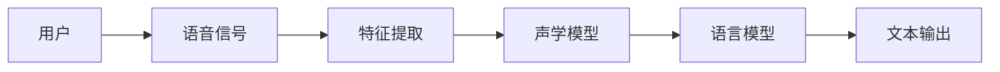
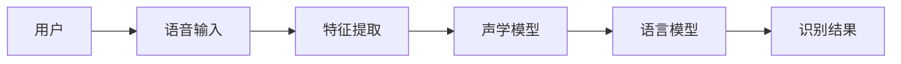
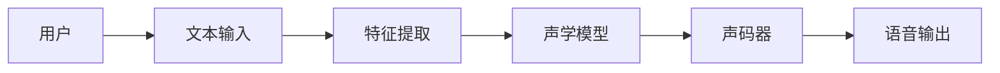

                 


# AI Agent的语音交互设计：语音识别与合成

## 关键词：AI Agent，语音交互，语音识别，语音合成，自然语言处理

## 摘要：  
随着人工智能技术的快速发展，语音交互已成为AI Agent与用户之间的重要通信方式。本文将深入探讨语音识别与合成的核心原理、算法实现以及系统设计，帮助读者全面理解AI Agent语音交互的关键技术。通过详细分析，本文将揭示语音交互在实际应用中的优势与挑战，并提供具体的实现方案和优化建议。

---

# 第1章: AI Agent与语音交互的背景介绍

## 1.1 AI Agent的基本概念  
AI Agent（人工智能代理）是一种能够感知环境、自主决策并执行任务的智能实体。它通过与用户的交互，提供个性化的服务，如信息检索、任务执行和情感陪伴等。  

### 1.1.1 AI Agent的定义  
AI Agent是指具备以下特征的智能系统：  
1. **自主性**：无需外部干预，自主完成任务。  
2. **反应性**：能够实时感知环境并做出反应。  
3. **目标导向**：基于目标驱动行为。  
4. **学习能力**：通过数据和经验不断优化性能。  

### 1.1.2 AI Agent的核心特征  
1. **智能性**：具备问题解决和决策能力。  
2. **交互性**：能够通过多种方式与用户互动。  
3. **适应性**：能够根据环境变化调整行为。  

### 1.1.3 语音交互在AI Agent中的作用  
语音交互是AI Agent与用户进行信息交换的重要方式，它能够提高用户体验，使其更加自然和便捷。  

## 1.2 语音交互的背景与现状  
语音交互技术的发展始于20世纪50年代，经历了从简单的声音识别到复杂的自然语言处理的演变。  

### 1.2.1 语音交互的历史发展  
1. **20世纪50年代**：初步的语音识别技术出现，主要用于特定词汇的识别。  
2. **20世纪90年代**：基于HMM（隐马尔可夫模型）的语音识别技术逐渐成熟。  
3. **21世纪初**：深度学习技术的应用使语音识别和合成的准确率大幅提升。  
4. **当前**：AI Agent的普及推动了语音交互技术的广泛应用。  

### 1.2.2 当前语音交互技术的成熟度  
1. **语音识别**：准确率已达到95%以上，在安静环境下表现优异。  
2. **语音合成**：能够生成接近人类语音的质量，支持多种音色和语调。  

### 1.2.3 语音交互的应用场景分析  
1. **智能家居**：如智能音箱、智能家电的控制。  
2. **移动设备**：如手机语音助手（Siri、Google Assistant）。  
3. **客服系统**：通过语音交互实现自动服务。  

## 1.3 语音识别与合成的技术基础  
### 1.3.1 语音识别的基本原理  
语音识别的目标是将输入的音频信号转换为对应的文本。其核心步骤包括：  
1. **特征提取**：提取语音信号的特征，如MFCC（Mel-Frequency Cepstral Coefficients）。  
2. **声学模型**：基于特征进行概率建模，常用HMM或DNN。  
3. **语言模型**：结合上下文信息，提高识别的准确性。  

### 1.3.2 语音合成的基本原理  
语音合成的目标是将文本转换为语音。其核心步骤包括：  
1. **特征提取**：提取文本的特征，如音调、音量和节奏。  
2. **声学模型**：基于特征生成语音信号，常用波形神经网络（Wavenet）或TTS（Text-to-Speech）模型。  
3. **声码器**：将声学特征转换为实际的音频信号。  

### 1.3.3 语音识别与合成的对比分析  
语音识别与合成在技术上存在一定的相似性，但目标相反。语音识别注重从声音中提取信息，而语音合成注重将信息转化为声音。  

---

# 第2章: 语音交互的核心概念与联系

## 2.1 语音识别的核心原理  
### 2.1.1 声音信号的特征提取  
特征提取是语音识别的关键步骤。常用的特征包括：  
1. **MFCC**：通过将音频信号转换到Mel频域，提取频谱特征。  
2. **Δ-MFCC**：计算MFCC的一阶差分，用于捕捉语音的动态特征。  

公式：  
$$ \text{MFCC} = \log(DFT(Mel\text{-filter}(x))) $$  

### 2.1.2 声学模型的构建  
声学模型通常采用深度神经网络（DNN）或长短期记忆网络（LSTM）。  
公式：  
$$ P(y|x) = \text{softmax}(Wx + b) $$  

### 2.1.3 语言模型的作用  
语言模型通过概率统计方法，计算文本序列的概率。常用模型包括：  
1. **n-gram模型**：基于n-1阶上下文的概率统计。  
2. **Transformer模型**：通过自注意力机制捕捉长距离依赖关系。  

## 2.2 语音合成的核心原理  
### 2.2.1 声音信号的特征提取  
语音合成通常需要提取文本的音调、音量和节奏特征。  
公式：  
$$ \text{Mel-spectrogram} = \log(DFT(Mel\text{-filter}(x))) $$  

### 2.2.2 声学模型的构建  
声学模型通过深度学习生成语音的声学特征，如Mel频谱。  
公式：  
$$ y = \text{DNN}(x) $$  

### 2.2.3 声码器的作用  
声码器将声学特征转换为实际的音频信号。常用的声码器包括：  
1. **GRiffin-Lim算法**：通过迭代重建音频信号。  
2. **WaveNet**：基于波形预测的生成模型。  

## 2.3 语音识别与合成的对比分析  
### 2.3.1 技术特点对比表格  
| 技术特点 | 语音识别 | 语音合成 |
|----------|----------|----------|
| 输入     | 音频信号 | 文本      |
| 输出     | 文本      | 音频信号 |
| 核心任务 | 转录     | 合成     |

### 2.3.2 实体关系图  


## 2.4 本章小结  
本章详细介绍了语音识别与合成的核心原理，分析了两者的异同点，并通过对比表格和实体关系图加深了读者的理解。

---

# 第3章: 语音识别的算法原理与实现

## 3.1 语音识别的特征提取  
### 3.1.1 MFCC特征提取  
MFCC是语音识别中常用的特征提取方法，通过将音频信号转换到Mel频域，提取频谱特征。  

公式：  
$$ \text{MFCC} = \log(DFT(Mel\text{-filter}(x))) $$  

### 3.1.2 其他特征提取方法  
1. **Δ-MFCC**：计算MFCC的一阶差分，用于捕捉语音的动态特征。  
2. **PLP（ perceptual linear prediction）**：模拟人类听觉系统，提取语音特征。  

## 3.2 语音识别的声学模型  
### 3.2.1 隐马尔可夫模型（HMM）  
HMM是一种基于状态转移的概率模型，适用于连续语音识别。  

公式：  
$$ P(y|x) = \sum_{i=1}^{n} \pi_i B(x|y=i) \alpha_i $$  

### 3.2.2 深度神经网络（DNN）  
DNN通过多层非线性变换，提取语音的高级特征。  

公式：  
$$ y = \text{DNN}(x) $$  

## 3.3 语音识别的语言模型  
### 3.3.1 基于n-gram的语言模型  
n-gram模型通过统计上下文信息，计算文本序列的概率。  

公式：  
$$ P(w_i|w_{i-1},...,w_{i-n+1}) = \frac{\text{count}(w_i, w_{i-1},...,w_{i-n+1})}{\text{count}(w_{i-1},...,w_{i-n+1}))} $$  

### 3.3.2 基于Transformer的语言模型  
Transformer模型通过自注意力机制，捕捉长距离依赖关系。  

公式：  
$$ \text{Attention}(Q,K,V) = \text{softmax}\left(\frac{QK^T}{\sqrt{d_k}}\right)V $$  

## 3.4 语音识别的流程图  


---

# 第4章: 语音合成的算法原理与实现

## 4.1 语音合成的特征提取  
### 4.1.1 Mel-spectrogram特征提取  
Mel-spectrogram是语音合成中常用的特征提取方法，通过将音频信号转换到Mel频域，提取频谱特征。  

公式：  
$$ \text{Mel-spectrogram} = \log(DFT(Mel\text{-filter}(x))) $$  

### 4.1.2 基于神经网络的特征提取  
通过深度学习模型提取更高层次的语音特征，如波形神经网络（WaveNet）。  

## 4.2 语音合成的声学模型  
### 4.2.1 基于DNN的声学模型  
DNN通过多层非线性变换，生成语音的声学特征。  

公式：  
$$ y = \text{DNN}(x) $$  

### 4.2.2 基于Transformer的声学模型  
Transformer模型通过自注意力机制，生成全局一致的语音特征。  

公式：  
$$ \text{Attention}(Q,K,V) = \text{softmax}\left(\frac{QK^T}{\sqrt{d_k}}\right)V $$  

## 4.3 语音合成的声码器  
### 4.3.1 基于GRiffin-Lim算法的声码器  
GRiffin-Lim算法通过迭代重建音频信号，生成波形。  

公式：  
$$ x = \text{inverse}(y) $$  

### 4.3.2 基于WaveNet的声码器  
WaveNet通过波形预测模型，生成高质量的语音信号。  

公式：  
$$ p(x|x_{<t}) = \prod_{t=1}^{T} p(x_t|x_{<t}) $$  

## 4.4 语音合成的流程图  


---

# 第5章: AI Agent语音交互的系统设计与实现

## 5.1 系统架构设计  
AI Agent的语音交互系统通常包括以下模块：  
1. **语音采集模块**：负责采集用户的语音输入。  
2. **语音处理模块**：包括特征提取、语音识别和语言理解。  
3. **语音合成模块**：根据理解生成语音输出。  

## 5.2 系统实现步骤  
1. **环境搭建**：安装必要的开发工具和库，如Python、TensorFlow、Kaldi等。  
2. **数据预处理**：对语音数据进行标准化处理，提取特征。  
3. **模型训练**：基于训练数据，训练语音识别和合成模型。  
4. **系统集成**：将各模块集成到AI Agent中，实现语音交互功能。  

## 5.3 系统优化与调优  
1. **特征选择**：选择合适的特征提取方法，提高识别准确率。  
2. **模型优化**：通过调整网络结构和超参数，提升模型性能。  
3. **降噪处理**：在噪声环境下，优化语音识别的鲁棒性。  

---

# 第6章: 项目实战：基于AI Agent的语音交互系统开发

## 6.1 项目需求分析  
本项目旨在开发一个基于AI Agent的语音交互系统，实现语音识别和合成功能。  

## 6.2 环境搭建  
1. **安装Python**：确保安装Python 3.8及以上版本。  
2. **安装依赖库**：如TensorFlow、Kaldi、Librosa等。  

## 6.3 核心代码实现  
### 6.3.1 特征提取代码  
```python
import librosa

def extract_features(audio_path):
    audio, sr = librosa.load(audio_path, sr=None)
    mfccs = librosa.feature.mfcc(y=audio, sr=sr)
    return mfccs
```

### 6.3.2 语音识别代码  
```python
import tensorflow as tf
from tensorflow.keras import layers

model = tf.keras.Sequential([
    layers.Dense(128, activation='relu'),
    layers.Dense(32, activation='relu'),
    layers.Dense(10, activation='softmax')
])

model.compile(optimizer='adam', loss='sparse_categorical_crossentropy', metrics=['accuracy'])
model.fit(x_train, y_train, epochs=10, batch_size=32)
```

### 6.3.3 语音合成代码  
```python
import numpy as np

def generate_speech(mel_spectrogram):
    # 假设我们有一个WaveNet模型
    model = WaveNet()
    predicted_waveform = model.predict(mel_spectrogram)
    return predicted_waveform
```

## 6.4 系统测试与优化  
1. **功能测试**：测试语音识别和合成的准确性。  
2. **性能优化**：通过调整模型参数和优化算法，提升系统性能。  
3. **用户体验优化**：设计友好的交互界面，提升用户体验。  

---

# 第7章: 最佳实践与总结

## 7.1 本章小结  
本文详细介绍了AI Agent语音交互的核心技术，包括语音识别与合成的原理、算法实现以及系统设计。通过项目实战，读者可以掌握语音交互系统的开发流程。

## 7.2 注意事项  
1. **数据质量**：语音数据的质量直接影响识别和合成的准确率。  
2. **模型优化**：通过不断优化模型结构和参数，提升系统性能。  
3. **用户体验**：设计友好的交互界面，提升用户体验。  

## 7.3 拓展阅读  
1. **语音识别**：深入学习HMM和DNN的原理与应用。  
2. **语音合成**：研究WaveNet和Transformer模型的最新进展。  
3. **自然语言处理**：探索NLP技术在语音交互中的应用。  

---

# 作者：AI天才研究院/AI Genius Institute & 禅与计算机程序设计艺术 /Zen And The Art of Computer Programming

