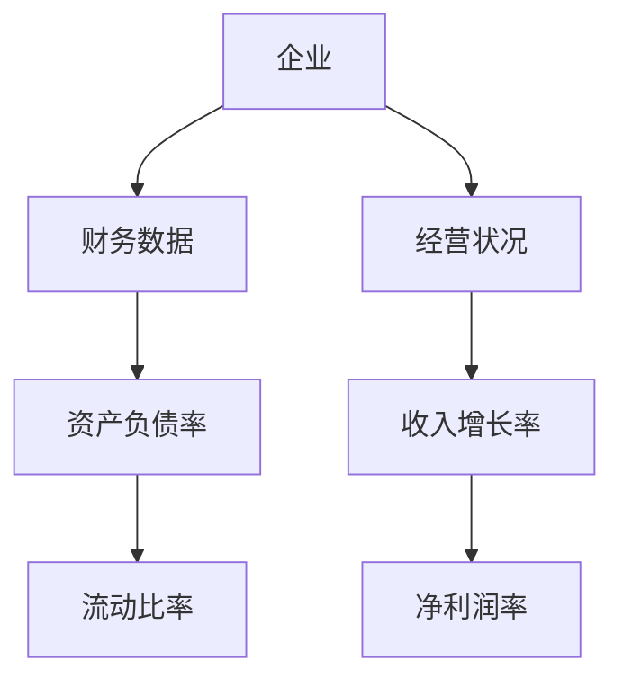
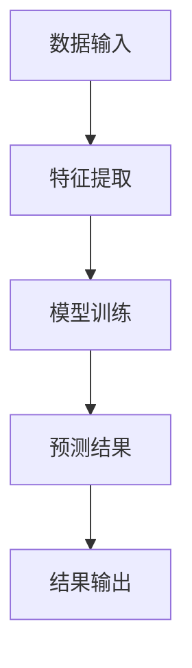

                 


# AI驱动的公司破产概率预测

## 关键词：AI驱动，公司破产，概率预测，机器学习，风险评估，企业预警

## 摘要：  
本文将探讨如何利用人工智能技术预测公司破产概率。通过结合机器学习算法和企业财务数据，我们能够构建高效的预测模型，从而帮助企业提前识别潜在风险，优化经营决策。本文从背景介绍、核心概念、算法原理、系统设计、项目实战到最佳实践，全面剖析AI驱动的公司破产概率预测的实现过程，提供深度的技术分析与实践指导。

---

## 第1章: 公司破产概率预测的背景与意义

### 1.1 破产预测的核心概念  
公司破产是企业经营中的重大风险事件，通常涉及复杂的财务、经营和市场因素。传统的破产预测方法依赖于财务指标分析，但这种方法往往存在主观性高、预测精度低的问题。随着人工智能技术的发展，基于机器学习的破产预测方法逐渐成为研究热点。

#### 1.1.1 破产预测的定义与范围  
破产预测是指通过分析企业的财务、经营和市场数据，预测企业在一定时间内的破产概率。其范围包括企业财务状况分析、经营能力评估以及市场环境影响等多个维度。

#### 1.1.2 破产预测的边界与外延  
- **边界**：破产预测仅关注企业在一定时间内的破产可能性，不涉及具体破产原因的分析。  
- **外延**：破产预测的结果可以为企业的风险评估、投资决策和信用评级提供重要参考。  

#### 1.1.3 破产预测的核心要素与组成  
- **财务数据**：如资产负债率、流动比率、净利润率等。  
- **经营数据**：如收入增长率、成本控制能力等。  
- **市场数据**：如行业景气度、宏观经济指标等。  

### 1.2 AI在破产预测中的作用  
AI技术通过自动化数据处理和模型优化，显著提升了破产预测的准确性和效率。以下是AI在破产预测中的主要作用：  
1. **数据挖掘**：从海量数据中提取关键特征，识别传统方法难以发现的规律。  
2. **模型优化**：通过机器学习算法构建非线性模型，捕捉复杂的变量关系。  
3. **实时监控**：利用AI技术实现对企业财务状况的实时预警。  

#### 1.2.1 AI技术如何赋能破产预测  
- **数据处理**：AI能够高效处理结构化和非结构化数据，提取特征并构建模型。  
- **模型训练**：通过深度学习算法，AI可以识别复杂的财务指标之间的关系。  
- **实时预测**：基于实时数据，AI系统可以动态更新预测结果，提供及时的风险预警。  

#### 1.2.2 破产预测中的关键问题与挑战  
1. **数据质量问题**：企业财务数据可能存在缺失、错误或不完整的情况。  
2. **模型解释性**：复杂的机器学习模型往往缺乏可解释性，影响实际应用。  
3. **数据隐私问题**：企业数据涉及商业机密，如何在保护隐私的前提下进行预测是一个重要挑战。  

#### 1.2.3 破产预测的业务价值与应用场景  
- **企业风险管理**：帮助企业在早期发现潜在风险，采取预防措施。  
- **投资决策支持**：投资者可以通过破产概率预测评估投资风险。  
- **信用评级优化**：金融机构可以基于破产概率预测调整信用评分。  

### 1.3 本章小结  
本章介绍了公司破产概率预测的核心概念、AI技术在其中的作用以及面临的挑战和应用场景。AI技术的引入为破产预测提供了新的思路和方法，但同时也带来了数据处理和模型解释性等方面的挑战。

---

## 第2章: AI驱动的破产预测的核心概念与联系  

### 2.1 核心概念原理  
AI驱动的破产预测通过构建机器学习模型，利用企业的财务、经营和市场数据，预测其破产概率。以下是核心概念的详细分析：  

#### 2.1.1 破产预测的多维度分析  
- **财务维度**：分析企业的偿债能力、盈利能力等。  
- **经营维度**：评估企业的市场竞争力、管理能力等。  
- **市场维度**：考虑宏观经济环境、行业趋势等外部因素。  

#### 2.1.2 AI模型在破产预测中的关键特征  
- **特征选择**：通过特征重要性分析确定关键指标。  
- **模型训练**：基于选定的特征训练机器学习模型。  
- **结果解释**：通过模型输出破产概率并进行解释。  

#### 2.1.3 破产预测的数学模型与算法选择  
- **逻辑回归**：适合二分类问题，输出概率值。  
- **随机森林**：能够处理高维数据，具有较强的抗过拟合能力。  
- **神经网络**：适用于非线性关系复杂的场景。  

### 2.2 核心概念属性特征对比表  

| 特征类型       | 破产企业特征   | 非破产企业特征   |  
|----------------|----------------|------------------|  
| 资产负债率     | 高             | 低               |  
| 流动比率       | 低             | 高               |  
| 净利润率       | 低             | 高               |  
| 收入增长率     | 增长缓慢       | 增长较快        |  

### 2.3 ER实体关系图  



### 2.4 本章小结  
本章通过分析AI驱动的破产预测的核心概念，探讨了多维度分析、特征选择和算法选择的关键问题，并通过对比表和ER图直观展示了企业的关键特征和数据结构。

---

## 第3章: AI驱动的破产预测算法原理  

### 3.1 破产预测的主要算法  

#### 3.1.1 逻辑回归  
逻辑回归是一种经典的二分类算法，适合处理二元分类问题。其核心思想是通过优化损失函数，找到最佳的参数组合，使得模型的预测结果与实际结果尽可能接近。  

##### 损失函数  
$$ L = -\frac{1}{m} \sum_{i=1}^{m} [y_i \cdot \ln(\hat{y}_i) + (1 - y_i) \cdot \ln(1 - \hat{y}_i)] $$  

##### 梯度下降  
$$ \theta := \theta - \alpha \cdot \frac{\partial L}{\partial \theta} $$  

##### 代码实现  
```python
from sklearn.linear_model import LogisticRegression

# 训练模型
model = LogisticRegression()
model.fit(X_train, y_train)

# 预测结果
y_pred = model.predict(X_test)
```

#### 3.1.2 随机森林  
随机森林是一种基于决策树的集成学习算法，通过构建多棵决策树并进行投票或平均，显著提高了模型的准确性和稳定性。  

##### 内部节点划分  
$$ \text{信息增益} = \sum_{i=1}^{k} p_i \log_2 p_i $$  

##### 代码实现  
```python
from sklearn.ensemble import RandomForestClassifier

# 训练模型
model = RandomForestClassifier()
model.fit(X_train, y_train)

# 预测结果
y_pred = model.predict(X_test)
```

#### 3.1.3 神经网络  
神经网络是一种模拟人脑神经元工作的深度学习算法，能够处理复杂的非线性关系。  

##### 激活函数  
$$ \text{ReLU}(x) = \begin{cases} 0 & \text{if } x < 0 \\ x & \text{if } x \geq 0 \end{cases} $$  

##### 损失函数  
$$ L = \frac{1}{n} \sum_{i=1}^{n} (y_i - \hat{y}_i)^2 $$  

##### 代码实现  
```python
import tensorflow as tf

# 构建模型
model = tf.keras.Sequential([
    tf.keras.layers.Dense(64, activation='relu'),
    tf.keras.layers.Dense(1, activation='sigmoid')
])

# 编译模型
model.compile(optimizer='adam', loss='binary_crossentropy', metrics=['accuracy'])

# 训练模型
model.fit(X_train, y_train, epochs=10, batch_size=32)
```

### 3.2 算法原理与流程  



### 3.3 算法实现代码示例  

#### 逻辑回归示例  
```python
import pandas as pd
from sklearn.model_selection import train_test_split
from sklearn.linear_model import LogisticRegression

# 加载数据
data = pd.read_csv('bankruptcy_data.csv')

# 数据预处理
X = data[['流动比率', '资产负债率', '收入增长率']]
y = data['破产标志']

# 划分训练集和测试集
X_train, X_test, y_train, y_test = train_test_split(X, y, test_size=0.2, random_state=42)

# 训练模型
model = LogisticRegression()
model.fit(X_train, y_train)

# 预测结果
y_pred = model.predict(X_test)
```

#### 随机森林示例  
```python
from sklearn.ensemble import RandomForestClassifier

# 训练模型
model = RandomForestClassifier()
model.fit(X_train, y_train)

# 预测结果
y_pred = model.predict(X_test)
```

#### 神经网络示例  
```python
import tensorflow as tf
from tensorflow.keras import layers

# 构建模型
model = tf.keras.Sequential([
    layers.Dense(64, activation='relu'),
    layers.Dense(1, activation='sigmoid')
])

# 编译模型
model.compile(optimizer='adam', loss='binary_crossentropy', metrics=['accuracy'])

# 训练模型
model.fit(X_train, y_train, epochs=10, batch_size=32)
```

### 3.4 本章小结  
本章详细介绍了逻辑回归、随机森林和神经网络三种常用的算法，并通过代码示例展示了它们的实现过程。每种算法都有其特点和适用场景，选择合适的算法需要结合实际数据和业务需求。

---

## 第4章: 系统分析与架构设计方案  

### 4.1 问题场景介绍  
本章将从实际业务需求出发，设计一个基于AI的公司破产概率预测系统。系统的目标是通过分析企业的财务、经营和市场数据，预测其破产概率，并为企业提供风险预警。

### 4.2 系统功能设计  

#### 4.2.1 领域模型  


#### 4.2.2 系统架构  


#### 4.2.3 系统接口设计  
- **输入接口**：接收企业的财务、经营和市场数据。  
- **输出接口**：返回企业的破产概率和风险等级。  

#### 4.2.4 系统交互流程  


### 4.3 本章小结  
本章通过系统分析和架构设计，明确了AI驱动的公司破产概率预测系统的功能模块和实现流程。系统设计注重模块化和可扩展性，为后续的开发和优化提供了清晰的指导。

---

## 第5章: 项目实战  

### 5.1 环境安装与数据准备  

#### 5.1.1 环境安装  
```bash
pip install numpy pandas scikit-learn tensorflow
```

#### 5.1.2 数据准备  
```python
import pandas as pd

# 加载数据
data = pd.read_csv('bankruptcy_data.csv')

# 数据预处理
X = data[['流动比率', '资产负债率', '收入增长率']]
y = data['破产标志']
```

### 5.2 系统核心实现  

#### 5.2.1 特征选择与数据清洗  
```python
# 删除缺失值
data.dropna(inplace=True)

# 标准化处理
from sklearn.preprocessing import StandardScaler

scaler = StandardScaler()
X_scaled = scaler.fit_transform(X)
```

#### 5.2.2 模型训练与评估  
```python
from sklearn.model_selection import train_test_split
from sklearn.metrics import accuracy_score, confusion_matrix

# 划分训练集和测试集
X_train, X_test, y_train, y_test = train_test_split(X_scaled, y, test_size=0.2, random_state=42)

# 训练模型
model = RandomForestClassifier()
model.fit(X_train, y_train)

# 评估模型
y_pred = model.predict(X_test)
print("准确率:", accuracy_score(y_test, y_pred))
print("混淆矩阵:", confusion_matrix(y_test, y_pred))
```

### 5.3 案例分析与结果解读  

#### 5.3.1 案例分析  
假设我们有一个企业的财务数据如下：  
- 流动比率：1.5  
- 资产负债率：60%  
- 收入增长率：-5%  

通过模型预测，该企业的破产概率为75%。

#### 5.3.2 结果解读  
- 破产概率较高，表明企业存在较高的破产风险。  
- 建议企业采取措施优化财务结构，如降低负债率、提高收入增长率等。  

### 5.4 本章小结  
本章通过一个实际案例展示了AI驱动的公司破产概率预测系统的实现过程，包括数据准备、特征选择、模型训练和结果分析。案例分析结果为企业提供了重要的风险预警信息。

---

## 第6章: 最佳实践与总结  

### 6.1 最佳实践  

#### 6.1.1 数据处理注意事项  
- 数据清洗：处理缺失值、异常值和重复值。  
- 特征工程：通过特征选择和工程化提升模型性能。  

#### 6.1.2 模型优化技巧  
- 调参：通过网格搜索优化模型参数。  
- 集成学习：结合多种算法提升预测精度。  

#### 6.1.3 模型部署建议  
- API接口：将模型封装为API，方便其他系统调用。  
- 实时监控：定期更新模型，确保预测结果的准确性。  

### 6.2 小结  
通过本文的分析与实践，我们可以看到AI技术在公司破产概率预测中的巨大潜力。然而，实际应用中仍需注意数据质量和模型解释性等问题。

### 6.3 注意事项  
- 数据隐私：企业数据涉及商业机密，需注意数据的安全性和隐私性。  
- 模型解释性：复杂的模型可能难以解释，需结合业务需求选择合适的算法。  

### 6.4 拓展阅读  
- 《机器学习实战》  
- 《Python机器学习》  
- 《深度学习》  

### 6.5 本章小结  
本章总结了AI驱动的公司破产概率预测的最佳实践，包括数据处理、模型优化和部署建议。同时，提出了需要注意的问题和拓展阅读的方向。

---

## 作者：AI天才研究院/AI Genius Institute & 禅与计算机程序设计艺术 /Zen And The Art of Computer Programming

---

**注**：以上目录和内容仅为示例，实际文章需要根据具体数据和业务需求进行调整和补充。

