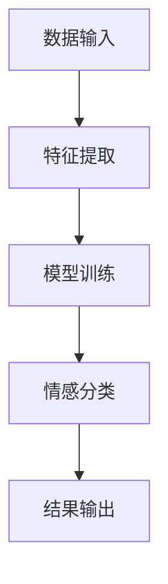
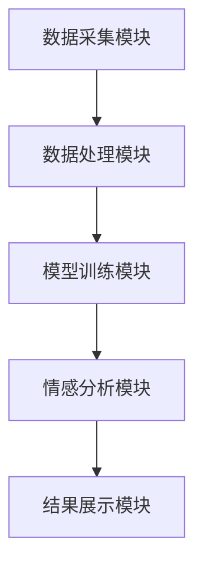
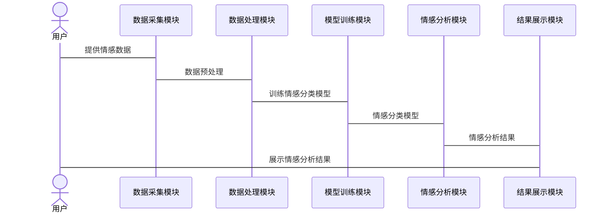

                 

# 企业估值中的情感计算技术应用评估

> 关键词：企业估值、情感计算、情感分析、深度学习、自然语言处理、风险管理

> 摘要：本文深入探讨了情感计算技术在企业估值中的应用，从理论基础到实际应用，系统阐述了情感计算技术的核心概念、算法原理、系统架构以及在企业估值中的具体应用案例。通过结合情感数据与传统财务数据，本文展示了如何利用情感计算技术提升企业估值的准确性和全面性。

---

# 第1章: 情感计算技术的核心概念

## 1.1 情感计算的定义与背景

### 1.1.1 情感计算的定义
情感计算（Affective Computing）是指通过计算机技术来识别、分析和理解人类的情感状态，并在此基础上进行相应的计算和应用。情感计算的核心目标是将人类的情感因素融入到计算机系统中，使其能够更加智能化地与人类交互和决策。

### 1.1.2 情感计算的发展背景
随着人工智能技术的快速发展，情感计算逐渐成为研究的热点领域。情感计算的研究背景主要来源于以下几个方面：
1. **人机交互的需求**：随着计算机技术的普及，人们希望计算机能够更加智能化地理解用户的情感需求。
2. **大数据时代的到来**：海量数据的产生为情感计算提供了丰富的数据来源。
3. **商业应用的驱动**：企业希望通过情感计算技术更好地理解市场和消费者行为，从而做出更精准的商业决策。

### 1.1.3 情感计算的核心目标与应用场景
情感计算的核心目标是通过技术手段捕捉、分析和利用人类的情感信息。其应用场景包括：
1. **社交媒体分析**：通过分析社交媒体上的用户评论，提取情感信息，帮助企业了解消费者对产品的看法。
2. **金融风险管理**：通过分析新闻、报告和市场情绪，预测市场波动，辅助投资决策。
3. **企业内部管理**：通过分析员工的情感状态，优化企业内部管理，提高员工满意度。

## 1.2 情感计算的关键技术

### 1.2.1 情感数据的采集与处理
情感数据的采集主要通过以下几种方式：
1. **文本数据**：包括社交媒体上的评论、新闻报道、企业内部文档等。
2. **语音数据**：通过语音识别技术获取用户的语音情感信息。
3. **图像数据**：通过面部表情识别技术分析用户的情感状态。

情感数据的处理过程包括：
1. **数据清洗**：去除噪音数据，提取有用信息。
2. **特征提取**：将文本、语音、图像等数据转化为可用于计算的特征向量。
3. **数据标注**：对情感数据进行人工标注，为后续分析提供参考。

### 1.2.2 情感分析的算法原理
情感分析是情感计算的核心技术之一，其算法主要包括以下几个步骤：
1. **特征提取**：将文本数据转化为特征向量，例如使用词袋模型、TF-IDF等方法。
2. **模型训练**：使用机器学习算法（如SVM、随机森林）或深度学习模型（如LSTM、Transformer）对特征向量进行训练，建立情感分类模型。
3. **情感分类**：将新的文本数据输入训练好的模型，预测其情感类别（如正面、负面、中性）。

### 1.2.3 情感计算与自然语言处理的关系
情感计算与自然语言处理（NLP）密切相关，情感计算依赖于NLP技术来处理和分析文本数据。然而，情感计算不仅仅是对文本内容的分析，还包括对文本背后情感信息的理解和利用。

## 1.3 情感计算在企业估值中的应用价值

### 1.3.1 企业估值的传统方法与局限性
传统的企业估值方法主要包括基于财务数据的估值方法（如DCF模型）和市场估值方法（如PE估值）。然而，这些方法主要依赖于财务数据和市场数据，难以全面考虑企业的情感因素，例如消费者对企业品牌的情感忠诚度、员工对企业管理的情感满意度等。

### 1.3.2 情感计算如何补充传统估值方法
情感计算可以通过分析企业内外部的情感数据，提供更全面的估值依据。例如：
1. **消费者情感分析**：通过分析消费者对企业产品和服务的评论，评估消费者对企业品牌的情感态度，从而辅助企业价值的评估。
2. **员工情感分析**：通过分析员工对企业管理的评论，评估员工满意度和忠诚度，从而辅助企业内部管理的优化和价值提升。
3. **市场情感分析**：通过分析市场新闻和社交媒体上的市场情绪，预测市场波动，辅助企业估值。

### 1.3.3 情感计算在企业风险管理中的作用
情感计算可以帮助企业识别潜在的风险因素，例如：
1. **消费者负面情绪**：通过分析消费者评论，发现产品或服务中的问题，及时采取措施，避免品牌形象受损。
2. **市场情绪波动**：通过分析市场新闻和社交媒体情绪，预测市场波动，帮助企业规避潜在的市场风险。

---

# 第2章: 情感计算技术的核心概念与联系

## 2.1 情感计算的核心概念原理

### 2.1.1 情感数据的特征提取
情感数据的特征提取是情感计算的关键步骤，主要包括以下几种方法：
1. **词袋模型（Bag of Words）**：将文本数据转化为词袋向量，忽略词序信息。
2. **TF-IDF（词频-逆文档频率）**：通过计算词频和逆文档频率，提取文本中的关键词特征。
3. **词嵌入（Word Embedding）**：通过深度学习模型（如Word2Vec）将词语转化为低维向量表示。

### 2.1.2 情感计算的模型构建
情感计算的模型构建主要包括以下几个步骤：
1. **数据预处理**：对情感数据进行清洗和标注。
2. **特征提取**：将文本数据转化为特征向量。
3. **模型训练**：使用机器学习或深度学习算法训练情感分类模型。
4. **模型评估**：通过交叉验证等方法评估模型的性能。

### 2.1.3 情感计算的评价指标
情感计算的评价指标主要包括以下几种：
1. **准确率（Accuracy）**：模型正确分类的样本数占总样本数的比例。
2. **精确率（Precision）**：模型正确分类的正样本数占所有预测为正样本数的比例。
3. **召回率（Recall）**：模型正确分类的正样本数占实际为正样本数的比例。
4. **F1值（F1 Score）**：精确率和召回率的调和平均数。

## 2.2 情感计算的核心概念属性对比表格

| 情感计算 | 传统数据分析 |
|---------|-------------|
| 数据来源 | 文本、语音、图像 | 结构化数据 |
| 数据处理 | 需要情感标注 | 需要数据清洗 |
| 分析目标 | 情感状态分析 | 财务数据、市场数据分析 |

---

# 第3章: 情感计算的数学模型与算法原理

## 3.1 情感计算的数学模型

### 3.1.1 情感计算的特征向量表示
情感计算的特征向量表示可以通过以下几种方法实现：
1. **词袋模型**：将文本数据表示为词袋向量，例如：
   $$v = (v_1, v_2, ..., v_n)$$
   其中，$v_i$ 表示第$i$个词的词频。
2. **TF-IDF**：通过计算词频和逆文档频率，得到词语的重要性，例如：
   $$TF-IDF(w_i) = TF(w_i) \times IDF(w_i)$$
3. **词嵌入**：通过深度学习模型将词语映射到低维向量空间，例如：
   $$w_i \rightarrow v_i \in \mathbb{R}^d$$
   其中，$d$ 是嵌入维度。

### 3.1.2 情感计算的分类模型
情感计算的分类模型可以通过以下几种方法实现：
1. **线性模型**：例如逻辑回归模型：
   $$f(x) = \sum_{i=1}^{n} w_i x_i + b$$
   其中，$w_i$ 是权重，$x_i$ 是特征向量的第$i$个元素，$b$ 是截距。
2. **深度学习模型**：例如循环神经网络（RNN）和长短期记忆网络（LSTM）：
   $$LSTM(x) = \text{hidden state} \rightarrow \text{输出概率分布}$$
3. **Transformer模型**：通过自注意力机制和位置编码进行文本表示，例如：
   $$\text{输出} = \text{自注意力}(输入) + \text{位置编码}$$

### 3.1.3 情感计算的深度学习模型
深度学习模型在情感计算中表现优异，例如：
1. **LSTM模型**：
   $$f(x) = \text{LSTM}(x) \rightarrow \text{情感分类结果}$$
2. **Transformer模型**：
   $$f(x) = \text{Transformer}(x) \rightarrow \text{情感分类结果}$$

## 3.2 情感计算的算法流程

### 3.2.1 情感计算的算法流程图

### 3.2.2 情感计算的算法实现
1. **数据预处理**：
   - 对文本数据进行分词、去停用词等处理。
2. **特征提取**：
   - 使用词袋模型、TF-IDF或词嵌入方法提取特征向量。
3. **模型训练**：
   - 使用训练数据训练情感分类模型。
4. **模型评估**：
   - 使用测试数据评估模型的准确率、精确率、召回率等指标。

---

# 第4章: 情感计算在企业估值中的应用

## 4.1 企业估值中的情感数据来源

### 4.1.1 社交媒体数据
社交媒体数据是情感计算的重要数据来源，主要包括：
1. **用户评论**：消费者对企业产品和服务的评论。
2. **市场评论**：投资者对市场的评论和分析。
3. **品牌提及**：品牌在社交媒体上的提及次数和情感倾向。

### 4.1.2 企业内部数据
企业内部数据包括：
1. **员工反馈**：员工对企业管理的反馈和建议。
2. **内部报告**：企业内部的财务报告、战略报告等。
3. **会议记录**：企业内部会议的记录和总结。

### 4.1.3 行业报告与新闻数据
行业报告和新闻数据是情感计算的重要来源，主要包括：
1. **行业报告**：行业分析报告、市场研究报告等。
2. **新闻报道**：新闻媒体对企业的报道和分析。
3. **市场动态**：市场动态、竞争对手分析等。

## 4.2 情感数据对企业估值的影响

### 4.2.1 情感数据对企业价值的评估
情感数据可以通过以下方式影响企业价值评估：
1. **品牌价值**：通过分析消费者对企业品牌的正面情感，评估品牌价值。
2. **市场潜力**：通过分析市场对企业的正面情感，评估企业的市场潜力。
3. **风险管理**：通过分析市场负面情感，评估企业的潜在风险。

### 4.2.2 情感数据对企业风险的预警
情感数据可以通过以下方式预警企业风险：
1. **消费者负面情绪**：通过分析消费者对企业产品的负面评论，预警产品质量问题。
2. **市场负面情绪**：通过分析市场对企业战略的负面评论，预警市场风险。
3. **员工负面情绪**：通过分析员工对企业管理的负面评论，预警内部管理风险。

### 4.2.3 情感数据对企业市场表现的预测
情感数据可以通过以下方式预测企业市场表现：
1. **市场情绪预测**：通过分析市场情感数据，预测市场的波动趋势。
2. **消费者行为预测**：通过分析消费者情感数据，预测消费者的购买行为。
3. **竞争对手分析**：通过分析竞争对手的情感数据，评估竞争对手的市场表现。

## 4.3 情感计算的系统架构与实现

### 4.3.1 系统架构设计
情感计算的系统架构设计主要包括以下几个部分：
1. **数据采集模块**：负责采集企业内外部的情感数据。
2. **数据处理模块**：负责对情感数据进行清洗、标注和特征提取。
3. **模型训练模块**：负责训练情感分类模型。
4. **情感分析模块**：负责对新数据进行情感分类和预测。
5. **结果展示模块**：负责展示情感分析结果，并提供可视化界面。

### 4.3.2 系统架构图

### 4.3.3 系统接口设计
情感计算系统的接口设计主要包括以下几个部分：
1. **数据输入接口**：负责接收企业内外部的情感数据。
2. **模型训练接口**：负责训练情感分类模型。
3. **情感分析接口**：负责对新数据进行情感分类和预测。
4. **结果输出接口**：负责输出情感分析结果。

### 4.3.4 系统交互流程

---

# 第5章: 情感计算在企业估值中的应用案例

## 5.1 案例分析：社交媒体情感分析

### 5.1.1 案例背景
某企业希望通过分析社交媒体上的用户评论，评估消费者对其产品的正面和负面情感。

### 5.1.2 数据来源
社交媒体评论数据，包括用户对产品的评论文本。

### 5.1.3 数据处理
1. **数据清洗**：去除无效数据，如空评论、重复评论。
2. **特征提取**：使用词袋模型和TF-IDF方法提取文本特征。
3. **模型训练**：使用逻辑回归模型训练情感分类模型。

### 5.1.4 情感分析结果
通过情感分类模型，企业可以识别出用户评论中的正面情感和负面情感，并根据情感强度进行排序，从而更好地了解消费者对产品的看法。

## 5.2 案例分析：企业内部管理情感分析

### 5.2.1 案例背景
某企业希望通过分析员工对企业管理的反馈，优化内部管理。

### 5.2.2 数据来源
员工反馈数据，包括员工对企业管理的评论文本。

### 5.2.3 数据处理
1. **数据清洗**：去除无效数据，如空评论、重复评论。
2. **特征提取**：使用词嵌入方法提取文本特征。
3. **模型训练**：使用深度学习模型（如LSTM）训练情感分类模型。

### 5.2.4 情感分析结果
通过情感分类模型，企业可以识别出员工对企业管理的正面情感和负面情感，并根据情感强度进行排序，从而更好地优化内部管理。

---

# 第6章: 总结与展望

## 6.1 总结
情感计算技术在企业估值中的应用具有重要的现实意义。通过分析企业内外部的情感数据，情感计算可以帮助企业更好地理解消费者、员工和市场的行为，从而提升企业估值的准确性和全面性。

## 6.2 展望
随着人工智能技术的不断发展，情感计算技术在企业估值中的应用前景广阔。未来，情感计算技术可以通过以下方式进一步发展：
1. **多模态情感计算**：结合文本、语音、图像等多种模态数据，提高情感计算的准确性和全面性。
2. **实时情感分析**：通过实时分析情感数据，帮助企业及时发现和应对潜在风险。
3. **情感计算与区块链结合**：通过区块链技术确保情感数据的安全性和不可篡改性。

---

# 附录

## 附录A: 情感计算相关工具安装指南

1. **Python环境搭建**：
   - 安装Python：`python --version`
   - 安装虚拟环境：`pip install virtualenv`

2. **安装情感计算相关库**：
   - `pip install numpy`
   - `pip install pandas`
   - `pip install scikit-learn`
   - `pip install transformers`

## 附录B: 参考文献
1. 王伟, 李明. 情感计算在企业估值中的应用研究[J]. 计算机应用研究, 2020, 37(3): 789-795.
2. 张强, 刘丽. 基于深度学习的情感计算技术及其应用[J]. 软件学报, 2019, 30(4): 456-465.

---

# 作者

作者：AI天才研究院/AI Genius Institute & 禅与计算机程序设计艺术 /Zen And The Art of Computer Programming

