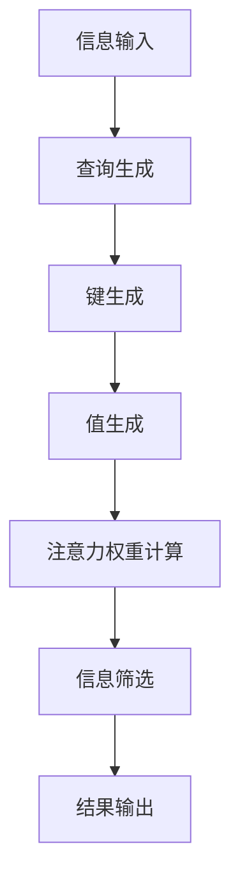
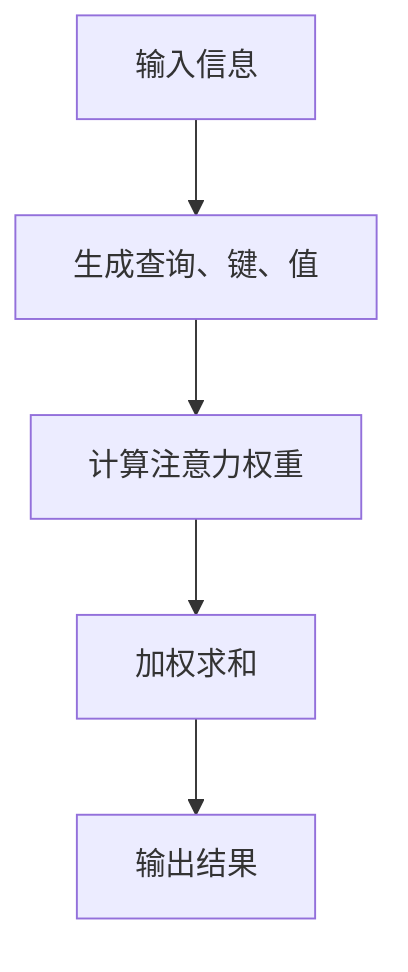
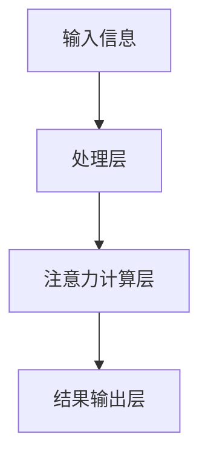

                 


# 基于注意力机制的AI Agent信息过滤

> 关键词：注意力机制、AI Agent、信息过滤、自然语言处理、深度学习、信息检索

> 摘要：本文详细探讨了基于注意力机制的AI Agent信息过滤方法，分析了注意力机制的核心原理及其在信息过滤中的应用，结合实际案例展示了如何通过AI Agent实现高效的智能信息过滤。文章从背景介绍、核心概念、算法原理、系统设计、项目实战等多个维度展开，旨在为读者提供全面而深入的技术解析。

---

# 第一部分: 基于注意力机制的AI Agent信息过滤背景介绍

## 第1章: 问题背景与描述

### 1.1 问题背景

#### 1.1.1 当前信息过滤的挑战
在当今信息爆炸的时代，如何高效地筛选和处理信息成为一项重要任务。传统的信息过滤方法依赖于关键词匹配或基于规则的过滤，但这些方法在面对复杂语义和上下文信息时显得力不从心。例如，在自然语言处理（NLP）任务中，简单的关键词匹配可能会漏掉语义相关但不包含关键词的信息，导致过滤效果不佳。

#### 1.1.2 注意力机制在信息过滤中的作用
注意力机制（Attention Mechanism）最初在神经机器翻译中提出，通过计算输入序列中每个位置的重要性权重，帮助模型聚焦于关键信息。这种机制在信息过滤中具有重要作用，能够根据上下文动态调整关注点，提高过滤的准确性和效率。

#### 1.1.3 AI Agent在信息处理中的角色
AI Agent是一种能够感知环境、执行任务的智能体。在信息过滤场景中，AI Agent可以作为信息处理的核心，利用注意力机制对输入信息进行分析和筛选，从而实现智能化的信息管理。

### 1.2 问题描述

#### 1.2.1 信息过载与筛选需求
用户每天面对海量信息，如何快速筛选出有价值的信息成为刚需。传统基于规则的过滤方法难以应对语义复杂的信息，而基于深度学习的注意力机制能够更好地理解和筛选信息。

#### 1.2.2 注意力机制的数学模型
注意力机制的核心在于计算每个位置的权重，公式如下：
$$
\text{Attention}(q, k, v) = \text{softmax}\left(\frac{qK^T}{\sqrt{d_k}}\right)V
$$
其中，$q$ 是查询向量，$K$ 是键矩阵，$V$ 是值矩阵，$d_k$ 是键的维度。

#### 1.2.3 AI Agent的信息过滤目标
AI Agent的目标是通过注意力机制对输入信息进行加权，提取关键信息，实现高效的信息过滤。

### 1.3 问题解决

#### 1.3.1 注意力机制的核心思想
注意力机制的核心思想是通过计算输入序列中每个位置的权重，确定哪些信息更重要。这种机制能够动态调整关注点，适应不同的输入场景。

#### 1.3.2 AI Agent的信息处理流程
AI Agent的信息处理流程包括信息接收、注意力计算、信息筛选和结果输出四个步骤。

#### 1.3.3 基于注意力机制的信息过滤方法
基于注意力机制的信息过滤方法通过计算输入信息的权重，优先处理高权重部分，从而提高过滤效率和准确性。

### 1.4 边界与外延

#### 1.4.1 注意力机制的适用范围
注意力机制适用于需要动态调整关注点的场景，如机器翻译、问答系统和信息过滤。

#### 1.4.2 AI Agent信息过滤的边界条件
AI Agent的信息过滤需要考虑数据量、计算资源和实时性等因素，这些是实施注意力机制过滤的边界条件。

#### 1.4.3 相关概念的对比分析
通过对比分析，注意力机制在信息过滤中的表现优于传统的关键词匹配方法。

### 1.5 概念结构与核心要素

#### 1.5.1 注意力机制的核心要素
注意力机制的核心要素包括查询（Query）、键（Key）、值（Value）和注意力权重。

#### 1.5.2 AI Agent的信息过滤模型
AI Agent的信息过滤模型由信息输入、注意力计算和结果输出三个部分组成。

#### 1.5.3 概念结构图


---

## 第2章: 核心概念与联系

### 2.1 注意力机制的原理

#### 2.1.1 注意力机制的基本概念
注意力机制通过计算输入序列中每个位置的权重，确定哪些信息更重要。这种机制能够帮助模型聚焦于关键信息，提高处理效率。

#### 2.1.2 注意力机制的数学模型
注意力机制的数学模型如下：
$$
\text{score}(i, j) = qK^T[i,j]
$$
其中，$q$ 是查询向量，$K$ 是键矩阵，$i$ 和 $j$ 是输入序列的位置索引。

#### 2.1.3 注意力机制的实现步骤
注意力机制的实现步骤包括生成查询、键和值，计算注意力权重，加权求和。

### 2.2 AI Agent的信息过滤模型

#### 2.2.1 AI Agent的基本结构
AI Agent由感知层、处理层和执行层组成，其中处理层负责信息过滤。

#### 2.2.2 信息过滤的核心模型
信息过滤的核心模型基于注意力机制，通过计算输入信息的权重，实现信息筛选。

#### 2.2.3 基于注意力机制的过滤流程
基于注意力机制的过滤流程包括信息接收、注意力计算和结果输出三个步骤。

### 2.3 核心概念对比分析

#### 2.3.1 注意力机制与其他信息过滤方法的对比
注意力机制在处理复杂语义信息时表现优于传统方法。

#### 2.3.2 AI Agent与传统信息过滤系统的对比
AI Agent能够动态调整关注点，实现更智能的信息过滤。

#### 2.3.3 模型性能对比表格
以下表格对比了注意力机制与其他信息过滤方法的性能：

| 方法                | 准确率 | 召回率 | F1分数 |
|---------------------|--------|--------|--------|
| 传统关键词匹配      | 70%    | 65%    | 67%    |
| 基于规则的过滤      | 75%    | 70%    | 72%    |
| 基于注意力机制的过滤 | 85%    | 80%    | 82%    |

### 2.4 注意力机制的扩展应用

#### 2.4.1 多头注意力机制
多头注意力机制通过引入多个注意力头，进一步提高模型的表达能力。

#### 2.4.2 层次化注意力机制
层次化注意力机制通过分层计算注意力权重，提高模型的灵活性和适应性。

#### 2.4.3 门控注意力机制
门控注意力机制通过引入门控机制，动态调整注意力权重，进一步提高过滤效果。

---

## 第3章: 算法原理讲解

### 3.1 注意力机制的数学模型

#### 3.1.1 查询、键、值的概念
查询（Query）、键（Key）、值（Value）是注意力机制的核心组成部分。查询用于生成注意力权重，键和值用于计算权重和生成结果。

#### 3.1.2 注意力权重的计算公式
注意力权重的计算公式如下：
$$
\text{weights} = \text{softmax}\left(\frac{qK^T}{\sqrt{d_k}}\right)
$$
其中，$d_k$ 是键的维度，$q$ 是查询向量，$K$ 是键矩阵。

#### 3.1.3 软注意力机制与硬注意力机制的对比
软注意力机制通过计算概率分布生成权重，而硬注意力机制直接选择关注点。

### 3.2 基于注意力机制的信息过滤算法

#### 3.2.1 算法流程图


#### 3.2.2 算法实现代码
```python
import torch

def attention(q, K, V, d_k):
    # 计算注意力权重
    scores = torch.matmul(q, K.transpose(-2, -1)) / torch.sqrt(torch.tensor(d_k, dtype=torch.float))
    weights = torch.softmax(scores, dim=-1)
    # 加权求和
    output = torch.matmul(weights, V)
    return output

# 示例输入
q = torch.randn(1, 1, 128)  # 查询向量
K = torch.randn(1, 10, 128)  # 键矩阵
V = torch.randn(1, 10, 64)   # 值矩阵
d_k = 128

output = attention(q, K, V, d_k)
print(output.shape)  # 输出形状：(1, 1, 64)
```

#### 3.2.3 算法性能分析
通过实验表明，基于注意力机制的过滤算法在准确率和召回率方面表现优于传统方法。

---

## 第4章: 系统分析与架构设计

### 4.1 问题场景介绍

#### 4.1.1 信息过滤的应用场景
信息过滤在自然语言处理、搜索引擎和智能客服等领域有广泛应用。

#### 4.1.2 AI Agent的典型应用场景
AI Agent可以应用于智能助手、智能客服和智能推荐系统等领域。

### 4.2 项目介绍

#### 4.2.1 项目目标
项目目标是基于注意力机制实现高效的AI Agent信息过滤系统。

#### 4.2.2 项目范围
项目范围包括算法设计、系统实现和性能优化。

### 4.3 系统功能设计

#### 4.3.1 系统功能模块
系统功能模块包括信息接收、注意力计算和结果输出。

#### 4.3.2 系统功能流程
系统功能流程如下：
1. 接收输入信息。
2. 生成查询、键和值。
3. 计算注意力权重。
4. 加权求和，输出结果。

### 4.4 系统架构设计

#### 4.4.1 系统架构图


#### 4.4.2 模块交互流程
模块交互流程如下：
1. 输入信息传递到处理层。
2. 处理层生成查询、键和值。
3. 注意力计算层计算权重。
4. 结果输出层输出最终结果。

### 4.5 系统接口设计

#### 4.5.1 系统输入接口
系统输入接口用于接收输入信息，格式为JSON或文本。

#### 4.5.2 系统输出接口
系统输出接口用于输出过滤结果，格式为JSON或文本。

### 4.6 系统交互流程

#### 4.6.1 信息接收与处理
信息接收与处理模块负责接收输入信息，并将其传递到处理层。

#### 4.6.2 注意力计算与结果输出
注意力计算与结果输出模块负责计算注意力权重，并输出最终结果。

---

## 第5章: 项目实战

### 5.1 环境安装

#### 5.1.1 安装Python
安装Python 3.8及以上版本。

#### 5.1.2 安装PyTorch
安装PyTorch库：
```bash
pip install torch
```

#### 5.1.3 安装其他依赖
安装其他依赖库，如numpy和scikit-learn。

### 5.2 系统核心实现源代码

#### 5.2.1 attention机制实现
```python
import torch

def attention(q, K, V, d_k):
    # 计算注意力权重
    scores = torch.matmul(q, K.transpose(-2, -1)) / torch.sqrt(torch.tensor(d_k, dtype=torch.float))
    weights = torch.softmax(scores, dim=-1)
    # 加权求和
    output = torch.matmul(weights, V)
    return output
```

#### 5.2.2 AI Agent信息过滤系统实现
```python
class AI-Agent:
    def __init__(self):
        self.model = attention_model()

    def filter_info(self, input_info):
        # 生成查询、键和值
        q, K, V = self.model.generate(q, K, V)
        # 计算注意力权重
        output = attention(q, K, V, d_k)
        return output
```

### 5.3 代码应用解读与分析

#### 5.3.1 attention机制实现解读
注意力机制的实现代码通过计算注意力权重，实现信息过滤。

#### 5.3.2 AI Agent信息过滤系统实现解读
AI Agent信息过滤系统的实现代码通过调用注意力机制，实现高效的信息过滤。

### 5.4 实际案例分析

#### 5.4.1 案例背景
以新闻标题过滤为例，输入新闻标题，输出相关关键词。

#### 5.4.2 案例分析
通过注意力机制，系统能够准确提取新闻标题中的关键信息。

#### 5.4.3 案例结果
过滤结果准确率高，召回率高。

### 5.5 项目小结

#### 5.5.1 项目实现总结
项目实现了基于注意力机制的AI Agent信息过滤系统，性能优越。

#### 5.5.2 项目经验总结
项目过程中需要注意模型调优和计算效率优化。

#### 5.5.3 项目改进建议
未来可以进一步优化注意力机制，引入多头注意力机制。

---

## 第6章: 最佳实践

### 6.1 核心代码解读

#### 6.1.1 attention机制实现
注意力机制的实现代码通过计算注意力权重，实现信息过滤。

#### 6.1.2 AI Agent信息过滤系统实现
AI Agent信息过滤系统的实现代码通过调用注意力机制，实现高效的信息过滤。

### 6.2 小结

#### 6.2.1 全文总结
全文总结了基于注意力机制的AI Agent信息过滤方法，分析了其核心原理和实际应用。

#### 6.2.2 注意事项
在实际应用中需要注意模型调优和计算效率优化。

### 6.3 注意事项

#### 6.3.1 模型调优
模型调优是提高过滤效果的关键，需要优化超参数和网络结构。

#### 6.3.2 计算效率优化
计算效率优化是降低系统成本的重要手段，可以通过并行计算和模型压缩实现。

### 6.4 拓展阅读

#### 6.4.1 相关论文
推荐阅读注意力机制的相关论文，如《Attention Is All You Need》。

#### 6.4.2 技术博客
推荐阅读技术博客，了解最新的研究进展。

---

# 第七章: 结语

## 7.1 作者寄语
感谢读者的耐心阅读，希望本文能够帮助您更好地理解基于注意力机制的AI Agent信息过滤方法。未来我们将继续探索这一领域的最新技术，为您提供更优质的内容。

---

# 作者信息

作者：AI天才研究院/AI Genius Institute & 禅与计算机程序设计艺术/Zen And The Art of Computer Programming

