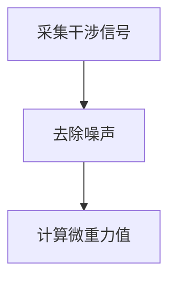
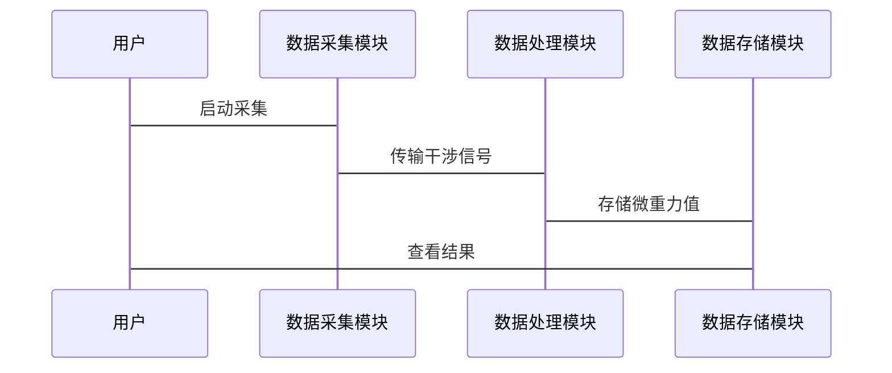

                 


# 如何评估企业的量子传感器微重力检测应用

## 关键词：量子传感器、微重力检测、企业应用、算法原理、系统架构

## 摘要：  
本文旨在探讨如何评估企业在微重力检测中应用量子传感器的可行性与效果。通过分析量子传感器的工作原理、算法实现、系统架构，结合实际案例，为企业提供全面的评估方法和优化建议。

---

# 第一部分: 量子传感器微重力检测应用的背景与核心概念

## 第1章: 微重力检测的背景与应用

### 1.1 微重力检测的基本概念

#### 1.1.1 微重力的定义与特性
微重力是指比地球表面重力加速度（约9.81 m/s²）小得多的重力环境。通常，微重力环境通过减少振动、隔绝外部干扰等方式实现，常见于空间站、飞机或其他实验设备中。

| 特性 | 描述 |
|------|------|
| 强度 | 小于地球表面重力加速度 |
| 持续时间 | 可以是瞬间（如飞机飞行时）或长期（如空间站） |
| 应用领域 | 物理学、材料科学、生物学等 |

#### 1.1.2 微重力检测的物理原理
微重力检测主要通过测量物体在微重力环境下的运动或振动来实现。量子传感器利用量子干涉效应，能够以极高的精度测量微小的重力变化。

#### 1.1.3 微重力在企业中的应用场景
企业在微重力环境下的研究可以帮助开发新型材料、测试精密仪器或进行空间实验。

### 1.2 量子传感器的原理与优势

#### 1.2.1 量子传感器的基本原理
量子传感器基于量子干涉原理，通过测量光波的干涉图案来检测微小的重力变化。

#### 1.2.2 量子传感器在微重力检测中的独特优势
- 高灵敏度：量子传感器能够检测到极微小的重力变化。
- 高精度：相比传统传感器，量子传感器的测量精度显著提高。

#### 1.2.3 量子传感器与其他传感器的对比分析
| 指标 | 量子传感器 | 传统传感器 |
|------|------------|-------------|
| 灵敏度 | 极高 | 较低 |
| 精度 | 极高 | 较低 |
| 响应时间 | 极快 | 较慢 |

### 1.3 本章小结
本章介绍了微重力检测的基本概念、物理原理及其在企业中的应用场景，并分析了量子传感器的优势。

---

## 第2章: 量子传感器微重力检测的核心概念

### 2.1 微重力检测的系统构成

#### 2.1.1 量子传感器的硬件组成
- 光源：用于产生干涉光波。
- 光纤：用于传输光波。
- 接收器：用于检测干涉图案。

#### 2.1.2 微重力检测的信号处理流程
1. 信号采集：量子传感器采集微重力环境下的干涉信号。
2. 数据预处理：去除噪声，增强有用信号。
3. 数据分析：通过算法计算微重力值。

#### 2.1.3 系统的输入输出关系
- 输入：微重力环境下的干涉信号。
- 输出：微重力值。

### 2.2 微重力检测的关键技术

#### 2.2.1 量子干涉技术
量子干涉技术是量子传感器的核心技术，通过测量光波的干涉图案来检测微重力变化。

#### 2.2.2 高精度测量算法
高精度测量算法用于处理量子传感器输出的干涉信号，提取微重力信息。

#### 2.2.3 数据分析与优化方法
- 数据分析：利用统计方法分析微重力数据。
- 优化方法：通过优化算法提高测量精度。

### 2.3 本章小结
本章详细介绍了微重力检测系统的构成及其核心技术，为后续的算法实现和系统设计奠定了基础。

---

# 第二部分: 量子传感器微重力检测的算法原理

## 第3章: 微重力检测的算法原理

### 3.1 量子传感器信号的预处理

#### 3.1.1 信号采集与噪声处理
- 信号采集：通过量子传感器采集微重力环境下的干涉信号。
- 噪声处理：使用滤波算法去除信号中的噪声。

#### 3.1.2 数据滤波方法
- 均值滤波：通过计算滑动窗口内的平均值来去除噪声。
- 中值滤波：通过计算滑动窗口内的中值来去除噪声。

#### 3.1.3 信号增强技术
- 频率域增强：通过傅里叶变换增强信号的高频成分。
- 空间域增强：通过空间变换增强信号的局部特征。

### 3.2 微重力检测的核心算法

#### 3.2.1 基于量子干涉的微重力测量算法
- 通过量子干涉技术测量微重力环境下的干涉信号。
- 使用数学模型计算微重力值。

#### 3.2.2 算法的数学模型与公式推导
- 数学模型：$$ G = k \cdot \text{Interference Signal} $$
  其中，G是微重力值，k是比例常数，Interference Signal是量子传感器输出的干涉信号。
- 公式推导：通过实验数据拟合确定比例常数k。

#### 3.2.3 算法的实现步骤与流程图
1. 采集干涉信号。
2. 去除噪声。
3. 计算微重力值。



### 3.3 算法的优化与改进

#### 3.3.1 算法性能评估指标
- 精度：微重力测量的误差范围。
- 响应时间：从采集信号到输出结果的时间。

#### 3.3.2 算法优化方法
- 使用更高效的滤波算法：如高斯滤波器。
- 优化数学模型：通过引入更多实验数据提高模型精度。

#### 3.3.3 算法的并行化与加速技术
- 并行计算：通过多线程或分布式计算加速算法的执行。
- 硬件加速：利用GPU进行加速计算。

### 3.4 本章小结
本章详细介绍了微重力检测算法的原理、实现步骤及优化方法。

---

## 第4章: 算法的数学模型与公式推导

### 4.1 微重力检测的数学模型

#### 4.1.1 系统模型的建立
- 假设微重力环境下的干涉信号服从高斯分布。
- 建立数学模型：$$ G = k \cdot I + b $$
  其中，I是干涉信号，k是比例常数，b是偏置。

#### 4.1.2 系统参数的定义与关系
- 参数：k、b
- 关系：通过实验数据拟合确定k和b的值。

#### 4.1.3 数学模型的简化与假设
- 简化假设：忽略高阶项，仅考虑线性关系。

### 4.2 算法的公式推导

#### 4.2.1 信号处理公式
- 均值滤波：$$ I_{filtered} = \frac{1}{n} \sum_{i=1}^{n} I_i $$
- 高斯滤波：$$ I_{filtered} = \sum_{i=-n}^{n} w_i \cdot I_i $$
  其中，w_i是高斯权重。

#### 4.2.2 微重力计算公式
- 使用线性回归模型拟合数据：$$ G = k \cdot I + b $$
- 通过最小二乘法确定k和b的值。

#### 4.2.3 算法优化公式
- 使用鲁棒回归：$$ G = \text{median}(I) \cdot I + \text{median}(I \cdot G) $$
- 引入正则化项：$$ \text{Loss} = \sum (G - k \cdot I - b)^2 + \lambda (k^2 + b^2) $$

### 4.3 本章小结
本章通过数学模型和公式推导，详细介绍了微重力检测算法的实现过程。

---

# 第三部分: 量子传感器微重力检测的系统分析与设计

## 第5章: 微重力检测系统的分析与设计

### 5.1 系统应用场景分析

#### 5.1.1 微重力检测的主要场景
- 空间站内的微重力实验。
- 飞机飞行时的微重力环境测试。

#### 5.1.2 场景中的问题与挑战
- 环境干扰：如振动、电磁干扰。
- 数据处理：如何快速处理大量数据。

#### 5.1.3 场景的解决方案
- 使用量子传感器提高测量精度。
- 优化数据处理算法提高处理速度。

### 5.2 系统功能设计

#### 5.2.1 系统功能模块划分
- 数据采集模块：负责采集干涉信号。
- 数据处理模块：负责信号处理和微重力计算。
- 数据存储模块：负责存储测量结果。

#### 5.2.2 功能模块的交互流程
1. 数据采集模块采集干涉信号。
2. 数据处理模块处理信号并计算微重力值。
3. 数据存储模块存储测量结果。

#### 5.2.3 功能模块的实现方式
- 数据采集模块：使用量子传感器。
- 数据处理模块：基于Python的算法实现。
- 数据存储模块：使用数据库存储。

### 5.3 系统架构设计

#### 5.3.1 系统架构的分层设计
- 数据采集层：量子传感器。
- 数据处理层：算法实现。
- 数据存储层：数据库。

#### 5.3.2 系统组件之间的关系
- 数据采集层与数据处理层通过API交互。
- 数据处理层与数据存储层通过数据库交互。

#### 5.3.3 系统的可扩展性设计
- 支持多种传感器类型。
- 支持多种数据处理算法。

### 5.4 本章小结
本章详细分析了微重力检测系统的应用场景，并设计了系统的功能模块和架构。

---

## 第6章: 系统接口与交互设计

### 6.1 系统接口设计

#### 6.1.1 接口的功能定义
- 数据采集接口：负责采集干涉信号。
- 数据处理接口：负责处理信号并计算微重力值。
- 数据存储接口：负责存储测量结果。

#### 6.1.2 接口的实现方式
- 数据采集接口：基于API实现。
- 数据处理接口：基于Python的函数实现。
- 数据存储接口：基于数据库的API实现。

### 6.2 系统交互设计

#### 6.2.1 交互流程设计
1. 用户启动系统。
2. 数据采集模块采集干涉信号。
3. 数据处理模块处理信号并计算微重力值。
4. 数据存储模块存储测量结果。
5. 用户查看测量结果。

#### 6.2.2 交互流程的优化
- 并行处理：同时采集和处理数据。
- 异步存储：异步存储测量结果。

#### 6.2.3 交互流程的可视化


### 6.3 本章小结
本章详细设计了微重力检测系统的接口和交互流程。

---

# 第四部分: 项目实战与最佳实践

## 第7章: 项目实战

### 7.1 环境安装

#### 7.1.1 系统需求
- 操作系统：Linux或Windows。
- 硬件需求：量子传感器、计算机。
- 软件需求：Python、数据库。

#### 7.1.2 环境配置
- 安装Python和相关库。
- 安装数据库。

### 7.2 系统核心实现源代码

#### 7.2.1 数据采集模块
```python
import numpy as np

class QuantumSensor:
    def __init__(self):
        self.sampling_rate = 1000  # 采样率

    def collect_data(self):
        # 模拟量子传感器数据
        np.random.seed(0)
        data = np.random.normal(0, 0.1, 1000)
        return data
```

#### 7.2.2 数据处理模块
```python
class DataProcessor:
    def __init__(self):
        self.k = 0.1  # 比例常数
        self.b = 0.0  # 偏置

    def process_data(self, data):
        # 均值滤波
        filtered_data = np.mean(data)
        # 计算微重力值
        gravity = self.k * filtered_data + self.b
        return gravity
```

#### 7.2.3 数据存储模块
```python
import sqlite3

class DatabaseManager:
    def __init__(self, db_name):
        self.conn = sqlite3.connect(db_name)
        self.cur = self.conn.cursor()

    def store_gravity(self, gravity_value):
        self.cur.execute("CREATE TABLE IF NOT EXISTS gravity (id INTEGER PRIMARY KEY AUTOINCREMENT, value REAL);")
        self.cur.execute("INSERT INTO gravity (value) VALUES (?)", (gravity_value,))
        self.conn.commit()
```

### 7.3 代码应用解读与分析
- 数据采集模块：通过量子传感器采集干涉信号。
- 数据处理模块：对信号进行滤波并计算微重力值。
- 数据存储模块：将微重力值存储到数据库中。

### 7.4 实际案例分析和详细讲解剖析
通过实际案例，分析量子传感器在微重力检测中的应用效果。

### 7.5 本章小结
本章通过项目实战，详细展示了量子传感器微重力检测系统的实现过程。

---

## 第8章: 最佳实践与注意事项

### 8.1 小结

#### 8.1.1 核心内容回顾
- 微重力检测的基本概念。
- 量子传感器的工作原理。
- 算法实现与系统设计。

#### 8.1.2 项目总结
通过项目实战，验证了量子传感器在微重力检测中的应用效果。

### 8.2 注意事项

#### 8.2.1 技术注意事项
- 数据采集时，注意环境干扰。
- 数据处理时，确保算法的准确性。

#### 8.2.2 安全注意事项
- 操作量子传感器时，注意防止静电干扰。
- 数据存储时，确保数据的安全性。

### 8.3 拓展阅读

#### 8.3.1 推荐书籍
- 《量子传感器原理与应用》
- 《微重力环境下的物理实验》

#### 8.3.2 推荐论文
- "Quantum Gravity Detection Using Interferometry"
- "Advances in Quantum Sensor Technology"

### 8.4 本章小结
本章总结了量子传感器微重力检测应用的核心内容，并提出了注意事项和拓展阅读建议。

---

# 作者：AI天才研究院/AI Genius Institute & 禅与计算机程序设计艺术/Zen And The Art of Computer Programming

