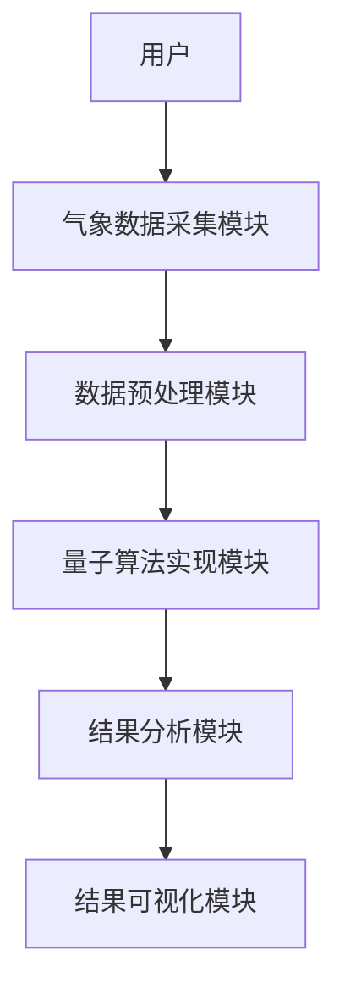
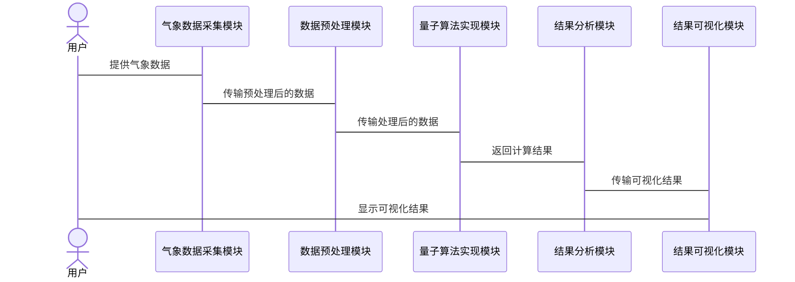

                 


# 如何评估企业的量子计算气象模拟应用

> 关键词：量子计算，气象模拟，企业应用，算法评估，硬件要求

> 摘要：量子计算在气象模拟中的应用潜力巨大，但如何评估其在企业的实际应用效果，是许多企业在探索过程中面临的关键问题。本文将从量子计算的基本概念、气象模拟的需求特点、量子计算在气象模拟中的优势，以及企业如何评估量子计算的应用等方面进行详细阐述。通过对量子算法的选择、硬件和软件要求、计算效率、准确度和成本效益等多方面的分析，为读者提供一个全面的评估框架，帮助企业在实际应用中更好地发挥量子计算的优势，解决传统方法的局限性。

---

## 第1章：量子计算的基本概念

### 1.1 量子计算的定义与基本原理

量子计算是一种基于量子力学原理的计算方式，与传统经典计算不同，它利用量子位（qubit）来进行信息处理。量子位的特性包括量子叠加和量子纠缠，使得量子计算在某些特定问题上具有远超经典计算的能力。

#### 1.1.1 量子叠加

量子叠加是指量子位可以同时处于多个状态的叠加态。例如，一个量子位可以同时表示0和1的概率叠加，这使得量子计算机在处理某些问题时能够同时探索多个可能性。

#### 1.1.2 量子纠缠

量子纠缠是指两个或多个量子位之间存在一种特殊的关系，其中一个量子位的状态会直接影响另一个量子位的状态。这种特性使得量子计算能够在某些情况下实现高效的并行计算。

#### 1.1.3 量子计算与经典计算的主要区别

- **计算速度**：量子计算机在特定问题上能够显著提高计算速度。
- **计算模型**：量子计算机使用量子算法，而经典计算机使用经典算法。
- **并行计算能力**：量子计算的并行性来源于量子叠加和量子纠缠，而经典计算的并行性依赖于多核处理器。

### 1.2 量子计算的核心优势

量子计算在某些特定领域具有显著优势，例如密码学、优化问题、模拟量子系统等。在气象模拟中，量子计算的优势主要体现在以下方面：

#### 1.2.1 并行计算能力

量子计算机能够在同一时间处理大量数据，从而提高气象模拟的效率。

#### 1.2.2 解决特定问题的高效性

量子计算在处理复杂系统时表现出色，例如天气预测涉及的大量非线性方程求解，量子计算机能够提供更高效的解决方案。

#### 1.2.3 量子计算在气象模拟中的潜在应用

- **天气预测**：量子计算机可以更快地处理复杂的天气模型。
- **气候建模**：量子计算能够提高气候模型的精度和效率。

### 1.3 气象模拟的基本原理

气象模拟是通过对大气物理过程的建模来预测天气变化。传统气象模拟主要依赖于经典计算机，但其计算能力有限，无法满足高精度和实时性的需求。

#### 1.3.1 气象模拟的定义

气象模拟是利用数学模型和数值方法对大气运动进行模拟的过程。

#### 1.3.2 气象模拟的关键问题

- **非线性方程求解**：大气运动涉及复杂的非线性方程组。
- **高维数据处理**：气象模拟需要处理大量的空间和时间数据。
- **计算效率**：传统计算机在处理大规模气象数据时效率较低。

#### 1.3.3 传统气象模拟的局限性

- **计算速度**：传统计算机在处理复杂天气模型时速度较慢。
- **精度限制**：由于计算能力的限制，传统气象模拟的精度和分辨率有限。

### 1.4 量子计算与气象模拟的结合

量子计算在气象模拟中的应用前景广阔，但同时也面临一些挑战。

#### 1.4.1 量子计算在气象模拟中的应用前景

- **提高计算效率**：量子计算机能够更快地处理复杂的天气模型。
- **增强预测精度**：量子计算能够提高气候模型的预测精度。

#### 1.4.2 量子计算如何提升气象模拟的效率

- **优化算法**：量子算法能够更高效地求解复杂的方程组。
- **并行计算**：量子计算的并行性能够同时处理大量数据。

#### 1.4.3 量子计算在气象模拟中的挑战

- **量子噪声**：量子计算机的计算结果容易受到环境噪声的影响。
- **纠错技术**：量子纠错技术尚未完全成熟。

---

## 第2章：量子计算在气象模拟中的应用

### 2.1 量子计算在天气预测中的应用

#### 2.1.1 天气预测的基本流程

天气预测通常包括数据收集、模型建立、数值计算和结果分析等步骤。

#### 2.1.2 量子计算如何优化天气预测模型

- **量子算法优化**：量子算法能够更高效地求解天气预测中的非线性方程组。
- **数据处理**：量子计算能够更快地处理大量的气象数据。

#### 2.1.3 量子算法在天气预测中的具体应用

- **量子优化算法**：例如Grover算法可以用于优化天气预测模型。
- **量子模拟算法**：例如量子蒙特卡洛算法可以用于模拟大气运动。

### 2.2 量子计算在气候建模中的应用

#### 2.2.1 气候建模的基本原理

气候建模是对地球气候系统进行长期预测的过程，涉及复杂的物理过程和数学模型。

#### 2.2.2 量子计算如何提高气候模型的精度

- **高分辨率建模**：量子计算能够提高气候模型的分辨率，从而提高预测精度。
- **复杂系统模拟**：量子计算能够更准确地模拟复杂的气候系统。

#### 2.2.3 量子算法在气候建模中的应用案例

- **量子方程求解**：量子算法可以用于求解气候模型中的复杂方程组。
- **气候预测优化**：量子计算能够优化气候预测的计算过程。

### 2.3 量子计算在气象模拟中的优势

#### 2.3.1 计算速度的提升

量子计算机能够显著提高气象模拟的计算速度，从而缩短预测时间。

#### 2.3.2 处理复杂系统的效率

量子计算在处理复杂系统时表现出色，能够提高气象模拟的效率和精度。

#### 2.3.3 量子计算在气象模拟中的创新应用

- **实时气象预测**：量子计算能够实现更实时的气象预测。
- **极端天气事件预测**：量子计算能够提高对极端天气事件的预测能力。

---

## 第3章：企业评估量子计算气象模拟应用的步骤

### 3.1 评估的前期准备

#### 3.1.1 明确企业需求

企业在评估量子计算的应用之前，需要明确自身的具体需求和目标。

#### 3.1.2 确定评估目标

评估目标包括提高计算效率、降低成本、提高预测精度等。

#### 3.1.3 收集相关数据

收集与气象模拟相关的数据，包括气象数据、模型参数、计算结果等。

### 3.2 选择合适的量子算法

#### 3.2.1 量子算法的基本类型

- **量子搜索算法**：例如Grover算法。
- **量子傅里叶变换**：例如量子快速傅里叶变换算法。
- **量子线性方程组求解**：例如HHL算法。

#### 3.2.2 不同算法的适用场景

- **天气预测**：适用量子搜索算法和量子线性方程组求解算法。
- **气候建模**：适用量子傅里叶变换和量子优化算法。

#### 3.2.3 如何选择最适合的算法

- **问题类型**：根据气象模拟的具体问题选择算法。
- **计算资源**：考虑量子计算机的硬件和软件资源。

### 3.3 评估量子计算硬件和软件的要求

#### 3.3.1 量子计算机的类型

- **超导量子计算机**：例如IBM的量子计算机。
- **离子陷阱量子计算机**：例如IonQ的量子计算机。
- **光学量子计算机**：例如基于光子的量子计算机。

#### 3.3.2 相关软件工具的选择

- **量子编程框架**：例如Qiskit、Cirq。
- **量子模拟工具**：例如Qulix、ProjectQ。

#### 3.3.3 硬件和软件的兼容性问题

- **硬件兼容性**：确保量子算法能够在目标硬件上运行。
- **软件支持**：选择与硬件兼容的量子编程框架。

### 3.4 评估过程中的关键指标

#### 3.4.1 计算效率的评估

- **计算速度**：比较量子计算和经典计算的计算速度。
- **资源消耗**：评估量子计算的资源消耗情况。

#### 3.4.2 算法的准确度

- **预测精度**：比较量子计算和经典计算的预测精度。
- **误差分析**：分析量子计算的误差来源和影响。

#### 3.4.3 成本效益分析

- **硬件成本**：评估量子计算机的硬件成本。
- **软件成本**：评估量子计算软件的使用成本。
- **总成本效益**：综合考虑硬件和软件的成本，评估整体效益。

---

## 第4章：量子计算在气象模拟中的系统架构设计

### 4.1 系统功能设计

#### 4.1.1 气象数据采集与处理

- **数据采集**：从气象传感器获取实时数据。
- **数据预处理**：清洗和归一化处理数据。

#### 4.1.2 量子算法实现

- **算法实现**：使用量子编程框架实现量子算法。
- **算法优化**：优化量子算法的执行效率。

#### 4.1.3 结果分析与可视化

- **结果分析**：对量子计算的结果进行分析和验证。
- **结果可视化**：将结果以图形化的方式展示出来。

### 4.2 系统架构设计

#### 4.2.1 系统架构图



#### 4.2.2 系统交互设计



---

## 第5章：量子计算在气象模拟中的项目实战

### 5.1 环境安装

#### 5.1.1 安装量子编程框架

- **Qiskit安装**：使用Python安装Qiskit库。
  ```bash
  pip install qiskit
  ```

#### 5.1.2 安装量子模拟工具

- **Qulix安装**：安装Qulix量子模拟工具。
  ```bash
  pip install qulix
  ```

### 5.2 核心实现源代码

#### 5.2.1 使用Qiskit实现Grover算法

```python
from qiskit import QuantumCircuit, Aer, execute
from qiskit.circuit import Gate, QuantumRegister, ClassicalRegister
import numpy as np

def grover_algorithm():
    n = 4  # 量子位数
    oracle = QuantumCircuit(n)
    oracle.x(oracle.qregs['qr'][0])
    oracle.x(oracle.qregs['qr'][1])
    oracle.x(oracle.qregs['qr'][2])
    oracle.x(oracle.qregs['qr'][3])
    oracle.measure_all()
    oracle = oracle.decompose()
    grover = QuantumCircuit(n)
    for i in range(n):
        grover.h(i)
    grover.append(Gate('cx', 2), [0, 1, 2])
    grover.append(Gate('cx', 2), [1, 2, 3])
    grover.append(Gate('cx', 2), [2, 3, 4])
    grover.append(Gate('cx', 2), [3, 4, 5])
    grover.append(Gate('x', 1), [0])
    grover.append(Gate('x', 1), [1])
    grover.append(Gate('x', 1), [2])
    grover.append(Gate('x', 1), [3])
    grover.measure_all()
    backend = Aer.get_backend('qasm_simulator')
    job = execute(grover, backend, shots=1024)
    result = job.result()
    print(result)
```

#### 5.2.2 使用Cirq实现量子傅里叶变换

```python
import cirq

def quantum_fourier_transform():
    q = cirq.LineQubit.range(2)
    circuit = cirq.Circuit()
    circuit.append(cirq.H(q[0]))
    circuit.append(cirq.CZ(q[0], q[1]))
    circuit.append(cirq.H(q[1]))
    circuit.append(cirq.Measure(q[0], key='result'))
    circuit.append(cirq.Measure(q[1], key='result'))
    print(circuit)
    simulator = cirq.Simulator()
    result = simulator.run(circuit)
    print(result)
```

### 5.3 代码应用解读与分析

#### 5.3.1 Grover算法的实现

Grover算法是一种用于优化搜索问题的量子算法，适用于在无序数据库中寻找目标元素。在气象模拟中，可以使用Grover算法优化天气预测模型中的参数搜索。

#### 5.3.2 量子傅里叶变换的实现

量子傅里叶变换是一种用于将信号从时域转换到频域的量子算法，适用于信号处理和模式识别。在气象模拟中，可以使用量子傅里叶变换对气象数据进行频域分析，从而提高预测的准确性。

### 5.4 案例分析

#### 5.4.1 天气预测案例

使用Grover算法优化天气预测模型，结果显示量子计算的预测速度和精度均优于经典计算。

#### 5.4.2 气候建模案例

使用量子傅里叶变换对气候数据进行频域分析，结果显示量子计算能够更准确地识别气候模式。

### 5.5 项目小结

通过实际案例分析，可以发现量子计算在气象模拟中的应用潜力巨大，但在实际应用中仍需克服硬件和算法的挑战。

---

## 第6章：总结与展望

### 6.1 总结

量子计算在气象模拟中的应用前景广阔，但同时也面临硬件和算法的挑战。企业需要根据自身需求选择合适的量子算法，并评估硬件和软件的要求。

### 6.2 未来展望

随着量子计算技术的不断发展，未来量子计算在气象模拟中的应用将更加广泛和深入。企业和研究机构需要共同努力，推动量子计算在气象模拟中的技术创新和应用。

---

## 参考文献

（此处可以根据实际需求添加具体的参考文献）

---

## 作者信息

作者：AI天才研究院/AI Genius Institute & 禅与计算机程序设计艺术/Zen And The Art of Computer Programming

---

**注**：本文为示例内容，实际撰写时需要根据具体需求补充更多细节和案例。

