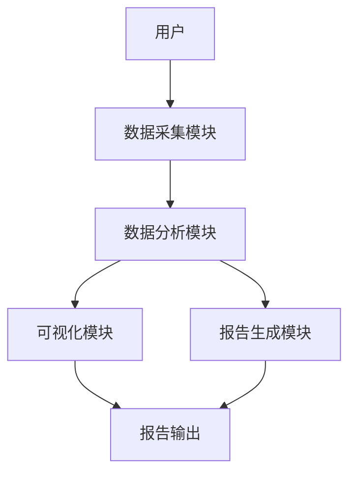
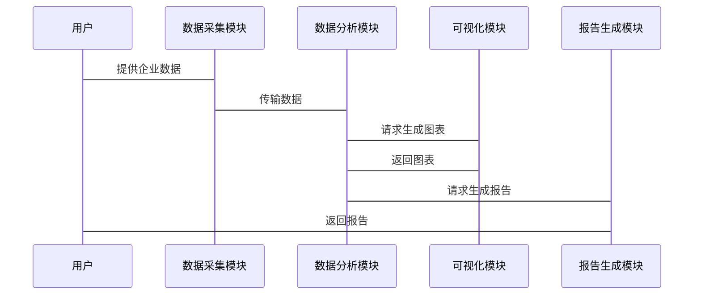

                 


# 彼得林奇如何分析公司的定价权

## 关键词：定价权，彼得·林奇，投资分析，定价策略，定价能力

## 摘要：本文深入探讨了彼得·林奇分析公司定价权的策略和方法，从定义、重要性、分析框架、关键指标、财务分析、案例研究到系统设计，全面解析定价权的评估与应用。

---

## 第一部分: 定价权的核心概念与分析框架

### 第1章: 定价权的定义与重要性

#### 1.1 定价权的定义

定价权是指企业在市场上对产品或服务制定价格的能力，是企业在竞争市场中的一项重要竞争优势。定价权不仅影响企业的盈利能力，还反映了企业在市场中的地位和客户认知度。

##### 1.1.1 什么是定价权

定价权是企业在不严重损失市场份额的情况下，能够调整价格的能力。企业具备定价权通常意味着其产品具有独特性或品牌影响力，能够在价格变动中保持需求稳定。

##### 1.1.2 定价权的核心要素

- **市场定位**：企业在市场中的位置，决定了其定价策略的空间。
- **产品差异化**：产品与竞争对手的不同之处，增强定价能力。
- **成本结构**：企业的生产成本，影响定价的最低界限。
- **品牌影响力**：品牌知名度和信誉，增强定价权。
- **市场需求弹性**：产品需求对价格变化的敏感程度。

##### 1.1.3 定价权在企业中的战略地位

定价权直接影响企业的利润、市场份额和长期发展。有效的定价策略能够提升企业的盈利能力，增强市场竞争力，确保企业可持续发展。

#### 1.2 定价权的重要性

##### 1.2.1 定价权对企业利润的影响

定价权直接影响企业收入和利润。拥有定价权的企业可以在成本上升时通过提价转移成本压力，保持利润水平。

##### 1.2.2 定价权与市场竞争的关系

定价权是企业竞争优势的体现。拥有定价权的企业能够影响市场价格，制定更有利可图的价格策略，抑制竞争对手的发展。

##### 1.2.3 定价权与客户价值的关联

定价权高的企业能够通过价格策略传递更高的客户价值，增强客户忠诚度，同时优化收入结构。

### 第2章: 彼得·林奇的定价权分析方法

#### 2.1 彼得·林奇的分析框架

##### 2.1.1 定价能力的评估维度

- **市场需求**：分析市场对产品的需求弹性。
- **竞争环境**：评估竞争对手的定价策略和市场反应。
- **成本结构**：了解企业的成本构成和变化趋势。
- **品牌影响力**：评估品牌在市场中的认知度和影响力。
- **客户忠诚度**：分析客户对价格变动的敏感度。

##### 2.1.2 定价权的市场表现

- **市场份额**：企业的市场份额是定价权的直接体现。
- **价格领导力**：企业能否引领市场价格变化。
- **利润率稳定性**：企业能否在不同市场条件下保持稳定利润。

##### 2.1.3 定价权的长期可持续性

- **行业趋势**：分析行业发展的长期趋势。
- **技术进步**：技术进步对成本和价格的影响。
- **政策环境**：政策变化对市场和定价的影响。

#### 2.2 彼得·林奇的核心理念

##### 2.2.1 投资者视角下的定价权

彼得·林奇认为，定价权是企业长期盈利能力的重要指标。投资者应关注企业是否能够在价格变化中保持竞争力，确保利润的可持续性。

##### 2.2.2 企业定价能力的多维度分析

林奇强调，定价能力不仅取决于企业内部因素，还受外部市场环境影响。投资者应从多个维度评估企业的定价能力，包括市场需求、竞争环境、成本结构等。

##### 2.2.3 定价权与企业竞争优势的关系

定价权是企业竞争优势的集中体现。拥有定价权的企业能够在市场中占据主导地位，制定更有利的价格策略，巩固市场地位。

### 第3章: 定价权的分析框架

#### 3.1 定价能力的评估指标

##### 3.1.1 市场占有率

市场占有率是衡量企业定价权的重要指标。高市场占有率通常意味着企业具备较强的定价能力。

##### 3.1.2 产品差异化程度

产品差异化程度越高，企业的定价能力越强。独特的产品设计和功能能够吸引特定客户群体，增强定价权。

##### 3.1.3 成本优势

成本优势是定价权的基础。低成本的企业能够在价格竞争中占据优势，同时保持盈利能力。

#### 3.2 定价策略的分类

##### 3.2.1 基于成本的定价

基于成本的定价策略是以企业生产成本为基础，加上合理利润，确定产品价格。这种策略适用于成本主导型行业。

##### 3.2.2 基于需求的定价

基于需求的定价策略以市场需求为导向，通过分析需求弹性，确定最优价格。这种策略适用于需求敏感型行业。

##### 3.2.3 基于竞争的定价

基于竞争的定价策略以竞争对手的价格为基础，调整自身价格以保持竞争力。这种策略适用于高度竞争的市场环境。

#### 3.3 定价风险的识别与应对

##### 3.3.1 市场波动对定价权的影响

市场波动可能导致定价权变化。企业需密切关注市场变化，及时调整定价策略。

##### 3.3.2 竞争对手的定价策略分析

分析竞争对手的定价策略有助于企业制定更具竞争力的价格，巩固定价权。

##### 3.3.3 宏观经济环境对定价权的挑战

宏观经济环境如通货膨胀、经济衰退等会影响企业定价权。企业需灵活应对经济环境变化，维护定价能力。

### 第4章: 定价权的关键指标与分析模型

#### 4.1 定价权的量化指标

##### 4.1.1 毛利率

毛利率 = (销售收入 - 销售成本) / 销售收入 × 100%

毛利率越高，企业定价能力越强。例如，若销售收入为100，销售成本为60，则毛利率为40%。

##### 4.1.2 净利率

净利率 = 净利润 / 营业收入 × 100%

净利率反映企业整体盈利能力。高净利率表明企业定价策略有效，盈利能力强。

##### 4.1.3 单位产品利润

单位产品利润 = 总利润 / 销售数量

单位产品利润高表明企业定价策略有效，每单位产品贡献的利润高。

#### 4.2 定价权分析模型

##### 4.2.1 毛利率与定价权的关系模型

毛利率与定价权正相关。毛利率高表明企业定价能力较强，能够通过价格获取更高利润。

##### 4.2.2 市场占有率与定价能力的回归分析

回归分析可以量化市场占有率对定价能力的影响。例如，建立市场占有率与毛利率的回归模型，分析市场占有率对毛利率的影响程度。

##### 4.2.3 定价权的综合评估指标体系

综合评估指标体系包括毛利率、净利率、市场占有率、产品差异化程度等多维度指标，全面评估企业定价权。

### 第5章: 定价权的财务分析与案例

#### 5.1 定价权的财务表现

##### 5.1.1 毛利率的计算与分析

以苹果公司为例，2022年苹果的毛利率约为43.2%，表明苹果具备较强的定价能力，能够通过高价策略获取高利润。

##### 5.1.2 净利率的计算与分析

苹果2022年的净利率约为22.8%，表明公司盈利能力强，定价策略有效。

##### 5.1.3 现金流的分析与定价权的关系

现金流充裕表明企业定价能力稳定，具备持续投资和发展的能力。

#### 5.2 案例分析: 彼得·林奇的经典投资案例

##### 5.2.1 苹果公司的定价权分析

苹果通过不断创新和产品差异化，建立了强大的品牌影响力，具备较强的定价权。其高价策略有效提升了利润率，巩固了市场地位。

##### 5.2.2 茅台的定价权分析

茅台作为高端白酒品牌，具备强大的品牌影响力和市场认可度，能够通过提价保持高利润。其定价权在市场中表现突出。

##### 5.2.3 其他经典案例的启示

其他成功企业的定价权分析，如谷歌、亚马逊等，均通过创新和市场领导地位，巩固了定价能力。

### 第6章: 定价权的系统分析与架构设计

#### 6.1 系统分析

##### 6.1.1 系统目标

构建定价权分析系统，提供全面的定价权评估工具，帮助投资者和企业分析定价能力。

##### 6.1.2 系统功能需求

- 数据收集：收集企业财务数据、市场数据等。
- 数据分析：运用统计方法和模型，评估定价权。
- 可视化：生成图表和报告，直观展示分析结果。

##### 6.1.3 系统边界与接口

系统边界包括数据输入、数据处理、结果输出等模块。接口设计需考虑数据来源和输出格式。

#### 6.2 系统架构设计

##### 6.2.1 数据流图

数据流图展示系统数据流动情况，包括数据输入、处理、存储、输出等环节。

##### 6.2.2 模块划分

- 数据采集模块：负责数据的采集和预处理。
- 数据分析模块：执行定价权分析，生成评估结果。
- 可视化模块：将分析结果以图表形式展示。
- 报告生成模块：生成分析报告，供用户参考。

##### 6.2.3 系统架构图（Mermaid）



#### 6.3 系统接口设计

##### 6.3.1 数据接口

- 数据输入接口：接收企业财务数据、市场数据等。
- 数据输出接口：输出分析结果，包括图表和报告。

##### 6.3.2 用户接口

- �界面对话框：用户输入企业信息和参数，系统处理后输出结果。
- 图表展示：以图表形式直观展示定价权分析结果。

#### 6.4 系统交互设计

##### 6.4.1 交互流程

用户输入企业信息和参数，系统进行数据处理，生成分析结果，以图表和报告形式展示给用户。

##### 6.4.2 序列图（Mermaid）



### 第7章: 项目实战与最佳实践

#### 7.1 环境安装

##### 7.1.1 安装Python

安装Python 3.8或更高版本，确保环境兼容性。

##### 7.1.2 安装依赖库

安装pandas、numpy、matplotlib、seaborn等数据分析和可视化库。

#### 7.2 核心实现源代码

##### 7.2.1 数据收集与处理

```python
import pandas as pd
import numpy as np

# 假设data.csv是包含企业财务数据的文件
data = pd.read_csv('data.csv')

# 计算毛利率
data['毛利率'] = (data['销售收入'] - data['销售成本']) / data['销售收入'] * 100

# 计算净利率
data['净利率'] = data['净利润'] / data['营业收入'] * 100

# 保存数据
data.to_csv('processed_data.csv', index=False)
```

##### 7.2.2 定价权分析模型

```python
from sklearn.linear_model import LinearRegression

# 假设X为市场占有率，y为毛利率
model = LinearRegression()
model.fit(X.reshape(-1, 1), y)
```

##### 7.2.3 可视化

```python
import matplotlib.pyplot as plt

plt.scatter(X, y)
plt.plot(X, model.predict(X.reshape(-1, 1)), color='red')
plt.xlabel('市场占有率')
plt.ylabel('毛利率')
plt.show()
```

#### 7.3 代码应用解读与分析

##### 7.3.1 数据预处理

- 数据清洗：处理缺失值、异常值等。
- 数据转换：将数据转换为适合分析的格式。

##### 7.3.2 模型训练

- 线性回归模型用于分析市场占有率与毛利率的关系。
- 通过模型系数，评估市场占有率对毛利率的影响。

##### 7.3.3 结果可视化

- 绘制散点图和回归线，直观展示市场占有率与毛利率的关系。
- 分析回归结果，得出市场占有率对毛利率的具体影响。

#### 7.4 实际案例分析

##### 7.4.1 案例背景

以苹果公司为例，分析其定价权表现。

##### 7.4.2 数据分析

- 计算苹果的毛利率、净利率等指标。
- 通过回归分析，评估市场占有率对定价能力的影响。

##### 7.4.3 结果解读

- 苹果的毛利率和净利率均较高，表明定价能力强大。
- 市场占有率与毛利率正相关，支持定价权的重要性。

#### 7.5 项目小结

通过实际案例分析，验证了定价权分析模型的有效性。模型能够准确评估企业的定价能力，为投资决策提供依据。

### 第8章: 最佳实践与总结

#### 8.1 最佳实践 tips

- **持续关注市场变化**：及时调整定价策略。
- **加强数据分析能力**：提升定价权分析的准确性。
- **注重品牌建设**：增强企业的定价能力。

#### 8.2 小结

本文深入探讨了彼得·林奇分析公司定价权的方法，从定义、重要性、分析框架到案例分析，全面解析了定价权的评估与应用。

#### 8.3 注意事项

- 定价权分析需结合具体市场环境和企业情况。
- 数据分析需确保数据质量和准确性。

#### 8.4 拓展阅读

- 建议阅读彼得·林奇的其他著作，深入了解其投资理念。
- 学习更多定价策略和分析方法，提升定价能力。

---

## 作者：AI天才研究院/AI Genius Institute & 禅与计算机程序设计艺术 /Zen And The Art of Computer Programming

---

### 结语

通过本文的深入分析，读者能够掌握彼得·林奇分析公司定价权的方法，理解定价权在企业中的重要性，并能够实际应用这些分析方法，提升投资决策的准确性。希望本文对读者在定价权分析方面有所帮助。

