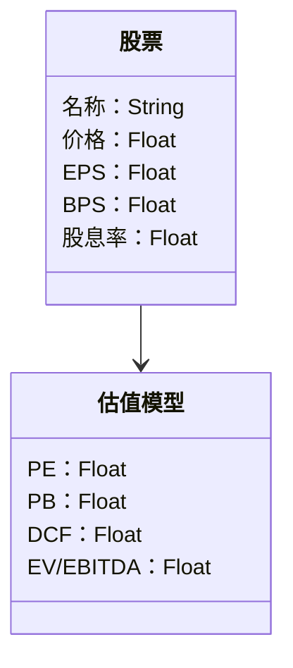
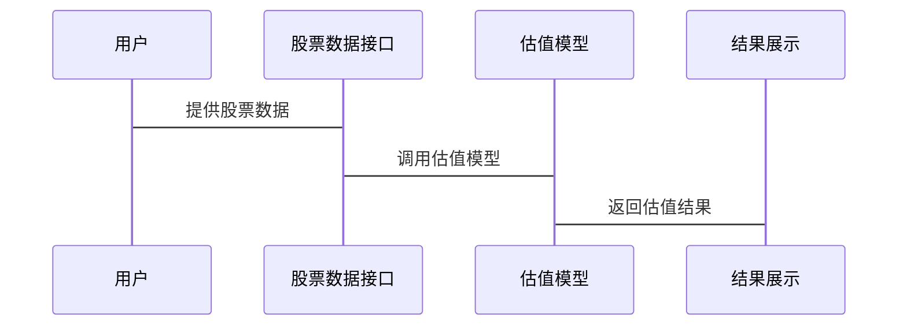

                 


# 日本股市估值:成熟市场的特点与挑战

> 关键词：日本股市，估值，PE，PB，DCF模型，EV/EBITDA，低增长环境

> 摘要：本文将探讨日本股市估值的特点、挑战及其在成熟市场中的独特性。通过分析市盈率（PE）、市净率（PB）等传统估值指标，以及现金流折现模型（DCF）等创新方法，本文将深入探讨日本股市估值的核心概念与实际应用。通过具体案例分析，本文将为投资者提供实用的估值方法和策略。

---

# 第一部分: 日本股市估值的背景与特点

## 第1章: 日本股市的背景与现状

### 1.1 日本股市的历史与发展

#### 1.1.1 日本股市的起源与发展
日本股市的起源可以追溯到19世纪末，东京证券交易所的成立标志着日本股市的正式诞生。20世纪80年代，日本股市经历了泡沫经济的高速增长期，随后泡沫破裂后，日本股市进入了一个长期的低增长甚至停滞期。尽管如此，日本股市仍然是全球第二大股市，上市公司数量众多，涵盖多个行业。

#### 1.1.2 日本股市与其他成熟市场的对比
与美国、欧洲等成熟市场相比，日本股市具有以下特点：
- **低增长环境**：日本经济长期处于低增长甚至停滞状态，企业的盈利增长相对有限。
- **老龄化社会**：日本社会的老龄化趋势对股市的需求和结构产生了深远影响。
- **文化差异**：日本企业在分红、并购等方面具有独特的文化和管理特点。

#### 1.1.3 日本股市的独特性与优势
- **企业稳定性**：日本企业具有较强的稳定性，许多企业历史悠久，品牌价值高。
- **低波动性**：与新兴市场相比，日本股市的波动性较低，适合长期投资者。
- **国际化程度高**：虽然日本股市以国内投资者为主，但随着全球化进程的加快，外资的流入逐渐增加。

### 1.2 日本股市的市场结构

#### 1.2.1 日本股市的主要参与者
- **个人投资者**：日本股市的个人投资者比例较高，尤其是散户投资者。
- **机构投资者**：包括国内和国际的机构投资者，如基金、保险公司等。
- **上市公司**：主要由日本本土企业构成，涵盖制造业、金融、科技等多个行业。

#### 1.2.2 日本股市的交易机制
- **交易时间**：与全球主要股市类似，通常为每天上午9:30至下午3:30。
- **撮合机制**：采用电子撮合系统，确保交易的公平性和效率。

#### 1.2.3 日本股市的监管框架
- **监管机构**：日本金融厅（FSA）负责监管股市，确保市场的公平和透明。
- **法律法规**：包括《证券交易法》、《公司法》等，规范上市公司的信息披露和行为。

## 第2章: 日本股市估值的核心概念与方法

### 2.1 估值的基本原理

#### 2.1.1 估值的定义与意义
估值是指对资产或股票的内在价值进行估计的过程，目的是确定其合理的价格区间。在股票估值中，我们通常关注企业的基本面，如盈利能力、成长性、财务状况等。

#### 2.1.2 估值的基本方法与分类
- **相对估值法**：基于市场数据，如市盈率（PE）、市净率（PB）等指标进行估值。
- **绝对估值法**：基于企业的现金流折现模型（DCF）进行估值。

#### 2.1.3 日本股市估值的独特性
- **低增长环境**：由于日本经济长期低迷，传统的高增长假设不再适用。
- **企业特殊性**：日本企业具有较高的负债率和较低的分红率。

### 2.2 日本股市估值的核心指标

#### 2.2.1 市盈率（PE）的计算与应用
市盈率是股票的市场价格除以每股收益（EPS），公式为：
$$ PE = \frac{P}{EPS} $$
其中，P为股票价格，EPS为每股收益。

#### 2.2.2 市净率（PB）的计算与应用
市净率是股票的市场价格除以每股净资产（BPS），公式为：
$$ PB = \frac{P}{BPS} $$

#### 2.2.3 股息率的计算与应用
股息率是股票的年股息除以股票价格，公式为：
$$ Dividend Yield = \frac{Dividend}{P} $$

### 2.3 日本股市估值的特殊性

#### 2.3.1 低增长环境下的估值挑战
在低增长环境下，传统的市盈率和市净率模型可能不再适用，需要引入其他指标，如企业价值倍数（EV/EBITDA）。

#### 2.3.2 日本企业的特殊会计处理
日本企业在会计处理上有一些特殊性，如存货计价方法和折旧政策，这些都需要在估值时加以调整。

#### 2.3.3 日本股市的国际化与外资影响
随着外资的流入，日本股市的估值方法逐渐国际化，但同时也受到外资流动的影响。

---

# 第二部分: 日本股市估值的核心算法与模型

## 第3章: 日本股市估值的传统方法

### 3.1 市盈率模型

#### 3.1.1 市盈率模型的定义与公式
市盈率模型是基于企业的盈利能力进行估值，公式为：
$$ Target Price = Target PE \times EPS $$

#### 3.1.2 市盈率模型的优缺点
- **优点**：简单易懂，适用于企业盈利稳定的情况。
- **缺点**：在低增长环境下，市盈率可能偏高，导致估值过高。

#### 3.1.3 日本股市中市盈率模型的实际应用
以日本某制造企业为例，假设其当前股价为100日元，EPS为50日元，则市盈率为2。如果目标PE为1.5，则目标股价为75日元。

### 3.2 市净率模型

#### 3.2.1 市净率模型的定义与公式
市净率模型是基于企业的资产价值进行估值，公式为：
$$ Target Price = Target PB \times BPS $$

#### 3.2.2 市净率模型的优缺点
- **优点**：适用于资产密集型企业。
- **缺点**：在低增长环境下，市净率可能偏低，导致估值过低。

#### 3.2.3 日本股市中市净率模型的实际应用
以日本某银行为例，假设其当前股价为1000日元，BPS为500日元，则市净率为2。如果目标PB为1.5，则目标股价为750日元。

### 3.3 股息率模型

#### 3.3.1 股息率模型的定义与公式
股息率模型是基于企业的股息支付能力进行估值，公式为：
$$ Target Price = \frac{Target Dividend}{Dividend Yield} $$

#### 3.3.2 股息率模型的优缺点
- **优点**：适用于高分红企业。
- **缺点**：在低分红环境下，股息率模型可能不适用。

#### 3.3.3 日本股市中股息率模型的实际应用
以日本某公用事业企业为例，假设其当前股价为2000日元，股息为100日元，则股息率为5%。如果目标股息率为6%，则目标股价为166.67日元。

## 第4章: 日本股市估值的创新方法

### 4.1 现金流折现模型（DCF）

#### 4.1.1 DCF模型的定义与公式
现金流折现模型是基于企业的未来现金流进行估值，公式为：
$$ TV = \sum_{t=1}^{n} \frac{CF_t}{(1+r)^t} + \frac{TV_{terminal}}{(1+r)^n} $$

#### 4.1.2 DCF模型的优缺点
- **优点**：考虑了企业的未来现金流，适用于高增长企业。
- **缺点**：需要对未来现金流进行准确预测，难度较大。

#### 4.1.3 日本股市中DCF模型的实际应用
以日本某科技企业为例，假设其未来5年的现金流分别为100、120、140、160、180亿日元，折现率r为8%，终端价值TV为200亿日元。则目标股价为：
$$ TV = \frac{100}{1.08} + \frac{120}{1.08^2} + \frac{140}{1.08^3} + \frac{160}{1.08^4} + \frac{180}{1.08^5} + \frac{200}{1.08^5} $$

### 4.2 企业价值倍数（EV/EBITDA）模型

#### 4.2.1 EV/EBITDA模型的定义与公式
企业价值倍数是基于企业的整体价值进行估值，公式为：
$$ EV = Target EV/EBITDA \times EBITDA $$

#### 4.2.2 EV/EBITDA模型的优缺点
- **优点**：适用于跨行业比较，考虑了企业的整体价值。
- **缺点**：需要准确预测EBITDA，且受到企业杠杆的影响。

#### 4.2.3 日本股市中EV/EBITDA模型的实际应用
以日本某制造企业为例，假设其EBITDA为200亿日元，目标EV/EBITDA为6，则企业价值为1200亿日元。

### 4.3 相对估值法

#### 4.3.1 相对估值法的定义与公式
相对估值法是基于市场的相对指标进行估值，公式为：
$$ Target Price = Target Ratio \times Reference Value $$

#### 4.3.2 相对估值法的优缺点
- **优点**：简单易懂，适用于市场数据较多的情况。
- **缺点**：依赖于市场的相对指标，可能受到市场波动的影响。

#### 4.3.3 日本股市中相对估值法的实际应用
以日本某上市公司为例，假设其竞争对手的PE为15，净利润为100亿日元，则目标股价为：
$$ Target Price = 15 \times \frac{100}{\text{发行股份}} $$

---

# 第三部分: 日本股市估值的系统分析与架构设计方案

## 第5章: 系统分析与架构设计

### 5.1 系统功能设计

#### 5.1.1 领域模型（Mermaid类图）


#### 5.1.2 系统架构设计（Mermaid架构图）


#### 5.1.3 系统接口设计
- **输入接口**：股票价格、EPS、BPS、股息率等数据。
- **输出接口**：估值结果，包括PE、PB、DCF、EV/EBITDA等指标。

#### 5.1.4 系统交互（Mermaid序列图）


---

# 第四部分: 日本股市估值的项目实战

## 第6章: 项目实战

### 6.1 环境安装与配置

#### 6.1.1 环境要求
- Python 3.8+
- 数据分析库（Pandas、NumPy、Matplotlib）
- 股票数据接口（Yahoo Finance等）

### 6.2 核心实现

#### 6.2.1 数据收集
使用Python代码从Yahoo Finance获取日本某上市公司的股票数据。

```python
import pandas as pd
import yfinance as yf

# 下载股票数据
stock_data = yf.download('AAPL', start='2020-01-01', end='2023-12-31')
```

#### 6.2.2 估值模型实现
实现市盈率、市净率、DCF等估值模型。

```python
def calculate_pe(stock_data):
    pe = stock_data['Close'] / stock_data['EPS']
    return pe

def calculate_pb(stock_data):
    pb = stock_data['Close'] / stock_data['BPS']
    return pb

def calculate_dcf(stock_data, discount_rate=0.08):
    dcf = stock_data['Cash Flow'].sum() / (1 + discount_rate)
    return dcf
```

#### 6.2.3 结果展示
绘制估值结果的可视化图表。

```python
import matplotlib.pyplot as plt

# 绘制市盈率和市净率的分布图
plt.figure(figsize=(10,6))
plt.plot(stock_data.index, calculate_pe(stock_data), label='PE')
plt.plot(stock_data.index, calculate_pb(stock_data), label='PB')
plt.legend()
plt.show()
```

### 6.3 案例分析与解读

#### 6.3.1 案例分析
以日本某上市公司为例，分析其市盈率、市净率、DCF等指标。

#### 6.3.2 结果解读
通过图表和数值分析，得出该公司的估值结果，并与市场价进行对比。

---

# 第五部分: 总结与展望

## 第7章: 总结与展望

### 7.1 总结
本文系统地介绍了日本股市估值的核心概念与方法，分析了传统与创新估值模型的应用，并通过实际案例展示了如何在实际中进行估值。

### 7.2 展望
未来的研究可以进一步探讨以下方向：
- 机器学习在股市估值中的应用。
- 全球化背景下日本股市估值的演变。
- 日本股市与新兴市场的估值对比。

### 7.3 最佳实践Tips
- 在低增长环境下，建议综合使用多种估值方法，如市盈率、市净率和现金流折现模型。
- 关注企业的基本面，尤其是盈利能力和财务状况。
- 定期更新估值模型，以适应市场变化。

---

# 作者：AI天才研究院/AI Genius Institute & 禅与计算机程序设计艺术 /Zen And The Art of Computer Programming

