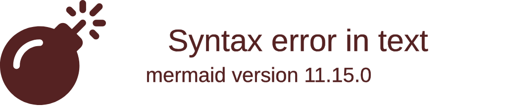
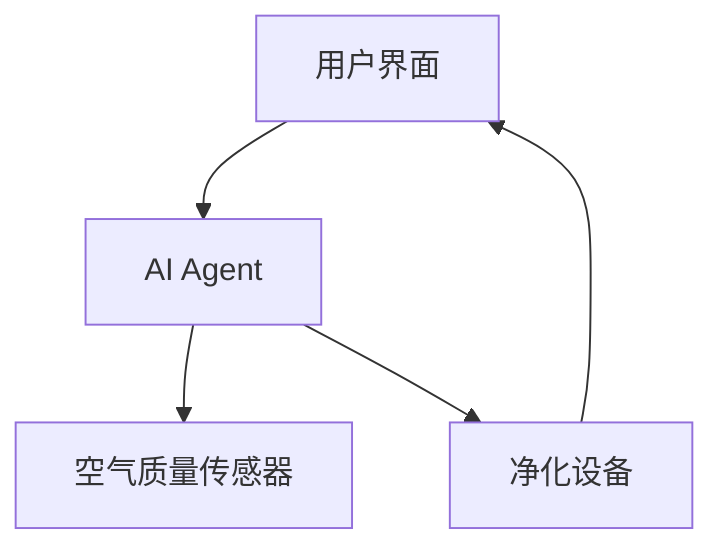
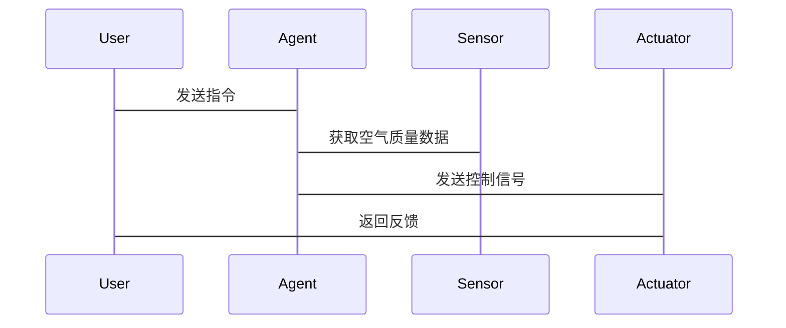

                 


# 智能窗台：AI Agent的室内空气净化优化

> 关键词：AI Agent, 室内空气净化, 强化学习, 系统架构, 项目实战

> 摘要：本文系统地探讨了AI Agent在室内空气净化优化中的应用，从理论基础到实际应用，详细分析了AI Agent的核心算法、系统架构设计以及项目实现。文章通过丰富的图表和代码示例，结合实际案例，全面展示了如何利用AI技术实现高效、智能的室内空气净化优化。

---

# 第一部分: AI Agent与室内空气净化优化背景

## 第1章: AI Agent与室内空气净化优化概述

### 1.1 AI Agent的基本概念

#### 1.1.1 AI Agent的定义与特点
- **定义**: AI Agent（人工智能代理）是一种能够感知环境、自主决策并执行任务的智能实体。
- **特点**: 智能性、自主性、反应性、社会性。
- **应用场景**: 室内空气净化优化、智能家居、机器人控制等。

#### 1.1.2 AI Agent的核心要素与功能
- **核心要素**:
  - **感知**: 通过传感器获取环境数据。
  - **决策**: 基于数据进行分析和优化。
  - **执行**: 执行优化后的操作。
- **功能**:
  - 数据采集与处理。
  - 状态监测与分析。
  - 决策优化与执行。

#### 1.1.3 室内空气净化的背景与需求
- **背景**: 空气污染问题日益严重，室内空气质量直接影响健康。
- **需求**:
  - 实时监测空气质量。
  - 智能调节净化设备。
  - 提供舒适、健康的室内环境。

### 1.2 室内空气净化的挑战与传统解决方案

#### 1.2.1 室内空气污染的主要来源
- **来源**:
  - 甲醛、苯等有害气体。
  - 灰尘、PM2.5等颗粒物。
  - 细菌、病毒等微生物。
- **影响**: 对人体健康造成严重威胁。

#### 1.2.2 传统空气净化技术的局限性
- **技术**:
  - 机械过滤。
  - 活性炭吸附。
  - 紫外线杀菌。
- **局限性**:
  - 单一技术效果有限。
  - 无法实时调整。
  - 缺乏智能性。

#### 1.2.3 AI技术在空气净化中的潜力
- **优势**:
  - 实时感知与优化。
  - 智能决策与执行。
  - 节能高效。

### 1.3 AI Agent在空气净化中的应用前景

#### 1.3.1 AI Agent如何优化空气净化效率
- **实时监测**: 通过传感器获取空气质量数据。
- **智能决策**: 基于数据进行优化。
- **精准控制**: 调节净化设备工作状态。

#### 1.3.2 智能窗台的概念与功能定位
- **概念**: 智能窗台是一种集成AI Agent的室内空气净化系统。
- **功能**:
  - 实时监测室内空气质量。
  - 智能调节净化设备。
  - 提供健康建议。

#### 1.3.3 用户需求与市场潜力分析
- **需求**:
  - 智能化、便捷化。
  - 高效、节能。
  - 定制化服务。
- **市场潜力**: 随着人们对健康的关注增加，智能空气净化市场潜力巨大。

### 1.4 本章小结
本章从AI Agent的基本概念出发，分析了室内空气净化的挑战与传统解决方案的局限性，提出了AI Agent在空气净化中的应用前景。

---

## 第2章: AI Agent与室内空气净化的核心概念

### 2.1 AI Agent的核心原理

#### 2.1.1 信息感知与数据采集
- **信息感知**: 通过传感器获取环境数据。
- **数据采集**: 包括PM2.5、甲醛、CO2等参数。

#### 2.1.2 数据分析与决策优化
- **数据分析**: 使用机器学习算法进行数据建模。
- **决策优化**: 基于模型预测最优解决方案。

#### 2.1.3 动作执行与反馈机制
- **动作执行**: 控制净化设备执行操作。
- **反馈机制**: 根据反馈调整决策。

### 2.2 室内空气净化的系统模型

#### 2.2.1 室内空气质量监测系统
- **系统组成**: 传感器、数据采集模块、数据处理模块。
- **功能**: 实时监测室内空气质量。

#### 2.2.2 空气净化设备的控制模型
- **设备控制**: 基于AI Agent的决策结果控制设备运行。
- **优化策略**: 根据空气质量动态调整设备参数。

#### 2.2.3 用户行为与环境的交互模型
- **用户行为**: 用户对空气净化系统的操作。
- **环境交互**: 系统根据用户行为调整运行状态。

### 2.3 AI Agent与空气净化系统的实体关系

#### 2.3.1 实体关系图（ER图）
```mermaid
erd
    Room: 房间
    Sensor: 传感器
    Agent: AI Agent
    Actuator: 执行器
    User: 用户
    AirQuality: 空气质量
    relation Room-Sensor: 组织关系，每个房间有多个传感器
    relation Sensor-Agent: 指定关系，每个传感器连接到一个AI Agent
    relation Agent-Actuator: 聚合关系，AI Agent控制多个执行器
    relation User-Agent: 关联关系，用户与AI Agent交互
    relation AirQuality-Agent: 关联关系，空气质量数据由AI Agent处理
```

#### 2.3.2 系统功能模块划分


#### 2.3.3 核心概念属性对比表格
| 概念     | 属性           | 描述                                   |
|----------|----------------|--------------------------------------|
| AI Agent | 智能性         | 能够自主决策和优化                   |
| 空气质量 | 监测参数       | PM2.5、甲醛、CO2等                   |
| 执行器   | 控制方式       | 调节风扇转速、启动紫外线灯等         |

### 2.4 本章小结
本章详细讲解了AI Agent的核心原理，分析了室内空气净化系统的模型，并通过ER图和功能模块划分展示了系统的架构。

---

## 第3章: AI Agent与室内空气净化优化的算法原理

### 3.1 强化学习算法在AI Agent中的应用

#### 3.1.1 强化学习的基本原理
- **定义**: 强化学习是一种通过试错机制学习策略的方法。
- **核心要素**:
  - 状态（State）: 当前环境的状态。
  - 动作（Action）: Agent采取的动作。
  - 奖励（Reward）: 执行动作后的反馈。
  - 策略（Policy）: 动作选择的概率分布。
  - 值函数（Value Function）: 对状态或动作-状态对的评估。

#### 3.1.2 Q-learning算法的数学模型
- **数学模型**:
  $$ Q(s,a) = r + \gamma \max_{a'} Q(s',a') $$
  其中：
  - \( Q(s,a) \): 状态s下动作a的Q值。
  - \( r \): 奖励值。
  - \( \gamma \): 折扣因子，取值在0到1之间。

#### 3.1.3 算法实现步骤与代码示例
```python
import numpy as np
from collections import defaultdict
import gym

def q_learning(env, learning_rate=0.1, gamma=0.9, epsilon=0.1):
    Q = defaultdict(lambda: np.zeros(env.action_space.n))
    for episode in range(max_episodes):
        state = env.reset()
        done = False
        while not done:
            if np.random.random() < epsilon:
                action = env.action_space.sample()
            else:
                action = np.argmax(Q[state])
            next_state, reward, done, info = env.step(action)
            if done:
                next_state = None
            Q[state][action] += learning_rate * (reward + gamma * np.max(Q[next_state]) - Q[state][action])
            state = next_state
    return Q

# 示例使用
env = gym.make('CartPole-v0')
Q = q_learning(env, learning_rate=0.1, gamma=0.9, epsilon=0.1)
```

#### 3.1.4 通俗易懂的举例说明
- **例子**: 在室内空气净化场景中，AI Agent通过强化学习算法，根据空气质量状态（如PM2.5浓度）选择最优的动作（如调整风扇转速或启动紫外线灯），并根据反馈（如空气质量改善情况）获得奖励或惩罚，从而不断优化策略。

### 3.2 其他算法的对比与选择

#### 3.2.1 其他算法的对比
- **对比算法**:
  - 监督学习: 数据标签已知，不适合动态环境。
  - 聚类分析: 无法直接应用于决策优化。
  - 强化学习: 适合动态环境下的决策优化。

#### 3.2.2 算法选择的依据
- **动态性**: 环境是否动态变化。
- **实时性**: 是否需要实时决策。
- **复杂性**: 系统的复杂程度。

### 3.3 算法优化与实现细节

#### 3.3.1 算法优化
- **经验回放**: 将历史经验存储起来，随机采样以提高学习效率。
- **网络结构**: 使用深度神经网络替代传统的Q表，提高处理复杂状态的能力。

#### 3.3.2 实现细节
- **数据预处理**: 对空气质量数据进行标准化处理。
- **超参数调整**: 如学习率、折扣因子的设置。
- **训练策略**: 如经验回放、目标网络的使用。

### 3.4 本章小结
本章详细讲解了强化学习算法在AI Agent中的应用，通过数学模型和代码示例展示了算法的实现细节，并通过对比分析选择了最适合室内空气净化优化的算法。

---

## 第4章: AI Agent与室内空气净化优化的系统架构设计

### 4.1 系统架构设计

#### 4.1.1 系统功能设计
- **功能模块**:
  - 数据采集模块: 采集室内空气质量数据。
  - 数据处理模块: 处理数据并生成决策。
  - 设备控制模块: 根据决策控制净化设备。
  - 用户交互模块: 提供用户界面和反馈。

#### 4.1.2 系统架构图


### 4.2 系统接口设计

#### 4.2.1 系统接口
- **输入接口**: 传感器数据输入。
- **输出接口**: 设备控制信号输出。

#### 4.2.2 接口协议
- **常用协议**:
  - HTTP: 用于Web端通信。
  - MQTT: 用于物联网设备间的通信。
  - TCP/IP: 用于本地设备间通信。

### 4.3 系统交互流程

#### 4.3.1 交互流程图


### 4.4 本章小结
本章详细设计了AI Agent与室内空气净化优化系统的架构，包括功能模块、接口设计和交互流程。

---

## 第5章: AI Agent与室内空气净化优化的项目实战

### 5.1 项目需求分析

#### 5.1.1 项目目标
- 实现一个基于AI Agent的智能窗台系统。
- 实现室内空气质量的实时监测与优化。

#### 5.1.2 功能需求
- 实时监测PM2.5、甲醛、CO2等参数。
- 智能调节风扇转速、启动紫外线灯。
- 提供用户友好的交互界面。

### 5.2 环境安装与配置

#### 5.2.1 环境要求
- 操作系统: Linux/Windows/MacOS。
- Python版本: 3.6以上。
- 依赖库: Gym、TensorFlow、Keras。

#### 5.2.2 安装步骤
```bash
pip install gym tensorflow keras
```

### 5.3 核心实现代码

#### 5.3.1 数据采集模块
```python
import serial

def read_sensor():
    ser = serial.Serial('COM3', 9600)
    data = ser.readline().decode().strip()
    ser.close()
    return data
```

#### 5.3.2 数据处理模块
```python
import numpy as np

def process_data(data):
    pm25 = float(data.split(',')[0])
    formaldehyde = float(data.split(',')[1])
    co2 = float(data.split(',')[2])
    return pm25, formaldehyde, co2
```

#### 5.3.3 AI Agent决策模块
```python
def decide_action(pm25, formaldehyde, co2):
    if pm25 > 50 or formaldehyde > 0.1 or co2 > 1000:
        return 'high'
    else:
        return 'low'
```

#### 5.3.4 设备控制模块
```python
def control_actuator(action):
    if action == 'high':
        print('风扇转速调至最高')
    else:
        print('风扇转速调至最低')
```

### 5.4 项目小结
本章通过实际项目展示了AI Agent在室内空气净化优化中的应用，详细讲解了环境安装、代码实现和系统交互流程。

---

## 第6章: 总结与展望

### 6.1 项目总结
- **核心成果**: 实现了一个基于AI Agent的智能窗台系统。
- **技术总结**: 通过强化学习算法实现了室内空气质量的实时优化。

### 6.2 项目经验与教训
- **经验**: 强化学习算法在动态环境中的表现优异。
- **教训**: 系统的实时性需要进一步优化。

### 6.3 未来展望
- **技术改进**: 使用更复杂的深度学习模型。
- **应用场景**: 拓展到更多智能建筑领域。

### 6.4 本章小结
本章总结了项目成果，分析了经验与教训，并展望了未来的技术发展方向。

---

## 作者：AI天才研究院/AI Genius Institute & 禅与计算机程序设计艺术 /Zen And The Art of Computer Programming

