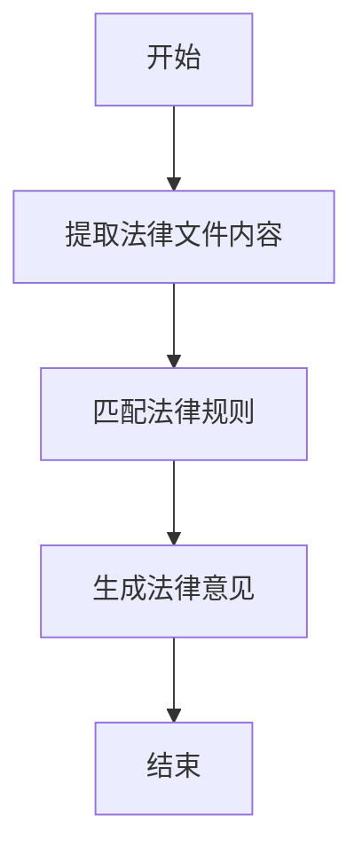
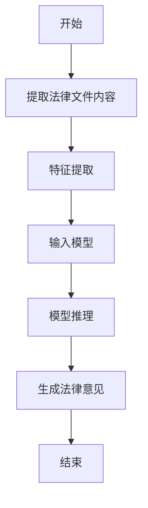
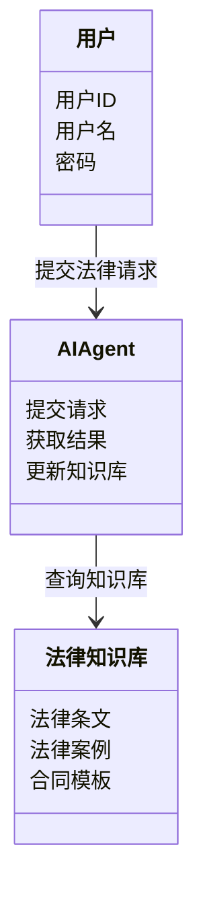
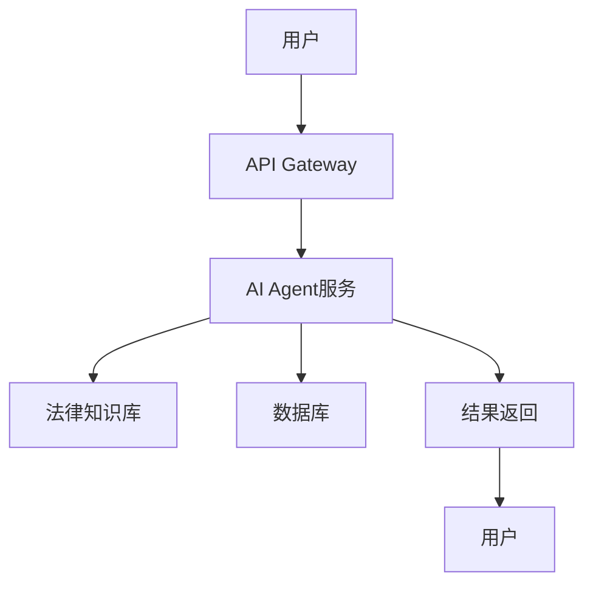
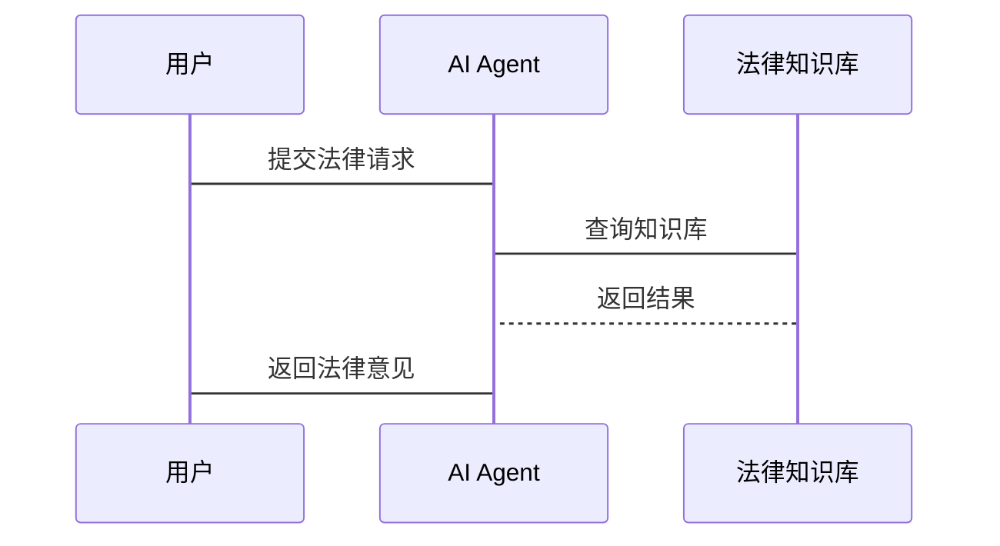

                 


# AI Agent在法律服务中的应用

> 关键词：AI Agent，法律服务，人工智能，法律自动化，智能合同审查

> 摘要：本文深入探讨AI Agent在法律服务中的应用，从核心概念、算法原理到系统设计和项目实战，全面解析AI Agent如何优化法律服务流程，提高效率和准确性。文章通过详细的技术分析和实际案例，展示AI Agent在合同审查、法律咨询等领域的潜力和应用价值。

---

## 第一部分: AI Agent在法律服务中的背景与核心概念

### 第1章: AI Agent的基本概念与法律服务的背景

#### 1.1 问题背景

##### 1.1.1 法律服务的现状与挑战
- **传统法律服务的低效性**：律师需要花费大量时间处理合同审查、法律文件检索等重复性工作，影响效率。
- **法律资源分配不均**：优质法律资源集中在一线城市，偏远地区难以获得。
- **法律服务成本高昂**：高昂的律师费用让中小企业和个人难以负担。

##### 1.1.2 AI技术在法律领域的应用潜力
- **自动化处理**：AI可以自动审查合同、生成法律文件，减少重复劳动。
- **智能检索**：利用自然语言处理技术快速检索相关法律条文和案例。
- **辅助决策**：通过分析案件数据，提供法律意见和风险评估。

##### 1.1.3 AI Agent在法律服务中的定位与作用
- AI Agent作为法律服务的辅助工具，帮助律师提高效率，降低成本。
- AI Agent可以处理合同审查、法律咨询、案件分析等任务，提升服务质量。

#### 1.2 问题描述

##### 1.2.1 法律服务中的重复性工作问题
- 合同审查：律师需要逐条检查合同条款，容易出错且耗时。
- 法律文件检索：手动查找相关法律条文和案例，效率低下。

##### 1.2.2 传统法律服务的效率瓶颈
- 人力成本高：律师费用昂贵，限制了中小企业的法律服务使用。
- 时间成本高：案件处理周期长，影响客户满意度。

##### 1.2.3 法律服务的资源分配不均问题
- 优质法律资源集中于一线城市，偏远地区难以获得高质量的法律服务。

#### 1.3 问题解决

##### 1.3.1 AI Agent如何提高法律服务效率
- **自动化处理**：AI Agent可以快速审查合同，识别潜在风险。
- **智能检索**：通过自然语言处理技术快速检索相关法律条文和案例。
- **辅助决策**：AI Agent可以分析案件数据，提供法律意见和风险评估。

##### 1.3.2 AI Agent在法律服务中的具体应用场景
- 合同审查：AI Agent可以自动审查合同，识别潜在法律风险。
- 法律咨询：AI Agent可以提供初步法律意见，帮助用户了解法律问题。
- 案件分析：AI Agent可以分析案件数据，提供案件预测和策略建议。

##### 1.3.3 AI Agent如何优化法律资源分配
- **远程服务**：AI Agent可以通过在线平台为偏远地区提供法律服务。
- **资源共享**：AI Agent可以整合优质法律资源，提高资源利用效率。

#### 1.4 AI Agent在法律服务中的边界与外延

##### 1.4.1 AI Agent的功能边界
- AI Agent主要用于辅助性工作，如合同审查、法律咨询，不能完全替代律师。
- AI Agent可以处理简单的法律问题，但对于复杂的法律问题仍需人类律师的介入。

##### 1.4.2 法律服务中的人工智能边界
- AI Agent的应用范围主要集中在法律事务的前端处理，如合同审查、文件检索。
- 复杂的法律决策仍需人类律师的判断和决策。

##### 1.4.3 AI Agent的未来发展与外延
- 随着技术进步，AI Agent将能够处理更多复杂的法律事务，如案件预测和策略制定。
- AI Agent将与区块链、物联网等技术结合，推动法律服务的智能化和数字化。

#### 1.5 核心概念结构与组成

##### 1.5.1 AI Agent的定义与组成要素
- AI Agent：一种能够感知环境并采取行动以实现目标的智能体。
- 组成要素：感知模块、推理模块、行动模块、知识库。

##### 1.5.2 法律服务的核心要素
- 法律知识库：包含法律条文、案例、合同模板等。
- 数据处理能力：能够处理法律文件、案件数据。
- 智能决策能力：能够根据数据提供法律意见和决策支持。

##### 1.5.3 AI Agent与法律服务的结合方式
- **知识库集成**：AI Agent通过法律知识库提供法律咨询和合同审查。
- **自动化处理**：AI Agent可以自动处理法律文件，提高效率。
- **人机协作**：AI Agent与人类律师协作，共同完成法律服务。

---

## 第2章: AI Agent的核心概念与联系

### 2.1 核心概念原理

#### 2.1.1 AI Agent的基本原理
- AI Agent通过感知环境、处理数据、采取行动来实现目标。
- 在法律服务中，AI Agent通过分析法律文件、检索法律条文、提供法律意见等方式协助人类律师。

#### 2.1.2 法律服务中的AI Agent工作流程
1. 数据输入：用户上传法律文件或提出法律问题。
2. 数据处理：AI Agent通过自然语言处理技术分析文件内容或问题。
3. 知识库查询：AI Agent查询法律知识库，获取相关法律条文、案例。
4. 推理与决策：AI Agent基于知识库内容和推理算法提供法律意见或决策建议。
5. 输出结果：AI Agent将结果返回给用户或律师。

#### 2.1.3 AI Agent与法律知识库的结合
- 法律知识库是AI Agent的核心资源，包含法律条文、案例、合同模板等。
- AI Agent通过自然语言处理技术，能够快速检索和分析法律知识库中的内容。

### 2.2 核心概念属性对比

#### 2.2.1 AI Agent与传统法律工具的对比

| 特性                | AI Agent                     | 传统法律工具               |
|---------------------|------------------------------|---------------------------|
| 功能                | 自动审查合同、提供法律意见    | 手动审查、检索             |
| 效率                | 高效、快速                    | 低效、耗时                 |
| 智能性               | 具备学习和推理能力            | 无智能性                   |
| 可扩展性             | 可扩展性强                   | 可扩展性有限               |

#### 2.2.2 AI Agent与其他人工智能技术的对比

| 技术                | AI Agent                     | 机器学习                   | 自然语言处理               |
|---------------------|------------------------------|---------------------------|---------------------------|
| 核心功能            | 法律咨询、合同审查            | 数据分析、预测             | 文本理解、生成             |
| 应用场景            | 法律服务                     | 金融、医疗                 | 电商、社交媒体             |
| 优势                | 法律知识库集成                | 数据驱动的预测能力         | 文本处理能力               |

### 2.3 实体关系图架构

```mermaid
er
    %%{title:AI Agent在法律服务中的实体关系图}
    %%{align:center}
    
    班级: AI Agent
    entity: AI Agent
    entity: 用户
    entity: 法律知识库
    entity: 法律服务系统
    relationship: AI Agent与用户交互
    relationship: AI Agent使用法律知识库
    relationship: AI Agent与法律服务系统集成
```

---

## 第3章: AI Agent的算法原理

### 3.1 算法原理讲解

#### 3.1.1 基于规则的推理



#### 3.1.2 基于机器学习的推理



#### 3.1.3 算法实现代码

```python
import tensorflow as tf
from tensorflow.keras import layers

# 模型定义
model = tf.keras.Sequential()
model.add(layers.Embedding(input_dim=10000, output_dim=16))
model.add(layers.SimpleRNN(units=16))
model.add(layers.Dense(1, activation='sigmoid'))

# 模型编译
model.compile(optimizer='adam', loss='binary_crossentropy', metrics=['accuracy'])

# 训练模型
model.fit(x_train, y_train, epochs=10, batch_size=32)
```

#### 3.1.4 数学模型与公式

- **损失函数**：$L = -\frac{1}{N}\sum_{i=1}^{N} y_i \log(p_i) + (1 - y_i)\log(1 - p_i)$
- **优化器**：Adam优化器，$ \theta_{t+1} = \theta_t - \eta \frac{\rho_1}{\sqrt{\rho_2}} g_t $

---

## 第4章: 系统分析与架构设计

### 4.1 问题场景介绍

- **法律服务场景**：律师需要快速审查合同、检索法律条文、提供法律意见。
- **用户需求**：用户希望获得高效、准确的法律服务，降低成本。

### 4.2 系统功能设计

#### 4.2.1 领域模型设计



#### 4.2.2 系统架构设计



#### 4.2.3 系统接口设计

- **API接口**：
  - 提交请求：`POST /api/legal-request`
  - 获取结果：`GET /api/legal-result?id=123`

### 4.3 系统交互设计



---

## 第5章: 项目实战

### 5.1 环境安装

```bash
pip install tensorflow
pip install transformers
pip install mermaid
```

### 5.2 核心代码实现

#### 5.2.1 合同审查模块

```python
from transformers import AutoTokenizer, AutoModelForSequenceClassification

tokenizer = AutoTokenizer.from_pretrained('model_name')
model = AutoModelForSequenceClassification.from_pretrained('model_name')

def review_contract(text):
    inputs = tokenizer(text, return_tensors='np')
    outputs = model(inputs.input_ids)
    prediction = outputs.logits.argmax().item()
    return prediction
```

#### 5.2.2 法律咨询模块

```python
import tensorflow as tf
from tensorflow.keras import layers

model = tf.keras.Sequential()
model.add(layers.Embedding(input_dim=10000, output_dim=16))
model.add(layers.SimpleRNN(units=16))
model.add(layers.Dense(1, activation='sigmoid'))

model.compile(optimizer='adam', loss='binary_crossentropy', metrics=['accuracy'])
model.load_weights('legal_advice_model.h5')
```

### 5.3 实际案例分析

- **案例1**：合同审查
  - 用户上传一份商业合同，AI Agent自动审查合同条款，识别潜在风险。
- **案例2**：法律咨询
  - 用户提出法律问题，AI Agent通过自然语言处理技术提供初步法律意见。

### 5.4 项目小结

- **实现功能**：合同审查、法律咨询、案件分析。
- **技术优势**：提高效率、降低成本、优化资源分配。
- **改进建议**：优化模型性能、增加更多法律知识库内容、提升用户体验。

---

## 第6章: 最佳实践、小结、注意事项、拓展阅读

### 6.1 最佳实践

- **数据隐私保护**：确保用户数据的安全性和隐私性。
- **模型可解释性**：提高AI Agent的可解释性，便于用户理解和信任。
- **持续学习**：定期更新法律知识库，保持模型的准确性和时效性。

### 6.2 小结

- AI Agent在法律服务中的应用前景广阔，能够显著提高法律服务的效率和准确性。
- 通过人机协作，AI Agent可以帮助律师更好地服务于客户，降低成本，优化资源分配。

### 6.3 注意事项

- **数据隐私**：确保用户数据的安全性和隐私性。
- **模型局限性**：AI Agent在处理复杂法律问题时仍需人类律师的介入。
- **技术依赖**：法律服务对AI技术的依赖性较强，需注意技术风险。

### 6.4 拓展阅读

- **书籍推荐**：《人工智能：一种现代的方法》
- **论文推荐**：《基于深度学习的法律文本分析研究》
- **技术博客**：TechCrunch、Medium上的相关技术文章

---

## 作者

作者：AI天才研究院/AI Genius Institute & 禅与计算机程序设计艺术/Zen And The Art of Computer Programming

---

感谢您的阅读！希望本文对您了解AI Agent在法律服务中的应用有所帮助。

