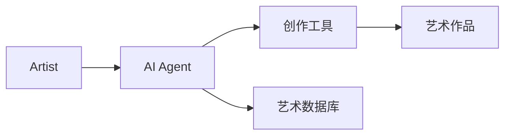
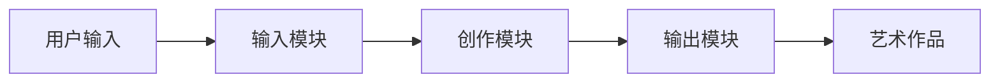
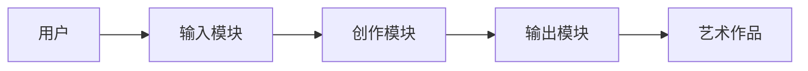

                 


# AI Agent在艺术创作中的应用

> 关键词：AI Agent, 艺术创作, 生成对抗网络, 强化学习, 深度学习

> 摘要：  
本文探讨了AI Agent在艺术创作中的应用，从背景介绍、核心概念、算法原理到系统设计和项目实战，全面分析了AI Agent如何赋能艺术创作。文章通过详细的技术分析和实际案例，展示了AI Agent在艺术创作中的潜力和实际应用价值，为艺术创作者和技术开发者提供了深刻的见解和实践指导。

---

# 第一部分: AI Agent在艺术创作中的应用背景

# 第1章: AI Agent与艺术创作的背景介绍

## 1.1 AI Agent的基本概念
### 1.1.1 AI Agent的定义与特点
AI Agent（人工智能代理）是指具有感知环境、自主决策和执行任务能力的智能体。它能够通过与用户的交互或环境的反馈，优化创作过程并生成高质量的艺术作品。AI Agent的核心特点包括：
- **智能性**：能够理解用户需求和创作意图。
- **自主性**：能够在没有人工干预的情况下完成创作任务。
- **适应性**：能够根据反馈不断优化创作结果。

### 1.1.2 AI Agent的核心要素与功能
AI Agent在艺术创作中的核心要素包括：
- **感知模块**：通过输入的艺术数据（如图像、文本）提取创作灵感。
- **决策模块**：基于感知结果生成创作策略。
- **执行模块**：通过艺术创作工具生成最终作品。

### 1.1.3 AI Agent在艺术创作中的角色定位
AI Agent在艺术创作中扮演的角色包括：
- **创作助手**：帮助艺术家快速生成灵感和初稿。
- **优化工具**：通过算法优化创作过程和结果。
- **独立创作者**：在无监督学习中生成完全由AI创作的艺术作品。

## 1.2 艺术创作的数字化转型
### 1.2.1 传统艺术创作的局限性
传统艺术创作依赖艺术家的个人经验和技巧，创作效率较低，且难以快速适应多样化的需求。

### 1.2.2 数字化工具对艺术创作的影响
数字化工具（如Photoshop、AI绘画软件）的出现，大大提高了艺术创作的效率和精准度，但仍然需要艺术家的大量手动操作。

### 1.2.3 AI技术如何赋能艺术创作
AI技术通过模拟人类的创造力和艺术感，帮助艺术家突破传统创作的限制，实现更高效、多样化的艺术表达。

## 1.3 AI Agent在艺术创作中的应用背景
### 1.3.1 当前艺术创作的技术趋势
随着深度学习和生成对抗网络（GAN）的快速发展，AI技术在艺术创作中的应用越来越广泛。

### 1.3.2 AI Agent在艺术领域的潜力
AI Agent可以通过生成高质量的艺术作品、优化创作流程、提供创作建议等方式，为艺术创作带来革命性的变化。

### 1.3.3 本章小结
本章通过介绍AI Agent的基本概念、艺术创作的数字化转型以及AI技术对艺术创作的赋能作用，为后续章节的深入分析奠定了基础。

---

# 第2章: AI Agent的核心概念与原理

## 2.1 AI Agent的定义与分类
### 2.1.1 AI Agent的定义
AI Agent是一种能够感知环境、自主决策并执行任务的智能体，其核心能力包括感知、决策和执行。

### 2.1.2 AI Agent的分类与应用场景
AI Agent可以分为以下几类：
- **基于规则的AI Agent**：通过预定义的规则进行创作。
- **基于学习的AI Agent**：通过深度学习模型进行创作。
- **基于推理的AI Agent**：通过逻辑推理生成创作策略。

### 2.1.3 AI Agent与传统艺术创作工具的对比
AI Agent的优势在于其智能化和自主性，能够根据用户需求动态调整创作策略，而传统工具则依赖于人工操作。

## 2.2 AI Agent的基本原理
### 2.2.1 AI Agent的感知与理解能力
AI Agent通过深度学习模型（如卷积神经网络CNN）感知艺术创作中的视觉元素，理解用户的创作意图。

### 2.2.2 AI Agent的创作与生成能力
AI Agent通过生成对抗网络（GAN）等技术生成高质量的艺术作品，优化创作结果。

### 2.2.3 AI Agent的优化与学习能力
AI Agent通过强化学习（Reinforcement Learning）不断优化创作策略，提升创作质量。

## 2.3 AI Agent在艺术创作中的核心算法
### 2.3.1 基于深度学习的图像生成算法
- **GAN（生成对抗网络）**：由生成器和判别器组成，通过对抗训练生成逼真的艺术作品。
  ```mermaid
  graph LR
      A[生成器] --> B[判别器]
      B --> C[损失函数]
      C --> D[优化器]
  ```

### 2.3.2 基于强化学习的创作优化算法
- **强化学习**：通过奖励机制优化创作策略。
  ```mermaid
  graph LR
      A[状态] --> B[动作]
      B --> C[奖励]
      C --> D[策略优化]
  ```

### 2.3.3 基于自然语言处理的创作指导算法
- **自然语言处理**：通过NLP技术理解用户的创作意图，生成创作建议。

## 2.4 AI Agent的实体关系图


## 2.5 本章小结
本章通过分析AI Agent的核心概念和算法原理，揭示了其在艺术创作中的技术基础和实现路径。

---

# 第3章: AI Agent的算法原理与实现

## 3.1 基于深度学习的图像生成算法
### 3.1.1 GAN（生成对抗网络）原理
- GAN由生成器和判别器组成，通过对抗训练生成逼真的图像。
  ```mermaid
  graph LR
      A[生成器] --> B[判别器]
      B --> C[损失函数]
      C --> D[优化器]
  ```

### 3.1.2 GAN在艺术创作中的应用
- **案例**：生成抽象画作或数字艺术作品。
- **代码实现**：
  ```python
  import torch
  import torch.nn as nn
  import torch.optim as optim

  class Generator(nn.Module):
      def __init__(self):
          super(Generator, self).__init__()
          self.main = nn.Sequential(
              nn.ConvTranspose2d(100, 50, 4, stride=2, padding=1),
              nn.ReLU(),
              nn.ConvTranspose2d(50, 3, 4, stride=2, padding=1),
              nn.Tanh()
          )

      def forward(self, x):
          return self.main(x)

  class Discriminator(nn.Module):
      def __init__(self):
          super(Discriminator, self).__init__()
          self.main = nn.Sequential(
              nn.Conv2d(3, 50, 4, stride=2, padding=1),
              nn.ReLU(),
              nn.Conv2d(50, 100, 4, stride=2, padding=1),
              nn.ReLU(),
              nn.Conv2d(100, 1, 1, stride=1, padding=0),
              nn.Sigmoid()
          )

      def forward(self, x):
          return self.main(x)

  # 初始化网络
  generator = Generator()
  discriminator = Discriminator()
  criterion = nn.BCELoss()
  optimizer_g = optim.Adam(generator.parameters(), lr=0.0002)
  optimizer_d = optim.Adam(discriminator.parameters(), lr=0.0002)
  ```

### 3.1.3 GAN的优缺点分析
- **优点**：生成质量高，能够创作出独特的艺术风格。
- **缺点**：训练过程不稳定，容易陷入模式崩溃。

## 3.2 基于强化学习的创作优化算法
### 3.2.1 强化学习的基本原理
- 强化学习通过奖励机制优化创作策略。
  ```mermaid
  graph LR
      A[状态] --> B[动作]
      B --> C[奖励]
      C --> D[策略优化]
  ```

### 3.2.2 强化学习在艺术创作中的应用
- **案例**：优化绘画的笔触和色彩搭配。
- **代码实现**：
  ```python
  import torch
  import torch.nn as nn
  import torch.optim as optim

  class PolicyNetwork(nn.Module):
      def __init__(self):
          super(PolicyNetwork, self).__init__()
          self.fc = nn.Sequential(
              nn.Linear(100, 256),
              nn.ReLU(),
              nn.Linear(256, 64),
              nn.ReLU(),
              nn.Linear(64, 2)
          )

      def forward(self, x):
          return self.fc(x)

  policy = PolicyNetwork()
  optimizer = optim.Adam(policy.parameters(), lr=0.001)
  ```

### 3.2.3 强化学习的优缺点分析
- **优点**：能够通过反馈不断优化创作策略。
- **缺点**：训练时间长，需要大量反馈数据。

## 3.3 基于自然语言处理的创作指导算法
### 3.3.1 NLP技术在艺术创作中的应用
- **案例**：根据用户描述生成绘画风格建议。

### 3.3.2 NLP算法实现
- **模型**：使用Transformer架构进行文本生成。
  ```python
  import torch
  import torch.nn as nn
  import torch.optim as optim

  class TransformerModel(nn.Module):
      def __init__(self, vocab_size):
          super(TransformerModel, self).__init__()
          self.embedding = nn.Embedding(vocab_size, 512)
          self.transformer = nn.TransformerEncoder(
              nn.TransformerEncoderLayer(512, 8),
              num_layers=2
          )
          self.fc = nn.Linear(512, vocab_size)

      def forward(self, x):
          embed = self.embedding(x)
          out = self.transformer(embed)
          out = self.fc(out)
          return out

  model = TransformerModel(10000)
  optimizer = optim.Adam(model.parameters(), lr=0.0001)
  ```

### 3.3.3 NLP算法的优缺点分析
- **优点**：能够理解和生成人类语言，提供创作建议。
- **缺点**：文本生成的质量受限于训练数据和模型能力。

## 3.4 本章小结
本章通过详细讲解GAN、强化学习和NLP等算法的原理和实现，揭示了AI Agent在艺术创作中的技术基础。

---

# 第4章: AI Agent的系统分析与架构设计

## 4.1 艺术创作的场景分析
- **用户需求**：艺术家希望通过AI Agent快速生成灵感和初稿。
- **技术需求**：系统需要支持多种艺术创作形式，如绘画、音乐、文本等。

## 4.2 系统功能设计
### 4.2.1 功能模块划分
- **输入模块**：接收用户的创作需求。
- **创作模块**：通过AI算法生成艺术作品。
- **输出模块**：展示生成的艺术作品。

### 4.2.2 功能流程设计


## 4.3 系统架构设计
### 4.3.1 模块划分与交互


### 4.3.2 数据流设计
- 数据流包括用户输入、创作数据和生成结果。

## 4.4 系统接口设计
### 4.4.1 输入接口
- 支持文本、图像等多种输入形式。

### 4.4.2 输出接口
- 支持多种艺术形式的输出，如图像、音乐等。

## 4.5 本章小结
本章通过分析艺术创作的场景，设计了一个完整的AI Agent系统架构，为后续的实现提供了框架支持。

---

# 第5章: AI Agent在艺术创作中的项目实战

## 5.1 项目背景与目标
- **项目背景**：开发一个基于AI Agent的绘画工具。
- **项目目标**：实现从用户输入到艺术作品生成的完整流程。

## 5.2 项目环境与工具安装
### 5.2.1 环境要求
- Python 3.8+
- PyTorch 1.9+
-其他依赖库：numpy、pillow、matplotlib。

### 5.2.2 工具安装
- 安装依赖库：
  ```bash
  pip install numpy pillow matplotlib torch torchvision
  ```

## 5.3 系统核心实现
### 5.3.1 创作模块实现
- 使用GAN生成绘画作品。
  ```python
  import torch
  import torch.nn as nn
  import torch.optim as optim
  import numpy as np
  from PIL import Image

  class GAN:
      def __init__(self, input_dim=100):
          self.generator = Generator(input_dim)
          self.discriminator = Discriminator(3)
          self.g_optimizer = optim.Adam(self.generator.parameters(), lr=0.0002)
          self.d_optimizer = optim.Adam(self.discriminator.parameters(), lr=0.0002)
          self.criterion = nn.BCELoss()

      def train(self, real_images, num_epochs=100):
          for epoch in range(num_epochs):
              # 训练判别器
              self.d_optimizer.zero_grad()
              d_real_labels = torch.ones(real_images.size(0), 1).to(device)
              d_real_output = self.discriminator(real_images)
              d_real_loss = self.criterion(d_real_output, d_real_labels)

              noise = torch.randn(real_images.size(0), 100, 1, 1).to(device)
              fake_images = self.generator(noise)
              d_fake_labels = torch.zeros(fake_images.size(0), 1).to(device)
              d_fake_output = self.discriminator(fake_images.detach())
              d_fake_loss = self.criterion(d_fake_output, d_fake_labels)

              d_total_loss = d_real_loss + d_fake_loss
              d_total_loss.backward()
              self.d_optimizer.step()

              # 训练生成器
              self.g_optimizer.zero_grad()
              g_labels = torch.ones(fake_images.size(0), 1).to(device)
              g_loss = self.criterion(d_fake_output, g_labels)
              g_loss.backward()
              self.g_optimizer.step()

  # 示例使用
  gan = GAN()
  real_images = torch.randn(32, 3, 64, 64).to(device)
  gan.train(real_images)
  ```

### 5.3.2 系统交互设计
- 用户输入创作需求，系统生成艺术作品。

## 5.4 项目实战案例分析
### 5.4.1 案例描述
- 用户输入“抽象画”，系统生成一幅抽象画作。

### 5.4.2 案例分析
- **生成结果**：抽象画作符合用户的创作意图。
- **优缺点**：生成质量高，但创作过程缺乏用户参与感。

## 5.5 本章小结
本章通过一个具体的项目案例，展示了AI Agent在艺术创作中的实际应用，为后续的优化和改进提供了参考。

---

# 第6章: AI Agent在艺术创作中的最佳实践与小结

## 6.1 最佳实践
- **数据准备**：确保训练数据的多样性和高质量。
- **模型优化**：通过调整超参数和优化算法提升生成质量。
- **用户反馈**：结合用户反馈不断优化创作策略。

## 6.2 小结
本文通过详细分析AI Agent在艺术创作中的背景、核心概念、算法原理和系统设计，展示了AI技术对艺术创作的深远影响。AI Agent不仅能够辅助艺术家创作，还能够独立生成高质量的艺术作品。

## 6.3 未来展望
随着AI技术的不断发展，AI Agent在艺术创作中的应用将更加广泛，创作形式也将更加多样化。未来的艺术创作将是一个人机协作的全新领域。

---

# 作者：AI天才研究院/AI Genius Institute & 禅与计算机程序设计艺术 /Zen And The Art of Computer Programming

