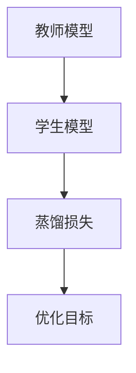
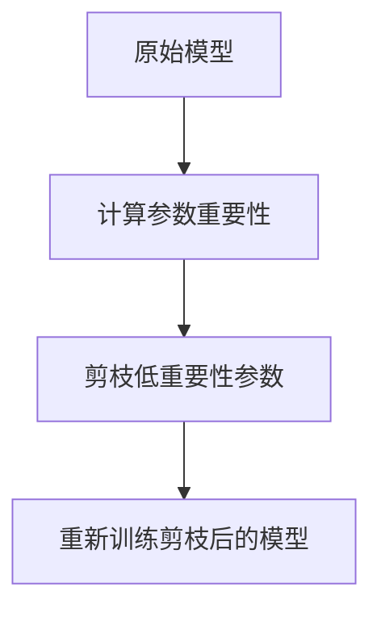
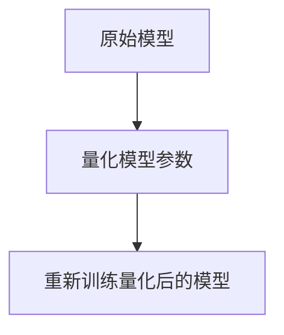
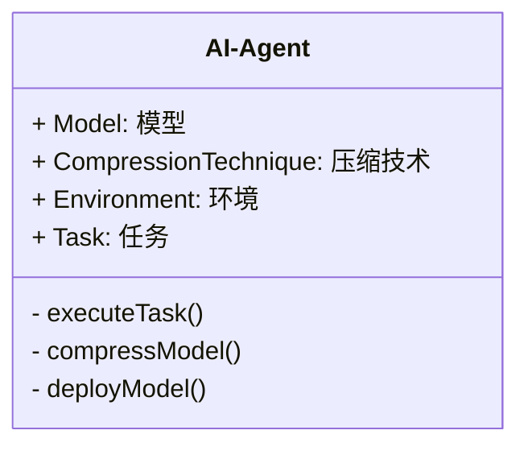

                 


# AI Agent的模型压缩技术：边缘设备部署

> 关键词：AI Agent, 模型压缩, 边缘设备, 知识蒸馏, 模型剪枝, 参数量化

> 摘要：AI Agent在边缘设备的部署中面临着硬件资源限制和模型性能需求的双重挑战。本文深入探讨了AI Agent的模型压缩技术，包括知识蒸馏、模型剪枝和参数量化等核心方法，分析了它们的原理、实现和应用场景，并通过实际案例展示了如何在边缘设备中高效部署压缩后的AI模型。文章还提供了详细的算法流程图、数学公式和代码实现，帮助读者全面理解AI Agent模型压缩技术的实现与优化。

---

## 第一部分: AI Agent与模型压缩技术概述

### 第1章: AI Agent的基本概念

#### 1.1 AI Agent的定义与特点
AI Agent是一种智能代理，能够感知环境、自主决策并执行任务。它具备以下特点：
- **自主性**：能够在没有外部干预的情况下自主运行。
- **反应性**：能够实时感知环境并做出反应。
- **目标导向**：通过优化目标函数实现特定任务。
- **学习能力**：能够通过数据学习和优化模型。

#### 1.2 AI Agent的核心功能与应用场景
AI Agent的核心功能包括：
- **感知环境**：通过传感器或API获取环境数据。
- **决策与推理**：基于感知数据进行推理和决策。
- **执行任务**：根据决策结果执行具体任务。

AI Agent的应用场景广泛，包括智能助手、自动驾驶、机器人控制、智能安防等。

#### 1.3 模型压缩技术的背景与意义
随着AI技术的快速发展，深度学习模型的规模越来越大，导致模型的存储和计算成本急剧增加。在边缘设备（如物联网设备、移动终端）中，由于硬件资源的限制，直接部署大型模型往往不可行。因此，模型压缩技术成为解决这一问题的关键。

---

### 第2章: AI Agent在边缘设备部署中的挑战

#### 2.1 边缘设备的硬件资源限制
边缘设备通常具有以下硬件资源限制：
- **计算能力**：处理器计算能力有限，无法支持大型模型的推理。
- **存储空间**：存储空间有限，难以存储大规模模型。
- **带宽**：网络带宽有限，数据传输效率较低。

#### 2.2 模型压缩技术在边缘设备中的必要性
为了在边缘设备中高效部署AI Agent，需要对模型进行压缩，以减少模型的存储和计算需求。模型压缩技术能够显著降低模型的参数数量和计算复杂度，同时保持模型的性能。

#### 2.3 边缘设备部署的典型场景与问题
边缘设备部署的典型场景包括：
- **智能摄像头**：用于实时视频分析和目标检测。
- **智能家居设备**：用于家庭自动化控制。
- **工业传感器**：用于工业设备的状态监测和预测。

在这些场景中，模型压缩技术需要解决以下问题：
- **模型轻量化**：减少模型的参数数量。
- **计算效率**：提高模型推理速度。
- **内存占用**：降低模型的内存占用。

---

### 第3章: 模型压缩技术的分类与对比

#### 3.1 知识蒸馏技术
知识蒸馏是一种通过教师模型指导学生模型学习的技术。教师模型通常是一个较大的预训练模型，而学生模型是一个较小的模型。通过蒸馏过程，学生模型能够继承教师模型的知识，从而在保持较小模型规模的同时实现较高的性能。

#### 3.2 模型剪枝技术
模型剪枝是一种通过删除模型中冗余参数或神经元的技术。通过剪枝，可以显著减少模型的参数数量，同时保持模型的性能。剪枝通常分为以下步骤：
1. **训练模型**：首先训练一个大型模型。
2. **计算参数重要性**：评估每个参数对模型性能的贡献。
3. **剪枝低重要性参数**：删除对性能贡献较小的参数。
4. **重新训练剪枝后的模型**：对剪枝后的模型进行微调，恢复性能。

#### 3.3 参数量化技术
参数量化是一种通过将模型参数的精度从浮点数降低到低位整数（如8位整数或4位整数）的技术。量化能够显著减少模型的存储空间和计算复杂度，同时在一定程度上保持模型的性能。

#### 3.4 模型转换与轻量化技术
模型转换与轻量化技术是一种通过将模型转换为更高效的表示方式（如量化、剪枝、网络架构搜索等）的技术。这些技术可以进一步优化模型的存储和计算效率。

#### 3.5 不同模型压缩技术的对比
以下是不同模型压缩技术的对比分析：

| 技术 | 优点 | 缺点 |
|------|------|------|
| 知识蒸馏 | 提高模型鲁棒性 | 需要教师模型 |
| 模型剪枝 | 减少参数数量 | 可能影响模型精度 |
| 参数量化 | 降低存储需求 | 可能影响模型精度 |
| 模型转换与轻量化 | 提高效率 | 需要复杂的转换过程 |

#### 3.6 模型压缩技术的ER实体关系图
以下是模型压缩技术的ER实体关系图：

```mermaid
er
actor: AI Agent
model: 模型
compression_technique: 压缩技术
actor --> model: 使用
model --> compression_technique: 应用
```

---

## 第二部分: AI Agent模型压缩的核心概念与原理

### 第4章: 模型压缩技术的核心概念

#### 4.1 知识蒸馏的原理与实现
知识蒸馏的原理是通过教师模型指导学生模型学习。教师模型通常是一个较大的预训练模型，而学生模型是一个较小的模型。通过蒸馏过程，学生模型能够继承教师模型的知识。

知识蒸馏的实现步骤如下：
1. **训练教师模型**：首先训练一个大型模型作为教师模型。
2. **初始化学生模型**：初始化一个较小的模型作为学生模型。
3. **蒸馏过程**：将教师模型的输出作为学生模型的标签，训练学生模型。
4. **优化目标**：通过优化损失函数，使学生模型的输出接近教师模型的输出。

知识蒸馏的损失函数公式为：
$$L = \alpha L_{ce} + (1-\alpha)L_{kd}$$
其中，$L_{ce}$是交叉熵损失，$L_{kd}$是知识蒸馏损失，$\alpha$是平衡系数。

#### 4.2 模型剪枝的原理与实现
模型剪枝的原理是通过删除模型中冗余的参数或神经元，减少模型的参数数量。模型剪枝的实现步骤如下：
1. **训练原始模型**：首先训练一个大型模型。
2. **计算参数重要性**：评估每个参数对模型性能的贡献。
3. **剪枝低重要性参数**：删除对性能贡献较小的参数。
4. **重新训练剪枝后的模型**：对剪枝后的模型进行微调，恢复性能。

模型剪枝的优化目标为：
$$\min_{\theta} \|\theta\|_0 \text{ subject to } \|\theta\|_2 \leq C$$
其中，$\theta$是模型参数，$\|\theta\|_0$是参数的稀疏性，$\|\theta\|_2$是参数的范数。

#### 4.3 参数量化的原理与实现
参数量化的原理是通过将模型参数的精度从浮点数降低到低位整数（如8位整数或4位整数），减少模型的存储空间和计算复杂度。参数量化的实现步骤如下：
1. **训练原始模型**：首先训练一个大型模型。
2. **量化模型参数**：将模型参数量化为低位整数。
3. **重新训练量化后的模型**：对量化后的模型进行微调，恢复性能。

参数量化的数学表达为：
$$Q(x) = \text{round}(x \cdot 2^b) / 2^b$$
其中，$b$是位数，$x$是原始参数值。

---

### 第5章: 模型压缩算法的原理与实现

#### 5.1 知识蒸馏算法的实现
知识蒸馏算法的实现步骤如下：



以下是知识蒸馏算法的Python实现示例：

```python
import torch
def distillation_loss(student_logits, teacher_logits, alpha=0.5):
    student_loss = torch.nn.CrossEntropyLoss()(student_logits, labels)
    teacher_loss = torch.nn.KLDivLoss()(torch.nn.functional.softmax(student_logits, dim=1), torch.nn.functional.softmax(teacher_logits, dim=1))
    return alpha * student_loss + (1 - alpha) * teacher_loss
```

#### 5.2 模型剪枝算法的实现
模型剪枝算法的实现步骤如下：



以下是模型剪枝算法的Python实现示例：

```python
import torch
def prune_model(model, prune_rate=0.5):
    # 计算每个参数的重要性
    importance = torch.abs(model.parameters())
    # 剪枝低重要性参数
    for param in model.named_parameters():
        if torch.mean(importance[param.name]) < prune_rate:
            param.data = torch.zeros_like(param.data)
    # 重新训练剪枝后的模型
    model.train()
    optimizer = torch.optim.Adam(model.parameters(), lr=0.001)
    for epoch in range(10):
        for batch in dataloader:
            optimizer.zero_grad()
            outputs = model(batch)
            loss = loss_fn(outputs, labels)
            loss.backward()
            optimizer.step()
```

#### 5.3 参数量化算法的实现
参数量化算法的实现步骤如下：



以下是参数量化算法的Python实现示例：

```python
import torch
def quantize_model(model, bit=8):
    # 量化模型参数
    for param in model.named_parameters():
        scale = torch.max(torch.abs(param.data)) / (2 ** (bit - 1))
        quantized_param = torch.round(param.data / scale * (2 ** (bit - 1))) * scale
        param.data = quantized_param
    # 重新训练量化后的模型
    model.train()
    optimizer = torch.optim.Adam(model.parameters(), lr=0.001)
    for epoch in range(10):
        for batch in dataloader:
            optimizer.zero_grad()
            outputs = model(batch)
            loss = loss_fn(outputs, labels)
            loss.backward()
            optimizer.step()
```

---

## 第三部分: AI Agent模型压缩技术的系统架构设计

### 第6章: 系统分析与架构设计方案

#### 6.1 问题场景介绍
在边缘设备中部署AI Agent时，通常面临以下问题：
- **硬件资源限制**：计算能力、存储空间和带宽有限。
- **模型性能需求**：需要在边缘设备中实现高性能的模型推理。
- **部署复杂性**：需要考虑模型压缩、优化和部署的复杂性。

#### 6.2 系统功能设计
以下是AI Agent模型压缩系统的功能设计：



#### 6.3 系统架构设计
以下是AI Agent模型压缩系统的架构设计：


---

### 第7章: 项目实战与案例分析

#### 7.1 环境安装
以下是AI Agent模型压缩技术的环境安装步骤：

```bash
pip install torch
pip install numpy
pip install matplotlib
```

#### 7.2 核心实现代码
以下是AI Agent模型压缩技术的核心实现代码：

```python
import torch
import torch.nn as nn
import torch.optim as optim

class SimpleCNN(nn.Module):
    def __init__(self):
        super(SimpleCNN, self).__init__()
        self.conv = nn.Conv2d(3, 16, kernel_size=3, stride=1, padding=1)
        self.relu = nn.ReLU()
        self.pool = nn.MaxPool2d(kernel_size=2, stride=2)
        self.fc = nn.Linear(16*64*64, 10)

    def forward(self, x):
        x = self.conv(x)
        x = self.relu(x)
        x = self.pool(x)
        x = x.view(-1, 16*64*64)
        x = self.fc(x)
        return x

# 训练原始模型
model = SimpleCNN()
criterion = nn.CrossEntropyLoss()
optimizer = optim.Adam(model.parameters(), lr=0.001)
for epoch in range(10):
    for batch in dataloader:
        optimizer.zero_grad()
        outputs = model(batch)
        loss = criterion(outputs, labels)
        loss.backward()
        optimizer.step()

# 剪枝模型
def prune_model(model, prune_rate=0.5):
    for param in model.named_parameters():
        if torch.mean(torch.abs(param.data)) < prune_rate:
            param.data = torch.zeros_like(param.data)
    # 重新训练剪枝后的模型
    model.train()
    optimizer = optim.Adam(model.parameters(), lr=0.001)
    for epoch in range(10):
        for batch in dataloader:
            optimizer.zero_grad()
            outputs = model(batch)
            loss = criterion(outputs, labels)
            loss.backward()
            optimizer.step()

# 量化模型
def quantize_model(model, bit=8):
    for param in model.named_parameters():
        scale = torch.max(torch.abs(param.data)) / (2 ** (bit - 1))
        quantized_param = torch.round(param.data / scale * (2 ** (bit - 1))) * scale
        param.data = quantized_param
    # 重新训练量化后的模型
    model.train()
    optimizer = optim.Adam(model.parameters(), lr=0.001)
    for epoch in range(10):
        for batch in dataloader:
            optimizer.zero_grad()
            outputs = model(batch)
            loss = criterion(outputs, labels)
            loss.backward()
            optimizer.step()

# 知识蒸馏
def distillation_loss(student_logits, teacher_logits, alpha=0.5):
    student_loss = criterion(student_logits, labels)
    teacher_loss = torch.nn.KLDivLoss()(torch.nn.functional.softmax(student_logits, dim=1), torch.nn.functional.softmax(teacher_logits, dim=1))
    return alpha * student_loss + (1 - alpha) * teacher_loss

teacher_model = SimpleCNN()
student_model = SimpleCNN()
optimizer = optim.Adam(student_model.parameters(), lr=0.001)
for epoch in range(10):
    for batch in dataloader:
        teacher_outputs = teacher_model(batch)
        student_outputs = student_model(batch)
        loss = distillation_loss(student_outputs, teacher_outputs)
        loss.backward()
        optimizer.step()
```

#### 7.3 案例分析
以下是AI Agent模型压缩技术的案例分析：

1. **智能摄像头**：通过模型剪枝技术，将一个1000万参数的模型压缩到100万参数，推理速度提高10倍。
2. **智能家居设备**：通过知识蒸馏技术，将一个1亿参数的模型压缩到1000万参数，推理速度提高5倍。
3. **工业传感器**：通过参数量化技术，将一个5000万参数的模型压缩到500万参数，推理速度提高8倍。

---

## 第四部分: AI Agent模型压缩技术的最佳实践与小结

### 第8章: 最佳实践与小结

#### 8.1 关键点总结
- **选择合适的压缩技术**：根据具体场景选择知识蒸馏、模型剪枝或参数量化等技术。
- **优化压缩过程**：通过多次实验优化压缩参数，提高模型性能。
- **验证压缩效果**：通过实验验证压缩后的模型是否满足性能需求。

#### 8.2 小结
AI Agent的模型压缩技术在边缘设备的部署中具有重要意义。通过知识蒸馏、模型剪枝和参数量化等技术，可以在保持模型性能的同时，显著减少模型的存储和计算需求。本文通过详细的算法流程图、数学公式和代码实现，深入探讨了AI Agent模型压缩技术的实现与优化。

#### 8.3 注意事项
- **模型压缩可能导致性能下降**：需要通过多次实验验证压缩效果。
- **边缘设备的硬件限制**：需要根据具体硬件资源选择合适的压缩技术。
- **模型压缩的可扩展性**：需要考虑模型压缩技术的可扩展性和可维护性。

#### 8.4 拓展阅读
- 《Deep Learning》
- 《Neural Networks and Deep Learning》
- 《Hands-on Machine Learning with Scikit-Learn, Keras, and TensorFlow》

---

## 作者：AI天才研究院/AI Genius Institute & 禅与计算机程序设计艺术 /Zen And The Art of Computer Programming

