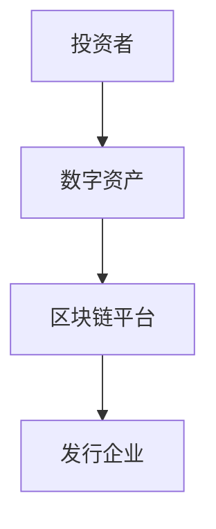
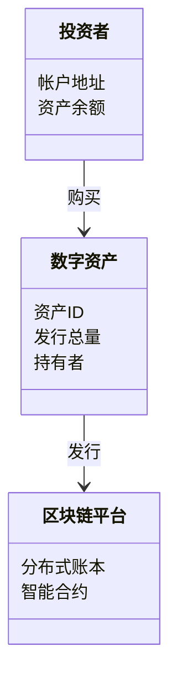
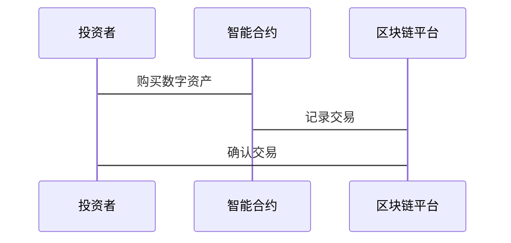

                 


# 企业估值中的区块链数字资产证券化平台评估

> 关键词：区块链，企业估值，数字资产，证券化，智能合约，分布式账本

> 摘要：区块链技术在企业估值中的应用正在改变传统金融市场的格局。数字资产证券化平台通过区块链技术实现了资产的透明化、去中心化和高效流通。本文详细分析了区块链数字资产证券化平台的评估方法，探讨了其在企业估值中的应用潜力，并通过实际案例展示了平台的实现过程和评估流程。

---

# 第一部分: 区块链数字资产证券化平台概述

## 第1章: 企业估值与区块链数字资产证券化概述

### 1.1 企业估值的基本概念

#### 1.1.1 企业估值的定义与方法
企业估值是通过对企业的财务状况、市场表现、管理团队等因素进行综合分析，以确定其市场价值的过程。传统的企业估值方法包括市盈率法、现金流折现法等，但这些方法往往依赖于主观判断，存在信息不对称和数据不透明的问题。

#### 1.1.2 区块链技术在企业估值中的应用潜力
区块链技术通过去中心化、不可篡改和透明性等特性，为企业估值提供了新的可能性。区块链可以确保企业数据的真实性，减少信息不对称，提高估值的准确性。

#### 1.1.3 数字资产证券化的定义与特点
数字资产证券化是指将传统资产（如股权、债权等）转化为数字形式的资产，并通过区块链技术进行流转和交易。数字资产证券化具有流动性高、成本低、透明性好等优点。

---

### 1.2 区块链技术的核心优势

#### 1.2.1 区块链的基本原理
区块链是一种分布式账本技术，通过去中心化的节点网络实现数据的存储和传输。每个区块包含交易信息和时间戳，并通过哈希值连接成链，确保数据不可篡改。

#### 1.2.2 区块链的去中心化特性
去中心化意味着没有单点控制权，数据的存储和传输依赖于分布式节点的共识机制。这种特性可以防止数据篡改，提高系统的安全性。

#### 1.2.3 区块链的透明性与不可篡改性
区块链上的所有交易记录都是公开可查的，且一旦写入区块链就无法被修改。这种特性为数字资产的估值提供了可靠的基础。

---

### 1.3 数字资产证券化的必要性

#### 1.3.1 传统企业估值的局限性
传统企业估值方法存在数据不透明、计算复杂、成本高等问题，难以满足快速变化的市场需求。

#### 1.3.2 数字资产证券化的价值主张
数字资产证券化通过区块链技术实现了资产的高效流通和透明估值，降低了交易成本，提高了市场效率。

#### 1.3.3 区块链在数字资产证券化中的作用
区块链技术为数字资产的发行、交易和结算提供了技术支持，确保了资产的真实性和交易的可信性。

---

### 1.4 本章小结

本章介绍了企业估值的基本概念、区块链技术的核心优势以及数字资产证券化的必要性。区块链技术的去中心化和透明性为数字资产证券化提供了技术基础，而数字资产证券化则为企业估值提供了新的解决方案。

---

# 第二部分: 区块链数字资产证券化平台的核心概念与技术

## 第2章: 区块链数字资产证券化平台的核心概念

### 2.1 区块链数字资产证券化的核心要素

#### 2.1.1 数字资产的定义与分类
数字资产是指以数字形式存在的资产，包括加密货币（如比特币、以太坊）和代币（如STO、NFT）。数字资产可以分为货币类、股权类和债权类等。

#### 2.1.2 证券化的定义与流程
证券化是指将非流动性资产转化为流动性证券的过程。数字资产证券化通过区块链技术实现了资产的数字化和证券化，具体流程包括资产发行、资产上链、交易清算等。

#### 2.1.3 区块链在数字资产证券化中的角色
区块链作为数字资产证券化的基础设施，提供了去中心化的账本、智能合约和资产发行平台，确保了资产的透明性和可信性。

---

### 2.2 区块链数字资产证券化的核心属性

#### 2.2.1 分布式账本
分布式账本是区块链的核心数据结构，通过多个节点的共识机制保证数据的一致性和不可篡改性。

#### 2.2.2 智能合约
智能合约是区块链上的自动执行程序，用于自动执行资产发行、交易和结算等操作，减少了对中间机构的依赖。

#### 2.2.3 资产通证化
资产通证化是将传统资产转化为数字代币的过程，通过区块链技术实现了资产的数字化和流动性。

---

### 2.3 区块链数字资产证券化的实体关系图

使用 Mermaid 绘制的实体关系图如下：



---

### 2.4 本章小结

本章介绍了区块链数字资产证券化的核心要素和核心属性，重点分析了分布式账本、智能合约和资产通证化在数字资产证券化中的作用，并通过实体关系图展示了各角色之间的关系。

---

# 第三部分: 区块链数字资产证券化平台的算法原理

## 第3章: 区块链数字资产证券化平台的算法原理

### 3.1 区块链共识机制的算法原理

#### 3.1.1 共识机制的定义
共识机制是区块链中用于确保分布式账本一致性的算法，常见的共识机制包括工作量证明（PoW）、权益证明（PoS）和 delegated proof of stake（DPOS）。

#### 3.1.2 常见共识机制
- **PoW（工作量证明）**：通过计算哈希函数的难度来确保区块的合法性。
- **PoS（权益证明）**：根据节点持有的代币数量来分配记账权。
- **DPOS（ delegated proof of stake）**：通过选举代表节点来参与记账。

#### 3.1.3 共识机制的数学模型
共识机制的数学模型通常涉及概率论和图论，例如 PoW 的概率模型可以通过以下公式表示：

$$ P = \frac{k}{2^{n}} $$

其中，$k$ 是找到有效区块的概率，$n$ 是哈希函数的难度。

---

### 3.2 智能合约的执行流程

#### 3.2.1 智能合约的定义
智能合约是区块链上的自动执行程序，用于定义和执行交易规则。

#### 3.2.2 智能合约的执行流程
1. 用户提交交易请求。
2. 智能合约根据预设的规则自动执行交易。
3. 区块链节点验证交易的合法性。
4. 交易被记录到区块链账本中。

#### 3.2.3 智能合约的数学模型
智能合约的逻辑可以用形式化的方法进行描述，例如：

$$ \text{if } (x > y) \text{ then } z = x - y \text{ else } z = y - x $$

---

### 3.3 资产通证化的加密算法

#### 3.3.1 加密算法的定义
加密算法用于保护数字资产的安全性，常见的加密算法包括哈希函数（如 SHA-256）和数字签名。

#### 3.3.2 常见加密算法
- **哈希函数**：将任意长度的数据映射为固定长度的哈希值。
- **数字签名**：通过私钥对数据进行加密，确保数据的完整性和真实性。

#### 3.3.3 加密算法的数学模型
哈希函数的数学模型可以表示为：

$$ H(x) = h \in \{0,1\}^n $$

其中，$h$ 是哈希值，$n$ 是哈希值的长度。

---

### 3.4 本章小结

本章详细分析了区块链数字资产证券化平台的核心算法，包括共识机制、智能合约和加密算法的原理和数学模型。这些算法为数字资产的发行和交易提供了技术保障。

---

# 第四部分: 区块链数字资产证券化平台的系统设计与实现

## 第4章: 区块链数字资产证券化平台的系统设计

### 4.1 项目介绍

本项目旨在通过区块链技术实现数字资产的发行、交易和结算，为企业估值提供支持。系统主要包括发行模块、交易模块和结算模块。

---

### 4.2 系统功能设计

#### 4.2.1 领域模型
使用 Mermaid 绘制的领域模型如下：



---

#### 4.2.2 系统架构设计
使用 Mermaid 绘制的系统架构图如下：


---

#### 4.2.3 系统接口设计
系统接口包括资产发行接口、资产交易接口和资产结算接口，具体如下：

```python
# 资产发行接口
def issue_asset(asset_id, quantity):
    # 调用智能合约进行资产发行
    contract.issue(asset_id, quantity)

# 资产交易接口
def trade_asset(asset_id, buyer, seller):
    # 调用智能合约进行资产交易
    contract.trade(asset_id, buyer, seller)

# 资产结算接口
def settle_asset(asset_id, buyer, seller):
    # 调用智能合约进行资产结算
    contract.settle(asset_id, buyer, seller)
```

---

#### 4.2.4 系统交互流程
使用 Mermaid 绘制的交互流程图如下：



---

### 4.3 本章小结

本章详细设计了区块链数字资产证券化平台的系统架构、功能模块和接口流程，为后续的实现提供了基础。

---

# 第五部分: 项目实战

## 第5章: 区块链数字资产证券化平台的项目实战

### 5.1 环境配置

#### 5.1.1 安装区块链平台
使用以太坊平台进行开发，安装步骤如下：

```bash
# 安装以太坊节点
npm install -g ethereumjs-testrpc
```

#### 5.1.2 安装智能合约开发工具
安装 Solidity 编译器和以太坊钱包：

```bash
# 安装 Solidity
npm install -g solc
```

---

### 5.2 核心代码实现

#### 5.2.1 智能合约实现
以下是数字资产发行的智能合约代码：

```solidity
pragma solidity ^0.8.0;

contract DigitalAsset {
    mapping(address => uint256) public balances;

    function issueAsset(address to, uint256 amount) public {
        balances[to] += amount;
    }

    function transferAsset(address from, address to, uint256 amount) public {
        require(balances[from] >= amount, "Insufficient balance");
        balances[from] -= amount;
        balances[to] += amount;
    }
}
```

---

#### 5.2.2 交易实现
以下是资产交易的实现代码：

```python
# 资产交易实现
def trade_asset(asset_id, buyer, seller):
    # 调用智能合约进行交易
    contract.trade(asset_id, buyer, seller)
```

---

#### 5.2.3 结算实现
以下是资产结算的实现代码：

```python
# 资产结算实现
def settle_asset(asset_id, buyer, seller):
    # 调用智能合约进行结算
    contract.settle(asset_id, buyer, seller)
```

---

### 5.3 实际案例分析

#### 5.3.1 案例背景
某企业希望通过区块链技术发行数字资产，实现股权的证券化。

#### 5.3.2 交易流程
1. 企业发行数字资产。
2. 投资者购买数字资产。
3. 资产在区块链平台上进行交易和结算。

---

#### 5.3.3 结果解读
通过区块链技术实现的数字资产证券化，提高了资产的流动性和透明度，降低了交易成本。

---

### 5.4 本章小结

本章通过实际案例展示了区块链数字资产证券化平台的实现过程，包括环境配置、核心代码实现和案例分析。

---

# 第六部分: 最佳实践与总结

## 第6章: 最佳实践与总结

### 6.1 最佳实践

#### 6.1.1 选择合适的区块链平台
根据项目需求选择适合的区块链平台，如以太坊、波卡等。

#### 6.1.2 确保智能合约的安全性
在编写智能合约时，要进行严格的测试和审计，避免漏洞。

#### 6.1.3 优化系统性能
通过优化共识机制和数据结构，提高系统的交易吞吐量和响应速度。

---

### 6.2 小结

区块链数字资产证券化平台为企业估值提供了新的解决方案，通过区块链技术实现了资产的透明化、去中心化和高效流通。本文详细分析了平台的核心概念、算法原理和系统设计，并通过实际案例展示了平台的实现过程。

---

### 6.3 注意事项

- **数据安全**：确保数字资产的安全性，防止数据篡改和丢失。
- **合规性**：遵守相关法律法规，确保数字资产的发行和交易合法合规。
- **性能优化**：根据实际需求优化系统性能，提高用户体验。

---

### 6.4 拓展阅读

- **区块链与金融创新**：了解区块链技术在金融领域的其他应用。
- **智能合约开发**：学习Solidity编程语言，掌握智能合约的开发技巧。
- **数字资产监管**：研究数字资产的监管政策，了解合规要求。

---

# 作者：AI天才研究院/AI Genius Institute & 禅与计算机程序设计艺术 /Zen And The Art of Computer Programming

---

以上是《企业估值中的区块链数字资产证券化平台评估》的完整目录大纲，涵盖了从理论到实践的各个方面，确保读者能够全面理解区块链在企业估值中的应用，并能够实际操作相关平台的评估。

