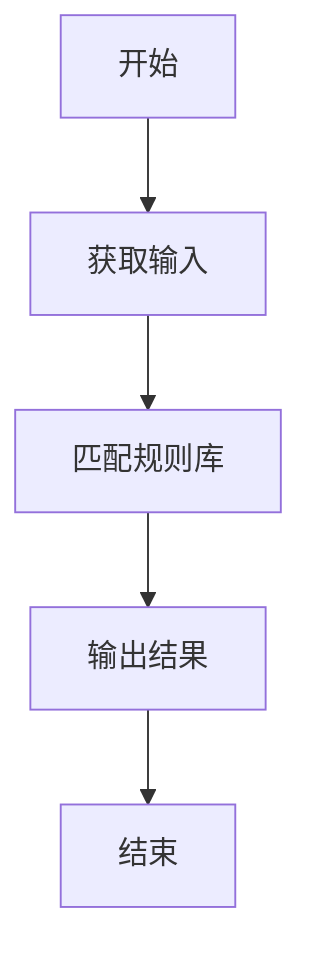
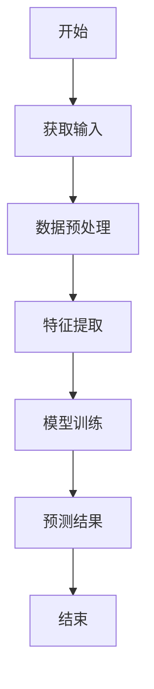
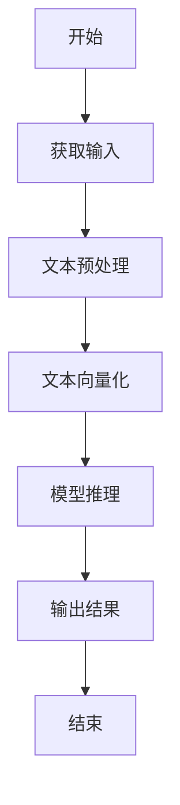
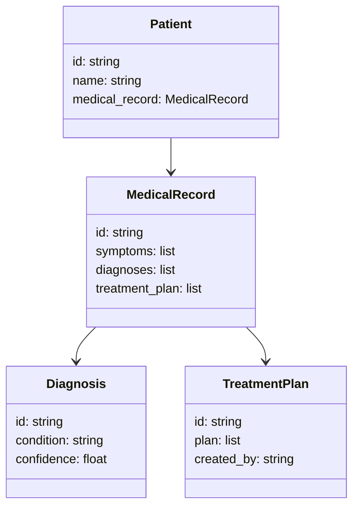
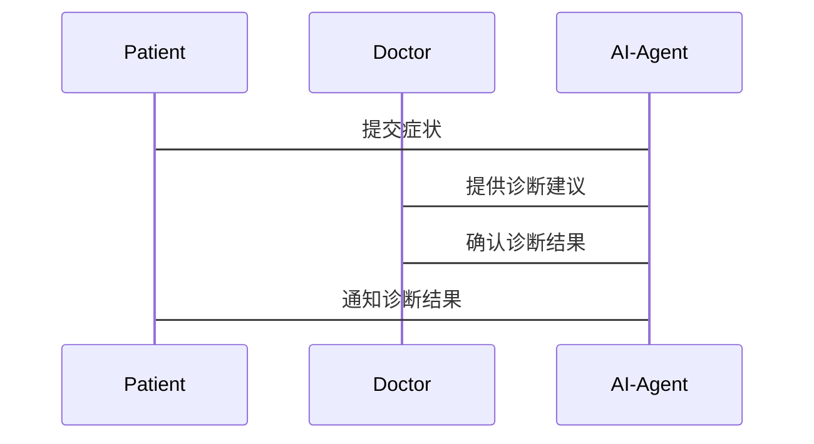

                 


# 医疗健康领域的AI Agent解决方案

> 关键词：AI Agent，医疗健康，人工智能，算法原理，系统架构

> 摘要：本文详细探讨了医疗健康领域中AI Agent的解决方案，从背景、核心概念到算法原理、系统架构，再到项目实战，全面解析了AI Agent在医疗健康中的应用与实现。通过本文，读者可以深入了解医疗AI Agent的定义、工作原理、技术实现及实际应用案例。

---

## 第一部分: 医疗健康领域的AI Agent背景与问题背景

### 第1章: 医疗健康领域的AI Agent背景与问题背景

#### 1.1 医疗健康领域的数字化转型

##### 1.1.1 医疗行业的现状与挑战

医疗行业正面临前所未有的数字化转型压力。传统医疗模式依赖于人工操作，效率低下且容易出错。例如，医生需要手动处理大量的病历数据、诊断结果和治疗方案，这不仅浪费时间，还可能导致误诊。

##### 1.1.2 数字化医疗的核心驱动力

数字化医疗的核心驱动力包括：

1. 提高医疗效率：通过自动化处理病历数据和诊断结果，减少医生的工作负担。
2. 提高诊断准确性：利用AI技术辅助医生进行更精准的诊断。
3. 降低医疗成本：通过数字化管理减少不必要的医疗支出。

##### 1.1.3 AI技术在医疗健康中的应用潜力

AI技术在医疗健康中的应用潜力巨大，包括：

- 辅助诊断：AI可以通过分析病历数据和医学影像，帮助医生快速诊断疾病。
- 个性化治疗：AI可以根据患者的基因信息和生活习惯，制定个性化的治疗方案。
- 药物研发：AI可以加速新药的研发过程，降低研发成本。

#### 1.2 AI Agent在医疗健康中的问题背景

##### 1.2.1 医疗健康领域的痛点分析

医疗行业存在以下痛点：

1. 医疗资源分配不均：优质医疗资源主要集中在大城市，基层医疗机构服务能力不足。
2. 医疗信息孤岛：不同医疗机构之间的数据无法互联互通，导致患者重复检查和治疗。
3. 医疗成本高昂：医疗费用不断上涨，患者负担加重。

##### 1.2.2 AI Agent如何解决医疗问题

AI Agent（智能代理）是一种能够感知环境并采取行动以实现目标的智能系统。在医疗领域，AI Agent可以：

- 协助医生快速诊断疾病。
- 提供个性化的治疗建议。
- 管理患者的健康档案。
- 监测患者的健康状况，及时发现异常。

##### 1.2.3 医疗AI Agent的边界与外延

医疗AI Agent的边界在于其功能的限制。例如，它不能替代医生的临床判断，但可以作为医生的辅助工具。其外延则包括与医疗相关的各种应用场景，如健康管理、医疗咨询等。

#### 1.3 医疗AI Agent的核心概念与问题解决

##### 1.3.1 医疗AI Agent的定义

医疗AI Agent是一种基于AI技术的智能系统，能够通过分析医疗数据和患者信息，提供辅助诊断、治疗建议和健康管理等服务。

##### 1.3.2 医疗AI Agent的核心要素组成

医疗AI Agent的核心要素包括：

1. 数据采集：通过医疗设备和数据库获取患者数据。
2. 数据分析：利用AI算法对数据进行分析和处理。
3. 智能推理：基于分析结果，生成诊断建议和治疗方案。
4. 用户交互：通过人机交互界面，与医生和患者进行实时沟通。

##### 1.3.3 医疗AI Agent与传统医疗系统的区别

医疗AI Agent与传统医疗系统的区别主要体现在：

- **决策方式**：传统医疗系统依赖于医生的主观判断，而AI Agent可以通过数据驱动的方式提供客观建议。
- **效率**：AI Agent可以快速处理大量数据，提高医疗效率。
- **个性化**：AI Agent可以根据患者的个体特征提供个性化的治疗方案。

#### 1.4 本章小结

本章从医疗行业的现状与挑战出发，探讨了AI Agent在医疗健康中的应用潜力，并详细介绍了医疗AI Agent的核心概念和问题解决方式。

---

## 第二部分: 医疗AI Agent的核心概念与联系

### 第2章: 医疗AI Agent的核心概念与联系

#### 2.1 AI Agent的核心原理

##### 2.1.1 基于规则的推理机制

基于规则的推理机制是一种简单的AI推理方法，通过预设的规则对数据进行分析和处理。例如，如果患者的体温超过39℃，且有咳嗽症状，则可能患有流感。

##### 2.1.2 基于机器学习的推理机制

基于机器学习的推理机制是一种更复杂的AI推理方法，通过训练模型对数据进行分类、回归或聚类分析。例如，利用深度学习模型分析医学影像，识别病变区域。

##### 2.1.3 基于自然语言处理的交互机制

基于自然语言处理的交互机制使AI Agent能够理解患者的自然语言输入，并生成相应的回答。例如，患者可以通过语音或文本与AI Agent进行对话，获取医疗建议。

#### 2.2 核心概念对比分析

##### 2.2.1 AI Agent与传统医疗系统的对比

| 对比维度       | AI Agent                     | 传统医疗系统             |
|----------------|------------------------------|--------------------------|
| 决策方式       | 数据驱动的自动化决策         | 人工判断为主             |
| 效率           | 高效处理大量数据             | 依赖人工处理，效率较低   |
| 个性化         | 可提供个性化服务             | 难以大规模提供个性化服务 |

##### 2.2.2 不同AI Agent算法的对比

| 算法类型       | 基于规则的推理               | 基于机器学习的推理       | 基于自然语言处理的交互   |
|----------------|------------------------------|--------------------------|--------------------------|
| 优势           | 实现简单，规则清晰           | 精度高，适用于复杂场景   | 自然流畅的交互体验       |
| 动态适应能力   | 较差                        | 较强                    | 较强                    |

##### 2.2.3 医疗数据与非医疗数据的对比

医疗数据具有以下特点：

1. **隐私性**：医疗数据涉及患者的隐私，需要严格保密。
2. **复杂性**：医疗数据包括文本、影像、基因等多种类型。
3. **关联性**：医疗数据之间具有较强的关联性，例如病史、症状、检查结果等。

#### 2.3 ER实体关系图架构

```mermaid
erDiagram
    patient : 患者
    doctor : 医生
    medical_record : 医疗记录
    diagnosis : 诊断结果
    treatment_plan : 治疗计划
    patient -> medical_record : 关联
    doctor -> medical_record : 关联
    medical_record -> diagnosis : 包含
    medical_record -> treatment_plan : 包含
```

#### 2.4 本章小结

本章详细介绍了AI Agent的核心原理，并通过对比分析和实体关系图，展示了医疗AI Agent的核心概念与联系。

---

## 第三部分: 医疗AI Agent的算法原理与数学模型

### 第3章: 医疗AI Agent的算法原理与数学模型

#### 3.1 基于规则的推理算法

##### 3.1.1 算法流程



##### 3.1.2 算法实现

基于规则的推理算法可以通过以下步骤实现：

1. **规则库构建**：根据医疗知识库构建规则库，例如“如果患者体温高于39℃，则可能患有流感”。
2. **输入处理**：获取患者的输入数据，例如体温、症状等。
3. **规则匹配**：将输入数据与规则库中的规则进行匹配，找到符合的规则。
4. **输出结果**：根据匹配的规则生成诊断结果。

##### 3.1.3 示例代码

```python
def diagnose.symptom_check(symptoms):
    rules = {
        "fever": "体温过高",
        "cough": "咳嗽",
        "fatigue": "疲劳"
    }
    diagnosis = []
    for symptom in symptoms:
        if symptom in rules:
            diagnosis.append(rules[symptom])
    return diagnosis
```

#### 3.2 基于机器学习的推理算法

##### 3.2.1 算法流程



##### 3.2.2 数学模型

基于机器学习的推理算法通常使用分类模型，例如逻辑回归或支持向量机（SVM）。以下是一个简单的逻辑回归模型：

$$ P(y=1|x) = \frac{e^{\beta_0 + \beta_1x}}{1 + e^{\beta_0 + \beta_1x}} $$

其中：
- $x$ 是输入特征
- $\beta_0$ 和 $\beta_1$ 是模型参数

##### 3.2.3 示例代码

```python
import numpy as np
from sklearn.linear_model import LogisticRegression

# 假设X是输入特征，y是标签
model = LogisticRegression()
model.fit(X, y)
predicted_labels = model.predict(X_test)
```

#### 3.3 基于自然语言处理的交互算法

##### 3.3.1 算法流程



##### 3.3.2 示例代码

```python
from transformers import pipeline

# 加载预训练的医疗NLP模型
nlp = pipeline("text-classification", model="bert-base-uncased")

# 对输入文本进行分类
result = nlp("我有持续的咳嗽和发热症状。")
print(result)
```

#### 3.4 本章小结

本章详细介绍了医疗AI Agent的三种核心算法：基于规则的推理、基于机器学习的推理和基于自然语言处理的交互，并通过数学公式和代码示例进行了详细讲解。

---

## 第四部分: 医疗AI Agent的系统架构设计

### 第4章: 医疗AI Agent的系统架构设计

#### 4.1 问题场景介绍

医疗AI Agent需要解决以下问题：

1. 如何高效处理患者的医疗数据？
2. 如何保证医疗数据的安全性和隐私性？
3. 如何实现与医生和患者的高效交互？

#### 4.2 项目介绍

医疗AI Agent系统是一个基于AI技术的智能医疗辅助系统，旨在通过AI技术提升医疗效率和诊断准确性。

#### 4.3 系统功能设计

##### 4.3.1 领域模型设计



##### 4.3.2 系统架构设计


##### 4.3.3 系统接口设计

医疗AI Agent系统需要以下接口：

1. 数据接口：用于与医疗数据库进行数据交互。
2. 用户接口：用于与医生和患者进行交互。
3. 接口：用于与其他医疗系统进行数据对接。

##### 4.3.4 系统交互设计



#### 4.4 本章小结

本章通过系统架构设计，详细描述了医疗AI Agent的功能模块、接口设计和交互流程。

---

## 第五部分: 医疗AI Agent的项目实战

### 第5章: 医疗AI Agent的项目实战

#### 5.1 环境安装与配置

##### 5.1.1 系统环境

- 操作系统：Linux/Windows/MacOS
- Python版本：3.6+

##### 5.1.2 依赖库安装

```bash
pip install numpy scikit-learn transformers
```

#### 5.2 核心实现

##### 5.2.1 数据预处理

```python
import pandas as pd

# 读取数据
data = pd.read_csv("medical_data.csv")
# 数据清洗
data.dropna(inplace=True)
```

##### 5.2.2 模型训练

```python
from sklearn.model import LogisticRegression

# 训练模型
model = LogisticRegression()
model.fit(X_train, y_train)
```

##### 5.2.3 接口开发

```python
from flask import Flask, request, jsonify

app = Flask(__name__)

@app.route("/diagnose", methods=["POST"])
def diagnose():
    data = request.json
    prediction = model.predict(data)
    return jsonify({"result": prediction.tolist()})
```

#### 5.3 案例分析

##### 5.3.1 实际案例

假设一个患者有持续的咳嗽和发热症状，医疗AI Agent可以通过分析症状，生成可能的诊断结果。

##### 5.3.2 案例分析

通过AI Agent的辅助诊断，医生可以更快地确定患者的病情，减少误诊的可能性。

#### 5.4 本章小结

本章通过实际案例，详细展示了医疗AI Agent的环境配置、核心实现和实际应用。

---

## 第六部分: 最佳实践与注意事项

### 第6章: 最佳实践与注意事项

#### 6.1 最佳实践

##### 6.1.1 数据安全

医疗数据涉及患者的隐私，必须严格加密和保护。

##### 6.1.2 模型可解释性

AI Agent的诊断结果需要具有可解释性，以便医生进行审核和确认。

##### 6.1.3 系统可扩展性

医疗AI Agent系统需要具备良好的可扩展性，以适应未来更多的医疗场景和数据类型。

#### 6.2 注意事项

##### 6.2.1 数据质量问题

医疗数据的质量直接影响AI Agent的诊断准确性，需要严格控制数据来源和质量。

##### 6.2.2 系统稳定性

医疗AI Agent系统需要具备高稳定性，确保在关键时刻能够正常运行。

##### 6.2.3 用户接受度

医疗AI Agent的推广需要考虑到医生和患者的心理接受度，避免因技术不信任导致的使用障碍。

#### 6.3 拓展阅读

建议读者进一步阅读以下内容：

1. 《Medical Image Analysis using AI》
2. 《Deep Learning in Medicine》
3. 《AI in Healthcare: Current and Future Trends》

---

## 第七部分: 项目总结与展望

### 第7章: 项目总结与展望

#### 7.1 项目总结

医疗AI Agent是一个复杂的系统工程，需要结合AI技术、医疗知识和系统架构设计。通过本文的介绍，读者可以深入了解医疗AI Agent的核心概念、算法原理和系统架构。

#### 7.2 项目展望

未来，医疗AI Agent将在以下几个方面继续发展：

1. **多模态数据融合**：结合文本、影像、基因等多种数据源，提供更精准的诊断。
2. **实时监测与预警**：通过实时监测患者的健康状况，提前发现潜在的健康问题。
3. **个性化医疗**：根据患者的个体特征，提供个性化的治疗方案。

---

## 第八部分: 附录

### 附录A: 常见问题解答

#### Q1: AI Agent是否可以完全替代医生？

**A**: AI Agent不能完全替代医生，它只是一个辅助工具，医生的临床判断仍然是最终决策。

#### Q2: 医疗AI Agent的数据隐私如何保障？

**A**: 医疗AI Agent需要严格遵守数据隐私法规，采用加密技术和访问控制来保护患者数据。

---

## 作者：AI天才研究院/AI Genius Institute & 禅与计算机程序设计艺术 /Zen And The Art of Computer Programming

---

**本文内容到此结束，希望对您有所帮助！如果需要进一步探讨或合作，请随时联系！**

