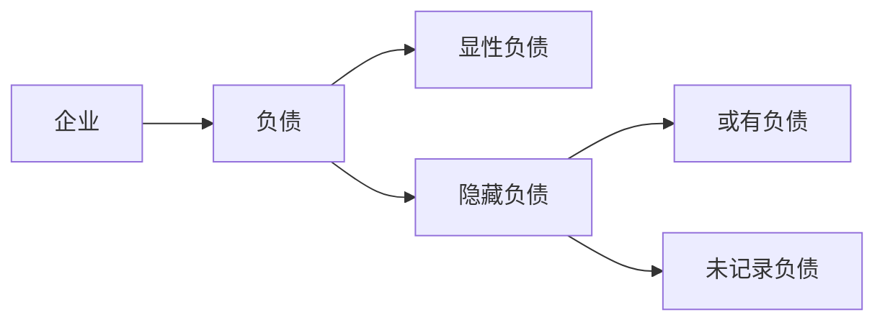
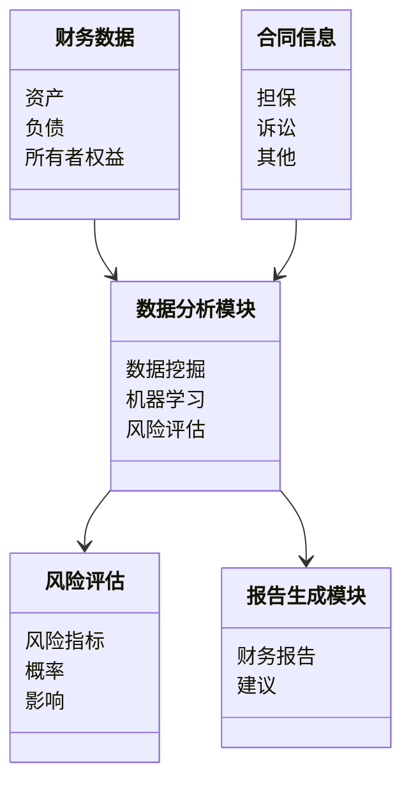
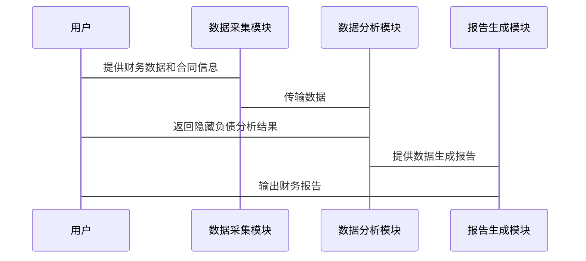

                 


# 如何识别企业的隐藏负债

> 关键词：企业财务风险，隐藏负债，财务审计，资产减值，或有负债，潜在债务

> 摘要：本文将深入探讨如何识别企业的隐藏负债。通过分析隐藏负债的定义、类型、影响以及识别方法，结合实际案例和系统设计，帮助读者掌握隐藏负债的识别技巧，从而有效管理企业财务风险。

---

## 第一部分：引言与背景

### 第1章：隐藏负债的定义与重要性

#### 1.1 隐藏负债的定义
- **1.1.1 什么是隐藏负债**
  隐藏负债是指企业在财务报表中未明确列出，但可能对企业财务状况产生重大影响的潜在债务或风险。这些负债通常未在资产负债表中反映，但可能在未来触发，导致企业承担额外的财务责任。

- **1.1.2 隐藏负债的特征**
  - 隐性性：未在财务报表中明确列出。
  - 潜在性：可能在未来触发，对企业财务状况造成影响。
  - 复杂性：涉及法律、会计和财务等多个方面。

- **1.1.3 隐藏负债的分类**
  - 或有负债（Contingent Liabilities）：取决于未来事件是否发生的债务。
  - 未记录负债（Unrecorded Liabilities）：由于会计政策或管理决策未记录的债务。
  - 潜在负债（Potential Liabilities）：由于企业行为或外部环境可能产生的债务。

#### 1.2 隐藏负债的重要性
- **1.2.1 避免财务危机的必要性**
  未识别的隐藏负债可能导致企业面临突如其来的财务压力，甚至引发破产。

- **1.2.2 提高企业透明度的必要性**
  及时识别隐藏负债，有助于提高企业财务透明度，增强投资者和债权人的信心。

- **1.2.3 符合监管要求的必要性**
  隐藏负债的识别是企业合规性的重要部分，符合相关会计准则和法律法规。

#### 1.3 识别隐藏负债的必要性
- **1.3.1 避免财务危机的必要性**
  隐藏负债可能在企业面临诉讼、债务纠纷或资产减值时突然显现，导致财务状况恶化。

- **1.3.2 提高企业透明度的必要性**
  及时识别隐藏负债，有助于企业内部管理决策的优化，避免因负债问题引发信任危机。

- **1.3.3 符合监管要求的必要性**
  企业需要按照会计准则和法律法规的要求，准确披露所有负债，包括隐藏负债。

#### 1.4 隐藏负债的边界与外延
- **1.4.1 隐藏负债的范围**
  隐藏负债不仅包括或有负债，还包括其他未记录或潜在的负债。

- **1.4.2 隐藏负债与其他负债的关系**
  隐藏负债与显性负债的区别在于是否在财务报表中明确列出。而与或有负债的关系在于其潜在性和不确定性。

- **1.4.3 隐藏负债的法律与会计处理**
  隐藏负债的识别和处理需要结合法律和会计知识，确保合规性和准确性。

---

## 第二部分：核心概念与理论基础

### 第2章：隐藏负债的核心概念

#### 2.1 隐藏负债的核心要素
- **2.1.1 负债的确认与计量**
  根据会计准则，负债需要满足特定条件才能被确认。未满足条件的负债可能成为隐藏负债。

- **2.1.2 负债的披露要求**
  企业需要在财务报表中充分披露所有负债，包括隐藏负债。未披露的隐藏负债可能导致财务报表失真。

- **2.1.3 隐藏负债的形成机制**
  隐藏负债通常由于企业内部管理不善、法律纠纷或潜在风险未充分评估而形成。

#### 2.2 隐藏负债的相关理论
- **2.2.1 财务会计理论基础**
  财务会计的基本原则要求企业真实、准确地反映财务状况，包括隐藏负债。

- **2.2.2 资产负债表理论**
  资产负债表需要全面反映企业的资产和负债，隐藏负债的存在可能影响资产负债表的准确性。

- **2.2.3 风险管理理论**
  隐藏负债的识别是企业风险管理的重要部分，有助于提前防范潜在风险。

#### 2.3 隐藏负债的属性特征对比
- **2.3.1 隐藏负债与显性负债的对比**
  | 特性            | 隐藏负债       | 显性负债       |
  |-----------------|----------------|----------------|
  | 是否记录        | 未记录         | 已记录         |
  | 可能性          | 潜在           | 确定           |
  | 影响程度        | 可能重大       | 明显           |

- **2.3.2 隐藏负债与或有负债的对比**
  - 或有负债是未来可能发生的负债，而隐藏负债是已经存在的潜在负债。
  - 或有负债通常与合同、担保等有关，而隐藏负债可能涉及更广泛的潜在风险。

- **2.3.3 隐藏负债与潜在负债的对比**
  - 潜在负债是可能发生的负债，而隐藏负债是已经存在的潜在负债。
  - 潜在负债可能尚未触发，而隐藏负债可能已经对企业财务状况产生影响。

#### 2.4 隐藏负债的ER实体关系图


---

## 第三部分：隐藏负债的识别方法与技术工具

### 第3章：隐藏负债的识别方法

#### 3.1 财务分析法
- **3.1.1 现金流分析**
  - 通过分析企业的现金流，识别潜在的隐藏负债。
  - 公式：$$ \text{净现金流} = \text{经营活动现金流} + \text{投资活动现金流} + \text{筹资活动现金流} $$
  - 如果净现金流异常，可能存在隐藏负债。

- **3.1.2 资产负债表分析**
  - 通过分析资产负债表中的资产和负债，识别未记录的隐藏负债。
  - 关注资产减值、担保和其他潜在负债。

#### 3.2 内部审计法
- **3.2.1 审计程序**
  - 实施内部审计，检查企业账务，识别未记录的负债。
  - 通过访谈、查阅文件和分析交易，发现潜在的隐藏负债。

#### 3.3 数据挖掘与机器学习
- **3.3.1 数据挖掘技术**
  - 使用数据挖掘技术，分析企业历史数据，识别隐藏负债的模式。
  - 例如，通过分析应收账款和应付账款的异常变动，识别潜在的隐藏负债。

- **3.3.2 机器学习算法**
  - 使用分类算法（如逻辑回归、随机森林）预测隐藏负债的可能性。
  - 通过训练模型，识别隐藏负债的特征和模式。

#### 3.4 风险评估法
- **3.4.1 风险评估指标**
  - 使用风险评估指标，如$$ \text{风险值} = \sum (\text{概率} \times \text{影响}) $$
  - 评估隐藏负债的可能性和影响，制定应对策略。

#### 3.5 外部审计与法律咨询
- **3.5.1 外部审计**
  - 委托外部审计机构，对企业的财务状况进行全面审计，识别隐藏负债。
  - 通过独立第三方的审计，确保财务报表的准确性和完整性。

- **3.5.2 法律咨询**
  - 咨询法律专家，评估企业潜在的法律责任，识别隐藏负债。
  - 通过法律分析，发现可能的诉讼、担保或其他潜在负债。

#### 3.6 财务比率分析
- **3.6.1 常见财务比率**
  - 利息覆盖倍数：$$ \text{利息覆盖倍数} = \frac{\text{EBIT}}{\text{利息支出}} $$
  - 如果利息覆盖倍数过低，可能存在隐藏负债。

  - 负债权益比：$$ \text{负债权益比} = \frac{\text{总负债}}{\text{股东权益}} $$
  - 高负债权益比可能表明企业存在较多的隐藏负债。

#### 3.7 数据可视化与报告生成
- **3.7.1 数据可视化工具**
  - 使用Tableau或Power BI，将隐藏负债的数据可视化。
  - 通过图表和仪表盘，直观展示隐藏负债的风险和趋势。

- **3.7.2 报告生成**
  - 自动生成财务报告，包含隐藏负债的分析和建议。
  - 通过报告，帮助企业管理层及时了解隐藏负债的情况。

---

## 第四部分：隐藏负债识别的系统架构与流程设计

### 第4章：系统架构与流程设计

#### 4.1 系统功能设计
- **4.1.1 功能模块**
  - 数据采集模块：收集企业的财务数据、合同信息和其他相关数据。
  - 数据分析模块：使用机器学习和数据挖掘技术，识别隐藏负债。
  - 报告生成模块：生成财务报告，包含隐藏负债的分析和建议。

- **4.1.2 领域模型**


#### 4.2 系统架构设计
- **4.2.1 系统架构**


- **4.2.2 关键算法实现**
  - 隐藏负债识别算法：
  ```python
  def identify_hidden_liabilities(financial_data, contract_info):
      # 数据预处理
      processed_data = preprocess(financial_data, contract_info)
      # 风险评估
      risk_scores = assess_risk(processed_data)
      # 隐藏负债识别
      hidden_liabilities = detect_hidden_liabilities(risk_scores)
      return hidden_liabilities
  ```

- **4.2.3 系统接口设计**
  - 数据接口：与企业的财务系统和合同管理系统对接，获取数据。
  - 报告接口：生成财务报告，提供给管理层和审计机构。

#### 4.3 系统交互设计
- **4.3.1 交互流程**


---

## 第五部分：隐藏负债识别的项目实战

### 第5章：项目实战与案例分析

#### 5.1 项目背景
- 某制造企业由于财务状况恶化，可能存在隐藏负债。
- 企业希望识别隐藏负债，优化财务结构，避免财务危机。

#### 5.2 项目环境
- 数据来源：企业的财务报表、合同信息和交易记录。
- 工具：Python、Pandas、Scikit-learn、Tableau。

#### 5.3 系统实现
- 数据采集模块：
  ```python
  import pandas as pd

  def load_data():
      financial_data = pd.read_csv('financial.csv')
      contract_info = pd.read_csv('contract.csv')
      return financial_data, contract_info
  ```

- 数据分析模块：
  ```python
  def preprocess(financial_data, contract_info):
      # 数据清洗和特征工程
      processed_data = pd.merge(financial_data, contract_info, on='id')
      processed_data['潜在负债'] = processed_data['担保'].astype('float')
      return processed_data
  ```

- 风险评估模块：
  ```python
  def assess_risk(processed_data):
      from sklearn.ensemble import RandomForestClassifier
      model = RandomForestClassifier()
      features = ['资产', '负债', '担保']
      model.fit(processed_data[features], processed_data['潜在负债'])
      return model
  ```

- 报告生成模块：
  ```python
  def generate_report(model, data):
      importances = model.feature_importances_
      top_importance = sorted(importances, reverse=True)[:5]
      return top_importance
  ```

#### 5.4 案例分析
- **5.4.1 数据分析结果**
  - 通过数据分析，识别出企业的潜在负债主要集中在担保和诉讼方面。
  - 担保金额超过净资产的50%，存在较大的财务风险。

- **5.4.2 改进建议**
  - 减少不必要的担保，优化债务结构。
  - 建立风险评估机制，定期识别隐藏负债。

---

## 第六部分：最佳实践与未来趋势

### 第6章：最佳实践与未来趋势

#### 6.1 最佳实践
- **6.1.1 定期审计**
  - 每季度进行内部审计，及时识别隐藏负债。
- **6.1.2 数据驱动**
  - 利用大数据和AI技术，提高隐藏负债识别的准确性和效率。
- **6.1.3 风险管理**
  - 建立全面的风险管理体系，定期评估潜在负债。

#### 6.2 注意事项
- **6.2.1 数据隐私**
  - 注意保护企业数据隐私，确保数据安全。
- **6.2.2 方法选择**
  - 根据企业实际情况选择合适的识别方法，避免盲目应用。

#### 6.3 未来趋势
- **6.3.1 AI技术的应用**
  - 未来的隐藏负债识别将更加依赖AI技术，实现自动化和智能化。
- **6.3.2 区块链技术**
  - 区块链技术可以帮助企业建立更加透明的财务记录，减少隐藏负债的可能性。
- **6.3.3 数据可视化**
  - 利用先进的数据可视化工具，帮助管理层更好地理解隐藏负债的风险和趋势。

---

## 结语

识别企业的隐藏负债是企业财务管理的重要部分，也是企业风险管理的关键环节。通过本文的分析，读者可以全面了解隐藏负债的概念、识别方法和系统设计。未来，随着技术的发展，隐藏负债的识别将更加智能化和自动化，帮助企业更好地管理财务风险。

---

## 作者

作者：AI天才研究院/AI Genius Institute & 禅与计算机程序设计艺术 /Zen And The Art of Computer Programming

