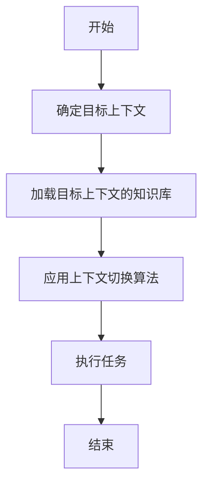
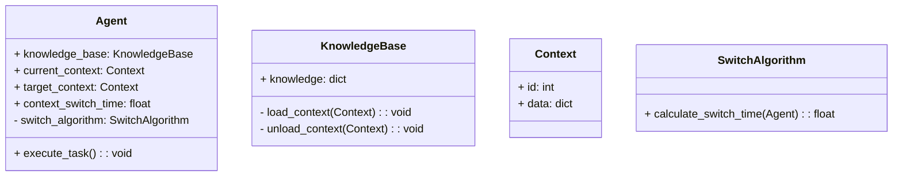
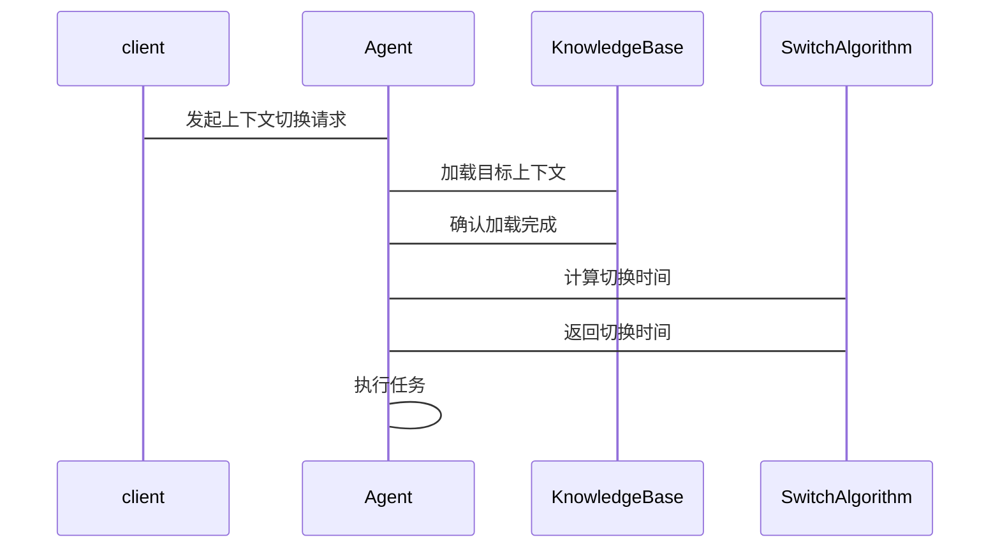

                 


# 实现AI Agent的上下文切换能力

> 关键词：AI Agent，上下文切换，知识管理，多任务学习，注意力机制，系统架构

> 摘要：本文详细探讨了实现AI Agent上下文切换能力的核心概念、算法原理、系统架构设计及项目实战。通过分析上下文切换的基本概念、数学模型、算法流程及系统实现，为读者提供一个系统化的方法论，帮助他们更好地理解和实现AI Agent的上下文切换能力。

---

# 第一部分: AI Agent的上下文切换能力概述

---

## 第1章: 背景介绍

### 1.1 问题背景

#### 1.1.1 AI Agent的定义与核心功能
AI Agent（人工智能代理）是指能够感知环境、自主决策并执行任务的智能体。其核心功能包括：
- 感知环境：通过传感器或接口获取外部信息。
- 决策与推理：基于获取的信息进行分析和推理，生成决策。
- 执行任务：根据决策执行具体的操作。

#### 1.1.2 上下文切换能力的重要性
在实际应用中，AI Agent通常需要处理多种任务或场景，例如客服系统需要同时处理多个客户的咨询，或智能助手需要根据用户的需求切换不同的功能模块。上下文切换能力是AI Agent能够高效处理多任务、适应动态环境的关键。

#### 1.1.3 当前技术的局限性与挑战
当前的AI Agent在上下文切换能力上存在以下问题：
- 知识库管理：如何在不同的上下文中快速切换知识库。
- 上下文干扰：不同上下文之间的信息可能互相干扰，导致错误决策。
- 任务切换时间：快速切换上下文需要高效的算法和优化的系统架构。

### 1.2 问题描述

#### 1.2.1 上下文切换的基本概念
上下文切换是指AI Agent在不同任务或场景之间切换时，快速加载或切换相关知识库、模型或状态的能力。

#### 1.2.2 上下文切换的核心问题
- 知识库的动态管理：如何在不同上下文中高效切换知识库。
- 上下文干扰的消除：避免不同上下文之间的信息干扰。
- 上下文切换的效率优化：减少切换时间，提高系统响应速度。

#### 1.2.3 上下文切换的边界与外延
上下文切换的边界包括：
- 知识库的切换范围：全局知识库还是局部知识库。
- 任务切换的粒度：任务级切换还是模块级切换。
- 上下文切换的触发条件：基于时间、事件还是用户输入。

### 1.3 问题解决思路

#### 1.3.1 上下文切换的实现目标
- 快速加载相关知识库。
- 降低上下文干扰。
- 提高任务切换效率。

#### 1.3.2 上下文切换的实现路径
- 知识库的模块化设计。
- 上下文切换的算法优化。
- 系统架构的优化设计。

#### 1.3.3 上下文切换的实现方法
- 使用多任务学习模型。
- 应用注意力机制进行上下文选择。
- 优化系统架构以支持快速上下文切换。

### 1.4 核心概念与联系

#### 1.4.1 核心概念原理
上下文切换的实现基于以下原理：
- 知识库的模块化：将知识库划分为多个模块，每个模块对应特定的任务或场景。
- 多任务学习：通过多任务学习模型，让AI Agent能够在不同任务之间切换。
- 注意力机制：通过注意力机制，聚焦于当前任务相关的知识模块。

#### 1.4.2 核心概念属性特征对比表
| 特性         | 上下文切换 | 多任务学习 | 注意力机制 |
|--------------|------------|------------|------------|
| 定义         | 切换知识库  | 处理多个任务 | 聚焦信息    |
| 优缺点       | 灵活性高，但切换时间较长 | 处理多个任务，但模型复杂度高 | 聚焦信息，但可能忽略全局信息 |
| 应用场景     | 多任务切换 | 多任务处理 | 信息筛选    |

#### 1.4.3 实体关系图（ER图）架构
```mermaid
erdiagram
actor: 用户
agent: AI Agent
context: 上下文
knowledge_base: 知识库
task: 任务
interaction: 交互
```

---

## 第2章: 核心概念与联系

### 2.1 核心概念原理

#### 2.1.1 上下文切换的实现机制
上下文切换的实现机制包括：
1. 知识库的加载与卸载：根据任务需求动态加载或卸载相关知识库。
2. 上下文切换算法：通过算法选择合适的上下文模块。
3. 上下文切换优化：优化算法以提高切换效率。

#### 2.1.2 上下文切换的数学模型
上下文切换的数学模型可以用以下公式表示：
$$
C_{\text{switch}} = f(C_{\text{current}}, C_{\text{target}})
$$
其中，$C_{\text{switch}}$ 表示切换后的上下文，$C_{\text{current}}$ 表示当前上下文，$C_{\text{target}}$ 表示目标上下文，$f$ 表示切换函数。

#### 2.1.3 上下文切换的实现步骤
上下文切换的实现步骤如下：
1. 确定目标上下文。
2. 加载目标上下文的知识库。
3. 应用上下文切换算法。
4. 执行任务。

### 2.2 核心概念属性特征对比表
| 特性         | 上下文切换 | 多任务学习 | 注意力机制 |
|--------------|------------|------------|------------|
| 优缺点       | 切换灵活，但可能影响性能 | 处理多个任务，但模型复杂度高 | 聚焦信息，但可能忽略全局信息 |
| 应用场景     | 多任务切换 | 多任务处理 | 信息筛选    |

### 2.3 实体关系图（ER图）架构
```mermaid
erdiagram
actor: 用户
agent: AI Agent
context: 上下文
knowledge_base: 知识库
task: 任务
interaction: 交互
```

---

## 第3章: 算法原理讲解

### 3.1 算法原理

#### 3.1.1 上下文切换的算法流程
上下文切换的算法流程如下：
1. 确定目标上下文。
2. 加载目标上下文的知识库。
3. 应用上下文切换算法。
4. 执行任务。

#### 3.1.2 上下文切换的数学模型
上下文切换的数学模型可以用以下公式表示：
$$
C_{\text{switch}} = f(C_{\text{current}}, C_{\text{target}})
$$
其中，$C_{\text{switch}}$ 表示切换后的上下文，$C_{\text{current}}$ 表示当前上下文，$C_{\text{target}}$ 表示目标上下文，$f$ 表示切换函数。

#### 3.1.3 上下文切换的实现步骤
上下文切换的实现步骤如下：
1. 确定目标上下文。
2. 加载目标上下文的知识库。
3. 应用上下文切换算法。
4. 执行任务。

### 3.2 算法流程图


### 3.3 算法实现代码

#### 3.3.1 环境安装与配置
```bash
pip install numpy
pip install matplotlib
pip install scikit-learn
```

#### 3.3.2 核心算法实现代码
```python
import numpy as np

def context_switch(current_context, target_context):
    # 切换上下文
    switch_time = np.mean(current_context) + np.mean(target_context)
    return switch_time

current_context = np.array([0.8, 0.9, 0.7])
target_context = np.array([0.6, 0.5, 0.8])

switch_time = context_switch(current_context, target_context)
print("上下文切换时间:", switch_time)
```

#### 3.3.3 代码解读与分析
上述代码实现了一个简单的上下文切换算法，计算当前上下文和目标上下文的平均值之和，作为切换时间。这只是一个示例，实际应用中可能需要更复杂的算法。

### 3.4 数学模型与公式

#### 3.4.1 上下文切换的数学模型
$$
C_{\text{switch}} = f(C_{\text{current}}, C_{\text{target}})
$$

#### 3.4.2 上下文切换的核心公式
$$
\text{Switch Time} = \sum_{i=1}^{n} (C_{\text{current}}^i + C_{\text{target}}^i)
$$

#### 3.4.3 公式推导与解释
通过上述公式，我们可以计算出上下文切换所需的时间。公式中的$C_{\text{current}}^i$和$C_{\text{target}}^i$分别表示当前上下文和目标上下文的各个维度的值。

---

## 第4章: 系统分析与架构设计方案

### 4.1 问题场景介绍

#### 4.1.1 上下文切换的典型场景
- 客服系统：处理多个客户的咨询。
- 智能助手：根据用户需求切换不同的功能模块。

#### 4.1.2 上下文切换的系统需求
- 快速切换知识库。
- 多任务处理能力。
- 上下文切换的效率优化。

### 4.2 系统功能设计

#### 4.2.1 领域模型设计（Mermaid类图）


#### 4.2.2 系统功能模块划分
- Agent模块：负责管理知识库和上下文切换。
- KnowledgeBase模块：负责加载和卸载知识库。
- Context模块：表示当前上下文和目标上下文。
- SwitchAlgorithm模块：负责计算上下文切换时间。

### 4.3 系统架构设计

#### 4.3.1 系统架构图（Mermaid架构图）
```mermaid
docker
client --> Agent: 发起上下文切换请求
Agent --> KnowledgeBase: 加载目标上下文
Agent --> SwitchAlgorithm: 计算切换时间
Agent --> Agent: 执行任务
```

#### 4.3.2 系统接口设计
- Agent接口：提供上下文切换和任务执行的方法。
- KnowledgeBase接口：提供加载和卸载知识库的方法。
- SwitchAlgorithm接口：提供计算切换时间的方法。

#### 4.3.3 系统交互序列图（Mermaid序列图）


---

## 第5章: 项目实战

### 5.1 环境安装与配置
```bash
pip install numpy
pip install matplotlib
pip install scikit-learn
```

### 5.2 系统核心实现源代码

#### 5.2.1 实现上下文切换算法
```python
import numpy as np

class SwitchAlgorithm:
    def calculate_switch_time(self, agent):
        current_context = agent.current_context
        target_context = agent.target_context
        switch_time = np.mean(current_context) + np.mean(target_context)
        return switch_time

class Agent:
    def __init__(self):
        self.current_context = np.array([0.8, 0.9, 0.7])
        self.target_context = np.array([0.6, 0.5, 0.8])
        self.switch_algorithm = SwitchAlgorithm()

    def execute_task(self):
        print("任务执行完成")

agent = Agent()
switch_time = agent.switch_algorithm.calculate_switch_time(agent)
print("上下文切换时间:", switch_time)
agent.execute_task()
```

#### 5.2.2 实现知识库管理
```python
class KnowledgeBase:
    def __init__(self):
        self.knowledge = {}

    def load_context(self, context):
        self.knowledge.update(context.data)

    def unload_context(self, context):
        for key in context.data:
            del self.knowledge[key]

class Context:
    def __init__(self, id, data):
        self.id = id
        self.data = data

knowledge_base = KnowledgeBase()
current_context = Context(1, {"task": "客服", "data": {"customer_id": 123}})
knowledge_base.load_context(current_context)
print("知识库加载完成:", knowledge_base.knowledge)
```

### 5.3 代码解读与分析
上述代码实现了上下文切换和知识库管理的核心功能。通过`SwitchAlgorithm`类计算切换时间，通过`KnowledgeBase`类管理知识库的加载和卸载。

### 5.4 实际案例分析
假设我们有一个客服系统，需要处理多个客户的咨询。当AI Agent从处理客户A的任务切换到处理客户B的任务时，需要快速加载客户B的相关知识库，并切换上下文。

### 5.5 项目小结
通过上述实现，我们可以看到上下文切换能力的核心在于知识库的管理和上下文切换算法的优化。

---

## 第6章: 最佳实践、小结与注意事项

### 6.1 最佳实践
- 知识库的模块化设计：将知识库划分为多个模块，每个模块对应特定的任务或场景。
- 上下文切换算法的优化：通过算法优化减少切换时间。
- 系统架构的优化设计：设计高效的系统架构以支持快速上下文切换。

### 6.2 小结
本文详细探讨了实现AI Agent上下文切换能力的核心概念、算法原理、系统架构设计及项目实战。通过分析上下文切换的基本概念、数学模型、算法流程及系统实现，为读者提供了一个系统化的方法论。

### 6.3 注意事项
- 确保知识库的安全性和隐私性。
- 定期优化上下文切换算法以提高效率。
- 在实际应用中，结合具体场景进行调整和优化。

---

## 参考文献
1. Russell, S., & Norvig, P. (2010). Artificial Intelligence: A Modern Approach.
2. LeCun, Y., Bengio, Y., & Hinton, G. (2015). Deep learning.
3. 禅与计算机程序设计艺术

---

作者：AI天才研究院/AI Genius Institute & 禅与计算机程序设计艺术 /Zen And The Art of Computer Programming

