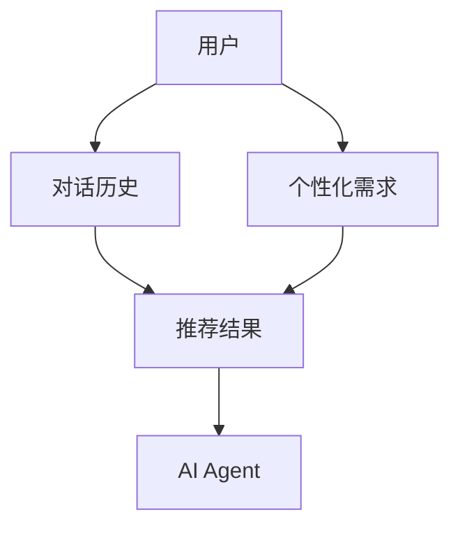
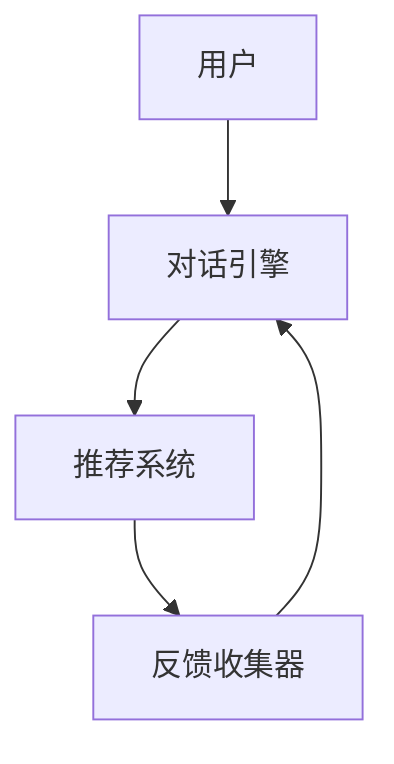
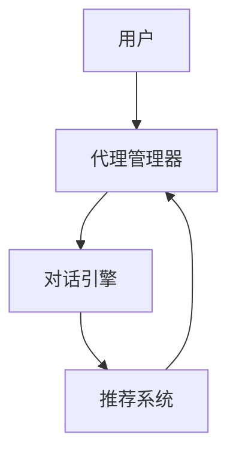
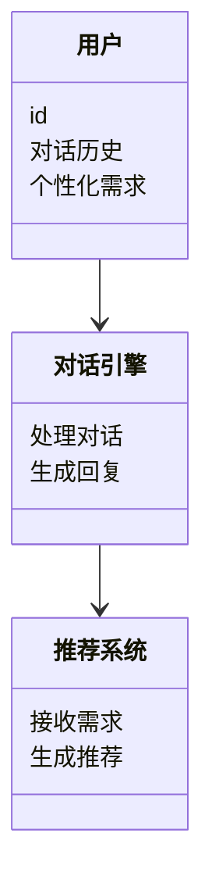
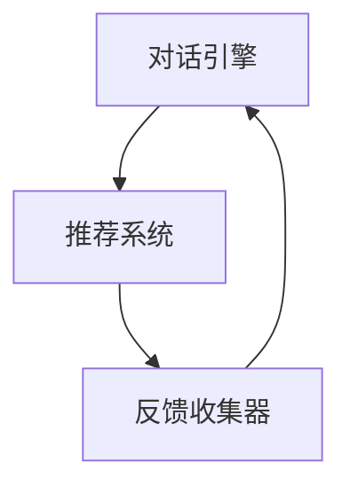

                 


# 对话式推荐：个性化AI Agent的建议

> 关键词：对话式推荐、个性化AI Agent、推荐系统、自然语言处理、机器学习

> 摘要：本文详细探讨了对话式推荐与个性化AI Agent的结合，分析了其背后的核心概念、算法原理、系统架构，并通过实际案例展示了如何实现这一技术。文章还提供了最佳实践建议和未来发展趋势的展望。

---

# 第1章: 对话式推荐与个性化AI Agent的背景介绍

## 1.1 问题背景与问题描述

### 1.1.1 对话式推荐的定义与应用场景

对话式推荐是一种基于自然语言处理（NLP）和机器学习技术的推荐方法。它通过用户与AI Agent之间的对话交互，实时理解和分析用户需求，从而提供个性化、动态的推荐结果。

**应用场景：**
- 智能音箱：通过对话交互推荐音乐、播客。
- 智能客服：通过对话推荐解决方案。
- 电商平台：通过对话推荐商品。

### 1.1.2 个性化AI Agent的核心问题

个性化AI Agent的目标是通过对话理解用户的深层需求，提供个性化的服务或推荐。核心问题包括：
1. 如何准确理解用户的需求？
2. 如何实时生成个性化推荐？
3. 如何优化推荐效果？

### 1.1.3 对话式推荐在AI Agent中的作用

对话式推荐是个性化AI Agent的核心功能之一。它通过实时对话交互，动态调整推荐策略，提升用户体验。

---

## 1.2 问题解决与边界分析

### 1.2.1 对话式推荐的解决方案

解决方案包括：
1. 基于NLP的意图识别。
2. 基于机器学习的推荐算法。
3. 实时对话交互。

### 1.2.2 个性化AI Agent的边界与外延

- **边界：** 专注于对话推荐，不涉及其他AI功能（如图像识别）。
- **外延：** 可扩展至其他领域（如教育、医疗）。

### 1.2.3 对话式推荐与AI Agent的结合方式

- **实时交互：** 对话中动态推荐。
- **个性化调整：** 根据对话内容优化推荐结果。

---

## 1.3 核心概念与结构

### 1.3.1 对话式推荐的核心要素

1. **用户输入：** 对话内容。
2. **意图识别：** 理解用户需求。
3. **推荐算法：** 生成推荐结果。

### 1.3.2 个性化AI Agent的组成结构

1. **对话引擎：** 处理对话交互。
2. **推荐系统：** 提供个性化推荐。
3. **反馈机制：** 收集用户反馈。

### 1.3.3 对话式推荐与AI Agent的交互流程

1. 用户发起对话。
2. AI Agent理解需求。
3. 推荐系统生成推荐。
4. 用户反馈优化。

---

## 1.4 本章小结

本章介绍了对话式推荐和个性化AI Agent的基本概念、应用场景及核心问题。通过分析边界和结构，为后续章节奠定了基础。

---

# 第2章: 对话式推荐与个性化AI Agent的核心概念与联系

## 2.1 对话式推荐的原理与实现

### 2.1.1 对话式推荐的基本原理

对话式推荐通过自然语言处理技术，分析对话内容，提取用户需求，结合推荐算法生成推荐结果。

### 2.1.2 个性化推荐的核心算法

1. **协同过滤：** 基于用户行为推荐。
2. **内容推荐：** 基于内容相似性推荐。
3. **混合推荐：** 结合协同过滤和内容推荐。

### 2.1.3 对话式推荐与AI Agent的结合方式

- **实时交互：** 对话中动态推荐。
- **上下文感知：** 根据对话上下文优化推荐。

---

## 2.2 个性化AI Agent的原理与实现

### 2.2.1 个性化AI Agent的定义与特点

个性化AI Agent是一种能够根据用户需求实时调整行为的智能代理。特点包括：
1. **个性化：** 根据用户需求调整。
2. **实时性：** 快速响应用户输入。
3. **动态性：** 根据反馈优化行为。

### 2.2.2 个性化AI Agent的核心算法

1. **意图识别：** 通过NLP技术识别用户意图。
2. **对话管理：** 管理对话流程。
3. **推荐系统：** 提供个性化推荐。

### 2.2.3 对话式推荐在AI Agent中的应用

- **用户需求分析：** 通过对话提取用户需求。
- **动态推荐：** 根据对话内容实时推荐。
- **反馈优化：** 根据用户反馈优化推荐策略。

---

## 2.3 对话式推荐与个性化AI Agent的对比分析

### 2.3.1 对话式推荐与个性化AI Agent的异同点

| 特性                | 对话式推荐                     | 个性化AI Agent               |
|---------------------|------------------------------|-----------------------------|
| 核心功能            | 实时推荐                     | 个性化服务                 |
| 输入方式            | 对话式输入                   | 多种输入方式               |
| 输出形式            | 推荐结果                     | 多样化服务                 |
| 依赖技术            | NLP、推荐算法                 | NLP、机器学习、对话管理     |

### 2.3.2 对话式推荐在AI Agent中的优势

1. **实时性：** 能够实时响应用户需求。
2. **个性化：** 根据对话内容提供个性化推荐。
3. **动态性：** 可根据反馈实时调整推荐策略。

### 2.3.3 对话式推荐在AI Agent中的挑战

1. **理解歧义性：** 对话中可能存在歧义。
2. **数据稀疏性：** 用户数据不足影响推荐准确性。
3. **计算复杂性：** 实时推荐需要高效计算能力。

---

## 2.4 ER实体关系图



---

## 2.5 本章小结

本章分析了对话式推荐与个性化AI Agent的核心概念，通过对比分析和ER图展示了它们之间的关系。

---

# 第3章: 对话式推荐与个性化AI Agent的算法原理讲解

## 3.1 对话式推荐的核心算法

### 3.1.1 基于协同过滤的推荐算法

协同过滤通过分析用户行为，找到相似用户的推荐。

### 3.1.2 基于内容的推荐算法

内容推荐通过分析物品属性，找到相似物品推荐。

### 3.1.3 深度学习推荐算法

深度学习通过神经网络模型学习用户和物品的特征，生成推荐结果。

---

## 3.2 个性化AI Agent的核心算法

### 3.2.1 意图识别算法

意图识别通过NLP技术分析对话内容，识别用户意图。

### 3.2.2 对话管理算法

对话管理通过决策树或状态机管理对话流程。

### 3.2.3 推荐系统算法

推荐系统通过协同过滤、内容推荐或混合推荐算法生成推荐结果。

---

## 3.3 对话式推荐与个性化AI Agent的算法结合

### 3.3.1 对话式推荐算法实现

```python
# 示例代码：协同过滤推荐
def collaborative_filtering(user_id, user_matrix):
    similar_users = find_similar_users(user_id, user_matrix)
   推荐结果 = get_recommendations(user_id, similar_users)
    return 推荐结果
```

### 3.3.2 个性化AI Agent算法实现

```python
# 示例代码：意图识别
def intent_recognition(dialogue):
    分词结果 = tokenize(dialogue)
    模型预测 = predict_intent(分词结果)
    返回模型预测结果
```

---

## 3.4 本章小结

本章详细讲解了对话式推荐与个性化AI Agent的核心算法，展示了它们如何结合实现推荐功能。

---

# 第4章: 对话式推荐与个性化AI Agent的系统分析与架构设计

## 4.1 问题场景介绍

### 4.1.1 对话式推荐的系统架构



### 4.1.2 个性化AI Agent的系统架构



---

## 4.2 项目介绍与系统功能设计

### 4.2.1 领域模型设计



---

## 4.3 系统架构设计

### 4.3.1 系统架构图



---

## 4.4 本章小结

本章分析了对话式推荐与个性化AI Agent的系统架构，展示了它们如何协同工作。

---

# 第5章: 对话式推荐与个性化AI Agent的项目实战

## 5.1 环境安装

### 5.1.1 安装Python

```bash
python --version
pip install numpy scikit-learn
```

### 5.1.2 安装NLP工具

```bash
pip install spacy
python -m spacy download en_core_web_sm
```

---

## 5.2 系统核心实现源代码

### 5.2.1 对话式推荐代码实现

```python
# 示例代码：协同过滤推荐
def collaborative_filtering(user_id, user_matrix):
    similar_users = find_similar_users(user_id, user_matrix)
    recommendations = get_recommendations(user_id, similar_users)
    return recommendations
```

### 5.2.2 个性化AI Agent代码实现

```python
# 示例代码：意图识别
def intent_recognition(dialogue):
    tokens = tokenize(dialogue)
    model_predictions = predict_intent(tokens)
    return model_predictions
```

---

## 5.3 代码应用解读与分析

### 5.3.1 对话式推荐代码解读

- **输入：** 用户ID和用户矩阵。
- **输出：** 推荐列表。

### 5.3.2 个性化AI Agent代码解读

- **输入：** 对话内容。
- **输出：** 用户意图。

---

## 5.4 实际案例分析

### 5.4.1 案例分析

用户输入：“我需要一个安静的环境。”

推荐系统分析用户需求，推荐降噪耳机。

---

## 5.5 本章小结

本章通过实际代码实现和案例分析，展示了对话式推荐与个性化AI Agent的应用。

---

# 第6章: 对话式推荐与个性化AI Agent的最佳实践与小结

## 6.1 最佳实践 tips

### 6.1.1 对话式推荐的优化建议

- **数据清洗：** 提高推荐准确性。
- **模型调优：** 提升推荐效果。
- **用户反馈：** 收集用户反馈优化推荐。

### 6.1.2 个性化AI Agent的优化建议

- **意图识别：** 提高识别准确率。
- **对话管理：** 优化对话流程。
- **推荐系统：** 提升推荐效率。

---

## 6.2 小结

本章总结了对话式推荐与个性化AI Agent的核心内容，提供了优化建议和未来展望。

---

# 第7章: 案例分析与未来展望

## 7.1 案例分析

### 7.1.1 案例分析

- **背景：** 用户通过对话推荐音乐。
- **过程：** 用户输入需求，系统推荐音乐。
- **结果：** 用户满意推荐结果。

---

## 7.2 未来展望

### 7.2.1 技术发展

- **多模态推荐：** 结合视觉、听觉等多模态信息。
- **实时性提升：** 提高推荐实时性。

### 7.2.2 应用领域

- **教育：** 推荐学习资源。
- **医疗：** 推荐医疗方案。

---

## 7.3 本章小结

本章通过案例分析和未来展望，展示了对话式推荐与个性化AI Agent的潜力。

---

# 作者：AI天才研究院 & 禅与计算机程序设计艺术

