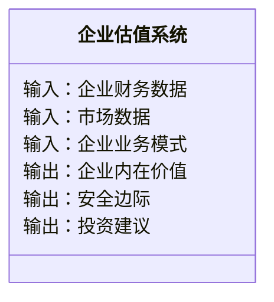
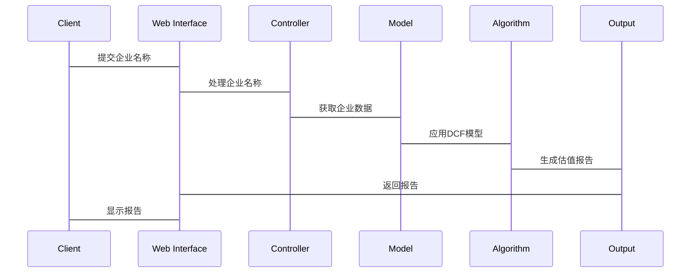

                 


# 巴菲特的企业估值秘诀解析

## 关键词：巴菲特, 企业估值, 投资哲学, 现金流折现模型, 价值投资, 股东权益收益率

## 摘要：本文详细解析了巴菲特的企业估值秘诀，从其投资哲学到具体的数学模型，再到实际案例分析，全面揭示了巴菲特如何通过高质量的管理层、可持续的竞争优势和合理的企业估值来实现投资成功。文章内容包括背景介绍、核心概念、算法原理、系统分析、项目实战和最佳实践等部分，帮助读者深入理解巴菲特的企业估值方法。

---

## 第1章: 巴菲特投资哲学与价值投资概述

### 1.1 巴菲特的投资哲学

#### 1.1.1 巴菲特的投资理念
巴菲特的投资哲学以“价值投资”为核心，强调购买低于内在价值的股票并长期持有。他相信市场短期波动不可预测，但长期趋势可以通过基本面分析来把握。以下是巴菲特投资理念的核心要素：

- **长期投资**：巴菲特认为市场短期波动无法预测，投资应着眼于长期。
- **安全边际**：在购买股票时，确保买入价格低于企业内在价值，以降低风险。
- **高质量管理层**：管理层的决策能力和道德水平直接影响企业价值。
- **可持续竞争优势**：企业应具备长期的竞争优势，如品牌、技术或成本优势。

#### 1.1.2 价值投资的定义与核心思想
价值投资是一种投资策略，强调以低于内在价值的价格购买优质资产。其核心思想是市场先生的非理性，导致短期价格波动，但长期来看，价格会回归基本面。

- **市场先生**：巴菲特将市场比作情绪化的“市场先生”，投资者应避免被短期情绪左右。
- **安全边际**：买入价格与内在价值的差距，确保在市场波动中仍有获利空间。

#### 1.1.3 巴菲特投资成功的关键因素
- **强大的竞争优势**：企业必须具备持久的竞争优势。
- **低廉的买入价格**：确保有足够的安全边际。
- **长期持有**：避免频繁交易，减少成本和错误。

---

### 1.2 巴菲特的企业估值方法

#### 1.2.1 股东权益收益率（ROE）的重要性
ROE是衡量企业盈利能力的重要指标，计算公式为：
$$
ROE = \frac{\text{净利润}}{\text{股东权益}}
$$
巴菲特认为，高ROE企业更有可能创造股东价值。

#### 1.2.2 每股收益（EPS）与市盈率（P/E）的关系
- **EPS**：每股净利润，公式为：
$$
EPS = \frac{\text{净利润}}{\text{总股本}}
$$
- **P/E**：市盈率，公式为：
$$
P/E = \frac{\text{股价}}{EPS}
$$
巴菲特认为，过高的P/E意味着股价可能被高估。

#### 1.2.3 企业内在价值的计算方法
巴菲特使用现金流折现模型（DCF）估算企业内在价值。公式为：
$$
\text{内在价值} = \sum_{t=1}^{n} \frac{\text{自由现金流}}{(1 + r)^t} + \frac{\text{终值}}{(1 + r)^n}
$$
其中，$r$为折现率，$n$为预测期。

---

### 1.3 巴菲特投资策略的核心要素

#### 1.3.1 高质量的管理层
巴菲特认为，管理层的能力和决策直接影响企业价值。他关注管理层的诚信、决策能力和扩张欲望。

#### 1.3.2 可持续的竞争优势
企业应具备长期的竞争优势，如品牌、技术、成本或网络效应。例如，可口可乐的全球品牌影响力为其提供了强大的竞争优势。

#### 1.3.3 合理的企业估值与安全边际
巴菲特强调买入价格低于内在价值，确保安全边际。例如，如果估算内在价值为100元，他可能在80元以下买入。

---

### 1.4 巴菲特投资案例分析

#### 1.4.1 可口可乐案例
- **竞争优势**：强大的品牌和分销网络。
- **估值方法**：使用DCF模型估算自由现金流，考虑未来现金流折现后的现值。

#### 1.4.2 巴菲特购买报纸公司案例
- **案例背景**：购买一家具有垄断地位的报纸公司，确保稳定的现金流。
- **估值方法**：评估企业未来现金流，考虑收购价格是否低于内在价值。

#### 1.4.3 巴菲特对铁路公司的投资策略
- **长期需求**：铁路运输在物流中的重要性。
- **估值方法**：分析铁路公司的财务状况，确保估值合理。

---

## 第2章: 企业估值的核心概念与数学模型

### 2.1 企业估值的基本原理

#### 2.1.1 企业价值的定义
企业价值（Enterprise Value，EV）是企业整体价值的度量，包括股权和债权。计算公式为：
$$
EV = \text{股权价值} + \text{债权价值} - \text{现金及短期投资}
$$

#### 2.1.2 股东权益与企业价值的关系
股东权益是企业净资产，公式为：
$$
\text{股东权益} = \text{资产} - \text{负债}
$$
企业价值与股东权益密切相关，但需考虑债权和现金流。

#### 2.1.3 企业估值的核心假设
- 稳定的现金流增长。
- 合理的折现率。
- 可持续的竞争优势。

---

### 2.2 股权价值计算的数学模型

#### 2.2.1 股权价值计算公式
股权价值（Equity Value）公式：
$$
\text{股权价值} = \text{净利润} \times \text{股东权益收益率（ROE）}
$$

#### 2.2.2 股东权益收益率（ROE）的计算公式
$$
ROE = \frac{\text{净利润}}{\text{股东权益}}
$$

#### 2.2.3 市盈率（P/E）与市净率（P/B）的比较
- **市盈率**：股价/每股收益。
- **市净率**：股价/每股净资产。
- 巴菲特更关注ROE和P/E的结合。

---

### 2.3 股票内在价值的数学模型

#### 2.3.1 现金流折现模型（DCF）
DCF模型将未来现金流折现为现值，计算公式为：
$$
\text{内在价值} = \sum_{t=1}^{n} \frac{\text{现金流}}{(1 + r)^t} + \frac{\text{终值}}{(1 + r)^n}
$$
其中，$r$为折现率，$n$为预测期。

#### 2.3.2 股权自由现金流模型
股权自由现金流（FCFF）公式：
$$
FCFF = \text{净利润} + \text{非现金费用} - \text{资本 expenditures}
$$

#### 2.3.3 股票内在价值的计算公式
$$
\text{内在价值} = \frac{\text{现金流}}{r - g}
$$
其中，$g$为现金流增长率。

---

### 2.4 巴菲特的企业估值公式

#### 2.4.1 企业价值=股东权益+税盾价值
税盾价值（Tax Shield）计算公式：
$$
\text{税盾价值} = \frac{\text{利息支出} \times \text{税率}}{r}
$$

#### 2.4.2 股东权益=净利润×股东权益收益率
$$
\text{股东权益} = \text{净利润} \times ROE
$$

#### 2.4.3 企业内在价值的计算步骤
1. 估算未来现金流。
2. 确定合理的折现率。
3. 计算终值。
4. 将现金流折现并求和。
5. 与当前股价比较，判断是否低估。

---

## 第3章: 现金流折现模型（DCF）的原理与应用

### 3.1 DCF模型的基本原理

#### 3.1.1 自由现金流的定义
自由现金流（FCF）是企业在扣除资本支出后的剩余现金流，公式为：
$$
FCF = \text{净利润} + \text{折旧} + \text{摊销} - \text{资本支出}
$$

#### 3.1.2 折现率的计算方法
折现率（$r$）通常基于无风险利率和风险溢价，公式为：
$$
r = \text{无风险利率} + \text{风险溢价}
$$

#### 3.1.3 终值的计算公式
终值（TV）计算公式：
$$
TV = \frac{\text{最后一年现金流}}{r - g}
$$
其中，$g$为稳定增长的现金流增长率。

---

### 3.2 DCF模型的步骤

#### 3.2.1 确定企业的自由现金流
以可口可乐为例，假设其未来5年的自由现金流分别为10, 12, 15, 18, 20（单位：百万美元）。

#### 3.2.2 估算合理的折现率
假设无风险利率为3%，风险溢价为5%，则折现率$r=8%$。

#### 3.2.3 计算终值和现值
假设第5年后现金流稳定增长3%，则终值为：
$$
TV = \frac{20 \times (1 + 0.03)}{0.08 - 0.03} = 426 \text{百万美元}
$$
现值为：
$$
PV = \frac{10}{1.08} + \frac{12}{1.08^2} + \frac{15}{1.08^3} + \frac{18}{1.08^4} + \frac{20}{1.08^5} + \frac{426}{1.08^5} = 300 \text{百万美元}
$$

#### 3.2.4 计算企业整体价值
$$
\text{整体价值} = \text{股权价值} + \text{债权价值} - \text{现金及短期投资}
$$

---

### 3.3 DCF模型的优缺点

#### 3.3.1 优点
- 考虑了时间价值和风险。
- 适用于具有稳定现金流的企业。

#### 3.3.2 缺点
- 高度依赖假设，尤其是增长率和折现率。
- 需要长期的现金流预测，难以准确估算。

#### 3.3.3 应用中的注意事项
- 确保现金流预测合理。
- 选择合适的折现率。
- 考虑通货膨胀和经济周期的影响。

---

### 3.4 巴菲特对DCF模型的改进

#### 3.4.1 税盾价值的考虑
税盾价值公式：
$$
\text{税盾价值} = \frac{\text{利息支出} \times \text{税率}}{r}
$$

#### 3.4.2 企业竞争优势的量化
通过ROE和ROA等指标衡量竞争优势。

#### 3.4.3 安全边际的引入
确保买入价格低于估算的内在价值。

---

## 第4章: 企业竞争优势的分析与量化

### 4.1 企业竞争优势的定义

#### 4.1.1 可持续竞争优势的特征
- 独特的价值主张。
- 高进入壁垒。
- 可持续的盈利能力。

#### 4.1.2 竞争优势的来源
- 品牌影响力。
- 成本优势。
- 技术创新。

#### 4.1.3 竞争优势的衡量指标
- 市场占有率。
- ROE。
- 净利润率。

---

### 4.2 企业竞争优势的分析框架

#### 4.2.1 五力分析模型
五力模型包括：
- 替代品威胁。
- 供应商议价能力。
- 买家议价能力。
- 竞争对手 rivalry。
- 新进入者的威胁。

#### 4.2.2 价值链分析
价值链分析帮助企业识别竞争优势来源。

#### 4.2.3 核心竞争力分析
核心竞争力是企业长期竞争优势的基础。

---

### 4.3 企业竞争优势的量化

#### 4.3.1 核心竞争力的量化指标
- 市场占有率。
- 利润率。
- 技术创新速度。

#### 4.3.2 竞争优势的财务表现
- 高ROE。
- 稳定的现金流。
- 可持续的增长。

---

## 第5章: 企业估值的系统分析与架构设计

### 5.1 问题场景介绍

#### 5.1.1 投资者面临的挑战
- 信息不对称。
- 市场波动。
- 企业基本面分析复杂。

#### 5.1.2 企业估值的系统需求
- 精准的企业基本面分析。
- 合理的估值模型。
- 可视化的估值结果。

---

### 5.2 系统功能设计

#### 5.2.1 领域模型（Mermaid类图）


#### 5.2.2 系统架构设计（Mermaid架构图）


#### 5.2.3 系统接口设计
- 输入接口：企业财务数据接口。
- 输出接口：估值报告接口。
- 交互接口：用户与系统交互界面。

#### 5.2.4 系统交互（Mermaid序列图）


---

## 第6章: 项目实战——基于DCF模型的企业估值

### 6.1 环境安装

#### 6.1.1 Python环境安装
使用Python 3.8及以上版本，安装以下库：
- pandas
- numpy
- matplotlib
- yfinance

#### 6.1.2 数据获取
从Yahoo Finance获取目标企业股价和财务数据。

---

### 6.2 核心实现

#### 6.2.1 财务数据预处理
加载财务数据并计算自由现金流。

```python
import pandas as pd
import numpy as np

# 加载财务数据
df = pd.read_csv('financial_data.csv')

# 计算自由现金流
df['FCF'] = df['净利润'] + df['折旧与摊销'] - df['资本支出']
```

#### 6.2.2 DCF模型实现
实现DCF模型，计算企业内在价值。

```python
def calculate_intrinsic_value(fcf, discount_rate, growth_rate, terminal_value):
    present_value = 0
    for i in range(len(fcf)):
        present_value += fcf[i] / (discount_rate ** (i + 1))
    present_value += terminal_value / (discount_rate ** (len(fcf) + 1))
    return present_value

# 示例计算
fcf = [10, 12, 15, 18, 20]
discount_rate = 0.08
growth_rate = 0.03
terminal_value = 426
intrinsic_value = calculate_intrinsic_value(fcf, discount_rate, growth_rate, terminal_value)
print(f"企业内在价值：{intrinsic_value}")
```

---

### 6.3 实际案例分析

#### 6.3.1 案例选择
以可口可乐为例，使用DCF模型进行估值。

#### 6.3.2 数据分析
根据DCF模型计算可口可乐的内在价值。

#### 6.3.3 结果解读
根据计算结果，判断股价是否低估。

---

### 6.4 项目小结

#### 6.4.1 核心实现总结
详细讲解了DCF模型的实现步骤和代码。

#### 6.4.2 案例分析总结
通过可口可乐案例，展示了DCF模型的实际应用。

#### 6.4.3 技术要点总结
强调了现金流预测和折现率选择的重要性。

---

## 第7章: 最佳实践与投资策略

### 7.1 最佳实践

#### 7.1.1 小结
总结企业估值的关键点，包括现金流预测、折现率选择和竞争优势分析。

#### 7.1.2 注意事项
- 确保数据准确性。
- 合理假设增长率和折现率。
- 考虑宏观经济因素。

#### 7.1.3 拓展阅读
推荐阅读巴菲特的经典著作和相关投资书籍。

---

## 第8章: 总结与展望

### 8.1 总结
本文详细解析了巴菲特的企业估值秘诀，从投资哲学到数学模型，再到实际案例，全面揭示了巴菲特的估值方法。

### 8.2 展望
未来可以进一步研究人工智能在企业估值中的应用，结合大数据分析提升估值精度。

---

## 作者：AI天才研究院 & 禅与计算机程序设计艺术

---

以上是《巴菲特的企业估值秘诀解析》的完整目录和文章内容，涵盖了从基础理论到实际应用的各个方面，帮助读者全面理解巴菲特的企业估值方法。

