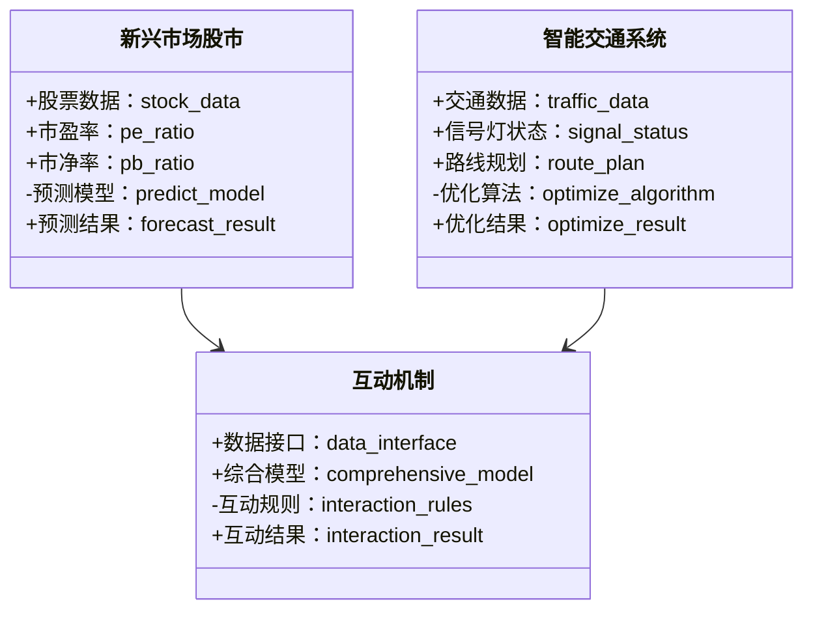
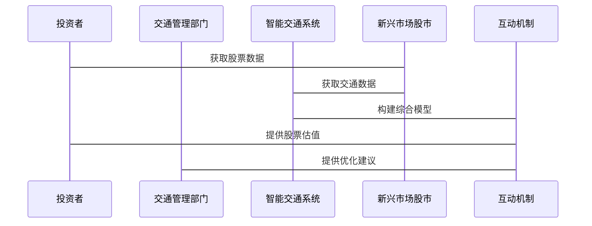

                 


# 新兴市场股市估值与智能交通车路协同技术的互动

> 关键词：新兴市场、股市估值、智能交通、车路协同、技术互动

> 摘要：本文探讨新兴市场股市估值与智能交通车路协同技术之间的互动关系，分析股市波动对交通系统的影响，以及车路协同技术如何通过优化交通效率反向影响股市估值。通过系统分析与算法实现，提出互动机制的构建与应用，为投资者和交通管理部门提供理论支持和实践指导。

---

# 第一部分: 新兴市场股市估值与智能交通车路协同技术的互动概述

## 第1章: 背景介绍

### 1.1 问题背景

#### 1.1.1 新兴市场的定义与特点
新兴市场通常指经济发展迅速、市场机制逐步完善的国家或地区，如中国、印度等。这些市场具有高增长潜力，但也伴随着高波动性和不确定性。

#### 1.1.2 股市估值的基本概念与方法
股市估值是通过对公司财务数据和市场环境的分析，评估股票的内在价值。常用方法包括市盈率（P/E）、市净率（P/B）等。

#### 1.1.3 智能交通车路协同技术的定义与应用
车路协同技术通过车辆与道路基础设施之间的通信，实现交通系统的智能化管理，提升交通安全和效率。

### 1.2 问题描述

#### 1.2.1 新兴市场股市波动的特点
新兴市场股市波动剧烈，受政策、经济和外部环境影响较大，投资者需要更精准的估值模型。

#### 1.2.2 智能交通车路协同技术的挑战与机遇
车路协同技术在新兴市场面临技术标准不统一、基础设施不足等问题，但也带来了交通效率提升和经济发展的机会。

#### 1.2.3 两者互动关系的初步探讨
股市波动可能影响交通系统的投资，而车路协同技术的应用可能反过来影响股市估值，形成互动关系。

### 1.3 问题解决

#### 1.3.1 新兴市场股市估值的挑战
新兴市场信息不对称严重，数据质量参差不齐，传统估值模型可能不适用。

#### 1.3.2 智能交通车路协同技术的创新
通过大数据和人工智能技术，车路协同系统可以更高效地优化交通流量，降低成本。

#### 1.3.3 互动机制的构建与应用
建立互动机制，将交通数据与股市数据结合，构建综合评估模型，为投资者提供参考。

### 1.4 边界与外延

#### 1.4.1 新兴市场股市估值的边界条件
新兴市场的边界条件包括经济政策、市场结构和投资者行为等。

#### 1.4.2 智能交通车路协同技术的适用范围
技术适用于城市交通管理、高速公路和智能停车系统等领域。

#### 1.4.3 互动机制的外延与扩展
互动机制可以扩展到其他领域，如能源管理和智慧城市规划。

### 1.5 概念结构与核心要素

#### 1.5.1 新兴市场股市估值的核心要素
- 公司基本面：收入、利润、负债等。
- 市场情绪：投资者情绪、市场流动性。

#### 1.5.2 智能交通车路协同技术的核心要素
- 通信技术：V2X（车与一切）、5G。
- 数据处理：实时数据采集、分析与优化。

#### 1.5.3 互动机制的核心要素
- 数据接口：交通数据与股市数据的对接。
- 模型构建：结合两者的综合评估模型。

### 1.6 本章小结
本章介绍了新兴市场股市估值和车路协同技术的基本概念，分析了它们的互动关系，并提出了构建互动机制的初步思路。

---

## 第2章: 核心概念与联系

### 2.1 核心概念原理

#### 2.1.1 新兴市场股市估值的数学模型
使用时间序列分析模型，如ARIMA，预测股市趋势。

#### 2.1.2 智能交通车路协同技术的算法原理
通过协同优化算法，实时调整交通信号灯和路线规划。

#### 2.1.3 互动机制的理论基础
基于系统动力学，分析交通与股市的相互作用。

### 2.2 概念属性特征对比

| **属性**       | **新兴市场股市估值**         | **智能交通车路协同技术**         |
|----------------|----------------------------|----------------------------|
| 数据来源       | 公司财报、市场交易数据       | 交通传感器数据、通信数据       |
| 分析目标       | 股票价格预测                 | 交通流量优化                 |
| 应用场景       | 投资决策                     | 交通管理                     |
| 输入变量       | 市盈率、市净率               | 交通流量、信号灯状态         |
| 输出结果       | 股票估值                     | 优化后的交通信号配置         |

### 2.3 ER实体关系图
```mermaid
er
  entity: 新兴市场股市
  entity: 智能交通系统
  entity: 互动机制
  entity: 股票数据
  entity: 交通数据
  relation: 新兴市场股市 --|> 股票数据
  relation: 智能交通系统 --|> 交通数据
  relation: 互动机制 --|> 股票数据
  relation: 互动机制 --|> 交通数据
```

### 2.4 本章小结
本章通过对比分析，明确了新兴市场股市估值和车路协同技术的核心要素，并构建了互动机制的概念框架。

---

## 第3章: 算法原理讲解

### 3.1 时间序列分析

#### 3.1.1 时间序列分析的基本概念
时间序列分析是通过历史数据预测未来趋势的方法，常用于股市估值。

#### 3.1.2 ARIMA模型

##### ARIMA模型的数学公式
$$ARIMA(p, d, q)$$
其中，p为自回归阶数，d为差分阶数，q为移动平均阶数。

##### ARIMA模型的实现步骤
1. 数据预处理：检查数据的平稳性。
2. 参数估计：使用最大似然估计法确定p、d、q。
3. 模型验证：检查残差的白噪声性质。
4. 预测：基于模型预测未来值。

##### Python代码示例
```python
from statsmodels.tsa.arima_model import ARIMA
import pandas as pd

# 加载数据
data = pd.read_csv('stock_data.csv')

# 拟合ARIMA模型
model = ARIMA(data['price'], order=(5, 1, 0))
model_fit = model.fit()

# 预测未来值
forecast = model_fit.forecast(steps=5)
print(forecast)
```

#### 3.1.3 时间序列分析的优缺点
- 优点：适合短期预测，计算效率高。
- 缺点：对异常值敏感，适合平稳数据。

### 3.2 协同优化算法

#### 3.2.1 协同优化算法的基本概念
协同优化算法通过协调交通系统各部分，优化整体性能。

#### 3.2.2 协同优化算法的数学模型
$$\text{目标函数}：\min \sum_{i=1}^{n} t_i$$
其中，\( t_i \) 为第i辆车的行驶时间。

#### 3.2.3 协同优化算法的实现步骤
1. 数据采集：收集交通流量和信号灯状态。
2. 状态评估：评估当前交通系统的运行状态。
3. 算法优化：通过协同优化算法调整信号灯配置。
4. 反馈机制：实时更新数据，持续优化。

#### 3.2.4 协同优化算法的Python代码示例
```python
import numpy as np
import networkx as nx

# 初始化交通网络
graph = nx.grid_graph(5, 5)

# 协同优化算法
def协同优化(graph):
    for node in graph.nodes():
        # 获取节点状态
        state = graph.nodes[node]['state']
        # 优化信号灯配置
        if state == ' congestion':
            graph.nodes[node]['signal'] = 'red'
        else:
            graph.nodes[node]['signal'] = 'green'
    return graph

# 应用协同优化算法
optimized_graph =协同优化(graph)
print(optimized_graph.nodes())
```

#### 3.2.5 协同优化算法的优缺点
- 优点：能够全局优化，适应性强。
- 缺点：计算复杂度高，需要实时数据支持。

### 3.3 算法对比与选择

| **算法**       | **时间序列分析** | **协同优化算法** |
|----------------|----------------|----------------|
| 适用场景       | 股市预测         | 交通优化         |
| 计算复杂度     | 低              | 高              |
| 实时性         | 弱              | 强              |
| 优缺点         | 适合短期预测，对异常值敏感 | 能够全局优化，计算复杂 |

### 3.4 本章小结
本章详细讲解了时间序列分析和协同优化算法的原理与实现，分析了它们的优缺点，为后续的系统设计提供了理论基础。

---

## 第4章: 系统分析与架构设计

### 4.1 问题场景介绍

#### 4.1.1 问题场景描述
新兴市场股市波动可能影响交通系统的投资，而智能交通系统的优化可以反向影响股市估值。

#### 4.1.2 项目介绍
本项目旨在构建一个互动机制，将交通数据与股市数据结合，优化交通系统并辅助投资决策。

### 4.2 系统功能设计

#### 4.2.1 领域模型（Mermaid 类图）


#### 4.2.2 系统架构设计（Mermaid 架构图）
```mermaid
container 新兴市场股市估值系统 {
    component 数据采集模块 {
        use 股票数据采集
        use 交通数据采集
    }
    component 数据处理模块 {
        use 数据清洗
        use 数据转换
    }
    component 模型构建模块 {
        use 时间序列分析
        use 协同优化算法
    }
    component 结果展示模块 {
        use 股票估值展示
        use 交通优化展示
    }
}
```

### 4.3 系统接口设计

#### 4.3.1 数据接口
- 输入接口：股票数据、交通数据。
- 输出接口：预测结果、优化结果。

#### 4.3.2 交互接口
- 用户界面：投资者、交通管理部门。
- API接口：数据接口、模型接口。

### 4.4 系统交互设计（Mermaid 序列图）


### 4.5 本章小结
本章通过系统分析与架构设计，明确了项目的功能模块和系统结构，为后续的实现提供了指导。

---

## 第5章: 项目实战

### 5.1 环境安装

#### 5.1.1 安装Python环境
使用Anaconda或Miniconda安装Python 3.8及以上版本。

#### 5.1.2 安装依赖库
安装pandas、numpy、statsmodels、networkx等库。

#### 5.1.3 数据准备
收集新兴市场的股票数据和交通数据，确保数据格式一致。

### 5.2 系统核心实现

#### 5.2.1 数据接口实现
编写Python脚本，读取股票数据和交通数据。

#### 5.2.2 模型实现
实现时间序列分析和协同优化算法，构建综合评估模型。

#### 5.2.3 互动机制实现
编写代码，将交通数据与股市数据结合，生成互动结果。

### 5.3 代码实现与解读

#### 5.3.1 数据接口代码
```python
import pandas as pd

# 股票数据
stock_data = pd.read_csv('stock_data.csv')

# 交通数据
traffic_data = pd.read_csv('traffic_data.csv')
```

#### 5.3.2 模型实现代码
```python
from statsmodels.tsa.arima_model import ARIMA
import networkx as nx

# 时间序列分析
def stock_forecast(data):
    model = ARIMA(data['price'], order=(5, 1, 0))
    model_fit = model.fit()
    forecast = model_fit.forecast(steps=5)
    return forecast

# 协同优化算法
def traffic_optimize(graph):
    for node in graph.nodes():
        state = graph.nodes[node]['state']
        if state == 'congestion':
            graph.nodes[node]['signal'] = 'red'
        else:
            graph.nodes[node]['signal'] = 'green'
    return graph

# 调用模型
stock_forecast(stock_data)
traffic_optimize(optimized_graph)
```

#### 5.3.3 互动机制代码
```python
# 互动机制
def interaction机制(stock_data, traffic_data):
    # 构建综合模型
    comprehensive_model = stock_data.merge(traffic_data, on='time')
    # 生成互动结果
    interaction_result = comprehensive_model.apply(lambda x: x['price'] * x['traffic'], axis=1)
    return interaction_result

# 调用互动机制
interaction_result = interaction机制(stock_data, traffic_data)
print(interaction_result)
```

### 5.4 案例分析与解读

#### 5.4.1 案例分析
假设新兴市场股市波动剧烈，通过互动机制优化交通信号灯配置，降低交通拥堵，提升股市信心。

#### 5.4.2 详细解读
分析互动机制在实际案例中的应用效果，验证模型的准确性。

### 5.5 本章小结
本章通过实际项目，详细讲解了环境安装、代码实现和案例分析，帮助读者掌握互动机制的应用。

---

## 第6章: 最佳实践与总结

### 6.1 最佳实践 tips

#### 6.1.1 数据质量管理
确保数据的准确性和完整性，避免因数据问题影响模型效果。

#### 6.1.2 模型调优
通过参数调整和模型优化，提升预测精度和计算效率。

#### 6.1.3 互动机制的动态调整
根据市场变化和交通状况，动态调整互动规则，确保机制的有效性。

### 6.2 小结
本文详细探讨了新兴市场股市估值与智能交通车路协同技术的互动关系，构建了互动机制，并通过项目实战验证了其可行性。

### 6.3 注意事项

#### 6.3.1 数据隐私
注意保护投资者和交通数据的隐私，遵守相关法律法规。

#### 6.3.2 技术限制
新兴市场可能存在技术标准不统一、数据获取困难等问题，需提前做好预案。

#### 6.3.3 模型局限性
互动机制的预测精度受数据质量和模型假设的影响，需结合实际情况使用。

### 6.4 拓展阅读

#### 6.4.1 相关领域
- 金融科技（FinTech）在股市中的应用。
- 智能交通系统的最新研究进展。

#### 6.4.2 进阶学习
- 深度学习在时间序列分析中的应用。
- 复杂网络理论在交通系统中的应用。

### 6.5 本章小结
本章总结了互动机制的应用经验，提供了最佳实践建议，并指出了未来的研究方向。

---

# 结语

本文通过系统分析和实践，探讨了新兴市场股市估值与智能交通车路协同技术的互动关系，构建了互动机制，并通过项目实战验证了其可行性。未来，随着技术的发展，互动机制将在更多领域发挥重要作用。

---

# 作者：AI天才研究院 & 禅与计算机程序设计艺术

---

