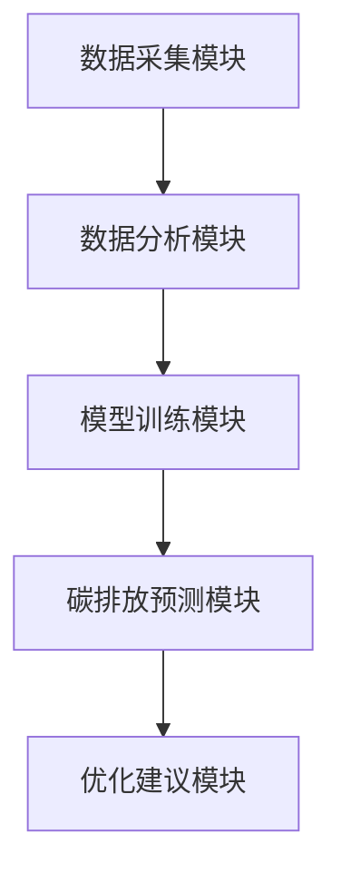
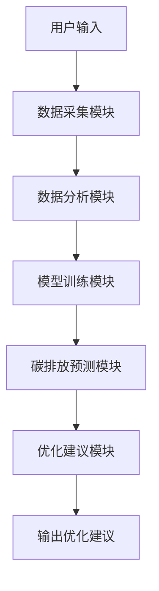

                 


# AI Agent在企业碳中和战略规划中的应用

## 关键词：AI Agent, 企业碳中和, 碳排放, 可持续发展, 人工智能

## 摘要：  
随着全球气候变化问题的加剧，企业碳中和目标的实现成为全球关注的焦点。AI Agent（人工智能代理）作为一种智能化的决策工具，正在被广泛应用于企业碳中和的战略规划中。本文将从AI Agent的基本概念、技术基础、应用场景、系统架构设计以及实际项目案例等方面，详细探讨AI Agent在企业碳中和战略中的应用价值与实现路径。通过分析碳排放数据、优化能源使用效率、预测碳排放趋势以及制定减排策略，AI Agent能够显著提升企业实现碳中和目标的能力，为企业提供科学、高效、可持续的解决方案。

---

## 第一部分：AI Agent与企业碳中和战略规划的背景与概念

### 第1章：碳中和与AI Agent概述

#### 1.1 碳中和的背景与挑战

##### 1.1.1 碳中和的定义与目标
碳中和是指企业、组织或个人在一定时间内，通过减少温室气体排放、增加碳汇等方式，使自身产生的碳排放总量与外界抵消的碳汇总量相等，实现净零排放。碳中和的目标是实现全球气候变化的可持续发展，减少对环境的破坏，推动绿色经济的发展。

##### 1.1.2 企业碳中和的必要性与挑战
企业实现碳中和的必要性在于：
1. **应对政策法规**：全球多个国家和地区正在制定严格的碳排放政策，企业如果不及时调整，可能面临罚款或市场准入限制。
2. **满足客户需求**：越来越多的消费者和客户倾向于选择环保型产品和服务，企业如果不降低碳排放，可能失去市场份额。
3. **降低运营成本**：通过优化能源使用效率，企业可以降低运营成本，提升竞争力。
4. **履行社会责任**：企业作为社会的重要组成部分，有责任减少碳排放，保护环境。

企业实现碳中和的主要挑战包括：
1. **数据获取与处理**：企业需要收集大量的碳排放数据，但数据来源多样、格式复杂，处理难度大。
2. **技术瓶颈**：碳中和需要技术创新支持，例如清洁能源技术、碳捕捉与封存技术等，但目前技术尚未完全成熟。
3. **成本问题**：实现碳中和需要大量的资金投入，企业可能面临资金不足的问题。
4. **员工意识与文化**：员工对碳中和的认知不足，可能影响企业的减排效果。

##### 1.1.3 AI技术在碳中和中的作用
AI技术可以通过以下方式助力碳中和：
1. **数据处理与分析**：AI可以快速处理大量碳排放数据，发现数据中的规律和趋势。
2. **预测与优化**：AI可以预测未来的碳排放趋势，并为企业提供最优的减排策略。
3. **实时监控与反馈**：AI可以通过实时监控企业的碳排放情况，及时调整生产计划，减少碳排放。
4. **决策支持**：AI可以为企业提供基于数据的决策支持，帮助企业在减排过程中做出最优决策。

---

#### 1.2 AI Agent的基本概念

##### 1.2.1 AI Agent的定义与特点
AI Agent（人工智能代理）是指能够感知环境、自主决策并采取行动以实现特定目标的智能体。AI Agent的特点包括：
1. **自主性**：AI Agent能够在没有外部干预的情况下自主运行。
2. **反应性**：AI Agent能够实时感知环境变化，并根据变化调整自己的行为。
3. **目标导向性**：AI Agent的行为都是为了实现特定的目标。
4. **学习能力**：通过机器学习技术，AI Agent可以不断优化自己的决策模型。

##### 1.2.2 AI Agent的核心功能与类型
AI Agent的核心功能包括：
1. **感知环境**：通过传感器或数据输入接口，AI Agent可以感知外部环境的状态。
2. **决策制定**：基于感知到的信息，AI Agent利用算法和模型制定决策。
3. **行动执行**：根据决策结果，AI Agent执行相应的动作，例如调整设备参数、优化能源使用等。

AI Agent的类型可以根据其智能水平和应用场景分为：
1. **反应式AI Agent**：基于当前感知的信息做出反应，不依赖历史数据。
2. **基于模型的AI Agent**：利用内部模型预测未来状态，并根据预测结果制定决策。
3. **学习型AI Agent**：通过机器学习技术不断优化自己的决策模型。

##### 1.2.3 AI Agent与传统决策系统的主要区别
与传统决策系统相比，AI Agent的主要区别在于：
1. **自主性**：AI Agent能够自主运行，而传统决策系统通常需要人工干预。
2. **实时性**：AI Agent能够实时感知环境并做出反应，而传统决策系统可能需要较长时间才能做出决策。
3. **学习能力**：AI Agent能够通过学习不断优化自己的决策模型，而传统决策系统通常不具备这种能力。

---

#### 1.3 企业碳中和战略中的AI Agent应用

##### 1.3.1 AI Agent在企业碳中和中的定位
在企业碳中和战略中，AI Agent可以作为企业的“智能参谋”，帮助企业在节能减排、能源管理、碳汇交易等领域制定最优策略。AI Agent可以实时监控企业的碳排放情况，分析数据并提供改进建议，帮助企业实现碳中和目标。

##### 1.3.2 AI Agent如何辅助企业实现碳中和目标
AI Agent可以通过以下方式辅助企业实现碳中和目标：
1. **数据分析与预测**：AI Agent可以分析企业的碳排放数据，预测未来的碳排放趋势，并为企业提供减排建议。
2. **优化能源使用**：AI Agent可以通过优化企业的能源使用效率，减少碳排放。
3. **碳汇交易支持**：AI Agent可以协助企业进行碳汇交易，帮助企业实现碳中和目标。
4. **实时监控与反馈**：AI Agent可以实时监控企业的碳排放情况，及时调整生产计划，确保企业始终在碳中和目标范围内。

##### 1.3.3 AI Agent在不同行业的潜在应用案例
1. **制造业**：AI Agent可以帮助企业优化生产流程，减少能源消耗，降低碳排放。
2. **能源行业**：AI Agent可以用于优化能源生产和分配，减少化石能源的使用，推动可再生能源的利用。
3. **交通行业**：AI Agent可以优化交通调度，减少交通拥堵，降低碳排放。
4. **服务业**：AI Agent可以优化服务流程，减少资源浪费，降低碳排放。

---

#### 1.4 本章小结
本章介绍了碳中和的背景与挑战，以及AI Agent的基本概念和在企业碳中和战略中的应用。通过分析碳中和的必要性和挑战，我们看到了AI技术在碳中和中的重要性。同时，我们还探讨了AI Agent的核心功能和类型，并展示了AI Agent在不同行业的潜在应用案例。这些内容为我们后续分析AI Agent在企业碳中和战略中的具体应用奠定了基础。

---

## 第二部分：AI Agent的技术基础与实现原理

### 第2章：AI Agent的核心技术基础

#### 2.1 AI Agent的算法原理

##### 2.1.1 基于强化学习的AI Agent算法
强化学习是一种通过试错方式来优化决策模型的机器学习方法。在碳中和场景中，强化学习可以用于优化企业的能源使用策略。例如，AI Agent可以通过强化学习算法，学习如何在不同的生产条件下选择最优的能源使用方案，以最小化碳排放。

**强化学习的基本流程：**
1. **状态识别**：AI Agent感知当前环境的状态，例如企业的能源使用情况、碳排放数据等。
2. **动作选择**：AI Agent根据当前状态，选择一个动作，例如调整设备的功率、优化生产流程等。
3. **奖励机制**：根据选择的动作带来的结果，AI Agent获得奖励或惩罚。奖励机制的设计是强化学习的核心，通常奖励与碳排放量、能源使用效率等指标相关。
4. **模型更新**：AI Agent根据奖励更新自己的决策模型，优化未来决策。

**强化学习的数学模型：**
强化学习的核心是通过Q-learning算法或其他类似算法，更新Q值（Q-value），表示在特定状态下采取某种动作所能获得的期望奖励。

$$ Q(s, a) = Q(s, a) + \alpha \cdot (r + \gamma \cdot \max_{a'} Q(s', a') - Q(s, a)) $$

其中：
- \( s \) 是当前状态
- \( a \) 是当前动作
- \( r \) 是获得的奖励
- \( \gamma \) 是折扣因子
- \( \alpha \) 是学习率

##### 2.1.2 基于监督学习的AI Agent算法
监督学习是一种基于标记数据的机器学习方法。在碳中和场景中，监督学习可以用于预测碳排放趋势。例如，AI Agent可以通过监督学习算法，学习如何根据历史碳排放数据预测未来的碳排放量。

**监督学习的基本流程：**
1. **数据收集**：收集企业的历史碳排放数据，包括时间、生产量、能源消耗等。
2. **特征提取**：从数据中提取有用的特征，例如生产量、能源类型、季节因素等。
3. **模型训练**：使用训练数据训练一个监督学习模型，例如线性回归、决策树、随机森林等。
4. **预测与评估**：使用训练好的模型预测未来的碳排放趋势，并评估预测结果的准确性。

**监督学习的数学模型：**
以线性回归为例，假设碳排放量 \( y \) 与生产量 \( x \) 之间的关系可以表示为：

$$ y = \beta_0 + \beta_1 x + \epsilon $$

其中：
- \( \beta_0 \) 是截距
- \( \beta_1 \) 是斜率
- \( \epsilon \) 是误差项

##### 2.1.3 基于生成对抗网络的AI Agent算法
生成对抗网络（GAN）是一种用于生成数据的深度学习模型。在碳中和场景中，GAN可以用于生成虚拟的碳排放数据，用于模型训练或模拟不同的生产场景。例如，AI Agent可以通过GAN生成大量的碳排放数据，模拟企业在不同生产条件下的碳排放情况。

**生成对抗网络的基本流程：**
1. **数据生成**：生成器（Generator）生成虚拟的碳排放数据。
2. **判别器判断**：判别器（Discriminator）判断生成的数据是否真实。
3. **模型优化**：生成器和判别器通过对抗训练不断优化模型，直到生成的数据能够欺骗判别器。

**生成对抗网络的数学模型：**
生成器的损失函数可以表示为：

$$ L_G = \log D(G(x)) $$

判别器的损失函数可以表示为：

$$ L_D = \log D(x) + \log (1 - D(G(x))) $$

其中：
- \( G \) 是生成器
- \( D \) 是判别器
- \( x \) 是真实数据

---

#### 2.2 AI Agent的模型构建

##### 2.2.1 神经网络模型在AI Agent中的应用
神经网络模型是AI Agent的核心技术之一。在碳中和场景中，神经网络可以用于碳排放预测、能源优化等任务。例如，AI Agent可以通过循环神经网络（RNN）或长短期记忆网络（LSTM）来预测未来的碳排放趋势。

**循环神经网络（RNN）的数学模型：**
RNN通过递归方式处理序列数据，可以捕捉时间序列中的依赖关系。其基本公式为：

$$ h_t = \text{tanh}(W_h h_{t-1} + W_x x_t + b) $$

其中：
- \( h_t \) 是当前时刻的隐藏状态
- \( W_h \) 是隐藏层权重
- \( W_x \) 是输入层权重
- \( b \) 是偏置项

##### 2.2.2 Transformer模型在AI Agent中的应用
Transformer模型是一种基于注意力机制的深度学习模型，在自然语言处理领域取得了巨大成功。在碳中和场景中，Transformer模型可以用于分析复杂的碳排放数据，捕捉数据中的长距离依赖关系。

**Transformer模型的数学模型：**
Transformer模型的核心是多头自注意力机制，其基本公式为：

$$ \text{Attention}(Q, K, V) = \text{softmax}\left( \frac{QK^T}{\sqrt{d_k}} \right)V $$

其中：
- \( Q \) 是查询向量
- \( K \) 是键向量
- \( V \) 是值向量
- \( d_k \) 是键的维度

##### 2.2.3 图神经网络在AI Agent中的应用
图神经网络（GNN）是一种用于处理图结构数据的深度学习模型。在碳中和场景中，GNN可以用于分析企业供应链中的碳排放情况，优化供应链的碳排放效率。

**图神经网络的数学模型：**
GNN通过聚合节点的邻居信息来更新节点表示，其基本公式为：

$$ h_v^{(l+1)} = \sigma \left( W_h h_v^{(l)} + W_a \sum_{u \in N(v)} h_u^{(l)} \right) $$

其中：
- \( h_v^{(l)} \) 是节点 \( v \) 在第 \( l \) 层的表示
- \( N(v) \) 是节点 \( v \) 的邻居节点集合
- \( W_h \) 和 \( W_a \) 是权重矩阵
- \( \sigma \) 是激活函数

---

#### 2.3 AI Agent的优化与调优

##### 2.3.1 超参数优化方法
AI Agent的性能很大程度上依赖于超参数的选择，例如学习率、批量大小、模型深度等。为了优化AI Agent的性能，可以通过网格搜索、随机搜索或贝叶斯优化等方法，找到最优的超参数组合。

**超参数优化的数学模型：**
以网格搜索为例，假设我们要优化两个超参数 \( \alpha \) 和 \( \beta \)，网格搜索的范围分别为 \( \alpha \in \{0.1, 0.2, 0.3\} \) 和 \( \beta \in \{1, 2, 3\} \)。我们可以遍历所有可能的组合，评估每个组合的性能，并选择性能最优的组合。

##### 2.3.2 模型压缩与轻量化技术
为了提高AI Agent的运行效率，可以采用模型压缩与轻量化技术，例如剪枝、知识蒸馏、量化等。这些技术可以在不显著降低模型性能的前提下，减少模型的参数数量，降低计算资源的消耗。

**模型压缩的数学模型：**
以剪枝为例，假设我们有一个深度神经网络模型，通过计算每个参数的重要性，我们可以移除对模型性能影响较小的参数，从而减少模型的大小。

##### 2.3.3 模型可解释性提升方法
为了更好地理解AI Agent的决策过程，可以采用模型可解释性提升方法，例如特征重要性分析、可视化解释、反向传播解释等。这些方法可以帮助企业更好地理解AI Agent的决策逻辑，确保AI Agent的决策符合企业的碳中和目标。

---

#### 2.4 本章小结
本章详细介绍了AI Agent的核心技术基础，包括强化学习、监督学习和生成对抗网络等算法原理，以及神经网络模型、Transformer模型和图神经网络等模型的构建方法。同时，我们还探讨了AI Agent的优化与调优方法，包括超参数优化、模型压缩和可解释性提升。这些内容为我们后续分析AI Agent在企业碳中和战略中的具体应用提供了技术基础。

---

## 第三部分：AI Agent在企业碳中和战略中的具体应用

### 第3章：AI Agent在企业碳排放数据分析中的应用

#### 3.1 碳排放数据的收集与处理

##### 3.1.1 数据来源与采集方法
碳排放数据的来源包括企业的生产过程、能源消耗、运输物流等。常见的数据采集方法包括：
1. **传感器数据**：通过安装在设备上的传感器，实时采集能源消耗、温度、湿度等数据。
2. **日志文件**：从企业的生产系统、能源管理系统中采集日志文件，获取碳排放相关数据。
3. **外部数据库**：从政府、行业组织等外部数据源获取碳排放相关数据。

##### 3.1.2 数据清洗与预处理
碳排放数据可能存在缺失、噪声、格式不一致等问题，需要进行数据清洗和预处理。常见的数据清洗方法包括：
1. **填补缺失值**：使用均值、中位数、插值法等方法填补缺失值。
2. **去除噪声数据**：通过异常检测方法，去除噪声数据。
3. **数据格式转换**：将数据转换为统一的格式，例如将日期格式统一为ISO格式。

##### 3.1.3 数据存储与管理
碳排放数据的存储与管理可以通过数据库、数据仓库或大数据平台实现。常见的数据存储方式包括：
1. **关系型数据库**：适用于结构化数据的存储，例如MySQL、PostgreSQL等。
2. **NoSQL数据库**：适用于非结构化数据的存储，例如MongoDB、Cassandra等。
3. **大数据平台**：适用于海量数据的存储与管理，例如Hadoop、Spark等。

---

#### 3.2 碳排放数据的可视化与分析

##### 3.2.1 数据可视化工具的选择与应用
数据可视化工具可以帮助企业更好地理解和分析碳排放数据。常见的数据可视化工具包括：
1. **Tableau**：功能强大，支持多种数据可视化方式，例如柱状图、折线图、热力图等。
2. **Power BI**：微软的商业智能工具，支持与Excel、SQL Server等数据源的集成。
3. **Python可视化库**：例如Matplotlib、Seaborn等，适用于编程人员进行定制化数据可视化。

##### 3.2.2 数据分析方法与模型
数据分析方法包括描述性分析、诊断性分析、预测性分析和规范性分析。在碳中和场景中，企业可以通过数据分析方法，识别碳排放的主要来源，分析碳排放的趋势，预测未来的碳排放情况，并制定相应的减排策略。

##### 3.2.3 数据驱动的碳排放优化策略
通过数据分析，企业可以制定数据驱动的碳排放优化策略。例如：
1. **优化能源使用**：通过分析能源消耗数据，识别能源浪费点，优化能源使用效率。
2. **减少运输碳排放**：通过分析运输数据，优化物流路线，减少运输过程中的碳排放。
3. **提高能源效率**：通过分析设备运行数据，优化设备运行参数，提高能源效率。

---

#### 3.3 AI Agent在碳排放预测中的应用

##### 3.3.1 碳排放预测模型的构建
碳排放预测模型的构建需要考虑数据特征、模型选择和评估指标。常见的数据特征包括时间、生产量、能源类型、地理位置等。模型选择可以根据数据特征和预测目标选择合适的模型，例如线性回归、时间序列模型、机器学习模型等。

##### 3.3.2 基于AI Agent的碳排放预测算法
基于AI Agent的碳排放预测算法可以通过强化学习、监督学习等方法实现。例如，使用强化学习算法优化预测模型的参数，或者使用监督学习算法训练一个碳排放预测模型。

##### 3.3.3 预测结果的验证与优化
碳排放预测结果的验证可以通过回测、交叉验证等方法实现。预测结果的优化可以通过调整模型参数、改进特征工程、引入外部数据等方式实现。

---

#### 3.4 本章小结
本章介绍了AI Agent在企业碳排放数据分析中的应用，包括数据的收集与处理、可视化与分析，以及碳排放预测。通过分析碳排放数据，企业可以识别碳排放的主要来源，分析碳排放的趋势，并制定相应的减排策略。同时，AI Agent可以通过预测碳排放趋势，帮助企业优化能源使用，减少碳排放。

---

## 第四部分：AI Agent的系统架构与实现

### 第4章：AI Agent的系统架构设计

#### 4.1 系统功能模块划分

##### 4.1.1 数据采集模块
数据采集模块负责从企业生产系统、能源管理系统等数据源采集碳排放数据。常见的数据采集方式包括：
1. **API接口**：通过API接口从生产系统获取实时数据。
2. **文件导入**：从本地文件中导入碳排放数据。
3. **数据库查询**：通过数据库查询获取历史碳排放数据。

##### 4.1.2 数据分析模块
数据分析模块负责对采集到的碳排放数据进行清洗、转换和分析。数据分析模块可以使用Python的Pandas库、SQL等工具进行数据处理，并使用统计分析方法对数据进行分析。

##### 4.1.3 模型训练模块
模型训练模块负责训练AI Agent的核心算法模型。模型训练模块需要选择合适的算法和模型，并通过训练数据优化模型参数。模型训练模块可以使用TensorFlow、PyTorch等深度学习框架进行模型训练。

##### 4.1.4 碳排放预测模块
碳排放预测模块负责基于训练好的模型，预测未来的碳排放趋势。碳排放预测模块需要输入预测参数，例如时间范围、生产计划等，并输出预测结果。

##### 4.1.5 优化建议模块
优化建议模块负责根据碳排放预测结果，生成优化建议。优化建议模块需要结合企业的实际情况，提出可行的减排策略，例如优化能源使用、调整生产计划等。

---

#### 4.2 系统架构设计

##### 4.2.1 系统功能设计
系统功能设计需要考虑系统的整体架构和模块之间的交互。例如，数据采集模块需要与数据分析模块、模型训练模块进行数据交互，碳排放预测模块需要与优化建议模块进行结果交互。

##### 4.2.2 系统架构图
以下是系统架构图的mermaid图：



##### 4.2.3 系统接口设计
系统接口设计需要考虑模块之间的接口定义和数据格式。例如，数据采集模块需要将数据传递给数据分析模块，数据格式可以是JSON或CSV。模型训练模块需要从数据分析模块获取处理后的数据，并返回训练好的模型。

##### 4.2.4 系统交互流程图
以下是系统交互流程图的mermaid图：



---

#### 4.3 本章小结
本章详细介绍了AI Agent系统的系统架构设计，包括功能模块划分、系统架构图、系统接口设计和系统交互流程图。通过系统架构设计，我们可以更好地理解AI Agent在企业碳中和战略中的实现方式。同时，系统架构设计也为后续的项目实战提供了理论基础。

---

## 第五部分：AI Agent的项目实战

### 第5章：AI Agent在企业碳中和战略中的项目实战

#### 5.1 项目背景与目标
假设我们正在为一家制造企业设计一个AI Agent系统，帮助企业实现碳中和目标。企业的主要碳排放来源是生产过程中的能源消耗，因此我们的目标是通过优化能源使用，减少碳排放。

#### 5.2 项目环境与工具安装
项目环境需要安装以下工具：
1. **Python**：用于编写AI Agent代码。
2. **TensorFlow/PyTorch**：用于训练AI Agent模型。
3. **Pandas**：用于数据处理。
4. **Matplotlib/Seaborn**：用于数据可视化。
5. **Mermaid**：用于绘制系统架构图和交互流程图。

#### 5.3 系统核心实现

##### 5.3.1 数据采集与处理
以下是数据采集与处理的Python代码示例：

```python
import pandas as pd

# 数据采集
# 假设我们从CSV文件中采集数据
data = pd.read_csv('carbon_emission.csv')

# 数据清洗
# 去除缺失值
data.dropna(inplace=True)

# 数据转换
# 将日期格式统一为ISO格式
data['timestamp'] = pd.to_datetime(data['timestamp'])
```

##### 5.3.2 模型训练与预测
以下是模型训练与预测的Python代码示例：

```python
import tensorflow as tf
from tensorflow.keras import layers

# 数据预处理
# 将数据分为训练集和测试集
train_data = data[:-100]
test_data = data[-100:]

# 构建模型
model = tf.keras.Sequential([
    layers.Dense(64, activation='relu'),
    layers.Dense(1, activation='linear')
])

# 编译模型
model.compile(optimizer='adam', loss='mean_squared_error')

# 训练模型
model.fit(train_data, epochs=100, batch_size=32)

# 预测
 predictions = model.predict(test_data)
```

##### 5.3.3 优化建议生成
以下是优化建议生成的Python代码示例：

```python
import numpy as np

# 假设我们有一个优化建议生成函数
def generate_recommendations(data, model):
    # 数据预处理
    processed_data = data.copy()
    processed_data['predicted_emission'] = model.predict(processed_data)
    
    # 生成优化建议
    recommendations = []
    for index, row in processed_data.iterrows():
        if row['predicted_emission'] > row['target']:
            recommendations.append(f"减少{row['predicted_emission'] - row['target']}单位碳排放")
    return recommendations

# 生成优化建议
recommendations = generate_recommendations(test_data, model)
print(recommendations)
```

#### 5.4 项目总结与优化
通过本项目实战，我们可以看到AI Agent在企业碳中和战略中的巨大潜力。然而，实际应用中还需要考虑以下问题：
1. **数据隐私**：企业的碳排放数据可能包含敏感信息，需要确保数据的安全性和隐私性。
2. **模型可解释性**：AI Agent的决策需要透明，以便企业能够理解并信任AI Agent的建议。
3. **实时性**：AI Agent需要能够实时监控企业的碳排放情况，并及时调整策略。

---

## 第六部分：总结与展望

### 第6章：总结与展望

#### 6.1 本章总结
本文详细探讨了AI Agent在企业碳中和战略规划中的应用，从背景与概念、技术基础、具体应用、系统架构到项目实战，全面分析了AI Agent在碳中和中的潜力与实现路径。通过分析碳排放数据、优化能源使用效率、预测碳排放趋势以及制定减排策略，AI Agent能够显著提升企业实现碳中和目标的能力。

#### 6.2 未来展望
未来，随着AI技术的不断发展，AI Agent在企业碳中和战略中的应用将更加广泛和深入。以下是未来可能的发展方向：
1. **多模态AI Agent**：结合视觉、听觉等多种模态信息，提升AI Agent的感知能力。
2. **强化学习优化**：通过强化学习算法的不断优化，提升AI Agent的决策能力。
3. **区块链技术结合**：通过区块链技术，确保碳排放数据的安全性和透明性。
4. **边缘计算结合**：通过边缘计算技术，提升AI Agent的实时性和响应速度。

---

## 作者：AI天才研究院/AI Genius Institute & 禅与计算机程序设计艺术 /Zen And The Art of Computer Programming

---

**总结：**  
本文通过系统地分析AI Agent在企业碳中和战略规划中的应用，为企业实现碳中和目标提供了理论支持和实践指导。未来，随着技术的不断进步，AI Agent将在企业碳中和战略中发挥越来越重要的作用，为全球气候变化的可持续发展做出贡献。

