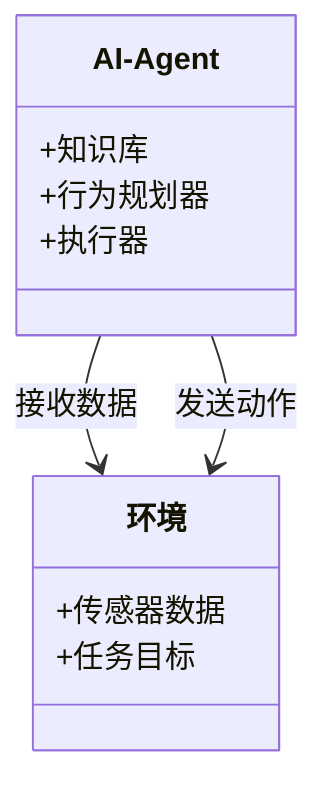
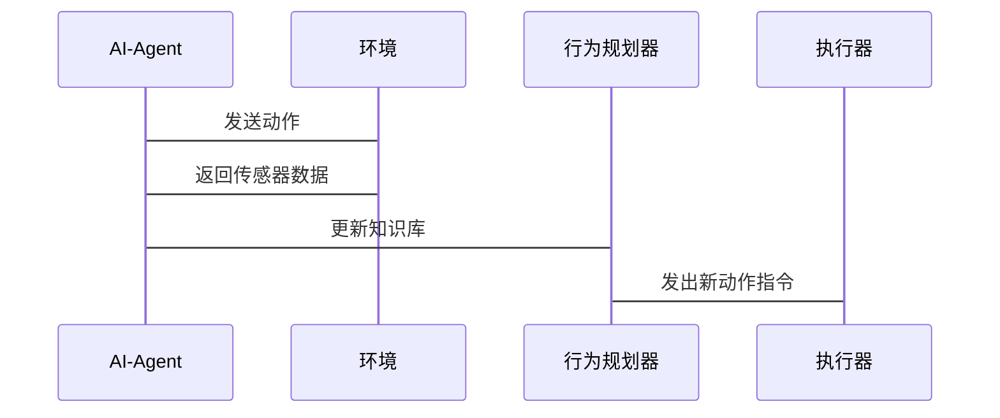

                 


```markdown
# AI Agent在智能太空探索中的实践

> 关键词：AI Agent，智能太空探索，强化学习，机器人，算法原理

> 摘要：本文探讨了AI Agent在智能太空探索中的实践应用，从基础概念到算法原理，再到系统架构和项目实战，全面解析AI Agent如何助力太空探索任务。

---

## 第一部分: AI Agent在智能太空探索中的基础

### 第1章: AI Agent概述

#### 1.1 AI Agent的基本概念
##### 1.1.1 什么是AI Agent
AI Agent是一种智能体，能够在环境中感知、推理、规划和执行任务，具备自主决策的能力。

##### 1.1.2 AI Agent的定义与特点
- **定义**：AI Agent是一个能够感知环境、做出决策并执行动作的智能实体。
- **特点**：
  - 自主性：无需外部干预，自主完成任务。
  - 反应性：能够实时感知环境变化并做出反应。
  - 智能性：具备推理和学习能力，能够优化决策过程。

##### 1.1.3 AI Agent的核心要素
- **知识表示**：将任务相关的信息结构化表示。
- **行为规划**：制定实现目标的行动步骤。
- **状态感知**：通过传感器获取环境信息。

#### 1.2 AI Agent在太空探索中的应用背景
##### 1.2.1 太空探索的挑战与需求
- **极端环境**：太空中的高温、辐射等极端条件对设备和算法提出了更高要求。
- **通信延迟**：地球与太空设备的通信存在延迟，需要设备具备自主决策能力。
- **资源有限**：太空任务中资源（如能源、数据传输带宽）有限，要求算法高效优化。

##### 1.2.2 AI Agent在太空任务中的优势
- **高效决策**：AI Agent能够快速处理数据，做出最优决策。
- **适应性**：能够在复杂多变的环境中调整策略，适应新情况。
- **实时性**：在任务执行中实时调整，确保任务顺利完成。

##### 1.2.3 当前AI Agent在太空探索中的应用现状
- **NASA的Mars Rover**：使用AI Agent进行自主导航和样本采集。
- **ESA的JUICE探测器**：利用AI Agent进行科学数据的自主收集与分析。

---

### 第2章: AI Agent的核心概念与原理

#### 2.1 AI Agent的核心概念
##### 2.1.1 知识表示
- **知识表示方法**：
  - **逻辑表示**：使用逻辑规则表示知识。
  - **语义网络**：通过节点和边表示概念及其关系。
  - **概率表示**：使用概率模型表示不确定性知识。

##### 2.1.2 行为规划
- **规划类型**：
  - **全局规划**：制定长期任务规划。
  - **局部规划**：针对具体问题制定短期行动方案。
  - **动态规划**：根据环境变化实时调整规划。

##### 2.1.3 状态感知
- **感知方式**：
  - **基于模型**：通过预定义的模型推断状态。
  - **基于数据**：通过传感器数据直接感知状态。
  - **混合感知**：结合模型和数据进行状态估计。

#### 2.2 AI Agent的决策机制
##### 2.2.1 强化学习
- **强化学习**：通过与环境互动，学习最优策略。
  - **奖励机制**：根据任务完成情况给予奖励或惩罚。
  - **策略优化**：通过不断试错，优化决策策略。

##### 2.2.2 监督学习
- **监督学习**：基于标注数据训练模型。
  - **分类任务**：将输入数据分类到预定类别。
  - **回归任务**：预测连续值。

##### 2.2.3 混合学习
- **混合学习**：结合强化学习和监督学习的优势。
  - 在已知环境中使用监督学习，未知环境中使用强化学习。

#### 2.3 AI Agent的通信与协作
##### 2.3.1 多智能体系统
- **多智能体协作**：多个AI Agent协同工作，完成复杂任务。
  - **任务分配**：根据各智能体的能力分配任务。
  - **信息共享**：智能体之间共享信息，提高整体效率。

##### 2.3.2 跨-Agent通信
- **通信方式**：
  - **直接通信**：智能体之间直接交换信息。
  - **间接通信**：通过中间媒介传递信息。
  - **混合通信**：结合直接和间接方式。

##### 2.3.3 协作任务分配
- **任务分配算法**：
  - **基于角色分配**：根据任务需求分配角色。
  - **基于能力分配**：根据智能体的能力分配任务。

---

### 第3章: AI Agent的算法原理

#### 3.1 强化学习算法
##### 3.1.1 Q-Learning算法
- **算法原理**：
  - 状态-动作-奖励-状态（SARSA）循环。
  - 通过Q表记录状态-动作对的期望奖励。
  - 更新公式：
    $$ Q(s,a) = Q(s,a) + \alpha [r + \gamma \max Q(s',a') - Q(s,a)] $$
    其中，$\alpha$ 是学习率，$\gamma$ 是折扣因子。

##### 3.1.2 DQN算法
- **DQN（Deep Q-Network）**：
  - 使用深度神经网络近似Q值函数。
  - 通过经验回放和目标网络优化。
  - 损失函数：
    $$ \mathcal{L} = \mathbb{E}[(r + \gamma Q(s',a') - Q(s,a))^2] $$

##### 3.1.3 策略梯度算法
- **策略梯度**：
  - 直接优化策略，而非Q值。
  - 使用概率梯度下降方法更新参数。
  - 更新公式：
    $$ \theta = \theta + \alpha \nabla_\theta J(\theta) $$

#### 3.2 聚类与分类算法
##### 3.2.1 K-means算法
- **K-means算法**：
  - 将数据划分为K个簇。
  - 簇中心初始化、迭代优化。
  - 目标函数：
    $$ \sum_{i=1}^{k} \sum_{x \in C_i} (x - \mu_i)^2 $$

##### 3.2.2 支持向量机
- **SVM（Support Vector Machine）**：
  - 用于分类和回归。
  - 寻找最优超平面，最大化类别间隔。
  - 对线性不可分数据使用核函数扩展。

##### 3.2.3 随机森林
- **Random Forest**：
  - 集成多个决策树，提高准确性和鲁棒性。
  - 通过特征抽取和样本抽取生成弱分类器。

#### 3.3 自然语言处理算法
##### 3.3.1 Transformer模型
- **Transformer架构**：
  - 基于自注意力机制，处理序列数据。
  - 包含编码器和解码器，用于机器翻译等任务。

##### 3.3.2 BERT模型
- **BERT（Bidirectional Encoder Representations from Transformers）**：
  - 预训练语言模型，支持双向编码。
  - 用于文本理解、问答系统等任务。

##### 3.3.3 GPT模型
- **GPT（Generative Pre-trained Transformer）**：
  - 预训练语言模型，擅长生成任务。
  - 用于文本生成、对话系统等。

---

### 第4章: AI Agent的数学模型与公式

#### 4.1 强化学习的数学模型
##### 4.1.1 Q-Learning的数学公式
$$ Q(s,a) = Q(s,a) + \alpha [r + \gamma \max Q(s',a') - Q(s,a)] $$
- **解释**：更新Q值，$\alpha$是学习率，$\gamma$是折扣因子。

##### 4.1.2 DQN的数学公式
$$ \text{损失函数} = \mathbb{E}[(r + \gamma Q(s',a') - Q(s,a))^2] $$
- **解释**：通过均方误差损失函数优化Q值。

#### 4.2 聚类算法的数学模型
##### 4.2.1 K-means算法的数学公式
$$ \sum_{i=1}^{k} \sum_{x \in C_i} (x - \mu_i)^2 $$
- **解释**：目标是最小化簇内平方距离之和。

##### 4.2.2 支持向量机的数学公式
$$ \text{最大化} \sum_{i=1}^n y_i (w \cdot x_i + b) + \frac{1}{2} w^T w $$
- **约束条件**：
  $$ y_i (w \cdot x_i + b) \geq 1 - \xi_i $$
  $$ \xi_i \geq 0 $$

---

### 第5章: AI Agent的系统架构设计

#### 5.1 问题场景介绍
##### 5.1.1 太空探测任务
- **任务目标**：例如，火星探测任务中的导航、样本采集等。
- **环境特征**：低光照、高温、通信延迟等。

#### 5.2 系统功能设计
##### 5.2.1 领域模型（Mermaid类图）


##### 5.2.2 系统架构（Mermaid架构图）


##### 5.2.3 系统交互（Mermaid序列图）


#### 5.3 系统接口设计
##### 5.3.1 数据接口
- **输入接口**：传感器数据、任务目标。
- **输出接口**：动作指令、状态反馈。

##### 5.3.2 通信接口
- **上行链路**：接收地面控制中心指令。
- **下行链路**：发送任务进展数据。

---

### 第6章: AI Agent的项目实战

#### 6.1 环境安装
##### 6.1.1 安装Python和相关库
```bash
pip install numpy matplotlib scikit-learn tensorflow
```

#### 6.2 系统核心实现源代码
##### 6.2.1 强化学习代码示例
```python
import numpy as np

class QLearningAgent:
    def __init__(self, state_space, action_space, alpha=0.1, gamma=0.9):
        self.state_space = state_space
        self.action_space = action_space
        self.Q = np.zeros((state_space, action_space))
        self.alpha = alpha
        self.gamma = gamma

    def act(self, state):
        return np.argmax(self.Q[state, :])

    def update(self, state, action, reward, next_state):
        target = reward + self.gamma * np.max(self.Q[next_state, :])
        self.Q[state, action] += self.alpha * (target - self.Q[state, action])
```

##### 6.2.2 应用解读与分析
- **代码功能**：
  - 初始化Q表，记录状态-动作对的Q值。
  - 根据当前状态选择动作。
  - 更新Q值，基于奖励和下一步状态的最大Q值。

---

### 第7章: 总结与展望

#### 7.1 最佳实践 tips
- **模块化设计**：将AI Agent分解为可复用的模块。
- **数据质量**：确保训练数据的多样性和代表性。
- **实时性优化**：优化算法，确保在高延迟环境下仍能快速决策。

#### 7.2 小结
AI Agent在智能太空探索中具有重要的应用价值，通过高效的知识表示、智能的决策机制和强大的算法支持，能够显著提升太空任务的效率和成功率。

#### 7.3 注意事项
- **算法选择**：根据具体任务需求选择合适的算法。
- **环境适应**：确保AI Agent能够适应极端太空环境。
- **安全性**：设计安全的通信机制，防止数据泄露或被篡改。

#### 7.4 拓展阅读
- **推荐书籍**：《强化学习（A Reinforcement Learning Approach）》。
- **推荐论文**：Nature的DQN论文。

---

### 附录: 算法代码示例

#### 附录A: 强化学习代码
```python
import gym

env = gym.make('CartPole-v0')
agent = QLearningAgent(env.observation_space.shape[0], env.action_space.n)

for episode in range(1000):
    state = env.reset()
    total_reward = 0
    done = False
    while not done:
        action = agent.act(state)
        next_state, reward, done, _ = env.step(action)
        agent.update(state, action, reward, next_state)
        total_reward += reward
        state = next_state
    print(f'Episode {episode}: Total Reward = {total_reward}')
```

---

作者：AI天才研究院/AI Genius Institute & 禅与计算机程序设计艺术 /Zen And The Art of Computer Programming
```

