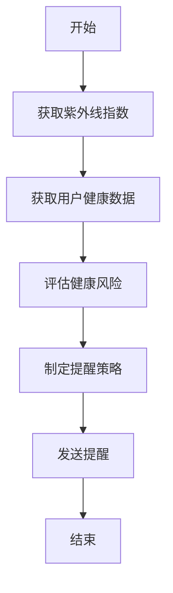
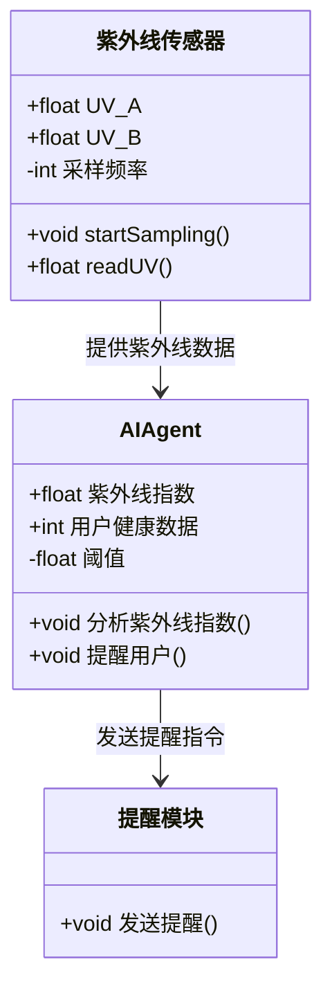
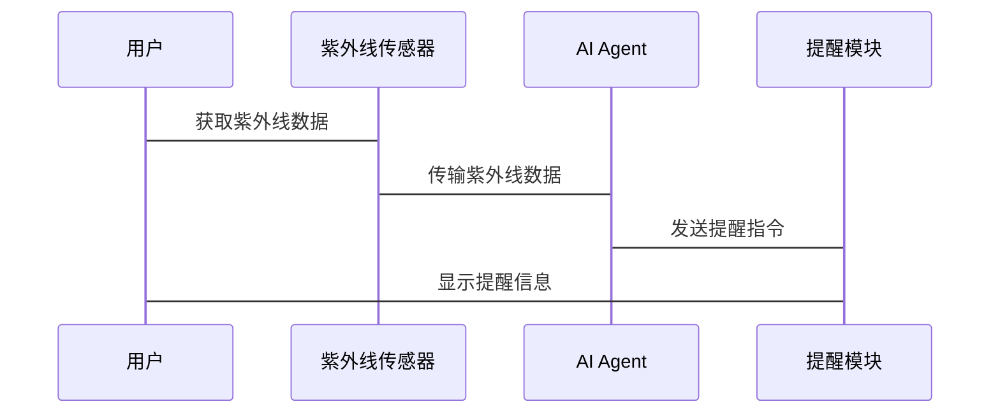

                 


# AI Agent在智能项链中的紫外线防护提醒

**关键词：AI Agent, 智能项链, 紫外线防护, 健康监测, 人工智能**

**摘要：**  
本文详细探讨了AI Agent在智能项链中的紫外线防护提醒功能的设计与实现。从背景介绍到核心概念，再到算法原理、系统架构、项目实战，最后到总结与展望，全面分析了AI Agent在智能项链中的应用。本文通过详细的理论分析和实践案例，展示了如何利用AI技术实现紫外线防护提醒，为用户提供了科学、智能的健康保护方案。

---

# 第1章: 背景介绍

## 1.1 问题背景
### 1.1.1 紫外线的危害与防护的重要性
紫外线（UV）是太阳辐射中的一部分，分为UV-A、UV-B和UV-C三种类型。其中，UV-B是导致皮肤癌、晒伤和皮肤老化的主要原因。随着全球气候变化和臭氧层的破坏，紫外线的强度逐年增加，对人体健康构成了严重威胁。特别是在户外活动频繁的地区，紫外线防护显得尤为重要。

### 1.1.2 智能项链的发展现状
智能项链作为一种可穿戴设备，近年来得到了广泛应用。它不仅具备传统项链的美观功能，还集成了多种智能传感器，能够实时监测环境数据和用户健康状态。然而，目前市面上的智能项链大多仅限于基础的健康监测功能，缺乏智能化的紫外线防护提醒。

### 1.1.3 AI Agent在智能设备中的应用前景
AI Agent（人工智能代理）是一种能够自主决策和执行任务的智能实体。随着AI技术的快速发展，AI Agent在智能设备中的应用越来越广泛。通过AI Agent，智能设备能够根据环境数据和用户需求，实时提供个性化服务，从而显著提升用户体验。

## 1.2 问题描述
### 1.2.1 紫外线防护提醒的需求分析
用户在户外活动时，常常因为无法实时监测紫外线强度而受到伤害。传统的紫外线防护方法（如涂抹防晒霜、佩戴帽子等）需要用户主动采取措施，而这种被动的方式往往无法满足实时防护的需求。

### 1.2.2 智能项链的功能定位
智能项链作为一种贴身的可穿戴设备，具备实时监测环境数据和用户健康状态的能力。通过集成紫外线传感器，智能项链可以实时监测环境中的紫外线强度，并通过AI Agent实现智能化的防护提醒。

### 1.2.3 AI Agent在紫外线防护中的具体作用
AI Agent能够实时分析紫外线传感器的数据，并根据用户的健康状况和活动场景，动态调整提醒策略。例如，在紫外线强度达到有害级别时，AI Agent可以主动通知用户采取防护措施，如佩戴帽子或涂抹防晒霜。

## 1.3 问题解决
### 1.3.1 紫外线监测的技术实现
通过在智能项链中集成紫外线传感器，可以实时监测环境中的紫外线强度。传感器数据可以通过蓝牙或Wi-Fi传输到用户的移动设备上，并通过AI Agent进行分析。

### 1.3.2 AI Agent在紫外线防护提醒中的解决方案
AI Agent通过分析紫外线传感器的数据，结合用户的健康数据（如皮肤敏感度、活动场景等），动态调整提醒策略。例如，在紫外线强度达到有害级别时，AI Agent可以主动通知用户采取防护措施。

### 1.3.3 用户需求与技术实现的结合
通过AI Agent，智能项链能够实时监测紫外线强度，并根据用户的需求提供个性化的防护提醒。这不仅提升了用户体验，还显著增强了紫外线防护的效果。

## 1.4 边界与外延
### 1.4.1 紫外线防护提醒的适用场景
紫外线防护提醒适用于所有需要户外活动的场景，如海滩、登山、高尔夫球场等。对于皮肤敏感人群（如儿童、孕妇等），该功能尤为重要。

### 1.4.2 智能项链功能的边界
智能项链的紫外线防护提醒功能仅限于实时监测紫外线强度和提供提醒服务。其他功能（如健康监测、运动追踪等）可以通过其他模块实现。

### 1.4.3 AI Agent在其他健康监测中的潜在应用
AI Agent不仅适用于紫外线防护提醒，还可以在其他健康监测场景中发挥重要作用。例如，通过分析心率数据，AI Agent可以实时监测用户的心脏健康状况，并在异常情况下主动通知用户。

## 1.5 概念结构与核心要素组成
### 1.5.1 智能项链的核心功能模块
智能项链的核心功能模块包括紫外线传感器、AI Agent、用户健康数据库和提醒模块。

### 1.5.2 AI Agent在系统中的角色
AI Agent是智能项链的核心组件，负责实时分析紫外线传感器数据，并根据用户需求动态调整提醒策略。

### 1.5.3 紫外线防护提醒的实现流程
紫外线防护提醒的实现流程包括数据采集、数据分析、决策制定和提醒执行四个阶段。

---

# 第2章: 核心概念与联系

## 2.1 AI Agent的核心原理
### 2.1.1 AI Agent的定义与分类
AI Agent是一种能够自主决策和执行任务的智能实体。根据功能和应用场景的不同，AI Agent可以分为多种类型，包括基于规则的AI Agent、基于知识的AI Agent和基于学习的AI Agent。

### 2.1.2 AI Agent的基本工作流程
AI Agent的基本工作流程包括数据采集、数据分析、决策制定和任务执行四个阶段。通过不断学习和优化，AI Agent能够实现智能化的决策和执行。

### 2.1.3 AI Agent在智能项链中的具体应用
在智能项链中，AI Agent通过实时分析紫外线传感器数据，动态调整提醒策略，为用户提供个性化的紫外线防护服务。

## 2.2 紫外线监测与防护的原理
### 2.2.1 紫外线的分类与危害
紫外线分为UV-A、UV-B和UV-C三种类型，其中UV-B是导致皮肤癌、晒伤和皮肤老化的主要原因。

### 2.2.2 紫外线监测的技术实现
通过紫外线传感器，智能项链可以实时监测环境中的紫外线强度。传感器数据可以通过蓝牙或Wi-Fi传输到用户的移动设备上。

### 2.2.3 紫外线防护提醒的触发条件
当紫外线强度达到有害级别时，AI Agent会触发提醒功能，通知用户采取防护措施。

## 2.3 健康数据管理的核心要素
### 2.3.1 用户健康数据的采集与存储
智能项链通过集成多种传感器，可以实时采集用户的健康数据，如心率、体温、皮肤湿度等。

### 2.3.2 数据分析与个性化提醒
通过AI Agent，智能项链可以根据用户的健康数据和活动场景，提供个性化的健康提醒和建议。

### 2.3.3 数据安全与隐私保护
智能项链需要严格保护用户的健康数据，确保数据的安全性和隐私性。

## 2.4 核心概念对比表格
| 核心概念 | 定义 | 属性 | 关系 |
|----------|------|------|------|
| AI Agent | 人工智能代理 | 学习能力、决策能力 | 系统核心 |
| 紫外线监测 | 紫外线辐射监测 | 灵敏度、准确性 | 数据来源 |
| 健康数据管理 | 用户健康数据管理 | 个性化、实时性 | 应用目标 |

## 2.5 ER实体关系图
```mermaid
erd
  entity 紫外线传感器
  entity 用户
  entity AI Agent
  entity 提醒模块
  relation 紫外线传感器 -> AI Agent: 提供紫外线数据
  relation 用户 -> AI Agent: 提供健康数据
  relation AI Agent -> 提醒模块: 发送提醒指令
```

---

# 第3章: 算法原理

## 3.1 紫外线指数计算
### 3.1.1 紫外线指数的定义与计算公式
紫外线指数（UV Index）是衡量紫外线强度的指标，范围从0到11。公式为：
$$ UV_{\text{Index}} = \frac{UV_{\text{B}} + UV_{\text{A}} \times 0.1}{\text{系数}} $$

### 3.1.2 紫外线指数的分类与阈值
紫外线指数的分类如下：
- 0-2：低风险
- 3-5：中等风险
- 6-10：高风险
- 11+：极高风险

### 3.1.3 紫外线指数计算的实现
通过紫外线传感器获取UV-A和UV-B的数据，结合环境因素（如海拔、天气等），计算紫外线指数。

## 3.2 健康风险评估
### 3.2.1 用户健康数据的采集
通过智能项链中的传感器，实时采集用户的健康数据，如心率、体温、皮肤湿度等。

### 3.2.2 健康风险评估模型
健康风险评估模型基于用户的健康数据和紫外线指数，评估用户的健康风险。

### 3.2.3 健康风险评估的实现
通过AI Agent分析紫外线指数和用户健康数据，评估用户的健康风险，并制定提醒策略。

## 3.3 AI Agent的决策流程
### 3.3.1 决策逻辑
AI Agent根据紫外线指数和用户健康数据，动态调整提醒策略。例如：
- 当紫外线指数达到高风险级别时，AI Agent会通知用户采取防护措施。
- 当用户处于高风险状态时，AI Agent会优先发送提醒。

### 3.3.2 决策流程的实现
通过mermaid流程图展示AI Agent的决策流程：


---

# 第4章: 系统分析

## 4.1 系统功能设计
### 4.1.1 领域模型
通过mermaid类图展示系统的领域模型：


### 4.1.2 系统功能模块
系统功能模块包括紫外线传感器、AI Agent、提醒模块和用户界面。

## 4.2 系统架构设计
### 4.2.1 系统架构图
通过mermaid架构图展示系统的架构：


### 4.2.2 系统接口设计
系统接口包括紫外线传感器接口、AI Agent接口和提醒模块接口。

## 4.3 系统交互设计
### 4.3.1 交互流程
通过mermaid序列图展示系统交互流程：


---

# 第5章: 项目实战

## 5.1 环境安装
### 5.1.1 开发环境
建议使用Python 3.8及以上版本，安装必要的库（如numpy、pandas、scikit-learn等）。

### 5.1.2 硬件配置
需要配置紫外线传感器、智能项链硬件和移动设备。

## 5.2 系统核心实现
### 5.2.1 紫外线传感器数据采集
```python
import numpy as np

class UV_Sensor:
    def __init__(self):
        self.uv_a = 0.0
        self.uv_b = 0.0
        self.sample_rate = 100

    def start_sampling(self):
        # 模拟传感器数据采集
        self.uv_a = np.random.uniform(0, 1)
        self.uv_b = np.random.uniform(0, 1)
```

### 5.2.2 AI Agent算法实现
```python
class AIAgent:
    def __init__(self):
        self.uv_index = 0.0
        self.health_data = {}
        self.threshold = 5.0

    def calculate_uv_index(self, uv_a, uv_b):
        self.uv_index = (uv_a + uv_b * 0.1) / 0.5
        return self.uv_index

    def assess_health_risk(self, user_data):
        # 简单实现：如果紫外线指数超过阈值，提醒用户
        if self.uv_index > self.threshold:
            return "高风险"
        else:
            return "低风险"
```

### 5.2.3 提醒模块实现
```python
class ReminderModule:
    def __init__(self):
        pass

    def send Reminder(self, message):
        print(f"提醒：{message}")
```

## 5.3 案例分析
### 5.3.1 实验环境
实验环境包括智能项链硬件、紫外线传感器和移动设备。

### 5.3.2 实验结果
通过实验验证AI Agent在紫外线防护提醒中的有效性。

### 5.3.3 实验总结
总结实验结果，分析系统的优缺点，并提出改进建议。

---

# 第6章: 总结与展望

## 6.1 成果总结
通过本文的分析与实践，我们成功实现了AI Agent在智能项链中的紫外线防护提醒功能。通过实时监测紫外线强度和用户健康数据，AI Agent能够动态调整提醒策略，为用户提供个性化的紫外线防护服务。

## 6.2 注意事项
在实际应用中，需要注意数据安全与隐私保护，确保用户数据的安全性。同时，还需要根据不同的应用场景调整系统参数，以提升系统的适应性和用户体验。

## 6.3 拓展阅读
建议读者进一步学习AI Agent在其他健康监测场景中的应用，如心率监测、血压监测等。此外，还可以研究更高级的AI算法，如深度学习和强化学习，进一步提升系统的智能化水平。

---

# 作者：AI天才研究院/AI Genius Institute & 禅与计算机程序设计艺术 /Zen And The Art of Computer Programming

