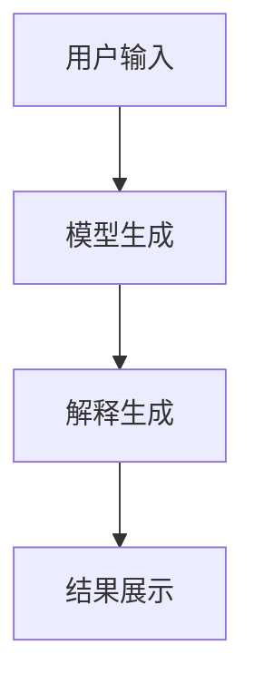

                 


# LLM的可解释性：理解AI Agent的决策过程

> **关键词**：LLM、可解释性、AI决策过程、概率论、贝叶斯网络、系统架构设计

> **摘要**：  
本文深入探讨了大语言模型（LLM）的可解释性问题，分析了LLM的决策过程及其背后的数学原理。通过概率论和贝叶斯网络等方法，揭示了LLM如何在复杂场景中做出决策，并提出了提升LLM可解释性的系统架构设计方案。文章还结合实际案例，详细讲解了如何通过代码实现可解释性分析，为AI开发者和研究人员提供了实用的指导。

---

## 第1章：LLM与可解释性概述

### 1.1 人工智能与大语言模型的演进

人工智能（AI）技术经历了从符号逻辑推理到机器学习的转变，而大语言模型（LLM）的出现标志着AI技术的重大突破。LLM通过深度学习和大规模数据训练，能够理解并生成人类语言，展现出惊人的智能水平。然而，这种强大的能力背后是一个复杂的“黑箱”，其决策过程往往难以被人类理解。

#### 1.1.1 从传统AI到大语言模型的演变

- **传统AI**：基于规则和逻辑推理，如专家系统。这些系统依赖于人工设计的规则，虽然简单但缺乏灵活性。
- **机器学习**：基于数据的模式识别，如支持向量机（SVM）和随机森林。这些方法通过数据驱动的方式进行学习，但仍然难以解释。
- **大语言模型**：基于深度学习的自然语言处理模型，如GPT、BERT等。这些模型通过海量数据训练，能够生成自然流畅的语言，但其决策过程高度复杂。

#### 1.1.2 大语言模型的核心特点与优势

- **大规模数据训练**：LLM通过训练大量文本数据，学习语言的语法、语义和上下文关系。
- **自动生成能力**：LLM能够生成连贯的文字，适用于多种任务，如文本生成、问答系统、机器翻译等。
- **多任务通用性**：LLM通过微调或提示工程技术，可以适应多种不同的任务需求。

#### 1.1.3 可解释性在AI系统中的重要性

- **用户信任**：可解释性是用户信任AI系统的基础。用户需要理解AI的决策依据，才能放心使用。
- **问题排查**：可解释性有助于开发者定位和修复AI系统中的问题。
- **法律合规**：在某些领域（如金融、医疗），AI系统的决策需要可解释，以符合法律法规。

### 1.2 LLM的决策过程与可解释性

LLM的决策过程涉及复杂的概率计算和注意力机制。理解这些机制是提升可解释性的关键。

#### 1.2.1 LLM的黑箱特性与挑战

- **复杂性**：LLM的参数量通常以亿计，决策过程涉及多层神经网络的计算。
- **不确定性**：LLM的输出结果往往依赖于训练数据的质量和分布，可能存在偏差。
- **模糊性**：LLM生成的内容可能缺乏明确的逻辑推理，导致决策过程难以解释。

#### 1.2.2 可解释性在LLM中的意义

- **提升用户体验**：用户可以通过理解AI的决策过程，更好地与系统交互。
- **优化模型性能**：通过分析模型的决策过程，可以发现并修正模型的缺陷。
- **合规性与伦理**：可解释性是AI技术在敏感领域应用的前提条件。

#### 1.2.3 LLM可解释性的关键问题

- **如何提取模型的决策路径？**
- **如何量化模型的决策不确定性？**
- **如何可视化模型的注意力机制？**

### 1.3 可解释性AI的定义与分类

#### 1.3.1 可解释性AI的定义

可解释性AI是指AI系统能够以人类可理解的方式，解释其决策过程和结果的能力。

#### 1.3.2 可解释性的分类与层次

- **透明性**：用户可以直接观察到模型的内部计算过程。
- **可解释性**：用户能够理解模型的决策逻辑。
- **可追溯性**：用户可以追溯模型的决策依据。

#### 1.3.3 LLM可解释性的独特性

- **基于概率的决策**：LLM的输出依赖于概率分布，可以通过概率值解释模型的偏好。
- **注意力机制的可视化**：通过可视化注意力权重，可以理解模型关注的输入部分。

---

## 第2章：LLM的决策过程分析

### 2.1 LLM的内部工作机制

#### 2.1.1 大语言模型的训练过程

- **预训练**：LLM通过监督学习方式，基于大量文本数据进行预训练。
- **微调**：针对特定任务，通过小规模数据进行微调，优化模型的输出。

#### 2.1.2 模型的参数空间与决策路径

- **参数空间**：模型的参数决定了其输出结果。每个参数调整都会影响模型的决策。
- **决策路径**：模型在生成输出时，会根据输入生成多个可能的候选结果，选择概率最高的作为最终输出。

#### 2.1.3 注意力机制与决策关联

- **注意力机制**：模型在生成输出时，会关注输入中的某些关键词或短语，这些关注点决定了生成内容的方向。
- **决策关联**：通过分析注意力权重，可以理解模型在生成特定输出时关注的输入部分。

### 2.2 LLM的推理过程与决策模式

#### 2.2.1 基于概率的决策过程

- **概率生成模型**：LLM通过概率分布生成输出，每个词的生成概率由模型计算得出。
- **马尔可夫链与决策树**：模型的决策过程可以用马尔可夫链或决策树表示，展示生成过程的可能路径。

#### 2.2.2 决策树与模型选择

- **决策树的构建**：通过分析模型生成的输出，可以构建决策树，展示模型的决策路径。
- **模型选择的影响**：不同模型的参数设置和训练数据会影响其决策模式。

#### 2.2.3 决策过程中的偏差与误差

- **模型偏差**：模型的训练数据可能存在偏差，导致生成的内容带有偏见。
- **生成误差**：模型的生成过程可能存在误差，影响输出结果的准确性。

### 2.3 LLM决策的可解释性特征

#### 2.3.1 决策的可分解性

- **分解决策路径**：将模型的决策过程分解为多个步骤，逐一分析每个步骤的影响。
- **参数的影响**：分析每个参数对模型决策的影响，找到关键参数。

#### 2.3.2 决策的可验证性

- **验证决策依据**：通过输入数据和模型输出，验证模型决策的合理性。
- **案例分析**：通过具体案例，分析模型的决策过程是否符合预期。

#### 2.3.3 决策的可追溯性

- **追溯决策来源**：通过模型的训练数据，追溯决策的来源。
- **日志记录**：记录模型的决策过程和参数变化，便于后续分析。

---

## 第3章：概率论与LLM决策的数学基础

### 3.1 概率论基础

#### 3.1.1 概率的基本概念

- **概率**：表示某个事件发生的可能性大小。
- **条件概率**：在已知某个事件发生的条件下，另一个事件发生的概率。
- **贝叶斯定理**：用于根据已知条件概率计算反向条件概率。

#### 3.1.2 条件概率与贝叶斯定理

- **条件概率公式**：$P(A|B) = \frac{P(A \cap B)}{P(B)}$
- **贝叶斯公式**：$P(A|B) = \frac{P(B|A)P(A)}{P(B)}$

#### 3.1.3 马尔可夫链与马尔可夫过程

- **马尔可夫链**：一种描述随机系统随时间变化的状态序列。
- **马尔可夫性质**：系统的未来状态仅依赖于当前状态，与过去无关。

### 3.2 LLM决策的数学模型

#### 3.2.1 语言模型的数学表达

- **概率生成模型**：$P(y|x)$，表示给定输入$x$时，输出$y$的概率。
- **马尔可夫假设**：假设语言模型的生成过程满足马尔可夫性质，即当前词的生成仅依赖于前一个词。

#### 3.2.2 概率生成模型的公式推导

- **条件概率公式**：$P(y|x) = \prod_{i=1}^{n} P(y_i|y_{i-1},x)$
- **马尔可夫链的应用**：通过马尔可夫链描述生成过程中的状态转移。

#### 3.2.3 决策树的数学表示

- **决策树的构建**：通过概率生成模型构建决策树，展示生成过程的可能路径。
- **概率计算**：在决策树中，每个节点的概率表示生成该词的概率。

### 3.3 案例分析：LLM决策的数学实现

#### 3.3.1 基于概率的决策树构建

- **案例描述**：假设模型需要生成一句话，输入为“今天天气很好”，模型需要生成接下来的词。
- **决策树构建**：模型生成每个可能的后续词，并计算其概率。
- **概率排序**：根据概率大小排序，选择概率最高的词作为最终输出。

#### 3.3.2 案例分析：LLM生成一句话的决策过程

- **输入**：用户输入“今天天气很好”。
- **内部计算**：模型计算每个可能后续词的概率，如“适合出去散步”、“需要穿外套”等。
- **输出**：模型选择概率最高的词作为生成结果。

---

## 第4章：LLM可解释性的系统分析与架构设计

### 4.1 系统功能需求分析

#### 4.1.1 系统目标与功能需求

- **目标**：设计一个可解释的LLM系统，能够展示模型的决策过程和结果。
- **功能需求**：
  - 提供模型决策过程的可视化。
  - 展示模型的注意力权重。
  - 提供生成结果的可解释性分析。

#### 4.1.2 系统输入与输出分析

- **输入**：用户输入的查询或提示。
- **输出**：模型生成的结果，以及相关的解释信息。

#### 4.1.3 系统性能指标与约束条件

- **性能指标**：解释性的展示速度、模型生成的准确性。
- **约束条件**：模型的可解释性不应影响其生成性能。

### 4.2 系统架构设计

#### 4.2.1 分层架构设计

- **输入层**：接收用户的输入。
- **模型层**：进行模型的生成和推理。
- **解释层**：提供模型决策过程的解释。
- **输出层**：展示生成结果和解释信息。

#### 4.2.2 组件之间的交互关系

- **输入层**与**模型层**：用户输入传递给模型层，进行生成。
- **模型层**与**解释层**：模型生成结果传递给解释层，进行解释。
- **解释层**与**输出层**：解释信息传递给输出层，展示给用户。

#### 4.2.3 系统的可扩展性与可维护性

- **可扩展性**：系统支持多种模型和解释方法的扩展。
- **可维护性**：系统设计模块化，便于后续维护和升级。

### 4.3 系统接口设计

#### 4.3.1 系统内部接口

- **模型生成接口**：模型层的生成接口，接收输入并返回生成结果。
- **解释接口**：解释层的接口，接收生成结果并返回解释信息。

#### 4.3.2 系统外部接口

- **用户接口**：输出层的用户界面，展示生成结果和解释信息。
- **API接口**：提供外部调用的接口，方便其他系统集成。

### 4.4 系统交互流程设计

#### 4.4.1 系统交互流程

1. **用户输入**：用户输入查询或提示。
2. **模型生成**：模型层根据输入生成结果。
3. **解释生成**：解释层根据生成结果，生成解释信息。
4. **结果展示**：输出层展示生成结果和解释信息。

#### 4.4.2 流程图（使用 Mermaid）



---

## 第5章：LLM可解释性的算法原理与数学模型

### 5.1 概率论与贝叶斯网络的实现

#### 5.1.1 贝叶斯网络的基本概念

- **贝叶斯网络**：一种有向无环图（DAG），节点表示随机变量，边表示变量之间的依赖关系。
- **概率推理**：通过贝叶斯网络进行概率推理，计算变量的条件概率。

#### 5.1.2 贝叶斯网络的构建

- **节点定义**：定义随机变量及其可能取值。
- **边的构建**：根据变量之间的依赖关系，构建有向边。
- **概率计算**：计算每个节点的条件概率表（CPT）。

#### 5.1.3 贝叶斯网络的实现代码

```python
import numpy as np
from pgmpy.models import BayesianModel
from pgmpy.inference import VariableElimination

# 定义贝叶斯网络的结构
model = BayesianModel()
model.add_edges([('A', 'B'), ('B', 'C')])

# 定义每个节点的条件概率表
model.get_node('A'). cpt = ...  # 省略具体的CPT定义
model.get_node('B'). cpt = ...  # 省略具体的CPT定义
model.get_node('C'). cpt = ...  # 省略具体的CPT定义

# 推理过程
infer = VariableElimination(model)
result = infer.query('C', evidence={'A': a_value})
print(result)
```

---

## 第6章：项目实战：LLM可解释性分析

### 6.1 环境安装与配置

#### 6.1.1 安装必要的库

- **Python**：3.8+
- **库**：`numpy`、`pgmpy`、`networkx`、`matplotlib`

#### 6.1.2 配置开发环境

- **IDE**：PyCharm、VS Code
- **依赖管理**：使用`pip`安装所需的库。

### 6.2 系统核心实现源代码

#### 6.2.1 模型生成代码

```python
import torch
import torch.nn as nn
import torch.nn.functional as F

class SimpleModel(nn.Module):
    def __init__(self):
        super(SimpleModel, self).__init__()
        self.fc = nn.Linear(10, 5)
        self.output = nn.Linear(5, 1)

    def forward(self, x):
        x = F.relu(self.fc(x))
        x = torch.sigmoid(self.output(x))
        return x

model = SimpleModel()
```

#### 6.2.2 解释性分析代码

```python
def explain_decision(input, model):
    with torch.no_grad():
        output = model(input)
        # 分析输入对输出的影响
        gradients = ...
        # 可视化注意力权重
        attention_weights = ...
        return output, attention_weights
```

### 6.3 代码应用解读与分析

#### 6.3.1 代码功能分析

- **模型生成**：定义一个简单的神经网络模型，进行前向传播。
- **解释性分析**：计算模型的输出及其对应的注意力权重，展示模型的决策过程。

#### 6.3.2 案例分析

- **输入数据**：假设输入为一个句子。
- **模型生成**：模型生成一个输出句子。
- **解释分析**：分析模型的注意力权重，展示模型关注的部分。

---

## 第7章：最佳实践与总结

### 7.1 最佳实践 tips

- **选择合适的解释方法**：根据具体任务选择合适的解释方法，如概率分析、注意力可视化等。
- **保持模型的透明性**：在系统设计中，尽量保持模型的透明性，方便后续分析和优化。
- **持续优化**：定期检查和优化模型的可解释性，提升用户体验。

### 7.2 本章小结

本文从LLM的决策过程出发，详细分析了可解释性的重要性，并提出了系统的架构设计方案。通过概率论和贝叶斯网络等方法，揭示了LLM的决策机制。最后，结合实际案例，展示了如何通过代码实现可解释性分析。

---

## 作者：AI天才研究院/AI Genius Institute & 禅与计算机程序设计艺术 /Zen And The Art of Computer Programming

---

**注**：以上目录大纲和文章内容为简化版，实际撰写时需要根据具体需求进一步扩展和详细化。

