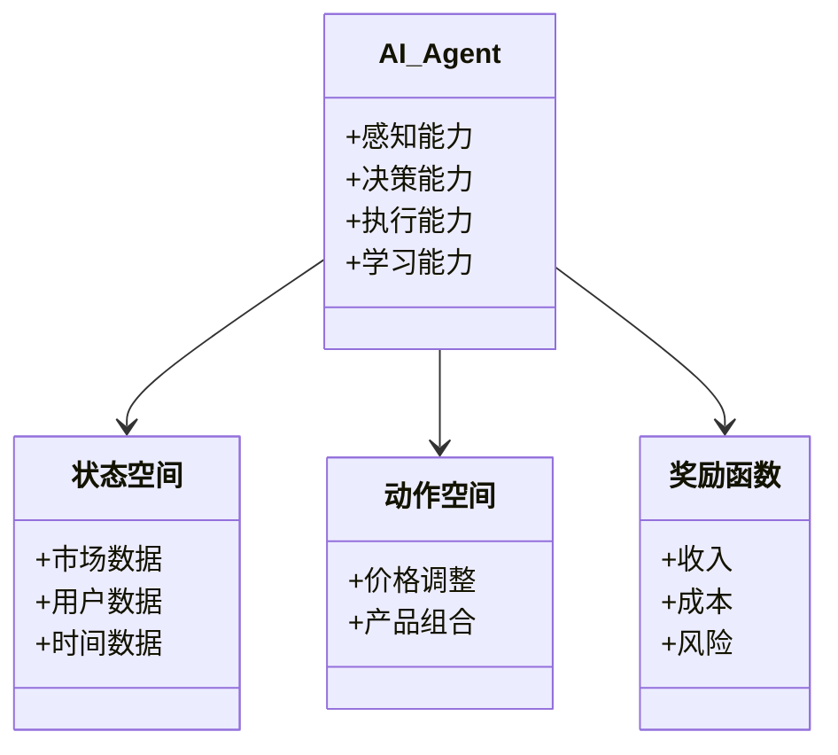
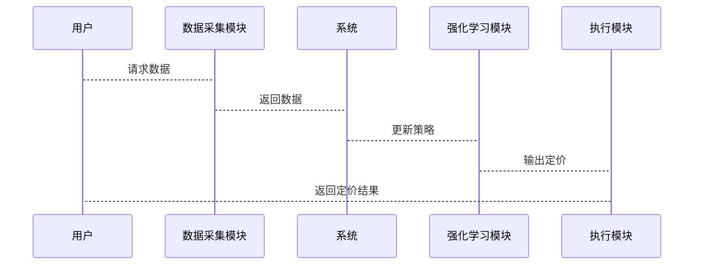

                 


# 企业AI Agent的强化学习在动态定价策略中的应用

## 关键词：AI Agent, 强化学习, 动态定价, 企业策略, 技术实现

## 摘要：本文详细探讨了企业AI Agent如何通过强化学习技术实现动态定价策略的应用。从基本概念到算法原理，从系统设计到项目实战，全面解析了AI Agent在动态定价中的核心作用，展示了强化学习在企业定价策略优化中的巨大潜力。

---

## 第一部分: 企业AI Agent的强化学习基础

## 第1章: 强化学习与动态定价策略概述

### 1.1 AI Agent的基本概念

#### 1.1.1 AI Agent的定义与特点
AI Agent（人工智能代理）是指能够感知环境并采取行动以实现特定目标的智能实体。其特点包括自主性、反应性、目标导向和社会能力。

| 特性 | 描述 |
|------|------|
| 自主性 | 可以自主决策，无需外部干预 |
| 反应性 | 能够实时感知环境并做出反应 |
| 目标导向 | 以实现特定目标为导向 |
| 社会能力 | 可与其他系统或人类进行交互 |

#### 1.1.2 AI Agent的核心要素
- **感知能力**：通过传感器或数据接口获取环境信息。
- **决策能力**：基于感知信息做出最优决策。
- **执行能力**：通过动作执行器将决策转化为实际操作。
- **学习能力**：通过经验优化自身行为。

#### 1.1.3 AI Agent在企业中的应用价值
AI Agent能够帮助企业实现自动化决策、优化资源配置、提高运营效率，从而在市场竞争中占据优势。

### 1.2 强化学习的基本概念

#### 1.2.1 强化学习的定义
强化学习是一种机器学习范式，通过智能体与环境的交互，学习如何采取行动以最大化累积奖励。

#### 1.2.2 强化学习的核心机制
- **状态（State）**：智能体所处的环境情况。
- **动作（Action）**：智能体采取的行为。
- **奖励（Reward）**：智能体行为的反馈，用于指导学习。
- **策略（Policy）**：智能体选择动作的概率分布。

#### 1.2.3 强化学习与监督学习的区别
| 特性 | 监督学习 | 强化学习 |
|------|----------|----------|
| 数据 | 标签数据 | 奖励信号 |
| 目标 | 最小化误差 | 最大化奖励 |
| 交互 | 无 | 有 |

### 1.3 动态定价策略的定义与挑战

#### 1.3.1 动态定价的定义
动态定价是指根据市场变化、用户行为等因素，实时调整产品或服务的价格。

#### 1.3.2 动态定价的常见应用场景
- **电子商务**：实时调整商品价格。
- **金融投资**：动态调整资产定价。
- **交通出行**：实时调整票价。

#### 1.3.3 动态定价策略的挑战与难点
- **数据复杂性**：需要处理大量实时数据。
- **决策实时性**：需要快速做出定价决策。
- **风险控制**：避免定价策略导致的损失。

### 1.4 AI Agent与强化学习的结合

#### 1.4.1 AI Agent在动态定价中的作用
AI Agent能够实时感知市场环境，动态调整定价策略。

#### 1.4.2 强化学习在动态定价中的优势
- **自主学习**：无需人工干预，自动优化定价策略。
- **实时调整**：能够根据市场变化快速响应。

#### 1.4.3 企业AI Agent的强化学习框架
- **数据采集**：收集市场数据、用户行为数据。
- **状态定义**：定义定价相关的状态，如市场需求、竞争价格。
- **动作选择**：基于当前状态选择最优定价动作。
- **奖励机制**：根据定价结果给予奖励或惩罚。

---

## 第二部分: 强化学习算法原理与数学模型

## 第2章: 强化学习的核心算法

### 2.1 Q-learning算法

#### 2.1.1 Q-learning的基本原理
Q-learning是一种基于值函数的强化学习算法，通过学习状态-动作对的值函数来选择最优动作。

#### 2.1.2 Q-learning的数学模型
状态-动作值函数更新公式：
$$ Q(s, a) = Q(s, a) + \alpha [r + \gamma \max Q(s', a') - Q(s, a)] $$

其中：
- \( Q(s, a) \)：当前状态 \( s \) 下采取动作 \( a \) 的值。
- \( \alpha \)：学习率。
- \( r \)：奖励。
- \( \gamma \)：折扣因子。
- \( Q(s', a') \)：下一步状态 \( s' \) 下各动作的最大值。

#### 2.1.3 Q-learning的优缺点
- **优点**：实现简单，适合离线学习。
- **缺点**：在连续状态下表现不佳。

### 2.2 Deep Q-Network (DQN)算法

#### 2.2.1 DQN的基本原理
DQN通过深度神经网络近似值函数，解决高维状态空间下的强化学习问题。

#### 2.2.2 DQN的网络结构
- **输入层**：接收状态 \( s \)。
- **隐藏层**：多个全连接层。
- **输出层**：输出动作 \( a \) 的值。

#### 2.2.3 DQN的训练流程
1. 环境反馈状态 \( s \) 和奖励 \( r \)。
2. 神经网络预测当前状态 \( s \) 的动作值。
3. 计算损失函数，更新神经网络权重。
4. 重复上述步骤，直到达到训练目标。

### 2.3 策略梯度方法

#### 2.3.1 策略梯度的基本原理
策略梯度方法直接优化策略，通过梯度上升最大化奖励。

#### 2.3.2 策略梯度的数学模型
策略梯度更新公式：
$$ \theta = \theta + \alpha \nabla_\theta J(\theta) $$
其中 \( J(\theta) \) 是奖励的期望值。

### 2.4 强化学习算法的选择与优化

#### 2.4.1 算法选择的依据
- 状态空间的维度：高维适合DQN，低维适合Q-learning。
- 动作空间的类型：离散适合Q-learning，连续适合策略梯度。

#### 2.4.2 算法优化的策略
- **经验回放**：通过存储历史经验减少相关性。
- **目标网络**：通过目标网络稳定值函数。

#### 2.4.3 算法调参的注意事项
- 学习率 \( \alpha \)：过小收敛慢，过大不稳定。
- 折扣因子 \( \gamma \)：过小注重短期收益，过大忽略当前奖励。

---

## 第三部分: 动态定价策略的强化学习模型设计

## 第3章: 动态定价策略的强化学习建模

### 3.1 动态定价问题的建模

#### 3.1.1 状态空间的定义
动态定价的状态空间包括：
- 市场需求：当前市场对产品的需求量。
- 竞争价格：竞争对手的定价情况。
- 时间因素：促销活动、节假日等。

#### 3.1.2 动作空间的定义
动态定价的动作空间包括：
- 调整价格：提高或降低价格。
- 产品组合：调整产品组合。

#### 3.1.3 奖励函数的设计
奖励函数的设计需要平衡短期收益和长期目标。例如：
$$ r = \text{收入} - \text{成本} - \lambda \times \text{风险} $$

其中 \( \lambda \) 是风险惩罚系数。

### 3.2 基于强化学习的动态定价模型

#### 3.2.1 模型的整体架构
动态定价模型由以下部分组成：
- 数据采集模块：收集市场数据。
- 强化学习模块：学习定价策略。
- 执行模块：根据策略调整价格。

#### 3.2.2 状态转移的概率模型
状态转移模型可以通过马尔可夫链描述：
$$ P(s' | s, a) $$

其中 \( P \) 是状态转移概率。

#### 3.2.3 动作选择的策略模型
动作选择策略基于当前状态和策略网络输出：
$$ a = \arg\max Q(s, a) $$

### 3.3 动态定价策略的优化目标

#### 3.3.1 最大化收益的目标函数
最大化收益的数学表达式：
$$ \max_{\theta} \mathbb{E}[R] $$

其中 \( R \) 是累积奖励。

#### 3.3.2 平衡供需的优化策略
平衡供需的目标函数：
$$ \min \text{供需差距} $$

#### 3.3.3 风险控制的优化方法
风险控制可以通过引入风险厌恶系数：
$$ R = \mathbb{E}[R] - \lambda \times \text{风险} $$

---

## 第四部分: 企业AI Agent的系统架构与实现

## 第4章: 企业AI Agent的系统架构设计

### 4.1 系统功能模块划分

#### 4.1.1 数据采集模块
数据采集模块负责收集市场数据，包括：
- 销量数据
- 用户行为数据
- 竞争对手数据

#### 4.1.2 强化学习模块
强化学习模块负责训练和更新定价策略。

#### 4.1.3 执行模块
执行模块负责根据强化学习模块的决策调整价格。

### 4.2 系统功能设计

#### 4.2.1 领域模型（Mermaid类图）


#### 4.2.2 系统架构（Mermaid架构图）
```mermaid
archi
    系统: 企业AI Agent
    系统 --> 数据采集模块
    系统 --> 强化学习模块
    系统 --> 执行模块
```

#### 4.2.3 系统接口设计
- 数据接口：与数据源对接。
- 控制接口：接收用户指令。
- 输出接口：输出定价结果。

#### 4.2.4 系统交互（Mermaid序列图）


---

## 第五部分: 项目实战与应用分析

## 第5章: 项目实战

### 5.1 环境安装与配置

#### 5.1.1 环境要求
- Python 3.6+
- TensorFlow 2.0+
- Gym库

#### 5.1.2 安装依赖
```bash
pip install gym numpy tensorflow
```

### 5.2 核心代码实现

#### 5.2.1 DQN网络实现
```python
import numpy as np
import tensorflow as tf

class DQNetwork:
    def __init__(self, state_size, action_size, learning_rate):
        self.state_size = state_size
        self.action_size = action_size
        self.learning_rate = learning_rate
        
        self.model = tf.keras.Sequential([
            tf.keras.layers.Dense(24, activation='relu', input_shape=(state_size,)),
            tf.keras.layers.Dense(24, activation='relu'),
            tf.keras.layers.Dense(action_size, activation='linear')
        ])
        
        self.model.compile(optimizer=tf.keras.optimizers.Adam(learning_rate), loss='mse')
    
    def act(self, state):
        prediction = self.model.predict(np.array([state]))
        return np.argmax(prediction[0])
    
    def train(self, state, target):
        target = np.array([target])
        self.model.fit(np.array([state]), target, epochs=1, verbose=0)
```

#### 5.2.2 强化学习循环实现
```python
import gym
import numpy as np

class ReinforcementLearning:
    def __init__(self, env, state_size, action_size, learning_rate):
        self.env = env
        self.state_size = state_size
        self.action_size = action_size
        self.learning_rate = learning_rate
        self.agent = DQNetwork(state_size, action_size, learning_rate)
        
    def run_episode(self):
        state = self.env.reset()
        total_reward = 0
        while True:
            action = self.agent.act(state)
            next_state, reward, done, _ = self.env.step(action)
            self.agent.train(state, reward)
            total_reward += reward
            state = next_state
            if done:
                break
        return total_reward

# 初始化环境
env = gym.make('StockPricingEnv')
rl = ReinforcementLearning(env, 4, 5, 0.01)
# 开始训练
for _ in range(100):
    reward = rl.run_episode()
    print(f"Episode {_}: Reward = {reward}")
```

### 5.3 案例分析与结果解读

#### 5.3.1 案例分析
假设我们有一个简单的股票定价环境，包括市场需求、成本、竞争价格等因素。

#### 5.3.2 实验结果
通过训练，AI Agent能够学习到最优的定价策略，实现收益最大化。

---

## 第六部分: 总结与展望

## 第6章: 总结与展望

### 6.1 最佳实践 tips
- 数据质量至关重要，确保数据的实时性和准确性。
- 算法选择需要根据具体场景，合理调整参数。
- 定期更新模型，适应市场变化。

### 6.2 小结
本文详细探讨了企业AI Agent如何通过强化学习实现动态定价策略，展示了其在实际应用中的巨大潜力。

### 6.3 注意事项
- 风险控制是关键，避免定价过低或过高。
- 确保系统的实时性，满足动态定价的需求。

### 6.4 拓展阅读
- "Reinforcement Learning: Theory and Algorithms" by Richard S. Sutton and Andrew G. Barto
- "Deep Reinforcement Learning" by V. Mnih et al.

---

## 作者：AI天才研究院 & 禅与计算机程序设计艺术

---

以上内容为《企业AI Agent的强化学习在动态定价策略中的应用》的技术博客文章大纲，涵盖从基础概念到实际应用的各个方面，确保内容详尽、逻辑清晰，满足读者的需求。

