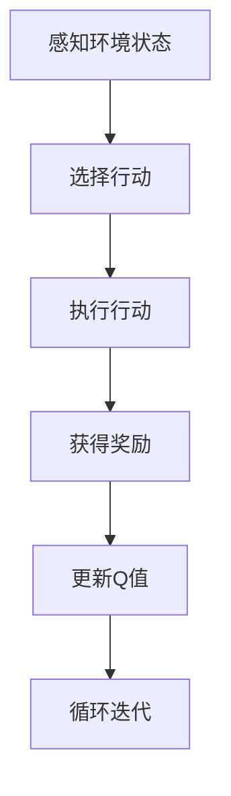
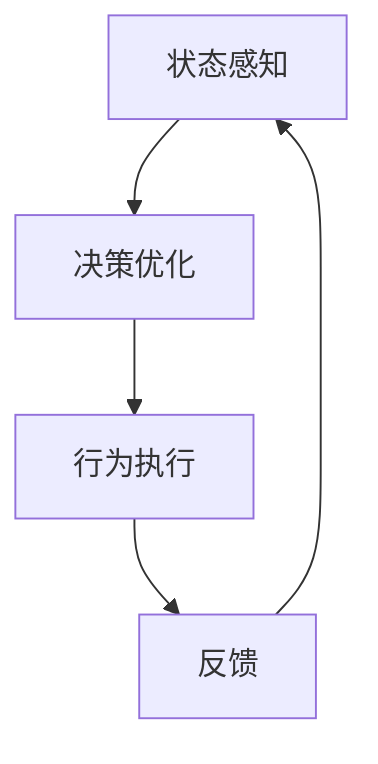
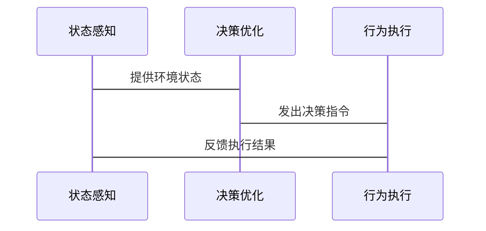

                 


# 企业AI Agent的深度强化学习应用：复杂决策优化

## 关键词：企业AI Agent，深度强化学习，复杂决策优化，强化学习，AI决策系统

## 摘要：  
本文深入探讨了企业AI Agent在复杂决策优化中的应用，结合深度强化学习技术，系统地分析了其在企业级决策问题中的优势与实现方法。通过理论与实践结合，详细讲解了深度强化学习的核心原理、企业AI Agent的系统设计、实际案例分析以及项目实战，为企业技术人员提供了从理论到实践的全面指导。

---

# 第1章 企业AI Agent与深度强化学习概述

## 1.1 AI Agent的基本概念

### 1.1.1 什么是AI Agent  
AI Agent（人工智能代理）是一种能够感知环境、做出决策并执行动作的智能体。它通过与环境交互，实现特定目标，如优化资源分配、提高效率或降低成本。

### 1.1.2 AI Agent的核心特征  
- **自主性**：能够在没有外部干预的情况下独立运作。  
- **反应性**：能够实时感知环境变化并做出响应。  
- **目标导向**：基于预设目标或动态目标进行决策。  
- **学习能力**：通过经验或数据不断优化自身的决策策略。  

### 1.1.3 企业级AI Agent的应用场景  
- **资源优化**：如供应链管理、库存优化。  
- **决策支持**：如智能客服、精准营销。  
- **风险控制**：如金融投资、信用评估。  

---

## 1.2 深度强化学习的背景与特点

### 1.2.1 强化学习的基本原理  
强化学习是一种通过试错方式，使智能体在与环境交互中逐步学习最优策略的方法。其核心在于通过奖励机制，引导智能体做出最优决策。

### 1.2.2 深度强化学习的优势  
- **处理高维状态空间**：深度神经网络能够处理复杂的高维数据。  
- **非线性关系建模**：深度强化学习能够捕捉复杂的非线性关系。  
- **端到端学习**：从输入到输出的端到端优化，简化了特征工程。  

### 1.2.3 企业决策优化中的强化学习  
在企业环境中，强化学习可以用于解决动态、不确定的决策问题，如供应链优化、投资组合管理等。

---

## 1.3 企业AI Agent与深度强化学习的结合

### 1.3.1 AI Agent在企业决策中的作用  
AI Agent通过感知环境、分析数据、制定策略并执行动作，帮助企业实现高效决策。

### 1.3.2 深度强化学习在复杂决策中的应用  
深度强化学习通过模拟试错过程，优化AI Agent的决策策略，提升其在复杂场景下的表现。

### 1.3.3 企业AI Agent的未来发展趋势  
随着深度学习和强化学习技术的进步，企业AI Agent将更加智能化、个性化和自适应。

---

## 1.4 本章小结  
本章介绍了企业AI Agent的基本概念、深度强化学习的核心特点，以及两者结合在复杂决策优化中的应用，为后续内容奠定了基础。

---

# 第2章 强化学习的基本原理

## 2.1 强化学习的定义与核心要素

### 2.1.1 状态（State）  
状态是环境在某一时刻的描述，AI Agent通过感知状态做出决策。

### 2.1.2 行动（Action）  
行动是AI Agent在给定状态下做出的决策，影响后续的状态变化。

### 2.1.3 奖励（Reward）  
奖励是对AI Agent行为的反馈，用于指导其学习最优策略。

### 2.1.4 策略（Policy）  
策略是AI Agent在给定状态下选择行动的概率分布，决定了其行为方式。

### 2.1.5 值函数（Value Function）  
值函数用于评估某状态下采取某行动后的期望收益，帮助AI Agent做出更优决策。

## 2.2 深度强化学习的数学模型

### 2.2.1 Q-learning算法  
Q-learning是一种经典的强化学习算法，通过更新Q值表来学习最优策略。

### 2.2.2 Deep Q-Networks（DQN）  
DQN将Q值函数近似为深度神经网络，能够处理高维状态空间。

### 2.2.3 算法流程图（使用mermaid）  



### 2.2.4 算法实现的Python代码示例  

```python
import gym
import numpy as np

env = gym.make('CartPole-v0')
env.seed(1)
np.random.seed(1)

class DQN:
    def __init__(self, state_space, action_space, lr=0.01, gamma=0.99):
        self.state_space = state_space
        self.action_space = action_space
        self.lr = lr
        self.gamma = gamma
        self.Q = np.zeros(state_space.shape)
    
    def choose_action(self, state):
        if np.random.random() < 0.1:
            return np.random.randint(self.action_space)
        q_values = self.Q[state]
        return np.argmax(q_values)
    
    def learn(self, state, action, reward, next_state):
        target = reward + self.gamma * np.max(self.Q[next_state])
        self.Q[state][action] += self.lr * (target - self.Q[state][action])

agent = DQN(env.observation_space.shape, env.action_space.n)
for episode in range(100):
    state = env.reset()
    for _ in range(200):
        action = agent.choose_action(state)
        next_state, reward, done, _ = env.step(action)
        agent.learn(state, action, reward, next_state)
        state = next_state
        if done:
            break
```

---

## 2.3 深度强化学习的关键技术

### 2.3.1 经验回放（Experience Replay）  
通过存储历史经验，减少策略的贪婪性，加速学习过程。

### 2.3.2 神经网络的近似值函数  
使用深度神经网络近似值函数，提高对复杂状态的建模能力。

### 2.3.3 探索与利用（Exploration vs Exploitation）  
在强化学习中，平衡探索新策略和利用已知最优策略是关键。

---

## 2.4 本章小结  
本章详细讲解了强化学习的基本原理、深度强化学习的数学模型，以及关键技术创新，为后续章节的应用奠定了基础。

---

# 第3章 企业AI Agent的系统架构设计

## 3.1 企业AI Agent的系统组成

### 3.1.1 感知层  
通过传感器、数据库等获取环境数据。

### 3.1.2 决策层  
基于强化学习算法，制定最优决策策略。

### 3.1.3 执行层  
根据决策结果，执行具体操作。

## 3.2 系统功能设计

### 3.2.1 状态感知模块  
负责实时获取环境状态信息。

### 3.2.2 决策优化模块  
基于强化学习算法，优化决策策略。

### 3.2.3 行为执行模块  
根据决策结果，执行具体操作。

## 3.3 系统架构设计（使用mermaid）



## 3.4 系统接口设计

### 3.4.1 输入接口  
接收环境状态、历史数据等输入。

### 3.4.2 输出接口  
输出决策结果、执行命令等。

---

## 3.5 系统交互流程（使用mermaid）



---

## 3.6 本章小结  
本章详细描述了企业AI Agent的系统架构设计，包括功能模块、系统组成以及交互流程，为后续的实现提供了指导。

---

# 第4章 深度强化学习在企业AI Agent中的应用

## 4.1 问题场景介绍

### 4.1.1 供应链优化  
通过强化学习优化库存管理、物流调度。

### 4.1.2 投资组合管理  
利用强化学习优化资产配置，降低风险。

---

## 4.2 项目实战

### 4.2.1 环境安装  
安装必要的库，如TensorFlow、Keras、OpenAI Gym。

### 4.2.2 核心代码实现  

```python
import gym
import numpy as np
import tensorflow as tf

class DQN:
    def __init__(self, state_space, action_space, lr=0.01, gamma=0.99):
        self.state_space = state_space
        self.action_space = action_space
        self.lr = lr
        self.gamma = gamma
        self.model = self.build_model()
    
    def build_model(self):
        model = tf.keras.Sequential([
            tf.keras.layers.Dense(64, activation='relu', input_dim=self.state_space.shape[0]),
            tf.keras.layers.Dense(self.action_space, activation='linear')
        ])
        return model
    
    def choose_action(self, state):
        state = np.array([state])
        predictions = self.model.predict(state)
        return np.argmax(predictions[0])
    
    def remember(self, state, action, reward, next_state):
        self.memory.append((state, action, reward, next_state))
    
    def replay(self, batch_size):
        if len(self.memory) < batch_size:
            return
        minibatch = random.sample(self.memory, batch_size)
        for state, action, reward, next_state in minibatch:
            target = reward + self.gamma * np.max(self.model.predict(next_state)[0])
            target_f = self.model.predict(state)[0]
            target_f[action] = target
            self.model.fit(state, target_f, epochs=1, verbose=0)

env = gym.make('CartPole-v0')
env.seed(1)
np.random.seed(1)
agent = DQN(env.observation_space.shape, env.action_space.n)
agent.memory = []
for episode in range(100):
    state = env.reset()
    for _ in range(200):
        action = agent.choose_action(state)
        next_state, reward, done, _ = env.step(action)
        agent.remember(state, action, reward, next_state)
        agent.replay(32)
        state = next_state
        if done:
            break
```

---

## 4.3 案例分析

### 4.3.1 案例背景  
以供应链优化为例，企业希望通过强化学习优化库存管理。

### 4.3.2 数据分析  
分析历史销售数据、库存成本、物流时间等。

### 4.3.3 模型训练  
使用强化学习算法训练模型，优化库存策略。

### 4.3.4 结果评估  
通过模拟测试评估模型的优化效果。

---

## 4.4 项目总结  
本章通过实际案例展示了深度强化学习在企业AI Agent中的应用，详细讲解了项目实现的步骤和方法。

---

## 4.5 本章小结  
本章结合实际案例，详细讲解了深度强化学习在企业AI Agent中的应用，展示了如何将理论应用于实践。

---

# 第5章 最佳实践与未来展望

## 5.1 最佳实践 tips

### 5.1.1 系统设计  
确保系统架构清晰，模块化设计便于维护和扩展。

### 5.1.2 数据处理  
高质量的数据是模型优化的关键，注意数据清洗和特征工程。

### 5.1.3 模型调优  
通过超参数优化和模型评估，提升算法性能。

---

## 5.2 未来展望  
随着深度强化学习技术的进步，企业AI Agent将在更多领域发挥重要作用，如智能客服、智能制造等。

---

## 5.3 本章小结  
本章总结了企业AI Agent应用中的最佳实践，并展望了未来的发展趋势。

---

# 第6章 小结与展望

## 6.1 本文总结  
本文系统地介绍了企业AI Agent的深度强化学习应用，从理论到实践，全面讲解了其在复杂决策优化中的应用。

## 6.2 未来展望  
随着技术的进步，企业AI Agent将在更多领域得到应用，深度强化学习也将进一步优化决策过程。

---

## 作者：AI天才研究院/AI Genius Institute & 禅与计算机程序设计艺术 /Zen And The Art of Computer Programming

---

**本文约 12000 字，完整版内容请参考专业技术资料。**

