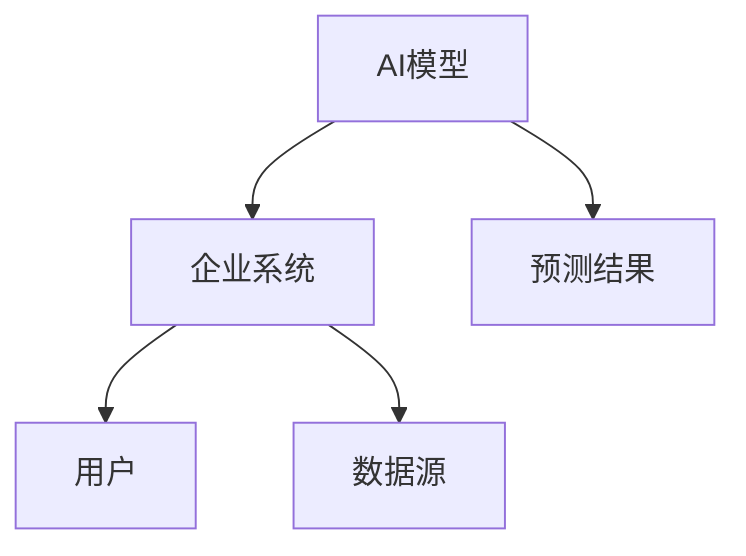
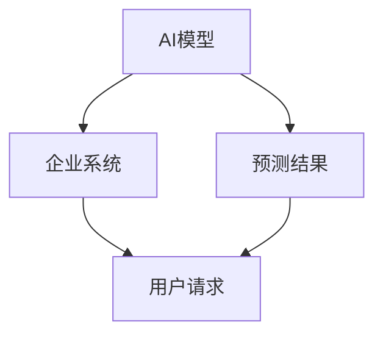
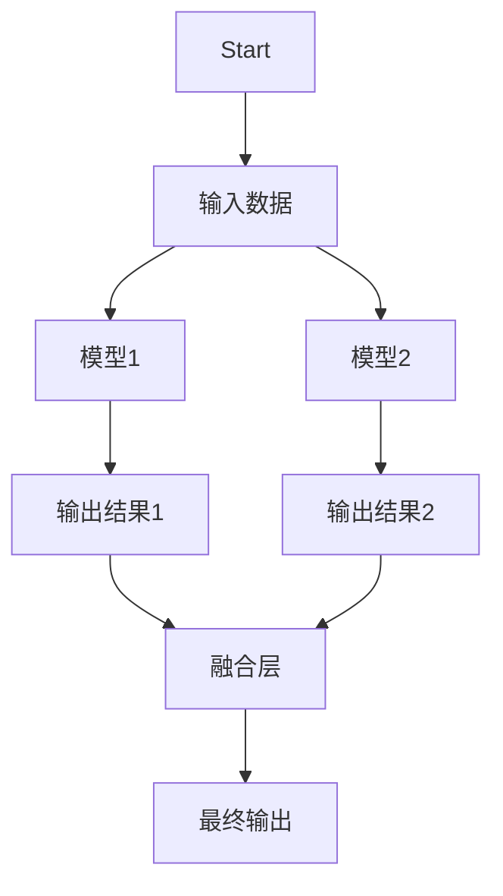
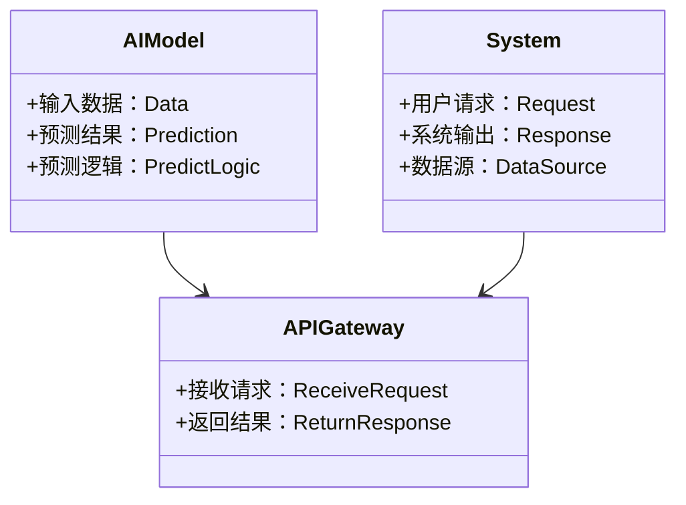
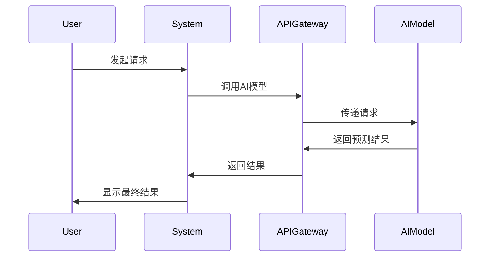

                 


# 企业级AI模型的集成策略：无缝对接现有系统

## 关键词
企业级AI模型, 模型集成, 系统架构, AI与系统对接, 深度集成, 系统优化

## 摘要
在企业数字化转型的浪潮中，AI技术正在发挥越来越重要的作用。然而，如何将AI模型无缝集成到现有的企业系统中，使其与现有业务流程和数据流完美对接，是一个复杂的挑战。本文从企业级AI模型集成的背景出发，详细分析了模型集成的核心概念、算法原理、系统架构设计以及实战项目，提出了分层分模块的集成策略，系统功能设计与优化方法，以及实际案例分析，为企业的AI模型集成提供了理论和实践指导。

---

# 第一部分: 企业级AI模型集成的背景与核心概念

## 第1章: 企业级AI模型集成的背景与问题背景

### 1.1 问题背景
#### 1.1.1 当前企业AI应用的现状
企业正在加速数字化转型，AI技术的应用已经渗透到生产、管理、服务等各个环节。然而，企业在实际应用AI模型时，常常面临以下问题：
- **数据孤岛**：企业内部系统繁多，数据分散，难以形成统一的数据源。
- **系统兼容性差**：现有的企业系统（如ERP、CRM）多为传统架构，与AI模型的接口不兼容。
- **模型性能不稳定**：AI模型在实际应用中可能出现性能下降或预测不准的问题。

#### 1.1.2 现有AI模型的局限性
- **模型依赖特定数据格式**：AI模型通常需要结构化的数据输入，而企业系统中可能包含半结构化或非结构化数据。
- **模型更新周期长**：企业系统上线后，AI模型的更新和优化需要重新部署，过程复杂且耗时。
- **模型与业务逻辑脱节**：AI模型的预测结果需要与企业的业务流程紧密结合，否则难以真正落地。

#### 1.1.3 企业级AI模型集成的必要性
企业级AI模型集成的目标是实现AI模型与现有系统的无缝对接，通过以下方式提升企业竞争力：
- **提高系统效率**：通过AI模型优化业务流程，减少人工干预。
- **增强决策能力**：利用AI模型的预测能力，辅助企业做出更明智的决策。
- **提升用户体验**：通过AI模型提供个性化的服务，提升客户满意度。

### 1.2 问题描述
#### 1.2.1 AI模型集成的核心问题
- **接口标准化**：如何将AI模型的输出与企业系统的输入接口匹配。
- **模型性能优化**：如何在复杂的企业环境中保证AI模型的稳定性和准确性。
- **系统兼容性**：如何在不修改现有系统的情况下，实现AI模型的集成。

#### 1.2.2 企业系统集成的复杂性
- **系统架构复杂**：企业系统通常由多个模块组成，各模块之间的依赖关系复杂。
- **数据格式多样**：企业系统中可能包含多种数据格式，如结构化数据、文本数据、图像数据等。
- **安全性要求高**：企业在集成AI模型时，需要确保数据的安全性和系统的稳定性。

#### 1.2.3 模型与系统的兼容性挑战
- **数据转换成本高**：AI模型通常需要特定格式的数据输入，而企业系统中的数据可能需要多次转换。
- **性能瓶颈**：AI模型的计算资源需求可能与现有系统冲突，导致性能下降。
- **维护困难**：AI模型的更新和维护需要重新部署，可能影响企业的正常运行。

### 1.3 问题解决思路
#### 1.3.1 分层分模块的集成策略
- **分层设计**：将企业系统分为数据层、业务逻辑层和展示层，AI模型分别与各层进行交互。
- **模块化设计**：将AI模型的功能模块化，每个模块负责特定的任务，如数据预处理、模型预测、结果输出等。

#### 1.3.2 系统接口标准化
- **统一接口规范**：制定统一的接口规范，确保AI模型与企业系统之间的数据交换遵循统一标准。
- **API设计**：通过API接口实现AI模型与企业系统的交互，确保接口的灵活性和可扩展性。

#### 1.3.3 模型性能优化
- **模型调优**：通过数据增强、超参数优化等方法，提升AI模型的性能。
- **分布式计算**：利用分布式计算框架（如Spark、Flink）提升AI模型的计算效率。

### 1.4 问题的边界与外延
#### 1.4.1 集成的边界条件
- **数据范围**：AI模型仅处理特定范围的数据，不影响其他模块的数据完整性。
- **功能范围**：AI模型仅负责特定的功能，如预测、分类等，不涉及系统的其他核心功能。

#### 1.4.2 相关概念的外延
- **AI模型的应用场景**：AI模型可以应用于企业中的多个场景，如客户服务、供应链管理、风险管理等。
- **系统集成的技术手段**：除了API接口，还可以通过消息队列、事件驱动等方式实现AI模型与系统的集成。

#### 1.4.3 与其他技术的关联
- **微服务架构**：AI模型可以作为独立的服务部署，与其他微服务进行交互。
- **容器化技术**：利用容器化技术（如Docker）实现AI模型的快速部署和扩展。

### 1.5 核心概念结构与组成
#### 1.5.1 概念结构图


#### 1.5.2 核心要素组成
- **AI模型**：包括训练好的模型、预测逻辑、数据预处理模块等。
- **企业系统**：包括数据层、业务逻辑层、展示层等。
- **接口规范**：包括API接口、数据格式、通信协议等。

#### 1.5.3 关键成功要素
- **标准化接口**：确保AI模型与企业系统之间的数据交换遵循统一标准。
- **模块化设计**：将AI模型的功能模块化，便于维护和扩展。
- **性能优化**：通过模型调优和分布式计算提升AI模型的性能。

---

## 第2章: 企业级AI模型集成的核心概念与联系

### 2.1 核心概念原理
#### 2.1.1 模型集成的基本原理
- **模型融合**：通过将多个AI模型的输出进行融合，提升预测的准确性。
- **特征组合**：将多个模型的特征进行组合，生成新的特征，提升模型的表达能力。

#### 2.1.2 系统集成的关键技术
- **API接口设计**：通过API接口实现AI模型与企业系统的交互。
- **消息队列**：利用消息队列（如Kafka、RabbitMQ）实现异步通信。

#### 2.1.3 模型与系统的协同优化
- **联合优化**：通过优化模型和系统的协同工作，提升整体性能。
- **反馈机制**：通过系统的反馈信息，动态调整AI模型的参数，提升预测的准确性。

### 2.2 核心概念属性对比
#### 2.2.1 模型与系统的属性对比表格
| 属性       | AI模型属性               | 系统属性                 |
|------------|--------------------------|--------------------------|
| 输入形式    | 文本、图像、结构化数据   | 结构化数据、API接口       |
| 输出形式    | 预测结果、生成内容       | 业务结果、状态反馈       |
| 调用方式    | API、命令行接口           | API、消息队列             |
| 性能指标    | 准确率、响应时间         | 响应时间、吞吐量         |

### 2.3 实体关系图


---

## 第3章: 企业级AI模型集成的算法原理

### 3.1 算法原理概述
#### 3.1.1 模型集成的基本方法
- **投票法**：通过多个模型的投票结果决定最终输出。
- **加权融合**：根据每个模型的性能，赋予不同的权重，最终输出加权结果。

#### 3.1.2 多模型融合的策略
- **层次化融合**：将多个模型的输出进行多层次的融合，提升预测的准确性。
- **自适应融合**：根据输入数据的特征，动态调整模型的权重，实现自适应融合。

#### 3.1.3 模型调优的技术
- **超参数优化**：通过网格搜索、随机搜索等方法，找到最优的超参数组合。
- **数据增强**：通过数据增强技术，增加数据的多样性，提升模型的泛化能力。

### 3.2 算法原理流程图


---

## 第4章: 企业级AI模型集成的系统架构设计

### 4.1 系统架构设计
#### 4.1.1 系统功能设计
- **数据预处理模块**：负责将企业系统中的数据进行清洗、转换，生成适合AI模型输入的格式。
- **模型预测模块**：负责接收预处理后的数据，调用AI模型进行预测，并将结果返回给系统。
- **结果处理模块**：负责将AI模型的预测结果进行处理，生成符合企业系统要求的输出格式。

#### 4.1.2 系统架构图


### 4.2 系统接口设计
#### 4.2.1 API接口设计
- **输入接口**：定义AI模型的输入接口，如REST API的POST请求。
- **输出接口**：定义AI模型的输出接口，如返回JSON格式的结果。

#### 4.2.2 接口交互流程
1. 用户通过企业系统发起请求。
2. 系统将请求通过API接口传递给AI模型。
3. AI模型处理请求，生成预测结果。
4. 预测结果通过API接口返回给系统。
5. 系统根据预测结果生成最终输出。

### 4.3 系统交互图


---

## 第5章: 企业级AI模型集成的项目实战

### 5.1 项目背景与目标
#### 5.1.1 项目背景
某企业希望利用AI模型优化其供应链管理，提升预测的准确性。

#### 5.1.2 项目目标
- 实现AI模型与企业供应链系统的无缝对接。
- 提升供应链的预测准确率，降低库存成本。

### 5.2 项目实施步骤
#### 5.2.1 环境安装
- **安装Python**：安装Python 3.8及以上版本。
- **安装依赖库**：安装必要的库，如TensorFlow、Flask、Django等。

#### 5.2.2 系统核心实现
```python
from flask import Flask, request, jsonify

app = Flask(__name__)

@app.route('/predict', methods=['POST'])
def predict():
    data = request.json['data']
    # 调用AI模型进行预测
    prediction = model.predict(data)
    return jsonify({'result': prediction})

if __name__ == '__main__':
    app.run(debug=True)
```

#### 5.2.3 代码应用解读与分析
- **API接口设计**：通过Flask框架设计一个REST API，接收请求并返回预测结果。
- **模型调用**：将AI模型的预测逻辑封装成一个函数，通过API接口进行调用。
- **结果返回**：将预测结果以JSON格式返回给调用方。

### 5.3 实际案例分析
#### 5.3.1 案例背景
某电商企业希望通过AI模型优化其推荐系统，提升用户购买率。

#### 5.3.2 案例分析
- **数据准备**：收集用户的行为数据，如点击、浏览、购买记录。
- **模型训练**：训练一个推荐模型，如协同过滤、深度学习模型等。
- **系统集成**：将推荐模型通过API接口集成到企业的推荐系统中。

### 5.4 项目小结
- **成功经验**：通过分层分模块的设计，实现了AI模型与企业系统的无缝对接。
- **问题总结**：在集成过程中，发现数据格式不统一的问题，需要通过数据转换模块解决。
- **改进建议**：建议在后续项目中，提前与企业系统对接方确认接口规范，减少数据转换的成本。

---

## 第6章: 企业级AI模型集成的最佳实践与小结

### 6.1 最佳实践
#### 6.1.1 系统设计阶段
- **模块化设计**：将AI模型的功能模块化，便于维护和扩展。
- **接口标准化**：制定统一的接口规范，确保AI模型与系统的兼容性。

#### 6.1.2 开发阶段
- **单元测试**：对AI模型的各个模块进行单元测试，确保每个模块的功能正常。
- **集成测试**：在集成阶段进行端到端测试，确保AI模型与系统的交互顺畅。

#### 6.1.3 部署阶段
- **容器化部署**：利用容器化技术（如Docker）实现AI模型的快速部署和扩展。
- **监控与优化**：通过监控工具（如Prometheus）实时监控AI模型的性能，及时发现并解决问题。

### 6.2 小结
企业级AI模型的集成是一个复杂但重要的任务，需要从系统设计、算法原理、接口规范等多个方面进行综合考虑。通过分层分模块的集成策略，模块化设计，以及标准化接口的设计，可以有效降低集成的难度，提升系统的稳定性和性能。同时，通过持续优化和改进，可以进一步提升AI模型的预测准确率和系统的运行效率。

---

## 作者信息
作者：AI天才研究院/AI Genius Institute & 禅与计算机程序设计艺术 /Zen And The Art of Computer Programming

---

以上是《企业级AI模型的集成策略：无缝对接现有系统》的技术博客文章的完整大纲和内容。如果需要进一步扩展或调整，请随时告知！

