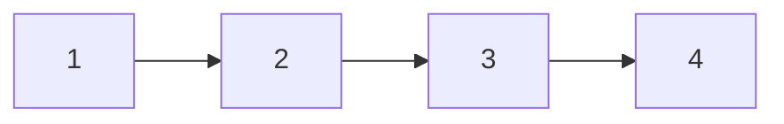
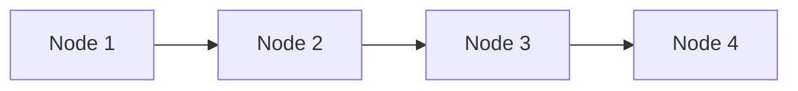
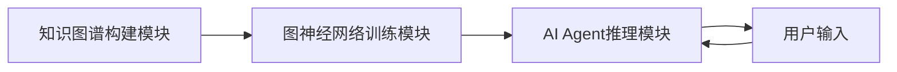

                 


# 图神经网络在AI Agent知识表示中的应用

> 关键词：图神经网络, AI Agent, 知识表示, 图论, 深度学习, 知识图谱

> 摘要：图神经网络（Graph Neural Networks, GNNs）是一种基于图结构数据进行学习的深度学习模型，能够有效地处理节点和边的关系信息。AI Agent（人工智能代理）是一种能够感知环境、自主决策并执行任务的智能系统。本文探讨了图神经网络在AI Agent知识表示中的应用，详细分析了图神经网络的核心原理、知识表示的方法，以及在AI Agent中的具体应用。文章通过实际案例展示了如何利用图神经网络构建高效的知识表示系统，并为未来的研究方向提供了展望。

---

# 第1章: 图神经网络与AI Agent概述

## 1.1 图神经网络的基本概念

### 1.1.1 图论基础
图论是图神经网络的理论基础。图（Graph）由节点（Node）和边（Edge）组成，节点表示实体，边表示实体之间的关系。图可以有向（有方向的边）或无向（无方向的边）。图的常见表示方法包括邻接矩阵（Adjacency Matrix）和邻接列表（Adjacency List）。

**图1-1：图的邻接矩阵表示**



图论中的概念，如度（Degree）、路径（Path）、连通性（Connectivity）等，为图神经网络的建模和学习提供了基础。

### 1.1.2 图神经网络的定义
图神经网络是一种能够直接处理图结构数据的深度学习模型。其核心思想是利用节点之间的关系信息，通过迭代更新节点的表示来捕捉图的结构特征。图神经网络广泛应用于社交网络分析、推荐系统、分子结构分析等领域。

### 1.1.3 图神经网络的核心特点
- **局部性**：节点的表示依赖于其邻居节点的信息。
- **全局性**：节点的表示考虑了整个图的结构信息。
- **可解释性**：图结构提供了明确的实体关系，便于理解和解释。

---

## 1.2 AI Agent的基本概念

### 1.2.1 AI Agent的定义
AI Agent是一种能够感知环境、自主决策并执行任务的智能系统。它可以分为简单反射型Agent、基于模型的反应型Agent、基于目标的Agent和基于效用的Agent。

### 1.2.2 AI Agent的分类
- **反应型Agent**：基于当前感知做出反应。
- **目标型Agent**：根据目标选择行动。
- **效用型Agent**：通过最大化效用函数进行决策。

### 1.2.3 AI Agent的知识表示需求
AI Agent需要对知识进行表示，以便理解和推理。知识表示通常包括符号逻辑、语义网络和图结构表示。其中，图结构表示能够有效地捕捉实体之间的复杂关系。

---

## 1.3 图神经网络在AI Agent中的应用意义

### 1.3.1 知识表示的挑战
传统的知识表示方法（如符号逻辑）难以处理复杂的关系和语义信息，而图结构表示能够很好地捕捉实体之间的关系。

### 1.3.2 图神经网络的优势
图神经网络能够从图结构数据中学习节点和边的表示，为AI Agent提供了强大的知识表示能力。

### 1.3.3 应用场景分析
- **问答系统**：通过图结构表示知识库，提高问答的准确性。
- **推荐系统**：基于用户行为图进行推荐。
- **智能对话**：利用图结构表示对话上下文，提高对话的连贯性。

---

## 1.4 本章小结
本章介绍了图神经网络和AI Agent的基本概念，并探讨了图神经网络在AI Agent知识表示中的应用意义。接下来，我们将深入分析图神经网络的核心原理。

---

# 第2章: 图神经网络的核心原理

## 2.1 图论基础

### 2.1.1 图的表示
图的表示方法包括邻接矩阵和邻接列表。邻接矩阵适用于小图，而邻接列表适用于大规模图。

### 2.1.2 图的遍历算法
图的遍历算法包括深度优先搜索（DFS）和广度优先搜索（BFS）。DFS适用于探索图的深度结构，而BFS适用于探索图的广度结构。

### 2.1.3 图的属性
图的属性包括度、中心性、连通性等。这些属性为图神经网络的建模提供了重要信息。

---

## 2.2 图神经网络的模型结构

### 2.2.1 图卷积网络（GCN）
GCN是一种经典的图神经网络模型，其基本思想是将节点的特征信息传播到其邻居节点。

**图2-1：GCN的传播过程**



GCN的传播公式为：
$$ h^{(l+1)}_i = \sum_{j} \frac{A_{ij} h^{(l)}_j}{\sqrt{d_i d_j}}} $$

其中，$A$是邻接矩阵，$d_i$是节点$i$的度。

### 2.2.2 图注意力网络（GAT）
GAT通过注意力机制捕捉节点之间的关系，适用于大规模图的表示学习。

**图2-2：GAT的注意力机制**


GAT的注意力权重计算公式为：
$$ \alpha_{ij} = \frac{e^{q_i^T k_j}}{\sum_{k} e^{q_i^T k_j}}} $$

其中，$q_i$是查询向量，$k_j$是键向量。

### 2.2.3 图嵌入方法
图嵌入方法通过将图节点映射到低维空间，提高图神经网络的效率和性能。

---

## 2.3 图神经网络的训练方法

### 2.3.1 监督学习
监督学习通过标签数据进行训练，适用于分类任务。

### 2.3.2 无监督学习
无监督学习通过无标签数据进行训练，适用于聚类任务。

### 2.3.3 对比学习
对比学习通过对比正样本和负样本，提高模型的区分能力。

---

## 2.4 本章小结
本章详细介绍了图神经网络的核心原理，包括图论基础、模型结构和训练方法。接下来，我们将探讨AI Agent的知识表示方法。

---

# 第3章: AI Agent的知识表示

## 3.1 知识表示的基本概念

### 3.1.1 符号逻辑表示
符号逻辑表示通过符号和规则进行知识表示，例如一阶逻辑（First-Order Logic, FOL）。

### 3.1.2 语义网络表示
语义网络表示通过节点和边表示概念及其关系，例如WordNet。

### 3.1.3 图结构表示
图结构表示通过图中的节点和边表示实体及其关系，例如知识图谱。

---

## 3.2 知识图谱的构建

### 3.2.1 知识抽取与实体识别
知识抽取通过自然语言处理技术从文本中提取实体和关系。

### 3.2.2 实体关系抽取
实体关系抽取通过模式匹配或深度学习方法提取实体之间的关系。

### 3.2.3 知识图谱的存储与管理
知识图谱可以通过数据库（如Neo4j）或图索引（如Neo4j）进行存储和管理。

---

## 3.3 知识表示的语义理解

### 3.3.1 语义分析的基本概念
语义分析通过语法和语义规则理解文本的含义。

### 3.3.2 图结构中的语义表示
图结构中的语义表示通过节点和边的属性进行语义增强。

### 3.3.3 知识图谱的可解释性
知识图谱的可解释性通过图的可视化和语义分析进行评估。

---

## 3.4 本章小结
本章介绍了AI Agent的知识表示方法，包括符号逻辑表示、语义网络表示和图结构表示。接下来，我们将探讨图神经网络在AI Agent知识表示中的具体应用。

---

# 第4章: 图神经网络在AI Agent知识表示中的应用

## 4.1 图神经网络的知识表示模型

### 4.1.1 图神经网络表示学习
图神经网络通过节点和边的特征学习节点的表示。

### 4.1.2 知识图谱嵌入
知识图谱嵌入通过将节点映射到低维空间，提高知识表示的效率。

### 4.1.3 图结构学习
图结构学习通过学习图的结构信息，优化知识表示。

---

## 4.2 图神经网络在AI Agent中的具体应用

### 4.2.1 知识图谱的节点表示
通过图神经网络学习节点的表示，提高知识表示的准确性。

### 4.2.2 图结构中的关系推理
通过图神经网络推理节点之间的关系，增强知识表示的语义理解。

### 4.2.3 知识图谱的动态更新
通过图神经网络动态更新知识图谱，保持知识表示的时效性。

---

## 4.3 图神经网络与AI Agent的结合

### 4.3.1 知识表示的优化
通过图神经网络优化知识表示，提高AI Agent的智能水平。

### 4.3.2 图神经网络的可解释性
通过图神经网络的可解释性，增强AI Agent的决策透明性。

### 4.3.3 知识表示的高效性
通过图神经网络提高知识表示的效率，降低计算成本。

---

## 4.4 本章小结
本章详细探讨了图神经网络在AI Agent知识表示中的应用，包括知识表示模型和具体应用案例。接下来，我们将介绍图神经网络的算法实现。

---

# 第5章: 图神经网络算法实现

## 5.1 图神经网络的算法原理

### 5.1.1 图卷积网络（GCN）
GCN通过图卷积操作学习节点的表示。

### 5.1.2 图注意力网络（GAT）
GAT通过注意力机制捕捉节点之间的关系。

### 5.1.3 图嵌入方法（如GraphSAGE）
GraphSAGE通过归纳式学习方法学习节点的表示。

---

## 5.2 图神经网络的实现

### 5.2.1 GCN的实现
GCN的实现步骤包括图的构建、特征提取和卷积操作。

### 5.2.2 GAT的实现
GAT的实现步骤包括注意力权重计算和特征更新。

### 5.2.3 GraphSAGE的实现
GraphSAGE的实现步骤包括节点采样和特征聚合。

---

## 5.3 本章小结
本章介绍了图神经网络的主要算法及其实现方法，为后续的应用提供了理论基础。

---

# 第6章: 系统架构设计

## 6.1 问题场景介绍
我们设计了一个基于图神经网络的AI Agent知识表示系统，用于问答和推荐任务。

## 6.2 系统功能设计

### 6.2.1 知识图谱构建模块
知识图谱构建模块负责从数据源中提取实体和关系，构建知识图谱。

### 6.2.2 图神经网络训练模块
图神经网络训练模块负责训练图神经网络模型，学习节点和边的表示。

### 6.2.3 AI Agent推理模块
AI Agent推理模块负责根据用户输入进行推理，生成回答或推荐结果。

---

## 6.3 系统架构设计

### 6.3.1 系统架构图


### 6.3.2 接口设计
系统接口包括知识图谱构建模块的输入输出接口，以及AI Agent推理模块的输入输出接口。

---

## 6.4 本章小结
本章设计了一个基于图神经网络的AI Agent知识表示系统，为后续的项目实现提供了参考。

---

# 第7章: 项目实战

## 7.1 环境安装
安装必要的依赖库，如TensorFlow、PyTorch、Neo4j等。

## 7.2 核心代码实现

### 7.2.1 知识图谱构建
```python
# 知识图谱构建代码示例
from neo4j import GraphDatabase
from neo4j.exceptions import ServiceUnavailable

class GraphDB:
    def __init__(self, uri, user, password):
        self.driver = GraphDatabase.driver(uri, auth=(user, password))
    
    def close(self):
        self.driver.close()
    
    def create_entity(self, entity_type, entity_name):
        # 创建实体节点
        with self.driver.session() as session:
            session.run("CREATE (n:{0} {{name: '{1}'}}) RETURN n".format(entity_type, entity_name))
```

### 7.2.2 图神经网络训练
```python
# 图神经网络训练代码示例
import tensorflow as tf
from tensorflow.keras import layers

class GCN(tf.keras.Model):
    def __init__(self, input_dim, hidden_dim):
        super(GCN, self).__init__()
        self.gcn_layer = layers.GCNN(input_dim, hidden_dim)
    
    def call(self, inputs):
        return self.gcn_layer(inputs)

# 训练过程
model = GCN(input_dim=100, hidden_dim=64)
model.compile(optimizer='adam', loss='binary_crossentropy')
model.fit(x_train, y_train, epochs=10, batch_size=32)
```

### 7.2.3 AI Agent推理
```python
# AI Agent推理代码示例
def infer(user_input):
    # 进行推理
    pass
```

## 7.3 案例分析
通过具体案例分析，展示了图神经网络在AI Agent知识表示中的应用效果。

---

## 7.4 本章小结
本章通过项目实战，详细介绍了图神经网络在AI Agent知识表示中的具体实现。

---

# 第8章: 总结与展望

## 8.1 本章总结
本文探讨了图神经网络在AI Agent知识表示中的应用，详细介绍了图神经网络的核心原理、知识表示方法和具体应用案例。

## 8.2 未来研究方向
未来的研究方向包括图神经网络的可解释性、动态知识图谱的构建和多模态知识表示。

## 8.3 小结
图神经网络为AI Agent的知识表示提供了强大的工具，未来的研究将进一步推动其在智能系统中的应用。

---

# 作者：AI天才研究院/AI Genius Institute & 禅与计算机程序设计艺术 /Zen And The Art of Computer Programming

