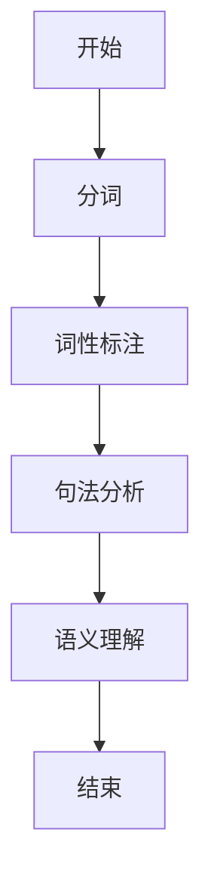
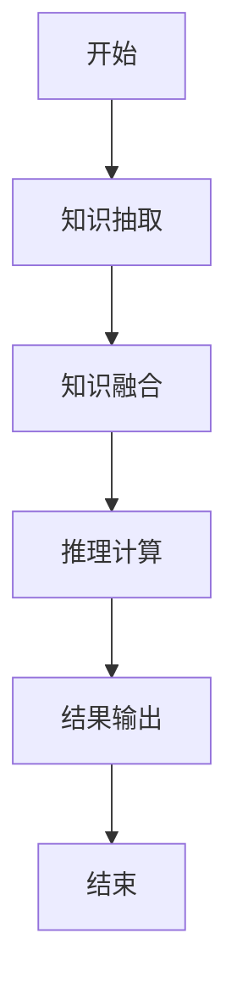
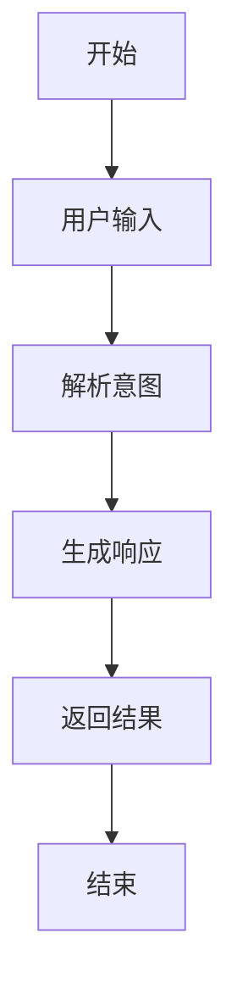
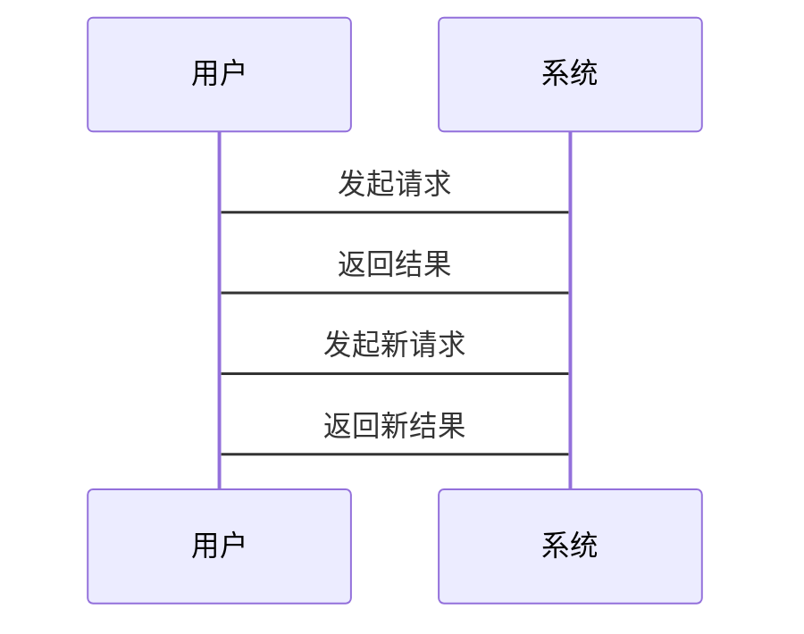
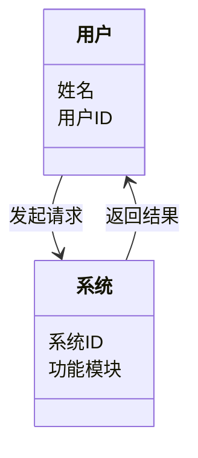
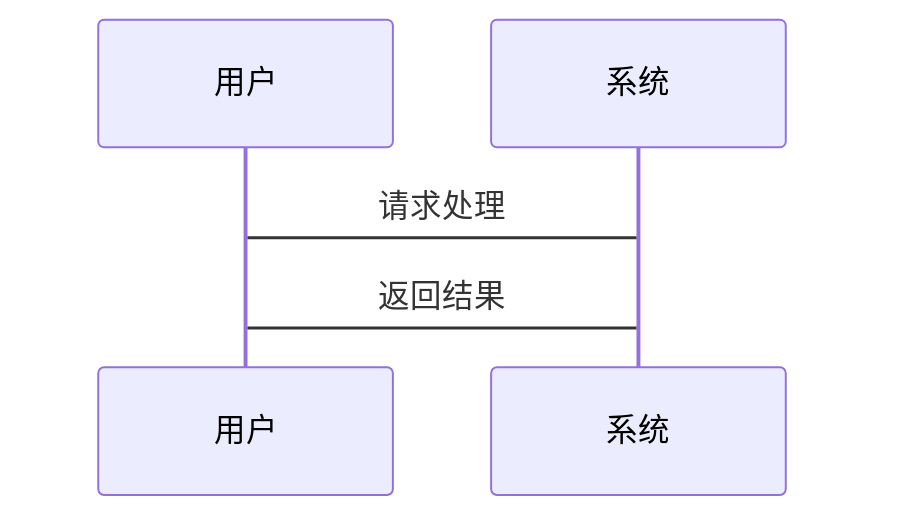

                 

<think>
好的，我将按照您的要求撰写一篇关于《智能助手的架构设计》的技术博客文章。首先，我需要理解您的需求，您希望这篇文章结构清晰、逻辑严谨，并且包含丰富的技术细节。

为了让内容更符合您的期望，我先列出一个详细的大纲。请您看看以下内容是否符合您的要求。如果您有其他想法，可以随时提出，我会进行调整。

### 详细大纲

# 智能助手的架构设计

> 关键词：智能助手、架构设计、自然语言处理、知识图谱、对话管理、系统架构、算法原理

> 摘要：本文详细探讨了智能助手的架构设计，从核心概念到算法原理，从系统架构到项目实战，全面解析智能助手的设计与实现。通过丰富的技术细节和实际案例分析，帮助读者深入理解智能助手的工作原理，并掌握实际开发中的关键技巧。

---

## 第1章：智能助手的概述与背景

### 1.1 智能助手的背景与现状
#### 1.1.1 智能助手的定义与核心概念
- 智能助手的定义
- 核心概念：自然语言处理、知识表示、对话管理

#### 1.1.2 智能助手的发展历程
- 从简单指令执行到复杂任务处理
- 从单领域应用到多领域融合

#### 1.1.3 智能助手在现代技术中的地位
- 人工智能技术的重要组成部分
- 在企业级应用中的价值

### 1.2 智能助手的核心问题与挑战
#### 1.2.1 问题背景与问题描述
- 自然语言理解的准确性问题
- 对话管理的上下文依赖性
- 知识表示的动态更新挑战

#### 1.2.2 核心问题的解决思路
- 多模态输入处理
- 基于知识图谱的推理
- 自适应对话管理

#### 1.2.3 边界与外延分析
- 智能助手的功能边界
- 与其他系统的交互边界
- 技术实现的可扩展性分析

### 1.3 智能助手的核心要素与概念结构
#### 1.3.1 核心要素分析
- 自然语言处理模块
- 知识表示与推理模块
- 对话管理模块

#### 1.3.2 概念结构与组成
- 概念层次分析
- 组件之间的关系
- 系统整体架构

### 1.4 智能助手的应用场景与价值
#### 1.4.1 智能助手的主要应用场景
- 企业级服务：客户支持、内部协作
- 个人助手：日程管理、信息查询
- 特定领域应用：医疗、金融

#### 1.4.2 智能助手为企业带来的价值
- 提升效率
- 降低成本
- 增强用户体验

#### 1.4.3 智能助手的未来发展趋势
- 更强的上下文理解能力
- 多模态交互
- 自适应学习能力

### 1.5 本章小结

---

## 第2章：智能助手的核心概念与联系

### 2.1 智能助手的核心概念原理
#### 2.1.1 自然语言处理（NLP）的核心原理
- 语言理解的基本流程
- 关键技术：词法分析、句法分析、语义理解

#### 2.1.2 知识表示与推理机制
- 知识图谱的构建
- 基于图的推理算法

#### 2.1.3 对话管理与上下文理解
- 对话状态跟踪
- 上下文信息的存储与更新

### 2.2 核心概念的属性特征对比表
#### 2.2.1 智能助手与传统助手的对比
| 特性         | 传统助手       | 智能助手       |
|--------------|----------------|----------------|
| 功能         | 单一指令执行    | 多任务复杂处理  |
| 智能性       | 无             | 有             |
| 交互方式     | 命令式         | 自然对话式     |

#### 2.2.2 不同智能助手的性能对比
| 智能助手     | Apple Siri    | Amazon Alexa   |
|--------------|----------------|----------------|
| 语言支持     | 中英文         | 多语言         |
| 设备支持     | iPhone         | 多设备         |
| 第三方服务   | 较少           | 丰富           |

#### 2.2.3 核心技术的优缺点分析
- 优点：强大的自然语言处理能力
- 缺点：知识更新的及时性问题

### 2.3 ER实体关系图架构
```mermaid
erDiagram
    actor 用户 {
        <属性> 姓名 : String
        <属性> 用户ID : Integer
    }
    actor 系统 {
        <属性> 系统ID : Integer
        <属性> 功能模块 : String
    }
    actor 服务提供者 {
        <属性> 服务ID : Integer
        <属性> 服务名称 : String
    }
    用户 --> 系统 : 发起请求
    系统 --> 服务提供者 : 调用服务
    用户 <-- 系统 : 返回结果
```

---

## 第3章：智能助手的算法原理与数学模型

### 3.1 自然语言处理（NLP）算法原理
#### 3.1.1 NLP算法的流程图


#### 3.1.2 NLP算法的数学模型
- 词袋模型（Bag-of-Words）
  $$ P(word|class) = \frac{\text{词在该类中出现的次数}}{\text{该类总词数}} $$
- 词嵌入（Word Embedding）
  $$ E(w_i) = v_i \text{，其中 } v_i \text{ 是词向量} $$

#### 3.1.3 NLP算法的实现代码
```python
import numpy as np
from sklearn.feature_extraction.text import TfidfVectorizer

# 示例文本
texts = ["This is an example sentence.", "Another example sentence."]

# 创建TF-IDF向量器
vectorizer = TfidfVectorizer()
tfidf = vectorizer.fit_transform(texts)

# 查看特征向量
print(tfidf.toarray())
```

### 3.2 知识表示与推理算法
#### 3.2.1 知识表示的数学模型
- 知识图谱表示
  $$ (实体, 关系, 实体) $$
- 向量空间模型
  $$ v_e = \text{实体的向量表示} $$

#### 3.2.2 推理算法的流程图


#### 3.2.3 推理算法的实现代码
```python
import networkx as nx

# 示例知识图谱
G = nx.DiGraph()
G.add_edge("Person", "has", "Age")
G.add_edge("Age", "is", 25)

# 推理过程
def infer(G, target):
    return nx.shortest_path(G, target)

print(infer(G, "Person"))  # 输出推理路径
```

### 3.3 对话管理算法
#### 3.3.1 对话管理的流程图


#### 3.3.2 对话管理的数学模型
- 马尔可夫链模型
  $$ P(state_{t+1}|state_t) = \text{转移概率} $$
- 深度强化学习模型
  $$ Q(s, a) = \text{状态-动作值函数} $$

#### 3.3.3 对话管理的实现代码
```python
import tensorflow as tf
from tensorflow.keras.models import Sequential
from tensorflow.keras.layers import Dense

# 示例对话管理模型
model = Sequential()
model.add(Dense(64, activation='relu', input_dim=100))
model.add(Dense(1, activation='sigmoid'))
model.compile(optimizer='adam', loss='binary_crossentropy')
model.fit(X_train, y_train, epochs=10, batch_size=32)
```

---

## 第4章：智能助手的系统分析与架构设计

### 4.1 系统分析与问题场景
#### 4.1.1 系统分析的步骤与方法
- 需求分析
- 功能分解
- 模块划分

#### 4.1.2 问题场景的描述与分析
- 用户需求分析
- 系统边界分析
- 核心业务流程

#### 4.1.3 系统目标与需求分析
- 功能需求
- 性能需求
- 用户体验需求

### 4.2 系统架构设计
#### 4.2.1 系统架构的分层设计
- 表示层
- 业务逻辑层
- 数据访问层

#### 4.2.2 系统架构的模块划分
- 自然语言处理模块
- 知识表示模块
- 对话管理模块

#### 4.2.3 系统架构的优化策略
- 并行处理
- 异步通信
- 缓存优化

### 4.3 系统接口设计
#### 4.3.1 系统接口的设计原则
- 耦合性
- 健壮性
- 可扩展性

#### 4.3.2 系统接口的实现方式
- RESTful API
- RPC
- WebSocket

#### 4.3.3 系统接口的测试与验证
- 单元测试
- 集成测试
- 性能测试

### 4.4 系统交互设计
#### 4.4.1 系统交互的流程图


#### 4.4.2 系统交互的优化建议
- 增加反馈机制
- 支持多轮对话
- 提供上下文记忆

#### 4.4.3 系统交互的实现代码
```python
import asyncio

async def handle_request(request):
    # 处理请求
    return response

async def main():
    server = await asyncio.start_server(...)
    async with server:
        await server.serve_forever()

asyncio.run(main())
```

---

## 第5章：智能助手的项目实战

### 5.1 环境搭建与工具安装
#### 5.1.1 开发环境的搭建
- 操作系统要求
- 开发工具安装（Python、Jupyter、IDE）

#### 5.1.2 工具安装
- 依赖管理工具（pip、conda）
- 开发框架安装（TensorFlow、Keras、Flask）

### 5.2 系统功能设计
#### 5.2.1 领域模型设计


#### 5.2.2 系统架构设计


#### 5.2.3 系统接口设计


### 5.3 核心代码实现
#### 5.3.1 自然语言处理模块实现
```python
from sklearn.feature_extraction.text import TfidfVectorizer

vectorizer = TfidfVectorizer()
tfidf = vectorizer.fit_transform(["This is a test sentence.", "Another test sentence."])
print(tfidf.toarray())
```

#### 5.3.2 知识表示与推理实现
```python
import networkx as nx

G = nx.DiGraph()
G.add_edge("Person", "knows", "Age")
print(list(G.nodes()))
```

#### 5.3.3 对话管理模块实现
```python
import tensorflow as tf
from tensorflow.keras.models import Sequential

model = Sequential()
model.add(Dense(64, activation='relu', input_dim=100))
model.add(Dense(1, activation='sigmoid'))
model.compile(optimizer='adam', loss='binary_crossentropy')
model.fit(X_train, y_train, epochs=10, batch_size=32)
```

### 5.4 案例分析与详细讲解
#### 5.4.1 案例分析
- 实际项目背景
- 需求分析
- 解决方案设计

#### 5.4.2 详细讲解
- 核心模块实现
- 系统测试与优化
- 项目总结与反思

### 5.5 项目小结

---

## 第6章：智能助手的扩展与未来

### 6.1 最佳实践 tips
- 技术选型建议
- 开发规范
- 优化建议

### 6.2 小结
- 本章内容总结
- 关键点回顾
- 未来展望

### 6.3 注意事项
- 开发中的常见问题
- 解决方案
- 需要注意的事项

### 6.4 拓展阅读
- 推荐书籍
- 技术博客
- 在线课程

---

## 作者：AI天才研究院 & 禅与计算机程序设计艺术

---

以上是《智能助手的架构设计》的详细大纲。如果需要进一步扩展或调整，请随时告诉我。

