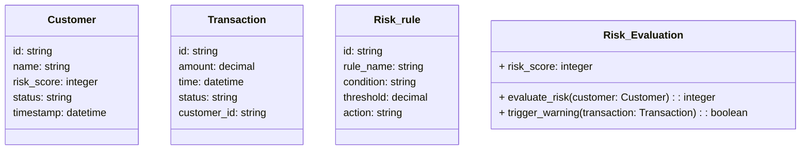
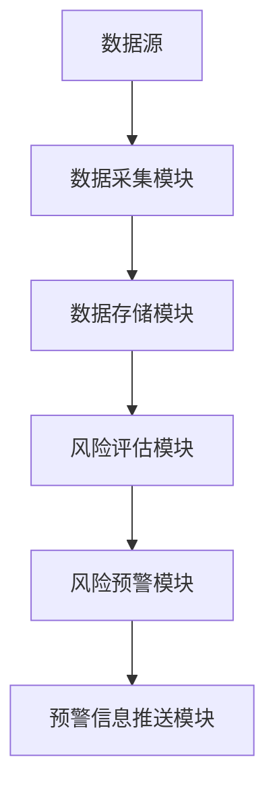
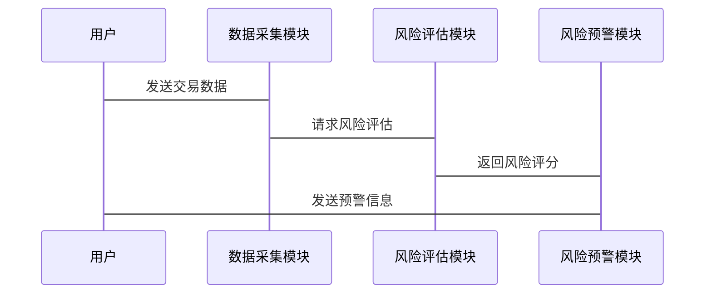

                 


# 构建智能企业风控系统：实时监控与风险预警

> 关键词：企业风控系统、实时监控、风险预警、智能风控、数据流处理、算法实现

> 摘要：本文将详细探讨如何构建一个智能企业风控系统，重点分析实时监控与风险预警的核心原理、算法实现、系统架构设计以及实际项目中的应用。通过结合大数据与人工智能技术，我们将为企业提供一个高效可靠的风控解决方案。

---

# 第一部分: 企业风控系统背景与概述

# 第1章: 企业风控系统概述

## 1.1 企业风控的重要性

### 1.1.1 企业风控的定义与范围

企业风控（Risk Control）是指通过识别、评估和管理潜在风险，以确保企业运营的稳定性和可持续性。在现代商业环境中，风险无处不在，从市场波动、财务问题到操作失误，各种风险可能对企业的生存和发展构成威胁。因此，构建一个智能化的风控系统，能够实时监控企业内外部风险，并及时发出预警，是现代企业不可或缺的一部分。

### 1.1.2 风险在企业中的表现形式

企业在运营过程中可能面临的风险包括：

- **市场风险**：市场需求变化、竞争加剧等。
- **财务风险**：资金链断裂、应收账款逾期等。
- **操作风险**：内部流程失误、员工操作不当等。
- **信用风险**：客户违约、供应链中断等。
- **合规风险**：政策变化、法律诉讼等。

### 1.1.3 构建智能风控系统的必要性

传统的风控方式通常依赖人工审核和定期报告，这种方式效率低下、覆盖面有限，难以应对现代企业面临的复杂风险。智能风控系统通过引入大数据、人工智能和机器学习技术，能够实时分析海量数据，快速识别潜在风险，并提供精准的预警和解决方案。

## 1.2 智能风控的核心目标

### 1.2.1 实时监控的定义

实时监控是指对企业的关键业务指标和潜在风险点进行持续的、实时的数据采集和分析，以便及时发现异常情况并采取应对措施。

### 1.2.2 风险预警的机制

风险预警是通过建立数学模型，对企业的各项指标进行预测和评估，当某些指标偏离正常范围时，系统会自动触发预警机制，通知相关人员进行处理。

### 1.2.3 智能风控系统的价值

智能风控系统能够显著提升企业的风险管理效率，减少人为错误，降低风险发生的概率和影响范围。同时，系统还可以帮助企业优化资源配置、提升决策能力，从而在竞争激烈的市场中保持优势。

## 1.3 智能风控系统的应用场景

### 1.3.1 金融领域的风控应用

在金融行业，智能风控系统主要用于评估客户的信用风险、监测交易异常行为以及防范欺诈交易。

### 1.3.2 企业运营中的风控需求

企业可以通过智能风控系统实时监控供应链的稳定性、评估供应商的信用状况、优化库存管理等。

### 1.3.3 典型案例分析

以某电商平台为例，该平台通过智能风控系统实时监测交易数据，识别异常订单，有效防范了欺诈行为的发生，保障了平台的安全性和用户体验。

## 1.4 本章小结

本章从企业风控的重要性出发，详细介绍了智能风控的核心目标和应用场景，为后续章节的深入分析奠定了基础。

---

# 第二部分: 智能企业风控系统的核心概念

# 第2章: 实时监控与风险预警的核心概念

## 2.1 实时监控的原理

### 2.1.1 数据采集与处理

实时监控的第一步是数据采集。企业需要从多个数据源（如数据库、API、日志文件等）获取实时数据，并进行清洗和预处理。

### 2.1.2 实时数据流的处理机制

实时数据流处理通常采用流处理技术，如Apache Kafka、Apache Flink等工具，能够高效处理大规模实时数据。

### 2.1.3 监控指标的定义与选择

监控指标是实时监控的核心，需要根据企业的业务需求选择关键指标（KPIs），如交易量、订单完成率、用户活跃度等。

## 2.2 风险预警的机制

### 2.2.1 风险评估模型

风险评估模型是预警机制的核心，常用的模型包括逻辑回归、决策树、随机森林等机器学习模型，以及基于时间序列的预测模型。

### 2.2.2 预警阈值的设定

预警阈值是根据历史数据和业务需求设定的临界值，当某项指标超过阈值时，系统会触发预警。

### 2.2.3 预警触发条件

预警触发条件可以根据具体业务场景设置，如交易金额突然增加、用户行为异常等。

## 2.3 实时监控与风险预警的关联

### 2.3.1 数据流的实时分析

通过实时数据分析，系统可以快速识别潜在风险，并及时发出预警。

### 2.3.2 风险信号的实时识别

利用机器学习算法，系统能够从海量数据中识别出异常信号，如欺诈交易、信用违约等。

### 2.3.3 预警信息的实时推送

系统可以通过邮件、短信、应用程序通知等方式，将预警信息实时推送至相关人员。

## 2.4 核心概念的ER实体关系图

以下是企业风控系统的核心实体关系图：

```mermaid
er
    Customer
    ----
    id: string
    name: string
    risk_score: integer
    status: string
    timestamp: datetime

    Transaction
    ----
    id: string
    amount: decimal
    time: datetime
    status: string
    customer_id: string

    Risk_rule
    ----
    id: string
    rule_name: string
    condition: string
    threshold: decimal
    action: string
```

## 2.5 本章小结

本章详细介绍了实时监控与风险预警的核心概念，包括数据采集、监控指标、风险评估模型以及预警机制等，为后续章节的算法实现和系统设计提供了理论基础。

---

# 第三部分: 智能企业风控系统的算法原理

# 第3章: 时间序列分析与异常检测

## 3.1 时间序列分析的基本原理

### 3.1.1 时间序列的定义

时间序列是指按时间顺序排列的数据，通常用于分析数据的变化趋势和周期性。

### 3.1.2 时间序列的分解方法

时间序列可以分解为趋势、季节性、周期性和随机性四个部分。

### 3.1.3 常见的时间序列模型

- **ARIMA模型**：适用于线性时间序列数据。
- **Prophet模型**：由Facebook开源，适合非线性时间序列数据。
- **LSTM模型**：基于深度学习的时间序列预测模型。

## 3.2 异常检测算法

### 3.2.1 基于统计的异常检测

- **Z-score方法**：通过计算数据点与均值的偏差程度来判断异常。
- **孤立森林算法**：适用于高维数据的异常检测。

### 3.2.2 基于机器学习的异常检测

- **Isolation Forest**：基于树结构的无监督异常检测算法。
- **One-Class SVM**：通过构建支持向量边界来识别异常点。

### 3.2.3 基于深度学习的异常检测

- **Autoencoder**：通过压缩数据并重建来识别异常。
- **LSTM网络**：适用于时间序列数据的异常检测。

## 3.3 基于LSTM的时间序列异常检测

### 3.3.1 LSTM网络的结构

LSTM（长短期记忆网络）由输入门、遗忘门和输出门组成，能够有效捕捉时间序列的长程依赖关系。

### 3.3.2 时间序列异常检测的数学模型

LSTM模型的损失函数通常采用均方误差（MSE），用于衡量预测值与真实值的差异。

$$ \text{MSE} = \frac{1}{N} \sum_{i=1}^{N} (y_i - \hat{y}_i)^2 $$

### 3.3.3 LSTM模型的训练与部署

以下是基于LSTM的时间序列异常检测的Python代码示例：

```python
import numpy as np
from tensorflow.keras.models import Sequential
from tensorflow.keras.layers import LSTM, Dense

# 数据准备
X_train = np.random.random((1000, 24, 1))
y_train = np.random.random((1000, 1))

# 模型构建
model = Sequential()
model.add(LSTM(64, input_shape=(24, 1)))
model.add(Dense(1))
model.compile(loss='mean_squared_error', optimizer='adam')

# 模型训练
model.fit(X_train, y_train, epochs=10, batch_size=32)

# 模型部署
def predict_anomaly(new_data):
    prediction = model.predict(new_data)
    return prediction
```

## 3.4 本章小结

本章详细介绍了时间序列分析和异常检测的算法原理，重点讲解了LSTM模型在时间序列异常检测中的应用，并通过代码示例展示了模型的训练与部署过程。

---

# 第四部分: 智能企业风控系统的架构设计

# 第4章: 系统功能设计与架构

## 4.1 问题场景介绍

本章将从实际业务需求出发，设计一个智能风控系统的功能模块和架构。

## 4.2 系统功能设计

### 4.2.1 风险评估模块

- 数据采集与预处理
- 风险评估模型训练与部署
- 风险评分计算

### 4.2.2 风险预警模块

- 实时数据监控
- 异常检测与预警
- 预警信息推送

## 4.3 系统架构设计

### 4.3.1 领域模型类图

以下是系统领域的类图：



### 4.3.2 系统架构图

以下是系统的整体架构图：



### 4.3.3 系统接口设计

系统主要接口包括：

- 数据采集接口：从数据库或API获取实时数据。
- 风险评估接口：接收客户信息，返回风险评分。
- 预警触发接口：接收交易数据，判断是否触发预警。

### 4.3.4 系统交互序列图

以下是系统交互的序列图：



## 4.4 本章小结

本章从系统功能和架构设计的角度，详细描述了智能风控系统的整体框架，并通过类图、架构图和序列图展示了系统的各个模块及其交互方式。

---

# 第五部分: 项目实战

# 第5章: 项目实战与案例分析

## 5.1 环境安装与配置

### 5.1.1 安装Python环境

安装Python 3.8及以上版本，并配置好Jupyter Notebook或IDE环境。

### 5.1.2 安装依赖库

安装以下依赖库：

```bash
pip install numpy pandas scikit-learn tensorflow keras matplotlib
```

## 5.2 系统核心实现

### 5.2.1 数据采集与预处理

```python
import pandas as pd
import numpy as np

# 数据采集
data = pd.read_csv('transactions.csv')

# 数据清洗
data.dropna(inplace=True)
data = data[~data.duplicated()]
```

### 5.2.2 风险评估模型实现

```python
from sklearn.model import LogisticRegression

# 训练逻辑回归模型
model = LogisticRegression()
model.fit(X_train, y_train)

# 预测风险评分
y_pred = model.predict(X_test)
```

### 5.2.3 风险预警实现

```python
from kafka import KafkaConsumer

# 实时数据消费
consumer = KafkaConsumer('risk_warnings')
for message in consumer:
    process_message(message.value)
```

## 5.3 项目案例分析

### 5.3.1 案例背景

假设我们有一个电商平台，需要实时监控交易数据，防范欺诈行为。

### 5.3.2 案例实现

```python
# 实时监控交易数据
from flask import Flask
from kafka import KafkaProducer

app = Flask(__name__)
producer = KafkaProducer(bootstrap_servers='localhost:9092')

@app.route('/api/transaction', methods=['POST'])
def process_transaction():
    # 处理交易数据并发送到Kafka主题
    producer.send('transactions', value=request.json)
    return jsonify({'status': 'success'})

if __name__ == '__main__':
    app.run(debug=True)
```

## 5.4 本章小结

本章通过一个实际案例，详细讲解了智能风控系统的项目实现过程，包括环境配置、核心代码实现以及案例分析。

---

# 第六部分: 系统优化与扩展

# 第6章: 系统优化与可扩展性

## 6.1 系统性能优化

### 6.1.1 数据处理优化

- 使用分布式计算框架（如Spark）处理海量数据。
- 优化数据存储结构，减少查询时间。

### 6.1.2 算法优化

- 使用更高效的算法（如XGBoost）替代传统机器学习算法。
- 优化模型参数，提升预测准确率。

## 6.2 系统的可扩展性设计

### 6.2.1 模块化设计

将系统划分为多个独立模块，便于后续功能扩展。

### 6.2.2 异构计算

结合CPU和GPU资源，提升系统的计算能力。

## 6.3 高可用性设计

### 6.3.1 负载均衡

使用Nginx等工具实现应用服务器的负载均衡。

### 6.3.2 数据备份与恢复

定期备份数据，并建立完善的灾备方案。

## 6.4 本章小结

本章重点讨论了系统的优化与扩展问题，从性能优化到可扩展性设计，为企业构建智能风控系统提供了重要的参考。

---

# 第七部分: 总结与展望

# 第7章: 总结与展望

## 7.1 全文总结

本文详细探讨了智能企业风控系统的构建过程，从实时监控到风险预警，从算法实现到系统架构设计，再到项目实战，为读者提供了一个全面的解决方案。

## 7.2 未来展望

随着人工智能和大数据技术的不断发展，智能风控系统将变得更加智能化和自动化。未来的研究方向可能包括更高效的算法、更强大的数据处理能力以及更精准的风险预测模型。

## 7.3 最佳实践 Tips

- 在实际项目中，建议结合企业的具体需求，选择合适的算法和工具。
- 系统上线后，需要定期监控和优化，确保系统的稳定性和高效性。

## 7.4 本章小结

本章总结了全文的主要内容，并展望了未来的发展方向，为读者提供了进一步学习和研究的方向。

---

# 作者：AI天才研究院/AI Genius Institute & 禅与计算机程序设计艺术 /Zen And The Art of Computer Programming

---

以上是《构建智能企业风控系统：实时监控与风险预警》的完整目录大纲，涵盖了从理论到实践的各个方面，内容详实，逻辑清晰，适合技术人员和企业管理人员阅读。

