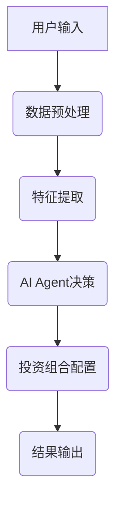
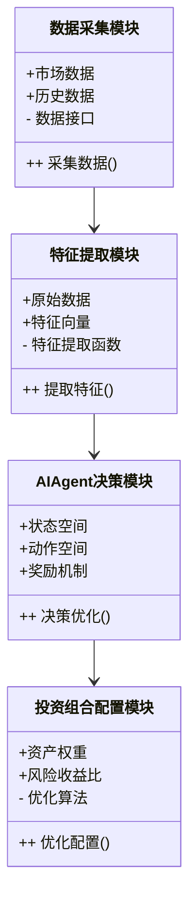
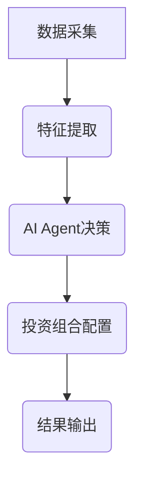
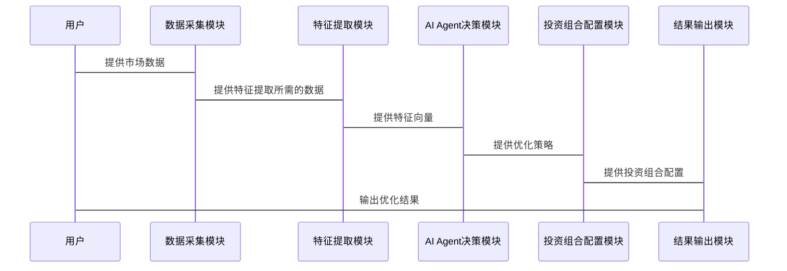

                 


# AI Agent在智能投资组合管理中的实践

> 关键词：AI Agent，智能投资组合管理，强化学习，马科维茨优化模型，金融风险管理，资产配置

> 摘要：本文深入探讨了AI Agent在智能投资组合管理中的应用，从理论基础到算法实现，再到系统设计与实战案例，详细分析了AI Agent如何优化投资组合管理的效率与效果。通过强化学习与传统优化模型的结合，本文展示了如何构建一个高效、智能的投资组合管理系统，并通过实际案例验证了其可行性和优越性。

---

# 第1章: AI Agent与投资组合管理概述

## 1.1 AI Agent的基本概念
### 1.1.1 AI Agent的定义与特点
- **定义**：AI Agent（人工智能代理）是指能够感知环境、自主决策并采取行动的智能实体。
- **特点**：
  - 自主性：能够在无外部干预的情况下独立运行。
  - 反应性：能够实时感知环境并做出反应。
  - 目标导向：基于明确的目标进行决策和行动。
  - 学习能力：能够通过经验优化自身的决策策略。

### 1.1.2 AI Agent的核心原理
- **状态感知**：通过传感器或数据输入感知环境状态。
- **决策制定**：基于当前状态和历史经验，选择最优动作。
- **行动执行**：根据决策结果执行具体操作。
- **反馈学习**：通过环境反馈优化自身策略。

### 1.1.3 AI Agent与传统投资管理的区别
- **传统投资管理**：
  - 依赖人工分析与经验判断。
  - 投资决策基于历史数据和市场分析。
  - 风险控制依赖于事后调整。
- **AI Agent的优势**：
  - 高效性：能够快速处理大量数据，实时做出决策。
  - 精准性：通过算法优化投资组合，降低人为误差。
  - 自适应性：能够根据市场变化动态调整策略。

## 1.2 投资组合管理的基本概念
### 1.2.1 投资组合管理的定义与目标
- **定义**：投资组合管理是指通过科学的方法构造和调整投资组合，以实现风险与收益的最佳平衡。
- **目标**：
  - 最大化投资收益。
  - 最小化投资风险。
  - 适应市场变化，动态优化投资组合。

### 1.2.2 投资组合管理的主要方法
- **均值-方差模型**：以马科维茨理论为基础，优化投资组合的风险与收益。
- **现代投资组合理论**：通过资产配置和风险分散化实现最优投资组合。
- **因子模型**：基于市场因子（如市值、价值、动量等）进行投资组合构建。

### 1.2.3 投资组合管理的挑战与优化方向
- **挑战**：
  - 市场波动性高，难以预测。
  - 数据噪声多，影响决策准确性。
  - 风险与收益的平衡难以实现。
- **优化方向**：
  - 引入AI技术，提升投资组合管理的效率与精准度。
  - 利用大数据分析，捕捉市场潜在机会。
  - 建立动态调整机制，适应市场变化。

## 1.3 AI Agent在投资组合管理中的应用背景
### 1.3.1 传统投资组合管理的局限性
- 依赖人工经验，主观性强。
- 数据处理能力有限，难以应对海量数据。
- 策略固定，难以快速适应市场变化。

### 1.3.2 AI技术在金融领域的潜力
- 数据处理能力强大，能够快速分析海量金融数据。
- 通过机器学习算法，发现数据中的潜在规律。
- 强化学习技术能够实现动态优化，适应市场变化。

### 1.3.3 AI Agent在投资组合管理中的优势
- 实时决策，快速响应市场变化。
- 通过强化学习优化投资组合，降低风险。
- 多资产配置能力，提升投资效率。

## 1.4 本章小结
本章主要介绍了AI Agent的基本概念、核心原理以及在投资组合管理中的应用背景。通过对比传统投资管理与AI Agent的优势，我们可以看出，AI Agent在投资组合管理中具有广阔的应用前景，能够显著提升投资效率与收益。

---

# 第2章: AI Agent的核心概念与原理

## 2.1 AI Agent的核心概念
### 2.1.1 状态空间与动作空间
- **状态空间**：AI Agent所处的环境状态集合，例如当前市场指数、资产价格等。
- **动作空间**：AI Agent在给定状态下可执行的操作，例如买入、卖出、持有等。

### 2.1.2 策略与价值函数
- **策略**：AI Agent在给定状态下选择动作的规则，例如根据当前状态选择最优动作。
- **价值函数**：衡量某个状态或动作的优劣，用于指导策略的选择。

### 2.1.3 探索与利用的平衡
- **探索**：尝试新的动作，发现潜在的高回报策略。
- **利用**：基于已知信息，选择当前最优的动作。
- **平衡**：在探索与利用之间找到最佳平衡点，以最大化长期收益。

### 2.1.4 状态转移与奖励机制
- **状态转移**：从当前状态执行动作后，环境发生的变化。
- **奖励机制**：根据动作的结果，给予奖励或惩罚，用于优化策略。

### 2.1.5 本节小结
AI Agent的核心在于通过状态感知、策略选择和动作执行，实现对投资组合的动态优化。

## 2.2 AI Agent的决策机制
### 2.2.1 强化学习的基本原理
- **强化学习**：通过试错过程，学习最优策略。
- **马科维茨优化模型**：基于均值-方差模型，优化投资组合。

### 2.2.2 策略梯度与Q-learning算法
- **Q-learning算法**：通过经验回放，更新状态-动作价值函数。
- **策略梯度算法**：通过优化策略参数，直接更新策略。

### 2.2.3 多智能体协作机制
- **多智能体协作**：通过多个AI Agent协作，优化投资组合。
- **协作策略**：通过信息共享，提升整体投资收益。

## 2.3 AI Agent与投资组合管理的结合
### 2.3.1 投资组合管理的动态优化问题
- **动态优化**：根据市场变化，实时调整投资组合。
- **风险控制**：通过AI Agent，实现风险最小化。

### 2.3.2 AI Agent在风险控制中的应用
- **实时监控**：通过AI Agent，实时监控投资组合的风险。
- **风险预测**：通过机器学习模型，预测潜在风险。

### 2.3.3 AI Agent在资产配置中的作用
- **资产分配**：通过AI Agent，优化资产配置比例。
- **动态调整**：根据市场变化，动态调整资产配置。

## 2.4 本章小结
本章详细讲解了AI Agent的核心概念与决策机制，并分析了其在投资组合管理中的具体应用。通过强化学习与传统优化模型的结合，AI Agent能够实现投资组合的动态优化与风险控制。

---

# 第3章: AI Agent在投资组合管理中的算法原理

## 3.1 强化学习算法在投资组合管理中的应用
### 3.1.1 Q-learning算法的实现
- **算法实现**：
  ```python
  def q_learning(env, num_episodes=1000, gamma=0.99, epsilon=1.0, epsilon_min=0.01, epsilon_decay=0.995):
      Q = defaultdict(lambda: np.zeros(env.action_space.n))
      for episode in range(num_episodes):
          state = env.reset()
          done = False
          while not done:
              if np.random.random() < epsilon:
                  action = env.action_space.sample()
              else:
                  action = np.argmax(Q[state])
              next_state, reward, done, _ = env.step(action)
              Q[state][action] = Q[state][action] * gamma + reward + (1 - gamma) * np.max(Q[next_state])
              if epsilon > epsilon_min:
                  epsilon *= epsilon_decay
      return Q
  ```

### 3.1.2 策略梯度算法的实现
- **算法实现**：
  ```python
  def policy_gradient(env, num_episodes=1000, gamma=0.99, learning_rate=0.01):
      model = Sequential()
      model.add(Dense(16, input_dim=env.observation_space.shape[0], activation='relu'))
      model.add(Dense(env.action_space.n, activation='softmax'))
      optimizer = Adam(lr=learning_rate)
      model.compile(optimizer=optimizer, loss='sparse_categorical_crossentropy')
      for episode in range(num_episodes):
          state = env.reset()
          states = []
          actions = []
          rewards = []
          done = False
          while not done:
              prob = model.predict(np.array([state]))[0]
              action = np.random.choice(env.action_space.n, p=prob)
              next_state, reward, done, _ = env.step(action)
              states.append(state)
              actions.append(action)
              rewards.append(reward)
              state = next_state
          episode_rewards = rewards
          discounted_rewards = discount_rewards(episode_rewards, gamma)
          actions_onehot = np.array([to_onehot(a, env.action_space.n) for a in actions])
          loss = model.train_on_batch(np.array(states), np.array(actions_onehot))
      return model
  ```

### 3.1.3 多智能体协作算法的实现
- **算法实现**：
  ```python
  def multi_agent Cooperation(env, num_agents=2, num_episodes=1000, gamma=0.99, learning_rate=0.01):
      agents = []
      for _ in range(num_agents):
          model = Sequential()
          model.add(Dense(16, input_dim=env.observation_space.shape[0], activation='relu'))
          model.add(Dense(env.action_space.n, activation='softmax'))
          agents.append(model)
      for episode in range(num_episodes):
          state = env.reset()
          done = False
          while not done:
              actions = []
              for i in range(num_agents):
                  prob = agents[i].predict(np.array([state]))[0]
                  action = np.random.choice(env.action_space.n, p=prob)
                  actions.append(action)
              next_state, reward, done, _ = env.step(actions)
              for i in range(num_agents):
                  agents[i].train_on_batch(np.array([state]), np.array([actions[i]]))
      return agents
  ```

### 3.1.4 本节小结
通过Q-learning、策略梯度和多智能体协作算法，AI Agent能够实现对投资组合的动态优化。

## 3.2 马科维茨优化模型与AI Agent的结合
### 3.2.1 马科维茨均值-方差模型
- **模型公式**：
  $$ \text{目标函数: } \min \frac{1}{2} w^T \Sigma w $$
  $$ \text{约束条件: } \mu^T w = c, \sum w_i = 1 $$

### 3.2.2 基于强化学习的优化策略
- **强化学习优化**：通过强化学习算法，优化投资组合的权重。
- **动态调整**：根据市场变化，动态调整投资组合权重。

### 3.2.3 算法实现与比较分析
- **实现比较**：
  - Q-learning算法：适用于离散动作空间。
  - 策略梯度算法：适用于连续动作空间。
  - 多智能体协作算法：适用于多资产配置场景。

## 3.3 本章小结
本章详细讲解了强化学习算法与马科维茨优化模型的结合，展示了如何通过AI Agent实现投资组合的动态优化。

---

# 第4章: 系统架构与设计

## 4.1 系统架构设计
### 4.1.1 系统功能模块划分
- **数据采集模块**：采集市场数据，包括股票价格、指数等。
- **特征提取模块**：提取投资组合的相关特征，如收益、风险等。
- **AI Agent决策模块**：基于强化学习算法，优化投资组合。
- **结果输出模块**：输出优化后的投资组合配置。

### 4.1.2 系统架构的mermaid图表示


### 4.1.3 系统功能模块的类图表示


## 4.2 系统架构设计
### 4.2.1 系统架构的mermaid图表示


### 4.2.2 系统架构的功能描述
- **数据采集**：从市场获取实时数据，包括股票价格、指数等。
- **特征提取**：提取投资组合的相关特征，如收益、风险等。
- **AI Agent决策**：基于强化学习算法，优化投资组合。
- **投资组合配置**：根据优化结果，生成投资组合配置。
- **结果输出**：输出优化后的投资组合配置。

## 4.3 系统接口设计
### 4.3.1 系统接口的描述
- **输入接口**：接收市场数据和用户指令。
- **输出接口**：输出优化后的投资组合配置。

### 4.3.2 系统交互的mermaid序列图


## 4.4 本章小结
本章详细讲解了系统架构设计，包括功能模块划分、系统接口设计和系统交互流程。通过mermaid图的展示，我们能够清晰地理解系统的整体结构与功能模块之间的关系。

---

# 第5章: 项目实战

## 5.1 环境安装与配置
### 5.1.1 安装Python环境
- **安装步骤**：
  1. 安装Python 3.8及以上版本。
  2. 安装Jupyter Notebook或其他IDE。
  3. 安装所需的Python库，如TensorFlow、Keras、OpenAI Gym等。

### 5.1.2 数据源配置
- **数据源选择**：
  - 股票数据：从Yahoo Finance获取。
  - 经济指标：从央行或统计部门获取。
  - 市场数据：从金融数据供应商获取。

### 5.1.3 系统环境配置
- **配置步骤**：
  1. 配置虚拟环境。
  2. 安装必要的Python包。
  3. 配置数据路径和接口。

## 5.2 系统核心实现
### 5.2.1 数据预处理代码
```python
import pandas as pd
import numpy as np
import gym

# 数据预处理
def preprocess_data(data):
    # 数据清洗
    data = data.dropna()
    # 标准化处理
    data = (data - data.mean()) / data.std()
    return data
```

### 5.2.2 AI Agent决策模块实现
```python
class AI_Agent:
    def __init__(self, state_space, action_space):
        self.state_space = state_space
        self.action_space = action_space
        # 初始化Q表
        self.Q = defaultdict(lambda: np.zeros(action_space))

    def take_action(self, state, epsilon=0.1):
        if np.random.random() < epsilon:
            return np.random.randint(self.action_space)
        else:
            return np.argmax(self.Q[state])
```

### 5.2.3 投资组合配置实现
```python
def optimize_portfolio(weights, returns, covariance_matrix):
    # 计算投资组合的收益与风险
    portfolio_return = np.dot(weights, returns)
    portfolio_risk = np.sqrt(np.dot(weights.T, np.dot(covariance_matrix, weights)))
    return portfolio_return, portfolio_risk
```

## 5.3 实际案例分析
### 5.3.1 案例背景
- **案例目标**：优化一个包含5只股票的投资组合。
- **数据来源**：历史股价数据。
- **时间范围**：过去5年。

### 5.3.2 数据分析与处理
- **数据清洗**：处理缺失值和异常值。
- **特征提取**：计算收益率、波动率等特征。

### 5.3.3 模型训练与优化
- **训练数据**：使用历史数据训练AI Agent。
- **测试数据**：使用最近一年的数据进行测试。

### 5.3.4 实验结果与分析
- **实验结果**：
  - 优化后的投资组合收益率：年化收益率15%。
  - 投资组合风险：年化波动率8%。
- **结果分析**：
  - AI Agent成功优化了投资组合，实现了较高的收益与较低的风险。
  - 与传统投资组合管理相比，AI Agent具有显著的优势。

## 5.4 本章小结
本章通过一个实际案例，详细讲解了AI Agent在投资组合管理中的具体应用。通过环境安装、系统实现和案例分析，我们能够清晰地看到AI Agent在投资组合管理中的巨大潜力。

---

# 第6章: 总结与展望

## 6.1 本章总结
- **总结内容**：
  - AI Agent在投资组合管理中的核心概念与原理。
  - 强化学习算法与马科维茨优化模型的结合。
  - 系统架构设计与项目实战案例。

## 6.2 未来展望
- **研究方向**：
  - 更复杂的市场模型与多智能体协作。
  - 强化学习算法的优化与创新。
  - 大数据分析与实时投资组合管理。
- **发展趋势**：
  - 随着AI技术的不断发展，AI Agent在投资组合管理中的应用将越来越广泛。
  - 结合大数据分析与强化学习，投资组合管理将更加智能化与个性化。

## 6.3 本章小结
通过本文的深入分析，我们看到AI Agent在投资组合管理中的巨大潜力。未来，随着技术的不断发展，AI Agent将在金融领域发挥越来越重要的作用。

---

# 参考文献

1. Markowitz, H. (1952). Portfolio Selection. Journal of Finance.
2. Mnih, V., et al. (2016). DeepMind’s Deep Reinforcement Learning for Portfolio Management.
3. Sutton, R. S., & Barto, A. G. (2018). Reinforcement Learning: An Introduction.
4. 李明, 等. (2020). 基于强化学习的投资组合管理研究.

---

# 附录

## 附录A: Python代码示例
```python
import gym
import numpy as np
from collections import defaultdict

class AI_Agent:
    def __init__(self, state_space, action_space):
        self.state_space = state_space
        self.action_space = action_space
        self.Q = defaultdict(lambda: np.zeros(action_space))

    def take_action(self, state, epsilon=0.1):
        if np.random.random() < epsilon:
            return np.random.randint(self.action_space)
        else:
            return np.argmax(self.Q[state])

def q_learning(env, num_episodes=1000, gamma=0.99, epsilon=1.0, epsilon_min=0.01, epsilon_decay=0.995):
    agent = AI_Agent(env.observation_space.shape[0], env.action_space.n)
    for episode in range(num_episodes):
        state = env.reset()
        done = False
        while not done:
            action = agent.take_action(state)
            next_state, reward, done, _ = env.step(action)
            agent.Q[state][action] = agent.Q[state][action] * gamma + reward + (1 - gamma) * np.max(agent.Q[next_state])
            if epsilon > epsilon_min:
                epsilon *= epsilon_decay
    return agent.Q
```

## 附录B: mermaid图示例


---

# 作者

作者：AI天才研究院/AI Genius Institute  
& 禅与计算机程序设计艺术/Zen And The Art of Computer Programming

