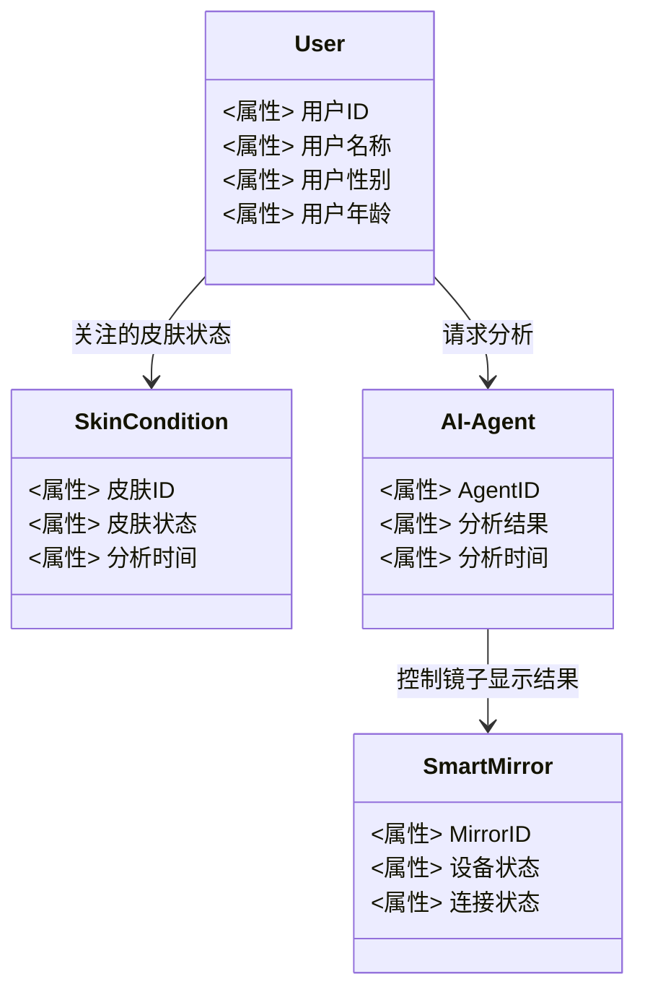
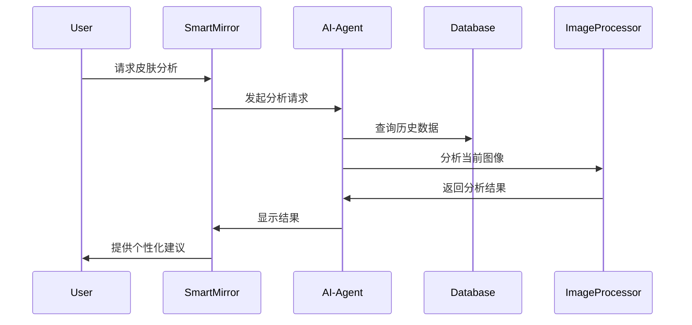

                 


# AI Agent在智能浴室镜中的皮肤状态分析

> 关键词：AI Agent, 智能浴室镜, 皮肤状态分析, 图像处理, 人工智能, 健康监测

> 摘要：本文探讨了AI Agent在智能浴室镜中的皮肤状态分析应用。通过分析皮肤状态，AI Agent能够为用户提供个性化的健康建议，优化护肤方案。文章从背景介绍、核心概念、算法原理、系统设计、项目实战等多个角度展开，详细分析了AI Agent在智能浴室镜中的实现过程，展示了其在健康监测领域的巨大潜力。

---

## 第1章: AI Agent在智能浴室镜中的皮肤状态分析概述

### 1.1 问题背景

#### 1.1.1 皮肤健康的重要性
皮肤是人体最大的器官，不仅承担着保护身体、调节体温的功能，还反映着一个人的健康状况。皮肤问题如 acne、aging、dryness 等，往往与生活方式、饮食习惯、环境因素密切相关。及时监测和改善皮肤状态，对个人健康至关重要。

#### 1.1.2 智能浴室镜的发展趋势
随着物联网和人工智能技术的快速发展，智能浴室镜逐渐从简单的镜子功能扩展到健康监测、个人护理等领域。通过集成传感器和AI技术，智能浴室镜能够实时监测用户的生理指标，提供个性化的健康建议。

#### 1.1.3 AI技术在医疗健康领域的应用潜力
AI技术在医疗健康领域的应用越来越广泛，尤其是在图像识别、数据分析、个性化诊断等方面展现出巨大潜力。AI Agent（智能体）作为一类特殊的AI程序，能够通过与用户交互，主动提供服务和建议。

### 1.2 问题描述

#### 1.2.1 皮肤状态分析的定义
皮肤状态分析是指通过技术手段，对皮肤的健康状况进行评估的过程。常见的评估指标包括皮肤的湿润度、颜色变化、纹理特征、斑点分布等。

#### 1.2.2 智能浴室镜的使用场景
智能浴室镜通常安装在浴室环境中，用户可以通过镜子进行日常护肤、健康监测、信息查询等活动。AI Agent的功能使其能够主动分析用户的皮肤状态，并提供相应的建议。

#### 1.2.3 当前皮肤健康监测的痛点
传统的皮肤健康监测依赖于主观判断或医疗设备，存在以下痛点：
- **便捷性不足**：用户需要专门的时间和地点进行检测。
- **成本高**：专业的皮肤检测设备价格昂贵，难以普及。
- **实时性差**：无法实时反馈皮肤状态变化。

### 1.3 问题解决

#### 1.3.1 AI Agent的核心作用
AI Agent在智能浴室镜中的作用主要体现在以下几个方面：
- **实时监测**：通过摄像头和传感器，实时采集用户的皮肤数据。
- **智能分析**：利用AI算法，分析皮肤状态，识别潜在问题。
- **个性化建议**：根据分析结果，为用户提供个性化的护肤建议。

#### 1.3.2 智能浴室镜如何实现皮肤状态分析
智能浴室镜通过以下步骤实现皮肤状态分析：
1. **数据采集**：使用高分辨率摄像头拍摄用户的面部图像。
2. **图像处理**：通过图像分割、特征提取等技术，识别皮肤区域。
3. **状态分析**：利用预训练的AI模型，分析皮肤的健康状况。
4. **结果反馈**：通过镜子显示分析结果，并提供个性化建议。

#### 1.3.3 解决方案的可行性分析
- **技术可行性**：AI技术和图像处理技术已经较为成熟，能够支持皮肤状态分析。
- **市场潜力**：智能浴室镜市场逐渐扩大，消费者对健康监测功能的需求日益增长。
- **用户体验**：通过实时反馈和个性化建议，提升用户体验，增强用户粘性。

### 1.4 边界与外延

#### 1.4.1 解决方案的边界
- **功能边界**：仅限于皮肤状态分析，不涉及其他健康指标的监测。
- **用户边界**：适用于普通用户，不支持专业医疗诊断。
- **环境边界**：仅在智能浴室镜的特定环境中使用。

#### 1.4.2 解决方案的外延
- **扩展功能**：未来可以集成更多的健康监测功能，如心率监测、体温监测等。
- **应用场景**：从家庭扩展到健身房、美容院等场所。
- **用户群体**：从普通用户扩展到特定健康需求的用户群体。

#### 1.4.3 解决方案的局限性
- **技术局限性**：AI算法的准确性依赖于数据质量和模型训练。
- **设备局限性**：智能浴室镜需要特定的硬件支持，难以普及。
- **隐私问题**：用户数据的采集和存储存在隐私风险。

### 1.5 核心概念与核心要素

#### 1.5.1 AI Agent的定义与特点
- **定义**：AI Agent是一种智能程序，能够通过感知环境、执行任务并主动与用户交互。
- **特点**：
  - **主动性**：能够主动发起任务，无需用户手动操作。
  - **适应性**：能够根据环境变化调整行为。
  - **交互性**：能够通过多种方式与用户交互。

#### 1.5.2 智能浴室镜的功能与结构
- **功能**：
  - 数据采集：通过摄像头和传感器获取用户数据。
  - 数据处理：对采集的数据进行分析和处理。
  - 用户反馈：通过镜子显示分析结果，并提供个性化建议。
- **结构**：
  - 硬件部分：摄像头、传感器、显示屏等。
  - 软件部分：AI算法、数据处理模块、用户界面等。

#### 1.5.3 皮肤状态分析的指标与方法
- **指标**：
  - 皮肤湿润度
  - 皮肤颜色
  - 皮肤纹理
  - 斑点分布
- **方法**：
  - 基于图像处理的分析方法
  - 基于AI模型的分类方法

---

## 第2章: 核心概念与联系

### 2.1 核心概念原理

#### 2.1.1 AI Agent的工作原理
AI Agent通过以下步骤实现皮肤状态分析：
1. **数据采集**：使用摄像头和传感器获取用户面部图像。
2. **图像处理**：对图像进行预处理，提取皮肤区域的特征。
3. **模型训练**：利用训练好的AI模型对皮肤状态进行分类。
4. **结果反馈**：通过镜子显示分析结果，并提供个性化建议。

#### 2.1.2 智能浴室镜的硬件与软件架构
- **硬件部分**：
  - 摄像头：用于采集用户的面部图像。
  - 传感器：用于检测环境光线、温度等参数。
  - 显示屏：用于显示分析结果和个性化建议。
- **软件部分**：
  - 数据处理模块：对采集的数据进行预处理和分析。
  - AI模型：用于皮肤状态的分类和预测。
  - 用户界面：用于与用户交互。

#### 2.1.3 皮肤状态分析的算法流程
1. **图像采集**：获取用户的面部图像。
2. **图像预处理**：调整图像亮度、对比度等参数，增强图像质量。
3. **特征提取**：提取皮肤区域的特征，如颜色、纹理等。
4. **模型训练**：利用训练好的AI模型对皮肤状态进行分类。
5. **结果反馈**：显示分析结果，并提供个性化建议。

### 2.2 核心概念属性对比

| **核心概念** | **AI Agent** | **智能浴室镜** | **皮肤状态分析** |
|--------------|--------------|----------------|------------------|
| **定义**     | 智能程序，能够主动感知环境并执行任务 | 集成AI技术的智能设备，用于健康监测 | 通过技术手段分析皮肤健康状况 |
| **功能**     | 数据采集、分析、反馈 | 实时监测、个性化建议 | 分类、预测、反馈 |
| **优势**     | 高度智能化，能够主动提供服务 | 集成多种功能，方便用户使用 | 准确性高，实时反馈 |

### 2.3 ER实体关系图

```mermaid
erDiagram
    actor User {
        <属性> 用户ID
        <属性> 用户名称
        <属性> 用户性别
        <属性> 用户年龄
    }
    class SkinCondition {
        <属性> 皮肤ID
        <属性> 皮肤状态
        <属性> 分析时间
    }
    class AI-Agent {
        <属性> AgentID
        <属性> 分析结果
        <属性> 分析时间
    }
    class SmartMirror {
        <属性> MirrorID
        <属性> 设备状态
        <属性> 连接状态
    }
    User --> SkinCondition : 关注的皮肤状态
    User --> AI-Agent : 请求分析
    AI-Agent --> SmartMirror : 控制镜子显示结果
```

---

## 第3章: 算法原理讲解

### 3.1 算法选择与原理

#### 3.1.1 图像分割
- **原理**：通过分割算法将皮肤区域从图像中分离出来。
- **实现步骤**：
  1. **图像预处理**：调整图像亮度、对比度等参数。
  2. **边界检测**：通过边缘检测算法找到皮肤区域的边界。
  3. **区域分割**：将皮肤区域从图像中分割出来。

#### 3.1.2 图像分类
- **原理**：通过分类算法对皮肤状态进行分类。
- **实现步骤**：
  1. **特征提取**：提取皮肤区域的特征，如颜色、纹理等。
  2. **模型训练**：利用训练好的AI模型对皮肤状态进行分类。
  3. **结果输出**：输出分类结果，并提供个性化建议。

### 3.2 数学模型与公式

#### 3.2.1 图像分割模型
$$
\text{分割结果} = f(\text{图像输入}, \text{分割参数})
$$

#### 3.2.2 图像分类模型
$$
\text{分类结果} = g(\text{特征向量}, \text{分类器})
$$

### 3.3 算法实现

#### 3.3.1 Python代码实现

```python
import cv2
import numpy as np

def skin_segmentation(image):
    # 转换为HSV颜色空间
    hsv = cv2.cvtColor(image, cv2.COLOR_BGR2HSV)
    # 定义皮肤颜色范围
    lower = np.array([0, 40, 60])
    upper = np.array([40, 255, 255])
    # 使用阈值分割提取皮肤区域
    mask = cv2.inRange(hsv, lower, upper)
    # 返回分割结果
    return mask

def skin_analysis(image):
    # 调用皮肤分割函数
    mask = skin_segmentation(image)
    # 提取皮肤区域的特征
    features = extract_features(mask)
    # 调用分类器进行分类
    result = classify_skin(features)
    return result

def extract_features(mask):
    # 提取特征函数
    pass

def classify_skin(features):
    # 分类器函数
    pass
```

#### 3.3.2 代码说明
- **图像分割**：通过颜色空间转换和阈值分割，提取皮肤区域。
- **特征提取**：从分割后的皮肤区域中提取颜色、纹理等特征。
- **分类器调用**：利用预训练的分类器对皮肤状态进行分类，返回分析结果。

---

## 第4章: 系统分析与架构设计

### 4.1 项目场景介绍

#### 4.1.1 项目背景
智能浴室镜通过AI Agent实现皮肤状态分析，为用户提供个性化的健康建议。用户可以在日常洗漱时，实时了解自己的皮肤状态，并获得护肤建议。

#### 4.1.2 项目目标
- 实现皮肤状态的实时监测。
- 提供个性化的护肤建议。
- 提升用户体验，增强用户粘性。

### 4.2 系统功能设计

#### 4.2.1 领域模型类图



#### 4.2.2 系统架构图

```mermaid
graph TD
    User --> AI-Agent : 请求分析
    AI-Agent --> SmartMirror : 控制显示
    SmartMirror --> Database : 存储结果
    Database --> AI-Agent : 返回结果
```

#### 4.2.3 系统接口设计
- **用户接口**：通过触摸屏或语音交互，用户可以请求皮肤分析。
- **AI Agent接口**：接收用户的请求，调用相关服务进行分析。
- **智能浴室镜接口**：显示分析结果，并提供个性化建议。

#### 4.2.4 系统交互设计



---

## 第5章: 项目实战

### 5.1 环境安装

#### 5.1.1 系统要求
- 操作系统：Windows 10 或更高版本。
- 硬件要求：支持摄像头和传感器的智能浴室镜。
- 软件要求：Python 3.8 或更高版本，OpenCV、TensorFlow等库。

#### 5.1.2 安装依赖
```bash
pip install numpy
pip install opencv-python
pip install tensorflow
```

### 5.2 系统核心实现

#### 5.2.1 核心代码

```python
import cv2
import numpy as np
import tensorflow as tf

def main():
    # 初始化摄像头
    cap = cv2.VideoCapture(0)
    while True:
        # 读取视频流
        ret, frame = cap.read()
        if not ret:
            break
        # 调用皮肤分析函数
        result = skin_analysis(frame)
        # 显示分析结果
        cv2.imshow('Skin Analysis', result)
        # 按键退出
        if cv2.waitKey(1) & 0xFF == ord('q'):
            break
    cap.release()
    cv2.destroyAllWindows()

if __name__ == "__main__":
    main()
```

#### 5.2.2 代码解读
- **摄像头初始化**：通过OpenCV库初始化摄像头，读取视频流。
- **皮肤分析**：调用`skin_analysis`函数，对每一帧图像进行分析。
- **结果显示**：将分析结果通过OpenCV窗口显示出来。
- **退出控制**：通过按'q'键退出程序。

### 5.3 案例分析与解读

#### 5.3.1 实际案例
用户A，25岁，女性，皮肤状态分析结果显示：皮肤偏干，建议使用保湿产品。

#### 5.3.2 分析解读
- **数据采集**：通过摄像头获取用户的面部图像。
- **图像处理**：提取皮肤区域，分析湿润度。
- **结果反馈**：通过镜子显示分析结果，并提供个性化建议。

### 5.4 项目小结

#### 5.4.1 核心收获
- 掌握了AI Agent在智能浴室镜中的实现方法。
- 理解了皮肤状态分析的核心算法和实现步骤。

#### 5.4.2 经验总结
- 数据采集是关键，图像质量直接影响分析结果。
- 模型训练需要大量的数据支持，算法的准确率依赖于数据质量和模型优化。

---

## 第6章: 最佳实践

### 6.1 小结

- 本文详细介绍了AI Agent在智能浴室镜中的皮肤状态分析应用。
- 通过分析皮肤状态，AI Agent能够为用户提供个性化的健康建议，优化护肤方案。

### 6.2 注意事项

- 数据隐私：用户数据的采集和存储需严格遵守隐私保护法规。
- 设备兼容性：确保智能浴室镜与不同设备的兼容性。
- 模型优化：持续优化AI模型，提高分析准确率。

### 6.3 拓展阅读

- 推荐阅读《深度学习实战》、《Python机器学习》等书籍，深入理解AI技术的应用。
- 关注AI在健康监测领域的最新进展，了解更多的应用场景。

---

## 作者：AI天才研究院/AI Genius Institute & 禅与计算机程序设计艺术/Zen And The Art of Computer Programming

