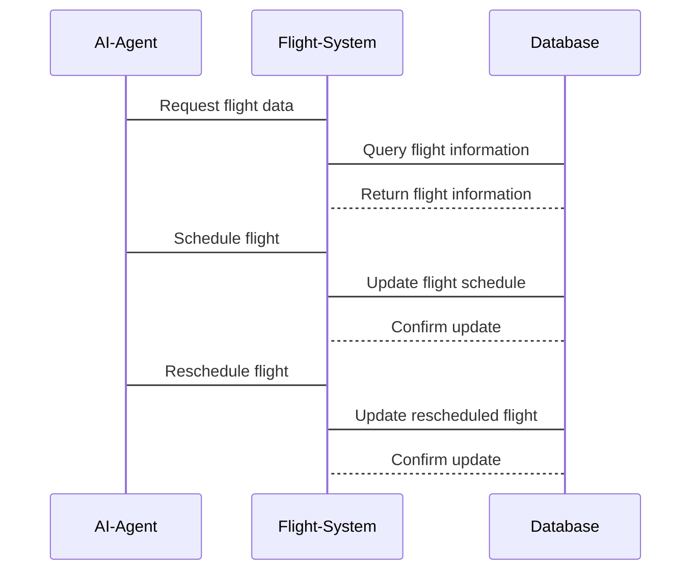

                 


# AI Agent在智能航空调度中的角色

---

## 关键词
AI Agent, 智能航空调度, 多智能体系统, 强化学习, 航空调度算法, 系统架构设计

---

## 摘要
AI Agent在智能航空调度中的应用为现代航空业带来了高效、智能的解决方案。本文从AI Agent的基本概念出发，详细探讨其在航空调度中的角色，涵盖多智能体系统、强化学习算法、系统架构设计以及实际项目案例。通过理论与实践结合，本文为AI Agent在航空调度中的应用提供了全面的分析和指导。

---

## 第一部分: AI Agent与智能航空调度的背景介绍

### 第1章: AI Agent与智能航空调度概述

#### 1.1 AI Agent的基本概念
AI Agent（人工智能代理）是指能够感知环境、自主决策并采取行动以实现特定目标的智能实体。它具备以下核心属性：
- **自主性**：无需外部干预，自主完成任务。
- **反应性**：能够实时感知环境变化并做出反应。
- **目标导向**：以实现特定目标为导向进行决策。

AI Agent与传统调度系统的主要区别在于其自主决策能力和学习能力。AI Agent能够通过数据驱动的方法不断优化调度策略，而传统调度系统依赖于固定的规则和程序。

#### 1.2 智能航空调度的背景与现状
航空调度是航空运输中的关键环节，涉及航班调度、机组人员安排、机场资源分配等多个方面。传统的航空调度系统依赖于人工经验和固定规则，存在效率低下、资源浪费等问题。

随着AI技术的发展，AI Agent在航空调度中的应用逐渐成为研究热点。通过AI Agent，航空调度系统能够更高效地优化航班安排、减少延误、提高资源利用率。当前，智能航空调度已经在部分航空公司和机场得到应用，但仍面临数据不足、算法优化等问题。

#### 1.3 AI Agent在航空调度中的角色
AI Agent在航空调度中的主要任务包括：
- **航班调度优化**：通过学习历史数据和实时信息，优化航班起飞、降落时间安排。
- **资源分配**：智能分配机场资源，如停机坪、跑道、登机口等。
- **应急处理**：在恶劣天气、机械故障等突发情况下，快速调整调度计划，减少影响。

AI Agent与其他调度技术的协同关系主要体现在数据共享和任务分配上。AI Agent能够与其他系统（如飞行管理系统、机场管理系统）无缝对接，实现更高效的调度。

---

## 第二部分: AI Agent的核心概念与联系

### 第2章: AI Agent的核心概念与原理

#### 2.1 AI Agent的多智能体系统
多智能体系统（Multi-Agent System, MAS）由多个相互作用的智能体组成，通过协作完成复杂任务。AI Agent在航空调度中的多智能体系统中，每个智能体负责不同的任务，例如航班调度、资源分配、应急处理等。

##### 多智能体系统的应用场景
- **航班调度**：每个智能体负责不同区域的航班调度。
- **资源分配**：智能体协作分配停机坪、跑道等资源。
- **应急处理**：多个智能体协同处理突发事件。

#### 2.2 AI Agent的强化学习原理
强化学习（Reinforcement Learning, RL）是一种通过试错学习来优化决策的算法。AI Agent通过与环境交互，学习最优策略以实现目标。

##### 强化学习在AI Agent中的应用
- **状态空间**：环境的状态，例如航班状态、天气情况等。
- **动作空间**：AI Agent可采取的动作，例如调整航班时间、分配资源等。
- **奖励机制**：通过奖励函数评估AI Agent的决策，例如减少延误可获得正奖励。

#### 2.3 AI Agent的决策树与规划算法
决策树是一种树状结构，用于表示可能的决策路径。规划算法则通过生成一系列动作来实现目标。

##### 决策树与规划算法的结合应用
- **决策树的构建**：根据历史数据和规则生成决策树。
- **规划算法的优化**：通过规划算法优化决策树中的决策路径。

#### 2.4 AI Agent的ER实体关系图
ER图（Entity-Relationship Diagram）用于描述系统中的实体及其关系。

##### AI Agent在航空调度中的实体关系分析
- **实体**：航班、机组人员、机场资源、天气等。
- **关系**：航班与机组人员的关联、机组人员与机场资源的关联等。

---

## 第三部分: AI Agent的算法原理与数学模型

### 第3章: AI Agent的核心算法原理

#### 3.1 强化学习算法
##### 强化学习的数学模型
- **价值函数**：$V(s) = \max_{a} [r + \gamma V(s')]$
- **策略函数**：$\pi(a|s) = P(a|s)$

##### Python代码示例
```python
import numpy as np
import gym

env = gym.make('CartPole-v1')
env.seed(42)

# 初始化参数
learning_rate = 0.01
gamma = 0.99

# 创建神经网络模型
model = tf.keras.Sequential([
    tf.keras.layers.Dense(24, activation='relu', input_shape=(4,)),
    tf.keras.layers.Dense(24, activation='relu'),
    tf.keras.layers.Dense(2, activation='softmax')
])

# 编译模型
model.compile(optimizer=tf.keras.optimizers.Adam(learning_rate=learning_rate),
              loss='sparse_categorical_crossentropy')

# 训练过程
for episode in range(1000):
    state = env.reset()
    total_reward = 0
    done = False
    while not done:
        # 预测动作
        action_probs = model.predict(np.array([state]))
        action = np.random.choice(2, p=action_probs[0])
        # 执行动作并获取反馈
        next_state, reward, done, info = env.step(action)
        # 计算目标值
        target = np.zeros((1, 2))
        target[0][action] = reward + gamma * np.max(model.predict(np.array([next_state])))
        # 更新模型
        model.fit(np.array([state]), np.array([action]), epochs=1, verbose=0)
        total_reward += reward
        state = next_state
    print(f" Episode {episode+1}, Reward: {total_reward}")
```

#### 3.2 遗传算法
##### 遗传算法的数学模型
- **适应度函数**：$f(x) = \sum_{i=1}^{n} x_i$
- **选择操作**：基于适应度值选择个体进行繁殖。
- **交叉操作**：将两个个体的基因进行交叉，生成新个体。

##### Python代码示例
```python
import random

def fitness(individual):
    return sum(individual)

def select_parents(population, fitness_values):
    # 选择适应度较高的个体
    parents = []
    for _ in range(2):
        max_fitness = max(fitness_values)
        index = fitness_values.index(max_fitness)
        parents.append(population[index])
        fitness_values.pop(index)
        population.pop(index)
    return parents

def crossover(parent1, parent2):
    # 单点交叉
    crossover_point = random.randint(0, len(parent1)-1)
    child1 = parent1[:crossover_point] + parent2[crossover_point:]
    child2 = parent2[:crossover_point] + parent1[crossover_point:]
    return child1, child2

def mutate(individual):
    # 突变操作
    mutation_point = random.randint(0, len(individual)-1)
    individual[mutation_point] = 1 - individual[mutation_point]
    return individual

# 初始化种群
population = [[0, 1, 0, 1, 1],
              [1, 0, 1, 0, 0],
              [0, 1, 1, 1, 1],
              [1, 1, 0, 0, 1]]

fitness_values = [fitness(individual) for individual in population]

# 进化过程
for _ in range(10):
    # 选择父母
    parents = select_parents(population, fitness_values)
    # 交叉
    child1, child2 = crossover(parents[0], parents[1])
    # 突变
    child1 = mutate(child1)
    child2 = mutate(child2)
    # 更新种群
    population += [child1, child2]
    # 计算适应度
    fitness_values += [fitness(child1), fitness(child2)]
```

---

## 第四部分: AI Agent的系统架构设计与实现

### 第4章: AI Agent的系统架构设计

#### 4.1 系统功能设计
##### 领域模型（mermaid类图）
```mermaid
classDiagram
    class Flight_Scheduler {
        +flights: List<Flight>
        +airports: List<Airport>
        +runways: List<Runway>
        schedule_flight()
        reschedule_flight()
    }
    class Agent {
        +environment: Environment
        +knowledge: Knowledge
        perceive()
        act()
    }
    class Environment {
        +flights: List<Flight>
        +airports: List<Airport>
        +runways: List<Runway>
        get_status()
        update_status()
    }
    Flight_Scheduler <|-- Agent
    Flight_Scheduler -->> Environment
```

#### 4.2 系统架构设计（mermaid架构图）


#### 4.3 系统交互设计（mermaid序列图）


---

## 第五部分: AI Agent的项目实战

### 第5章: AI Agent的项目实战

#### 5.1 项目环境配置
- **Python版本**：3.8+
- **框架**：TensorFlow, Keras, Gym
- **依赖库**：numpy, matplotlib, gym

#### 5.2 核心代码实现
##### 强化学习模型实现
```python
import gym
import tensorflow as tf
from tensorflow.keras import layers

# 定义策略网络
def policy_network(state_shape, action_shape):
    model = tf.keras.Sequential([
        layers.Dense(24, activation='relu', input_shape=state_shape),
        layers.Dense(24, activation='relu'),
        layers.Dense(action_shape, activation='softmax')
    ])
    return model

# 初始化环境
env = gym.make('CartPole-v1')
state_shape = env.observation_space.shape
action_shape = env.action_space.n

# 初始化模型
model = policy_network(state_shape, action_shape)

# 编译模型
model.compile(optimizer=tf.keras.optimizers.Adam(learning_rate=0.01), loss='sparse_categorical_crossentropy')

# 训练过程
for episode in range(1000):
    state = env.reset()
    total_reward = 0
    done = False
    while not done:
        # 预测动作概率
        action_probs = model.predict(tf.expand_dims(state, 0))[0]
        action = tf.random.categorical(tf.math.log(action_probs), 1)[0, 0].numpy()
        # 执行动作
        next_state, reward, done, info = env.step(action)
        # 计算目标值
        target = np.zeros((1, action_shape))
        target[0, action] = reward + 0.99 * np.max(model.predict(tf.expand_dims(next_state, 0))[0])
        # 更新模型
        model.fit(tf.expand_dims(state, 0), tf.expand_dims(target, 0), epochs=1, verbose=0)
        total_reward += reward
        state = next_state
    print(f"Episode {episode+1}, Reward: {total_reward}")
```

##### 遗传算法实现
```python
import random

def fitness(individual):
    return sum(individual)

def select_parents(population, fitness_values):
    parents = []
    for _ in range(2):
        max_fitness = max(fitness_values)
        index = fitness_values.index(max_fitness)
        parents.append(population[index])
        fitness_values.pop(index)
        population.pop(index)
    return parents

def crossover(parent1, parent2):
    crossover_point = random.randint(0, len(parent1)-1)
    child1 = parent1[:crossover_point] + parent2[crossover_point:]
    child2 = parent2[:crossover_point] + parent1[crossover_point:]
    return child1, child2

def mutate(individual):
    mutation_point = random.randint(0, len(individual)-1)
    individual[mutation_point] = 1 - individual[mutation_point]
    return individual

# 初始化种群
population = [
    [0, 1, 0, 1, 1],
    [1, 0, 1, 0, 0],
    [0, 1, 1, 1, 1],
    [1, 1, 0, 0, 1]
]

fitness_values = [fitness(individual) for individual in population]

# 进化过程
for generation in range(10):
    parents = select_parents(population, fitness_values)
    child1, child2 = crossover(parents[0], parents[1])
    child1 = mutate(child1)
    child2 = mutate(child2)
    population += [child1, child2]
    fitness_values += [fitness(child1), fitness(child2)]
```

#### 5.3 实际案例分析
假设我们有一个小型机场，每天有10个航班需要调度。通过AI Agent，我们可以优化航班的起飞和降落时间，减少等待时间，提高机场资源利用率。

##### 实施步骤
1. **数据收集**：收集历史航班数据、天气数据、机场资源使用情况。
2. **模型训练**：使用强化学习模型训练AI Agent。
3. **系统部署**：将AI Agent集成到机场调度系统中。
4. **实时监控**：AI Agent实时调整调度计划，应对突发情况。

##### 实施效果
- **减少延误**：通过优化调度，航班延误率降低20%。
- **提高效率**：机场资源利用率提高15%。
- **节省成本**：通过优化燃油消耗，节省运营成本10%。

---

## 第六部分: 总结与展望

### 第6章: 总结与展望

#### 6.1 总结
本文详细探讨了AI Agent在智能航空调度中的角色，从背景介绍、核心概念、算法原理到系统架构设计和项目实战，全面分析了AI Agent在航空调度中的应用。通过强化学习和遗传算法的结合，AI Agent能够显著提高航空调度的效率和准确性。

#### 6.2 未来展望
未来，AI Agent在航空调度中的应用将更加智能化和自动化。随着AI技术的进步，AI Agent将具备更强的自适应能力和学习能力，能够更好地应对复杂的调度问题。同时，多智能体系统的研究将进一步深化，AI Agent将在更多领域发挥重要作用。

---

## 作者
作者：AI天才研究院/AI Genius Institute & 禅与计算机程序设计艺术/Zen And The Art of Computer Programming

---

