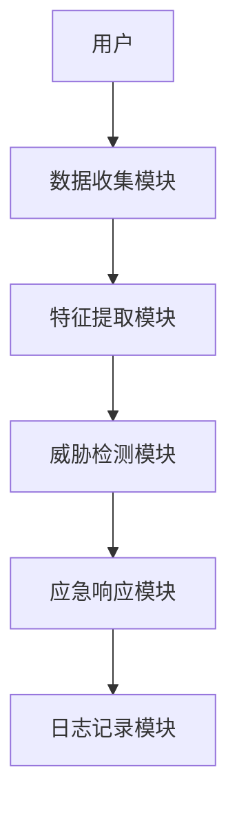
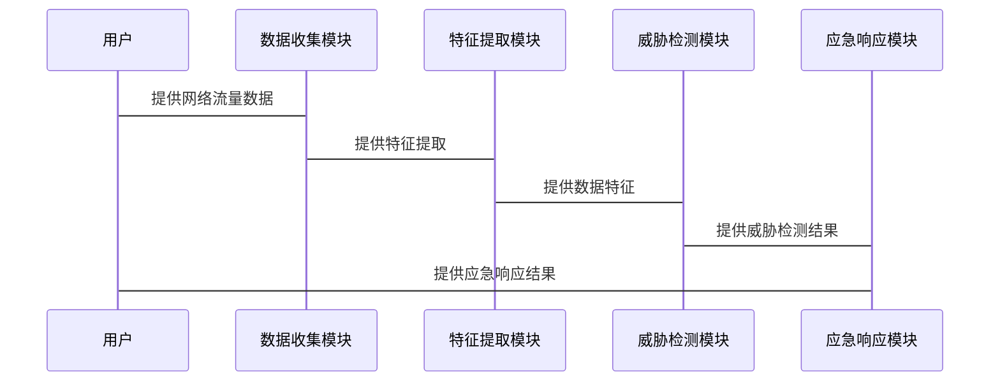

                 


# AI Agent在网络安全防御中的应用

> 关键词：AI Agent，网络安全，人工智能，威胁检测，漏洞挖掘，安全防御

> 摘要：随着网络安全威胁的日益复杂化和智能化，传统的基于规则的安全防御系统已难以应对新型攻击手段。本文详细探讨了AI Agent在网络安全防御中的应用，从基础概念到实际应用，结合算法原理和系统架构设计，系统性地分析了AI Agent在威胁检测、漏洞挖掘和应急响应等场景中的优势和实现方法。同时，通过具体的项目实战，展示了如何利用AI Agent构建智能化的安全防御系统。

---

# 第一部分: AI Agent与网络安全防御基础

## 第1章: AI Agent与网络安全防御概述

### 1.1 AI Agent的基本概念
#### 1.1.1 AI Agent的定义与特点
AI Agent（人工智能代理）是指能够感知环境、自主决策并执行任务的智能实体。AI Agent的核心特点包括：
- **自主性**：能够在没有外部干预的情况下自主运行。
- **反应性**：能够实时感知环境变化并做出相应反应。
- **学习能力**：通过数据和经验不断优化自身行为。

#### 1.1.2 AI Agent与传统安全防御的区别
传统的基于规则的安全防御系统依赖于预定义的规则和特征匹配，而AI Agent能够通过机器学习算法自动识别异常行为，适应新的威胁模式。

#### 1.1.3 网络安全防御中的AI Agent应用场景
AI Agent在网络安全中的主要应用场景包括：
- 威胁检测
- 漏洞挖掘
- 应急响应
- 安全监控

### 1.2 网络安全防御的基本概念
#### 1.2.1 网络安全防御的定义与目标
网络安全防御是指通过技术手段保护网络系统免受未经授权的访问、破坏或信息泄露。其主要目标包括：
- 保护数据完整性
- 保证服务可用性
- 维护数据机密性

#### 1.2.2 网络安全威胁的分类与特点
网络安全威胁主要分为以下几类：
- **病毒与恶意软件**：通过感染系统或数据传播恶意代码。
- **网络攻击**：利用漏洞攻击网络系统。
- **社会工程学攻击**：通过欺骗手段获取敏感信息。
- **数据泄露**：未经授权的数据访问和泄露。

#### 1.2.3 AI技术在网络安全中的优势
AI技术能够通过以下方式提升网络安全防御能力：
- **快速响应**：实时分析网络流量，快速识别并响应威胁。
- **智能学习**：通过机器学习算法不断优化威胁检测模型。
- **自动化防御**：自动化处理常见安全事件，减轻人工负担。

## 第2章: AI Agent的核心概念与原理

### 2.1 AI Agent的核心概念
#### 2.1.1 知识表示与推理
知识表示是AI Agent理解环境的基础。通过将知识表示为符号、规则或概率模型，AI Agent能够进行逻辑推理，做出决策。

#### 2.1.2 行为决策与规划
AI Agent需要根据当前状态和目标，制定行动计划并执行。常见的决策方法包括基于规则的决策和基于概率的决策。

#### 2.1.3 状态感知与反馈
AI Agent通过传感器或其他数据源感知环境状态，并根据反馈调整自身行为。

### 2.2 AI Agent的分类与特点
#### 2.2.1 基于规则的AI Agent
基于规则的AI Agent通过预定义的规则进行决策，适用于处理已知的、规则明确的问题。

#### 2.2.2 基于机器学习的AI Agent
基于机器学习的AI Agent能够从数据中学习规律，适用于处理复杂、动态的网络安全威胁。

#### 2.2.3 基于强化学习的AI Agent
基于强化学习的AI Agent通过与环境的交互不断优化自身的决策策略，适用于需要动态调整的网络安全防御场景。

### 2.3 AI Agent与网络安全防御的关系
#### 2.3.1 AI Agent在威胁检测中的作用
AI Agent能够通过机器学习算法分析网络流量，识别异常行为，从而提高威胁检测的准确率。

#### 2.3.2 AI Agent在漏洞挖掘中的应用
AI Agent可以通过自动化的方式扫描网络系统，识别潜在漏洞，并提出修复建议。

#### 2.3.3 AI Agent在应急响应中的价值
AI Agent能够快速响应安全事件，自动化执行应急响应策略，减少人工干预的时间。

## 第3章: AI Agent在网络安全防御中的应用背景

### 3.1 网络安全威胁的现状与挑战
#### 3.1.1 当前网络安全威胁的主要类型
当前网络安全威胁主要包括病毒、网络攻击、数据泄露等。

#### 3.1.2 传统安全防御的局限性
传统安全防御系统依赖于规则匹配和特征识别，难以应对新型、未知的威胁。

#### 3.1.3 AI技术在网络安全中的必要性
AI技术能够通过学习和适应，提升网络安全防御的智能化水平，更好地应对复杂威胁。

---

# 第二部分: AI Agent在网络安全防御中的算法原理

## 第4章: AI Agent的核心算法与实现

### 4.1 基于监督学习的威胁检测
#### 4.1.1 监督学习的定义与特点
监督学习是一种机器学习方法，通过训练数据学习输入与输出之间的关系。

#### 4.1.2 威胁检测的监督学习模型
常用的监督学习算法包括决策树、随机森林和逻辑回归。这些算法可以用于分类网络流量，识别异常行为。

#### 4.1.3 基于监督学习的威胁检测流程
1. 数据预处理：清洗数据，提取特征。
2. 模型训练：使用训练数据训练分类器。
3. 模型评估：通过测试数据评估模型的准确率、召回率等指标。

#### 4.1.4 代码实现
```python
from sklearn.tree import DecisionTreeClassifier
from sklearn.model_selection import train_test_split
from sklearn.metrics import accuracy_score

# 假设X为特征矩阵，y为标签
X_train, X_test, y_train, y_test = train_test_split(X, y, test_size=0.3)

# 初始化决策树分类器
clf = DecisionTreeClassifier()

# 训练模型
clf.fit(X_train, y_train)

# 预测测试数据
y_pred = clf.predict(X_test)

# 计算准确率
accuracy = accuracy_score(y_test, y_pred)
print(f"Accuracy: {accuracy}")
```

### 4.2 基于无监督学习的异常检测
#### 4.2.1 无监督学习的定义与特点
无监督学习是一种机器学习方法，适用于数据标签未知的情况。

#### 4.2.2 基于聚类算法的异常检测
K-means算法是一种常用的聚类算法，可以用于将网络流量分为正常和异常两类。

#### 4.2.3 基于无监督学习的异常检测流程
1. 数据预处理：清洗数据，提取特征。
2. 聚类分析：使用K-means算法将数据分为正常和异常两类。
3. 异常检测：通过分析聚类结果，识别异常行为。

#### 4.2.4 代码实现
```python
from sklearn.cluster import KMeans
from sklearn.metrics import silhouette_score

# 初始化K-means聚类器
kmeans = KMeans(n_clusters=2, random_state=0)

# 训练模型
kmeans.fit(X)

# 预测聚类结果
y_pred = kmeans.predict(X)

# 计算轮廓系数
score = silhouette_score(X, y_pred)
print(f"Silhouette Score: {score}")
```

### 4.3 基于强化学习的自适应防御
#### 4.3.1 强化学习的定义与特点
强化学习是一种机器学习方法，通过与环境的交互不断优化决策策略。

#### 4.3.2 基于强化学习的自适应防御策略
强化学习可以用于动态调整安全策略，例如动态调整防火墙规则。

#### 4.3.3 基于强化学习的自适应防御流程
1. 状态感知：感知网络环境的状态。
2. 行动选择：根据当前状态选择最优行动。
3. 状态转移：执行行动并观察新的状态。
4. 奖励机制：根据行动结果调整奖励函数，优化决策策略。

#### 4.3.4 代码实现
```python
import numpy as np
import gym

# 定义强化学习环境
class SecurityEnv(gym.Env):
    def __init__(self):
        # 状态空间定义
        self.observation_space = gym.spaces.Box(low=-1, high=1, shape=(1,))
        # 行动空间定义
        self.action_space = gym.spaces.Discrete(3)

    def reset(self):
        # 初始化环境
        self.state = 0
        return self.state

    def step(self, action):
        # 执行行动
        self.state = (self.state + action - 1) * 0.5
        # 返回新状态、奖励、是否终止
        reward = 1 if abs(self.state) < 0.1 else -1
        done = abs(self.state) < 0.01
        return self.state, reward, done, {}

# 初始化环境
env = SecurityEnv()

# 初始化强化学习算法（例如，Q-Learning）
# 这里简化为随机选择行动
action = np.random.randint(0, 3)
next_state, reward, done, _ = env.step(action)
print(f"Action: {action}, Reward: {reward}, Done: {done}")
```

---

# 第三部分: AI Agent在网络安全防御中的系统架构设计

## 第5章: AI Agent的系统架构与实现

### 5.1 系统功能设计
#### 5.1.1 系统功能模块
AI Agent系统主要包括以下功能模块：
- 数据收集模块：收集网络流量数据。
- 特征提取模块：提取数据特征。
- 威胁检测模块：基于机器学习算法检测威胁。
- 应急响应模块：根据检测结果采取应急措施。

#### 5.1.2 系统功能流程
1. 数据收集模块：实时收集网络流量数据。
2. 特征提取模块：提取数据中的特征，例如流量大小、源IP、目的IP等。
3. 威胁检测模块：基于机器学习算法对特征进行分类，识别异常行为。
4. 应急响应模块：根据检测结果，触发相应的安全策略，例如封锁IP、切断连接等。

### 5.2 系统架构设计
#### 5.2.1 系统架构图
使用Mermaid绘制系统架构图：



#### 5.2.2 系统模块设计
- **数据收集模块**：负责收集网络流量数据，存储到数据库中。
- **特征提取模块**：从数据中提取特征，例如时间戳、源IP、目的IP、流量大小等。
- **威胁检测模块**：基于机器学习算法对特征进行分类，识别异常行为。
- **应急响应模块**：根据检测结果，触发相应的安全策略，例如封锁IP、切断连接等。
- **日志记录模块**：记录系统的运行状态和检测结果。

### 5.3 系统接口设计
#### 5.3.1 数据接口
- 数据输入接口：接收网络流量数据。
- 数据输出接口：输出检测结果和日志信息。

#### 5.3.2 API接口
- 提供RESTful API，供其他系统调用检测结果。

### 5.4 系统交互设计
#### 5.4.1 交互流程
1. 用户通过API调用AI Agent系统。
2. 系统收集网络流量数据。
3. 系统提取数据特征。
4. 系统基于机器学习算法检测威胁。
5. 系统输出检测结果和日志信息。

#### 5.4.2 交互序列图
使用Mermaid绘制交互序列图：



---

# 第四部分: 项目实战

## 第6章: AI Agent在网络安全防御中的项目实战

### 6.1 项目背景与目标
#### 6.1.1 项目背景
本项目旨在开发一个基于AI Agent的网络安全防御系统，能够实时检测网络威胁，自动响应安全事件。

#### 6.1.2 项目目标
- 实现实时网络流量监控。
- 基于机器学习算法检测网络威胁。
- 自动化应急响应。

### 6.2 环境安装与配置
#### 6.2.1 环境要求
- 操作系统：Linux或Windows
- Python版本：3.6以上
- 需要安装的库：scikit-learn、numpy、pandas、mermaid、gym等。

#### 6.2.2 安装步骤
1. 安装Python环境。
2. 安装所需的Python库。
3. 配置网络数据收集工具（例如Snort、Suricata）。

### 6.3 核心代码实现
#### 6.3.1 数据收集模块
```python
import socket

def collect_network_traffic(interface='eth0'):
    # 创建原始套接字
    s = socket.socket(socket.AF_INET, socket.SOCK_RAW, socket.IPPROTO_IP)
    s.bind((interface, 0))
    s.setsockopt(socket.IPPROTO_IP, socket.IP_HDRINCL, 1)
    
    while True:
        # 接收数据包
        packet = s.recvfrom(65535)
        # 处理数据包
        handle_packet(packet)
```

#### 6.3.2 特征提取模块
```python
import numpy as np
import pandas as pd

def extract_features(packet):
    # 提取特征，例如时间戳、源IP、目的IP、流量大小等
    features = {
        'timestamp': packet.timestamp,
        'source_ip': packet.src,
        'destination_ip': packet.dst,
        'traffic_size': len(packet.load)
    }
    return pd.DataFrame(features)
```

#### 6.3.3 威胁检测模块
```python
from sklearn.ensemble import RandomForestClassifier

def detect_threat(features):
    # 训练模型
    model = RandomForestClassifier()
    model.fit(features, labels)
    
    # 预测威胁
    prediction = model.predict(new_features)
    return prediction
```

#### 6.3.4 应急响应模块
```python
def respond_to_threat(threat_level):
    if threat_level == 'high':
        # 封锁IP
        block_ip(ip)
    elif threat_level == 'medium':
        # 警报
        send_alert(ip)
    else:
        # 默认处理
        pass
```

### 6.4 项目小结
#### 6.4.1 项目实现的关键点
- 数据收集模块的实现
- 特征提取模块的设计
- 威胁检测模块的算法选择
- 应急响应模块的自动化处理

#### 6.4.2 项目中的注意事项
- 数据隐私问题
- 模型的泛化能力
- 系统的实时性要求

---

# 第五部分: 总结与展望

## 第7章: 总结与展望

### 7.1 总结
AI Agent在网络安全防御中的应用为传统的安全防御系统带来了新的思路和方法。通过机器学习算法，AI Agent能够实时检测网络威胁，自动化处理安全事件，显著提升了网络安全防御的效率和能力。

### 7.2 展望
尽管AI Agent在网络安全防御中取得了显著成效，但仍面临一些挑战，例如模型的泛化能力、系统的实时性、算法的可解释性等。未来的研究方向包括：
- 提升AI Agent的泛化能力，使其能够应对更多类型的网络安全威胁。
- 提高系统的实时性，减少响应时间。
- 提升算法的可解释性，便于安全专家理解和优化模型。

---

作者：AI天才研究院/AI Genius Institute & 禅与计算机程序设计艺术 /Zen And The Art of Computer Programming

