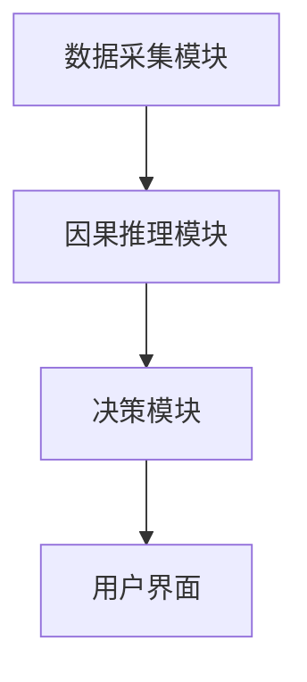
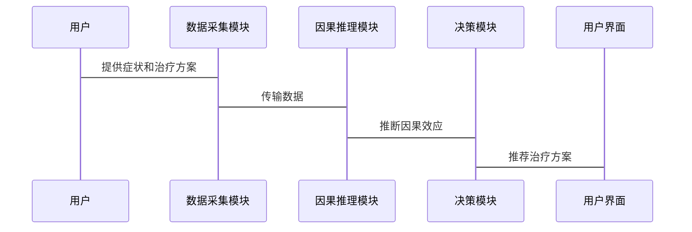

                 


# AI Agent的因果推理能力构建

> 关键词：AI Agent, 因果推理, 结构方程模型, 潜在结果框架, 因果图, 系统架构设计, 项目实战

> 摘要：本文深入探讨了AI Agent的因果推理能力构建，从基本概念到算法原理，再到系统设计和项目实战，全面解析了如何在AI Agent中实现因果推理。文章首先介绍了AI Agent和因果推理的基本概念，然后详细讲解了因果图、结构方程模型和潜在结果框架等核心概念。接着，通过具体的算法实现和系统架构设计，展示了因果推理在AI Agent中的实际应用。最后，通过一个项目实战案例，详细讲解了如何构建一个具备因果推理能力的AI Agent系统。

---

## 第一部分: AI Agent的因果推理能力构建概述

### 第1章: AI Agent与因果推理概述

#### 1.1 AI Agent的基本概念

##### 1.1.1 什么是AI Agent
AI Agent（人工智能代理）是指在计算机系统中，能够感知环境并采取行动以实现目标的实体。AI Agent可以是软件程序、机器人或其他智能系统，具备自主决策和问题解决的能力。

##### 1.1.2 AI Agent的核心特征
AI Agent的核心特征包括：
1. **自主性**：能够在没有外部干预的情况下自主运行。
2. **反应性**：能够感知环境并实时做出反应。
3. **目标导向**：所有行动都以实现特定目标为导向。
4. **学习能力**：通过经验或数据改进自身的决策能力。

##### 1.1.3 AI Agent的应用场景
AI Agent的应用场景广泛，包括：
- 智能助手（如Siri、Alexa）
- 自动驾驶汽车
- 智能推荐系统
- 智能监控系统

#### 1.2 因果推理的基本概念

##### 1.2.1 什么是因果推理
因果推理是指从数据中推断出因果关系的过程，即确定一个事件是否是另一个事件的直接原因。与相关性不同，因果关系强调“原因导致结果”的关系。

##### 1.2.2 因果关系的类型
因果关系的类型包括：
1. **直接因果关系**：A直接导致B。
2. **间接因果关系**：A通过中间变量C导致B。
3. **共同因果关系**：A和C共同导致B。

##### 1.2.3 因果推理的重要性
因果推理在AI Agent中的重要性体现在：
- **提高决策准确性**：通过理解因果关系，AI Agent能够做出更准确的决策。
- **增强系统鲁棒性**：因果推理帮助AI Agent更好地处理复杂和动态的环境。
- **支持可解释性**：因果推理提供了一种解释系统行为的方式，增强系统的透明度。

#### 1.3 AI Agent与因果推理的关系

##### 1.3.1 因果推理在AI Agent中的作用
因果推理是AI Agent实现高级智能的关键技术之一。通过因果推理，AI Agent能够理解行动与结果之间的关系，从而做出更合理的决策。

##### 1.3.2 因果推理如何提升AI Agent的智能性
因果推理帮助AI Agent从“相关性”推理升级到“因果性”推理，使其能够更好地处理复杂问题，如预测未来结果和优化决策。

##### 1.3.3 未来发展趋势
随着AI Agent在复杂场景中的应用增加，因果推理技术将变得更加重要。未来的发展趋势包括：
- 更加复杂的因果模型。
- 更高效的因果推理算法。
- 更广泛的应用场景。

---

## 第二部分: 因果推理的核心概念与原理

### 第2章: 因果推理的核心概念与原理

#### 2.1 因果图的基本原理

##### 2.1.1 因果图的定义
因果图是一种用于表示因果关系的图形模型，由节点和边组成，节点代表变量，边代表因果关系。

##### 2.1.2 因果图的构建方法
因果图的构建方法包括：
1. **基于领域知识的构建**：依赖领域专家的知识。
2. **基于数据的构建**：利用统计方法从数据中学习因果关系。

##### 2.1.3 因果图的性质
因果图具有以下性质：
- **有向性**：边是有向的，表示因果方向。
- **可分解性**：因果关系可以分解为直接和间接影响。

#### 2.2 结构方程模型

##### 2.2.1 结构方程模型的定义
结构方程模型是一种将变量之间的因果关系用方程表示的方法，通常用于描述系统中变量之间的线性关系。

##### 2.2.2 结构方程模型的构建步骤
结构方程模型的构建步骤包括：
1. **定义变量**：明确系统中的变量。
2. **确定因果关系**：确定变量之间的因果关系。
3. **构建方程**：根据因果关系构建线性方程。
4. **估计参数**：通过数据估计方程的参数。

##### 2.2.3 结构方程模型的应用
结构方程模型广泛应用于社会科学、经济学等领域，用于分析变量之间的因果关系。

#### 2.3 潜在结果框架

##### 2.3.1 潜在结果的定义
潜在结果是指在给定某些处理条件下，某个单元可能的结果。例如，在医疗领域，潜在结果是指患者接受某种治疗后的结果。

##### 2.3.2 潜在结果的估计方法
潜在结果的估计方法包括：
1. **完全随机化试验**：在完全随机化的情况下，可以直接估计潜在结果。
2. **倾向得分匹配**：通过匹配倾向得分，减少混淆变量的影响。

##### 2.3.3 潜在结果框架的优势
潜在结果框架的优势包括：
- **因果识别**：能够识别因果效应。
- **灵活性**：适用于不同类型的因果关系。

---

## 第三部分: 因果推理的算法原理

### 第3章: 因果推理的算法原理

#### 3.1 潜在结果框架的算法实现

##### 3.1.1 潜在结果框架的数学模型
潜在结果框架的数学模型可以用以下公式表示：
$$ Y_i = \tau D_i + X_i \beta + \epsilon_i $$
其中，$Y_i$ 是结果变量，$D_i$ 是处理变量，$\tau$ 是因果效应，$X_i$ 是控制变量，$\epsilon_i$ 是误差项。

##### 3.1.2 潜在结果框架的实现步骤
1. **数据收集**：收集处理变量和结果变量的数据。
2. **估计倾向得分**：使用机器学习方法估计倾向得分。
3. **匹配处理组和控制组**：通过倾向得分匹配，减少混淆变量的影响。
4. **估计因果效应**：通过匹配后的数据估计因果效应。

##### 3.1.3 潜在结果框架的代码实现
以下是一个简单的潜在结果框架的Python代码示例：

```python
import numpy as np
import pandas as pd
from sklearn.linear_model import LogisticRegression

# 生成数据
n = 1000
X = np.random.randn(n, 5)
D = np.random.binomial(1, 0.5, n)
Y = D * (X[:, 0] + np.random.randn(n)) + (1 - D) * (X[:, 1] + np.random.randn(n))

# 估计倾向得分
model = LogisticRegression()
model.fit(X, D)
 propensity_scores = model.predict_proba(X)[:, 1]

# 匹配处理组和控制组
 matched_data = pd.DataFrame({'D': D, 'Y': Y, 'propensity': propensity_scores})
 matched_data = matched_data.sort_values('propensity').iloc[::2]
```

#### 3.2 结构方程模型的算法实现

##### 3.2.1 结构方程模型的数学模型
结构方程模型可以用以下公式表示：
$$ Y = \beta X + \gamma Z + \epsilon $$
其中，$Y$ 是结果变量，$X$ 是外生变量，$Z$ 是中间变量，$\epsilon$ 是误差项。

##### 3.2.2 结构方程模型的实现步骤
1. **确定变量关系**：明确变量之间的因果关系。
2. **估计参数**：使用极大似然估计方法估计模型参数。
3. **验证模型**：通过统计检验验证模型的合理性。

##### 3.2.3 结构方程模型的代码实现
以下是一个简单的结构方程模型的Python代码示例：

```python
import statsmodels.api as sm

# 生成数据
n = 1000
X = np.random.randn(n, 2)
Z = X[:, 0] + np.random.randn(n)
Y = X[:, 1] + Z + np.random.randn(n)

# 构建模型
model = sm.OLS(Y, sm.add_constant(X))
 results = model.fit()

# 输出结果
print(results.summary())
```

---

## 第四部分: 系统分析与架构设计

### 第4章: 系统分析与架构设计

#### 4.1 问题场景介绍
在实际应用中，AI Agent需要具备因果推理能力，以应对复杂的决策问题。例如，在医疗领域，AI Agent需要根据患者的症状和治疗方案，推断出最佳的治疗方案。

#### 4.2 项目介绍
本项目旨在构建一个具备因果推理能力的AI Agent系统，用于医疗领域的治疗方案推荐。

#### 4.3 系统功能设计
系统功能设计包括：
1. **数据采集模块**：采集患者的症状和治疗方案。
2. **因果推理模块**：基于因果图和结构方程模型，推断出治疗方案的因果效应。
3. **决策模块**：根据因果效应，推荐最佳的治疗方案。

#### 4.4 系统架构设计

##### 4.4.1 系统架构图
以下是一个简单的系统架构图：



##### 4.4.2 系统交互流程
系统交互流程如下：



---

## 第五部分: 项目实战

### 第5章: 项目实战

#### 5.1 环境安装
需要安装以下Python库：
- `numpy`
- `pandas`
- `statsmodels`
- `scikit-learn`

#### 5.2 项目核心实现

##### 5.2.1 数据准备
以下是一个简单的数据准备代码：

```python
import numpy as np
import pandas as pd

# 生成数据
n = 1000
X = np.random.randn(n, 2)
D = np.random.binomial(1, 0.5, n)
Y = D * (X[:, 0] + np.random.randn(n)) + (1 - D) * (X[:, 1] + np.random.randn(n))

# 创建数据框
data = pd.DataFrame({'X': X, 'D': D, 'Y': Y})
```

##### 5.2.2 因果推理实现
以下是一个简单的因果推理实现代码：

```python
from sklearn.linear_model import LogisticRegression

# 估计倾向得分
model = LogisticRegression()
model.fit(X, D)
propensity_scores = model.predict_proba(X)[:, 1]

# 匹配处理组和控制组
matched_data = pd.DataFrame({'D': D, 'Y': Y, 'propensity': propensity_scores})
matched_data = matched_data.sort_values('propensity').iloc[::2]
```

##### 5.2.3 结果分析
通过匹配后的数据，可以估计出因果效应：

```python
treated = matched_data[matched_data['D'] == 1]['Y']
control = matched_data[matched_data['D'] == 0]['Y']
effect = treated.mean() - control.mean()
print('因果效应:', effect)
```

#### 5.3 案例分析
通过上述代码，我们可以看到因果效应的估计结果。例如，如果因果效应为正，则说明处理组的平均结果比控制组好。

#### 5.4 项目小结
本项目通过潜在结果框架和结构方程模型，成功实现了因果推理能力在AI Agent中的应用。通过代码实现和案例分析，验证了因果推理在实际应用中的有效性。

---

## 第六部分: 总结与展望

### 第6章: 总结与展望

#### 6.1 核心内容总结
本文详细介绍了AI Agent的因果推理能力构建，从基本概念到算法原理，再到系统设计和项目实战，全面解析了如何在AI Agent中实现因果推理。

#### 6.2 技术局限性
当前的因果推理技术还存在以下局限性：
- **复杂因果关系的处理**：对于复杂的因果关系，现有的算法可能难以准确建模。
- **数据需求**：因果推理需要高质量的数据，但在实际应用中，数据往往不完整或存在偏差。

#### 6.3 未来发展趋势
未来，因果推理技术的发展方向包括：
- **更复杂的因果模型**：如高维因果图和非线性因果模型。
- **更高效的算法**：如基于深度学习的因果推理算法。
- **更广泛的应用场景**：如自动驾驶、医疗诊断等领域。

#### 6.4 最佳实践 tips
- 在实际应用中，建议结合领域知识和数据，选择合适的因果推理方法。
- 注意数据的质量和完整性，以提高因果效应的估计精度。
- 定期更新和优化因果模型，以适应环境的变化。

---

## 作者

作者：AI天才研究院/AI Genius Institute & 禅与计算机程序设计艺术 /Zen And The Art of Computer Programming

---

通过本文的详细讲解，读者可以全面理解AI Agent的因果推理能力构建，并能够在实际应用中应用这些技术。

