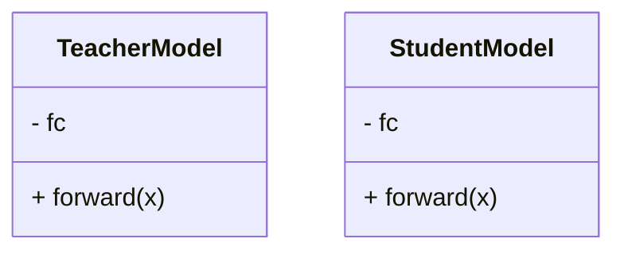

                 


# AI Agent的知识蒸馏与模型压缩

> 关键词：AI Agent, 知识蒸馏, 模型压缩, 机器学习, 深度学习

> 摘要：本文深入探讨了AI Agent中的知识蒸馏与模型压缩技术，分析了其核心原理、算法实现、系统架构设计以及实际应用场景。通过详细的技术分析和案例解读，帮助读者全面理解如何通过知识蒸馏与模型压缩优化AI Agent的性能和效率。

---

# 第1章: AI Agent与知识蒸馏概述

## 1.1 AI Agent的基本概念

### 1.1.1 AI Agent的定义与特点

AI Agent（人工智能代理）是指在特定环境中能够感知并自主行动以实现目标的智能实体。它具备以下特点：
- **自主性**：能够在没有外部干预的情况下独立运作。
- **反应性**：能够感知环境并实时调整行为。
- **目标导向**：所有行动都围绕实现特定目标展开。
- **学习能力**：通过经验改进自身性能。

### 1.1.2 AI Agent的应用场景

AI Agent广泛应用于多个领域，包括：
- **自然语言处理**：如智能对话系统、机器翻译。
- **推荐系统**：个性化推荐、行为预测。
- **自动驾驶**：路径规划、环境感知。
- **游戏AI**：策略优化、游戏对抗。

### 1.1.3 知识蒸馏的背景与意义

知识蒸馏是一种从复杂模型中提取知识到简单模型的技术，其意义在于：
- **降低计算成本**：减少模型的训练和推理资源消耗。
- **提高模型效率**：在保持性能的同时，提升模型的运行速度。
- **扩展应用场景**：在资源受限的环境中部署复杂模型。

---

## 1.2 知识蒸馏的核心原理

### 1.2.1 知识蒸馏的基本概念

知识蒸馏通过将教师模型（Teacher）的知识迁移到学生模型（Student），使学生模型在教师模型的指导下，快速掌握复杂任务。

### 1.2.2 知识蒸馏的关键步骤

1. **教师模型训练**：训练一个高性能的复杂模型作为教师。
2. **蒸馏过程**：通过蒸馏损失函数，将教师的知识迁移到学生模型中。
3. **学生模型优化**：通过蒸馏过程优化学生模型的参数，使其接近教师模型的表现。

### 1.2.3 知识蒸馏与传统机器学习的区别

| 对比维度         | 知识蒸馏                          | 传统机器学习                |
|------------------|-----------------------------------|-----------------------------|
| 数据需求         | 需要教师模型生成软标签            | 需要大量标注数据              |
| 模型复杂度       | 教师模型复杂，学生模型简单          | 通常使用复杂模型              |
| 训练效率         | 训练时间较短，资源消耗较低          | 训练时间较长，资源消耗较高      |

---

## 1.3 模型压缩技术的基本原理

### 1.3.1 模型压缩的定义与目标

模型压缩是指通过多种技术手段，减少模型的参数数量或计算复杂度，同时保持模型性能不变。

### 1.3.2 模型压缩的主要方法

1. **参数剪枝**：去除模型中冗余的参数。
2. **模型量化**：将模型参数从高精度（如浮点数）降低到低精度（如定点数）。
3. **知识蒸馏**：通过蒸馏技术将知识迁移到更小的模型中。

### 1.3.3 模型压缩与知识蒸馏的关系

模型压缩与知识蒸馏可以协同工作，知识蒸馏可以帮助模型压缩过程中保持性能，而模型压缩可以进一步减少蒸馏后的模型规模。

---

## 1.4 本章小结

本章介绍了AI Agent的基本概念及其应用场景，重点分析了知识蒸馏的核心原理及其与传统机器学习的区别，最后探讨了模型压缩的基本原理及其与知识蒸馏的关系。

---

# 第2章: 知识蒸馏的算法原理

## 2.1 知识蒸馏的基本算法

### 2.1.1 直接蒸馏法

直接蒸馏法是最简单的蒸馏方法，教师模型直接生成概率分布，学生模型通过最小化蒸馏损失函数进行优化。

$$ L_{dist} = -\sum_{i} p_{soft}(y_i|x) \log p_{hard}(y_i|x) $$

其中，$p_{soft}(y|x)$ 是教师模型的软标签，$p_{hard}(y|x)$ 是学生模型的预测概率。

### 2.1.2 软标签蒸馏法

软标签蒸馏法通过将教师模型的预测结果进行软化处理，生成平滑的概率分布，从而降低蒸馏过程中的不确定性。

### 2.1.3 硬标签蒸馏法

硬标签蒸馏法直接使用教师模型的预测类别作为硬标签，学生模型通过最小化分类损失函数进行优化。

---

## 2.2 知识蒸馏的改进算法

### 2.2.1 注意力机制蒸馏

注意力机制蒸馏通过引入注意力机制，使学生模型能够关注教师模型的关键特征。

$$ \alpha_i = \frac{\exp(f_{student}(x_i))}{\sum_j \exp(f_{student}(x_j))} $$

### 2.2.2 自适应蒸馏

自适应蒸馏通过动态调整蒸馏过程中的参数，以适应不同的数据分布。

### 2.2.3 多任务蒸馏

多任务蒸馏将多个任务的知识迁移到学生模型中，提升模型的泛化能力。

---

## 2.3 知识蒸馏的数学模型与公式

### 2.3.1 蒸馏损失函数

$$ L_{dist} = \alpha L_{cls} + (1-\alpha) L_{dist} $$

其中，$\alpha$ 是蒸馏系数，$L_{cls}$ 是分类损失，$L_{dist}$ 是蒸馏损失。

### 2.3.2 软标签生成公式

$$ p_{soft}(y|x) = \text{Softmax}(f_{teacher}(x)) $$

其中，$f_{teacher}(x)$ 是教师模型的输出。

---

## 2.4 知识蒸馏的算法实现

### 2.4.1 算法实现步骤

1. 训练教师模型。
2. 初始化学生模型。
3. 计算蒸馏损失。
4. 优化学生模型参数。

### 2.4.2 Python代码实现

```python
import torch
import torch.nn as nn
import torch.optim as optim

class TeacherModel(nn.Module):
    def __init__(self):
        super(TeacherModel, self).__init__()
        self.fc = nn.Linear(10, 5)

class StudentModel(nn.Module):
    def __init__(self):
        super(StudentModel, self).__init__()
        self.fc = nn.Linear(10, 5)

teacher = TeacherModel()
student = StudentModel()
optimizer = optim.Adam(student.parameters(), lr=0.001)
criterion = nn.CrossEntropyLoss()

for batch in dataloader:
    inputs, labels = batch
    teacher_outputs = teacher(inputs)
    student_outputs = student(inputs)
    loss_dist = -torch.mean(torch.sum(teacher_outputs * torch.log(student_outputs), dim=1))
    loss = criterion(student_outputs, labels) + loss_dist
    optimizer.zero_grad()
    loss.backward()
    optimizer.step()
```

---

## 2.5 本章小结

本章详细讲解了知识蒸馏的基本算法及其改进方法，通过数学公式和Python代码展示了蒸馏过程的具体实现。

---

# 第3章: 模型压缩技术的原理与实现

## 3.1 模型压缩的核心方法

### 3.1.1 参数剪枝

参数剪枝通过去除模型中冗余的参数，减少模型的复杂度。

### 3.1.2 模型量化

模型量化通过将模型参数从高精度（如32位浮点数）降低到低精度（如8位整数），减少模型的存储和计算开销。

### 3.1.3 知识蒸馏

知识蒸馏通过将教师模型的知识迁移到学生模型中，实现模型压缩。

---

## 3.2 模型压缩的数学模型与公式

### 3.2.1 量化公式

$$ q(x) = \text{round}\left(\frac{x}{\Delta}\right) $$

其中，$\Delta$ 是量化间隔。

### 3.2.2 剪枝公式

$$ w' = \text{sign}(w) \times \text{max}(|w| - \theta, 0) $$

其中，$\theta$ 是剪枝阈值。

---

## 3.3 模型压缩的实现步骤

1. 训练教师模型。
2. 初始化学生模型。
3. 剪枝或量化模型参数。
4. 优化学生模型参数。

---

## 3.4 模型压缩的Python代码实现

```python
import torch
import torch.nn as nn
import torch.optim as optim

class TeacherModel(nn.Module):
    def __init__(self):
        super(TeacherModel, self).__init__()
        self.fc = nn.Linear(10, 5)

class StudentModel(nn.Module):
    def __init__(self):
        super(StudentModel, self).__init__()
        self.fc = nn.Linear(10, 5)

teacher = TeacherModel()
student = StudentModel()
optimizer = optim.Adam(student.parameters(), lr=0.001)
criterion = nn.CrossEntropyLoss()

for batch in dataloader:
    inputs, labels = batch
    teacher_outputs = teacher(inputs)
    student_outputs = student(inputs)
    loss = criterion(student_outputs, labels)
    optimizer.zero_grad()
    loss.backward()
    optimizer.step()
```

---

## 3.5 本章小结

本章介绍了模型压缩的核心方法及其数学模型，通过Python代码展示了模型压缩的具体实现。

---

# 第4章: 知识蒸馏与模型压缩的协同优化

## 4.1 知识蒸馏与模型压缩的协同优化原理

知识蒸馏与模型压缩可以协同工作，通过蒸馏过程优化模型性能，同时通过模型压缩减少模型规模。

---

## 4.2 知识蒸馏与模型压缩的协同优化算法

### 4.2.1 算法步骤

1. 训练教师模型。
2. 初始化学生模型。
3. 通过蒸馏过程优化学生模型。
4. 通过模型压缩减少学生模型规模。

### 4.2.2 Python代码实现

```python
import torch
import torch.nn as nn
import torch.optim as optim

class TeacherModel(nn.Module):
    def __init__(self):
        super(TeacherModel, self).__init__()
        self.fc = nn.Linear(10, 5)

class StudentModel(nn.Module):
    def __init__(self):
        super(StudentModel, self).__init__()
        self.fc = nn.Linear(10, 5)

teacher = TeacherModel()
student = StudentModel()
optimizer = optim.Adam(student.parameters(), lr=0.001)
criterion = nn.CrossEntropyLoss()

for batch in dataloader:
    inputs, labels = batch
    teacher_outputs = teacher(inputs)
    student_outputs = student(inputs)
    loss_dist = -torch.mean(torch.sum(teacher_outputs * torch.log(student_outputs), dim=1))
    loss = criterion(student_outputs, labels) + loss_dist
    optimizer.zero_grad()
    loss.backward()
    optimizer.step()
```

---

## 4.3 本章小结

本章探讨了知识蒸馏与模型压缩的协同优化原理及其算法实现。

---

# 第5章: 项目实战——AI Agent的知识蒸馏与模型压缩应用

## 5.1 项目背景与需求分析

本项目旨在通过知识蒸馏与模型压缩技术，优化AI Agent的性能和效率。

---

## 5.2 项目实现

### 5.2.1 环境搭建

安装必要的库：
```bash
pip install torch numpy matplotlib
```

### 5.2.2 知识蒸馏与模型压缩的实现

```python
import torch
import torch.nn as nn
import torch.optim as optim

class TeacherModel(nn.Module):
    def __init__(self):
        super(TeacherModel, self).__init__()
        self.fc = nn.Linear(10, 5)

class StudentModel(nn.Module):
    def __init__(self):
        super(StudentModel, self).__init__()
        self.fc = nn.Linear(10, 5)

teacher = TeacherModel()
student = StudentModel()
optimizer = optim.Adam(student.parameters(), lr=0.001)
criterion = nn.CrossEntropyLoss()

for batch in dataloader:
    inputs, labels = batch
    teacher_outputs = teacher(inputs)
    student_outputs = student(inputs)
    loss_dist = -torch.mean(torch.sum(teacher_outputs * torch.log(student_outputs), dim=1))
    loss = criterion(student_outputs, labels) + loss_dist
    optimizer.zero_grad()
    loss.backward()
    optimizer.step()
```

### 5.2.3 系统功能设计



### 5.2.4 系统架构设计

```mermaid
graph TD
    A[输入数据] -> B[教师模型]
    B -> C[学生模型]
    C -> D[输出结果]
```

### 5.2.5 系统交互设计

```mermaid
sequenceDiagram
    模型训练 -> 教师模型
    模型训练 -> 学生模型
    训练完成 -> 优化器
```

---

## 5.3 实际案例分析

### 5.3.1 案例背景

假设我们有一个图像分类任务，需要通过知识蒸馏与模型压缩技术优化模型性能。

### 5.3.2 案例分析

1. 训练教师模型。
2. 初始化学生模型。
3. 通过蒸馏过程优化学生模型。
4. 通过模型压缩减少学生模型规模。

---

## 5.4 项目小结

本章通过实际案例展示了知识蒸馏与模型压缩技术的应用，帮助读者理解如何将理论应用于实践。

---

# 第6章: 知识蒸馏与模型压缩的未来展望

## 6.1 知识蒸馏与模型压缩技术的进一步发展

未来，知识蒸馏与模型压缩技术将朝着以下几个方向发展：
- **更高效的蒸馏算法**：进一步优化蒸馏过程，减少计算成本。
- **更智能的模型压缩方法**：结合AI技术，实现自适应的模型压缩。
- **跨任务蒸馏**：将多个任务的知识迁移到学生模型中，提升模型的泛化能力。

---

## 6.2 本章小结

本章展望了知识蒸馏与模型压缩技术的未来发展方向，为读者提供了进一步研究的思路。

---

# 第7章: 最佳实践与注意事项

## 7.1 最佳实践

1. **选择合适的蒸馏算法**：根据具体任务选择适合的蒸馏方法。
2. **优化蒸馏系数**：通过实验调整蒸馏系数，找到最佳值。
3. **结合模型压缩技术**：将蒸馏与模型压缩技术结合，进一步优化模型性能。

## 7.2 注意事项

1. **确保教师模型质量**：教师模型的性能直接影响蒸馏效果。
2. **选择合适的蒸馏温度**：蒸馏温度过大或过小都会影响蒸馏效果。
3. **避免过拟合**：在蒸馏过程中，注意防止学生模型过拟合教师模型。

---

# 作者：AI天才研究院 & 禅与计算机程序设计艺术

---

本文通过详细的技术分析和案例解读，帮助读者全面理解AI Agent中的知识蒸馏与模型压缩技术，为实际应用提供了理论支持和实践指导。希望本文能为AI领域的研究和应用提供有价值的参考。

