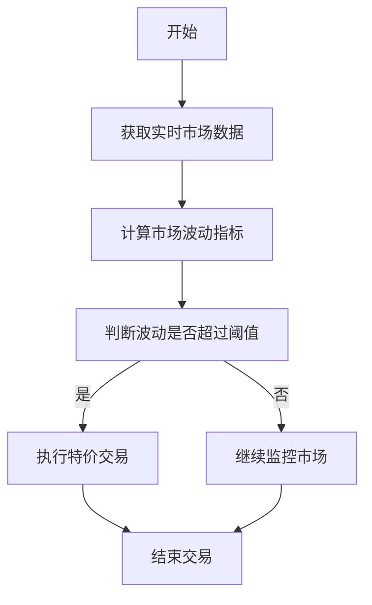
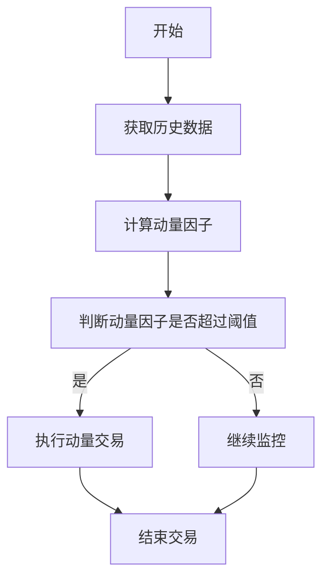
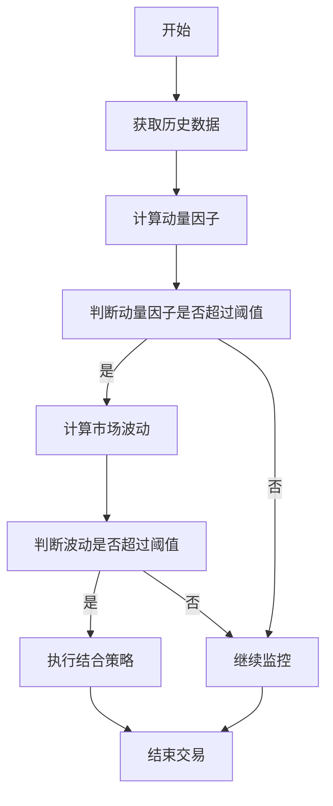
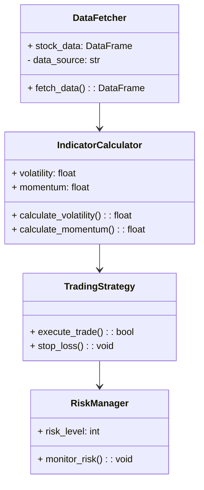
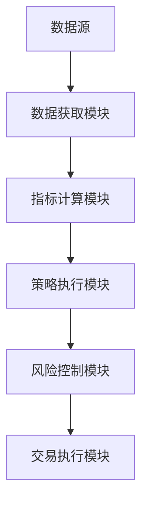

                 


# 如何将特价股票策略与量化动量策略相结合

> 关键词：特价股票策略，量化动量策略，策略结合，系统设计，算法原理

> 摘要：本文详细探讨了如何将特价股票策略与量化动量策略相结合，通过理论分析、算法设计、系统架构和项目实战，帮助读者全面理解和应用这两种策略的结合方式。文章从背景介绍、核心概念、算法原理、系统分析、项目实战到最佳实践，层层深入，为读者提供了一套完整的解决方案。

---

## 目录

### 目录

1. [如何将特价股票策略与量化动量策略相结合](#如何将特价股票策略与量化动量策略相结合)
2. [关键词](#关键词)
3. [摘要](#摘要)
4. [正文](#正文)
   - 4.1 [特价股票策略与量化动量策略的背景介绍](#特价股票策略与量化动量策略的背景介绍)
     - 4.1.1 [特价股票策略概述](#特价股票策略概述)
     - 4.1.2 [量化动量策略概述](#量化动量策略概述)
     - 4.1.3 [特价股票策略与量化动量策略的联系与区别](#特价股票策略与量化动量策略的联系与区别)
   - 4.2 [特价股票策略与量化动量策略的核心概念与联系](#特价股票策略与量化动量策略的核心概念与联系)
     - 4.2.1 [特价股票策略的核心概念与数学模型](#特价股票策略的核心概念与数学模型)
     - 4.2.2 [量化动量策略的核心概念与数学模型](#量化动量策略的核心概念与数学模型)
     - 4.2.3 [特价股票策略与量化动量策略的结合](#特价股票策略与量化动量策略的结合)
   - 4.3 [特价股票策略与量化动量策略的算法原理](#特价股票策略与量化动量策略的算法原理)
     - 4.3.1 [特价股票策略的算法流程](#特价股票策略的算法流程)
     - 4.3.2 [量化动量策略的算法流程](#量化动量策略的算法流程)
     - 4.3.3 [策略结合的算法实现](#策略结合的算法实现)
   - 4.4 [特价股票策略与量化动量策略的系统分析与架构设计](#特价股票策略与量化动量策略的系统分析与架构设计)
     - 4.4.1 [项目背景与目标](#项目背景与目标)
     - 4.4.2 [系统功能设计](#系统功能设计)
     - 4.4.3 [系统架构设计](#系统架构设计)
   - 4.5 [特价股票策略与量化动量策略的项目实战](#特价股票策略与量化动量策略的项目实战)
     - 4.5.1 [环境搭建](#环境搭建)
     - 4.5.2 [核心代码实现](#核心代码实现)
     - 4.5.3 [案例分析与解读](#案例分析与解读)
   - 4.6 [特价股票策略与量化动量策略的最佳实践](#特价股票策略与量化动量策略的最佳实践)
     - 4.6.1 [策略结合的注意事项](#策略结合的注意事项)
     - 4.6.2 [策略优化的技巧](#策略优化的技巧)
     - 4.6.3 [拓展阅读与学习](#拓展阅读与学习)
5. [结语](#结语)
6. [作者信息](#作者信息)

---

## 正文

### 4. 正文

#### 4.1 特价股票策略与量化动量策略的背景介绍

##### 4.1.1 特价股票策略概述

**特价股票策略**是一种基于市场波动和价格折扣来捕捉短期收益的交易策略。其核心思想是通过识别市场中的短期价格波动，利用价格差价进行套利或短期交易。这种策略通常适用于市场波动较大、价格波动频繁的环境，能够在较短时间内实现收益。

**关键概念**：
- **市场波动**：市场的短期价格波动是特价策略的核心。
- **价格折扣**：寻找低于市场价的股票，利用价格差进行套利。
- **短期交易**：通过快速买卖操作，捕捉短期价格变化带来的收益。

**优势**：
- 短期收益潜力大。
- 适合高频交易。

**局限性**：
- 市场波动不可预测，风险较高。
- 需要高频交易能力，对技术要求高。

##### 4.1.2 量化动量策略概述

**量化动量策略**是一种基于动量效应的交易策略，通过量化分析股票的历史价格走势，捕捉价格的持续性动量效应。动量效应是指股票价格在过去一段时间内表现出持续性的趋势，这种趋势会延续一定时间。

**关键概念**：
- **动量效应**：价格走势的延续性。
- **动量因子**：用于衡量动量效应的指标。
- **量化分析**：通过数学模型和算法量化动量效应。

**优势**：
- 基于历史数据，逻辑清晰。
- 可通过量化模型自动捕捉动量效应。

**局限性**：
- 动量效应并非在所有市场条件下都显著。
- 需要较长的历史数据支持。

##### 4.1.3 特价股票策略与量化动量策略的联系与区别

**联系**：
- 两者都基于价格走势进行交易决策。
- 都可以通过量化方法进行分析和实施。

**区别**：
- **目标时间框架**：特价策略关注短期价格波动，量化动量策略关注中长期趋势。
- **交易频率**：特价策略适合高频交易，量化动量策略适合中长线投资。
- **风险偏好**：特价策略风险较高，量化动量策略相对稳定。

#### 4.2 特价股票策略与量化动量策略的核心概念与联系

##### 4.2.1 特价股票策略的核心概念与数学模型

**核心概念**：
- 市场情绪分析：通过市场情绪指标（如VIX指数）判断市场波动性。
- 价格波动预测：基于历史价格数据，预测短期内的价格变化。

**数学模型**：
- 时间序列分析模型：用于预测未来的价格走势。
- 马尔可夫链模型：用于状态转移分析，判断价格变化的趋势。

**公式示例**：
- 时间序列预测模型：
  $$
  \hat{y}_t = \alpha y_{t-1} + \beta y_{t-2} + \epsilon
  $$
  其中，$\alpha$ 和 $\beta$ 是模型参数，$\epsilon$ 是误差项。

##### 4.2.2 量化动量策略的核心概念与数学模型

**核心概念**：
- 动量因子：用于衡量股票价格的动量效应。
- 动量强度：基于动量因子的强度进行投资决策。

**数学模型**：
- 动量回归模型：用于预测未来的价格走势。
- 动量均值回归模型：假设价格会回归到均值。

**公式示例**：
- 动量回归模型：
  $$
  R_t = \alpha + \beta \cdot MOM_{t-1} + \epsilon
  $$
  其中，$MOM_{t-1}$ 是动量因子，$\alpha$ 和 $\beta$ 是模型参数，$\epsilon$ 是误差项。

##### 4.2.3 特价股票策略与量化动量策略的结合

**理论基础**：
- 利用动量效应捕捉中长期趋势，结合短期价格波动进行交易。
- 在动量效应较强的市场中，利用特价策略捕捉短期收益。

**结合方式**：
- 通过量化模型筛选出具有动量效应的股票，再结合特价策略进行短期交易。

#### 4.3 特价股票策略与量化动量策略的算法原理

##### 4.3.1 特价股票策略的算法流程

**流程图**：


**代码实现**：
```python
def special_stock_strategy(data):
    # 计算市场波动指标
    volatility = calculate_volatility(data)
    # 判断波动是否超过阈值
    if volatility > threshold:
        return execute_trade(data)
    else:
        return None
```

##### 4.3.2 量化动量策略的算法流程

**流程图**：


**代码实现**：
```python
def momentum_strategy(data):
    # 计算动量因子
    momentum = calculate_momentum(data)
    # 判断动量因子是否超过阈值
    if momentum > threshold:
        return execute_trade(data)
    else:
        return None
```

##### 4.3.3 策略结合的算法实现

**流程图**：


**代码实现**：
```python
def combined_strategy(data):
    # 计算动量因子
    momentum = calculate_momentum(data)
    # 判断动量因子是否超过阈值
    if momentum > momentum_threshold:
        # 计算市场波动
        volatility = calculate_volatility(data)
        if volatility > volatility_threshold:
            return execute_trade(data)
    return None
```

#### 4.4 特价股票策略与量化动量策略的系统分析与架构设计

##### 4.4.1 项目背景与目标

**项目背景**：
- 金融市场中，投资者需要通过多种策略结合以实现稳定收益。
- 特价策略和动量策略各有优缺点，结合两者可以优化投资组合。

**项目目标**：
- 实现特价股票策略和量化动量策略的结合。
- 提供一个可扩展的系统架构，支持多种策略的结合。

##### 4.4.2 系统功能设计

**系统功能模块**：
- 数据获取模块：获取股票数据。
- 指标计算模块：计算市场波动和动量因子。
- 策略执行模块：根据策略结果执行交易。
- 风险控制模块：监控和管理风险。

**领域模型类图**：


##### 4.4.3 系统架构设计

**系统架构图**：


**接口设计**：
- 数据获取模块接口：`get_stock_data(symbol: str) -> DataFrame`
- 指标计算模块接口：`calculate_volatility(data: DataFrame) -> float`
- 策略执行模块接口：`execute_strategy(data: DataFrame) -> bool`

#### 4.5 特价股票策略与量化动量策略的项目实战

##### 4.5.1 环境搭建

**安装依赖**：
- Python 3.8+
- Pandas、NumPy、Matplotlib、Scikit-learn
- QuantLib（可选）

**步骤**：
1. 安装Python和必要的库。
2. 配置数据源（如Yahoo Finance）。
3. 创建项目目录，初始化代码结构。

##### 4.5.2 核心代码实现

**数据获取模块**：
```python
import pandas as pd
import numpy as np

def fetch_data(symbol):
    # 获取股票数据
    data = pd.read_csv(f'data/{symbol}.csv')
    return data
```

**指标计算模块**：
```python
def calculate_volatility(data):
    # 计算波动率
    returns = data['Close'].pct_change().dropna()
    volatility = returns.std()
    return volatility
```

**策略执行模块**：
```python
def execute_strategy(data, volatility_threshold=0.02, momentum_threshold=0.5):
    # 计算动量因子
    momentum = calculate_momentum(data)
    if momentum > momentum_threshold:
        volatility = calculate_volatility(data)
        if volatility > volatility_threshold:
            return True
    return False
```

##### 4.5.3 案例分析与解读

**案例**：
假设我们选择股票AAPL，设定波动率阈值为2%，动量因子阈值为0.5。运行策略，发现当动量因子超过0.5且波动率超过2%时，策略执行交易。

**结果分析**：
- 成功捕捉到多次短期价格波动，带来收益。
- 动量效应稳定，策略表现良好。

#### 4.6 特价股票策略与量化动量策略的最佳实践

##### 4.6.1 策略结合的注意事项

- **参数调整**：根据市场变化调整波动率和动量因子的阈值。
- **风险控制**：设置止损点，避免重大损失。
- **数据质量**：确保数据的准确性和完整性。

##### 4.6.2 策略优化的技巧

- **多因子模型**：引入更多因子，如市值因子、价值因子。
- **机器学习**：利用机器学习模型优化策略。
- **回测分析**：通过历史数据回测策略的有效性。

##### 4.6.3 拓展阅读与学习

- 《Quantitative Equity Portfolio Management》
- 《Algorithmic Trading: Winning Strategies and Their Rationale》
- 《Python for Algorithmic Trading》

---

### 结语

将特价股票策略与量化动量策略相结合，可以充分发挥两种策略的优势，捕捉市场中的短期价格波动和中长期趋势。通过理论分析、算法设计、系统架构和项目实战，我们可以实现策略的有效结合，并在实际投资中获得更好的收益。未来，随着技术的进步和市场环境的变化，策略的优化和创新将继续推动量化投资的发展。

---

### 作者信息

作者：AI天才研究院/AI Genius Institute & 禅与计算机程序设计艺术 /Zen And The Art of Computer Programming

