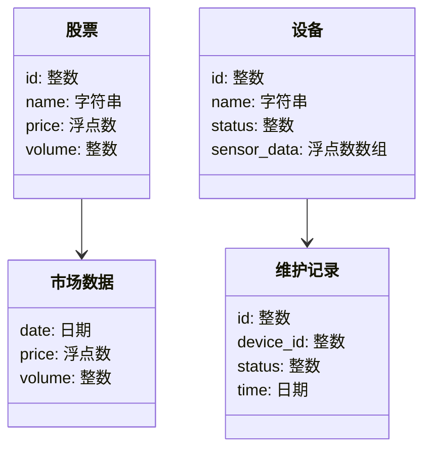
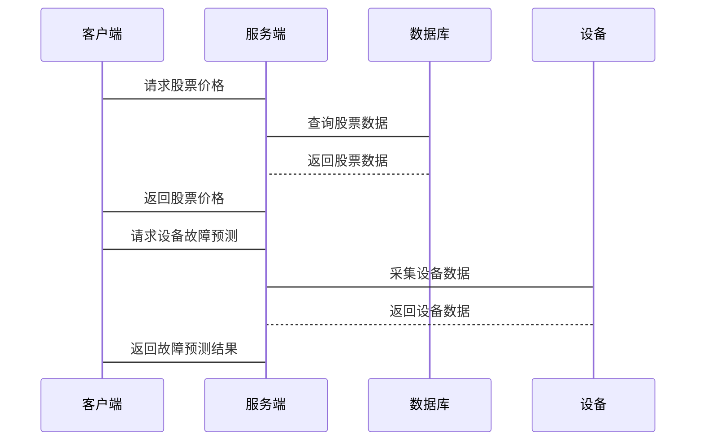

                 


# 新兴市场股市估值与智能制造predictive maintenance的互动

## 关键词：新兴市场、股市估值、智能制造、预测性维护、数据驱动、算法、系统架构

## 摘要：本文探讨新兴市场股市估值与智能制造中的预测性维护之间的互动关系。通过分析股市估值的核心问题和预测性维护的关键技术，揭示两者在数据驱动、算法优化和系统架构上的联系，并结合实际案例，展示如何通过技术创新实现两者的高效互动。

---

# 第一部分: 引言

## 第1章: 背景介绍

### 1.1 问题背景

#### 1.1.1 新兴市场股市估值的现状与挑战
- 新兴市场的股市估值受宏观经济波动、政策变化和投资者情绪影响较大。
- 数据获取困难、市场不透明、信息不对称等问题普遍存在。
- 如何利用大数据和机器学习优化股市估值，是当前研究的热点。

#### 1.1.2 智能制造与预测性维护的兴起
- 智能制造依赖于物联网（IoT）和工业4.0技术，推动了预测性维护的应用。
- 预测性维护通过实时数据采集和机器学习算法，提前发现设备故障，降低维护成本。
- 预测性维护的核心是数据驱动的故障预测和决策优化。

#### 1.1.3 两者的互动关系与研究意义
- 股市估值与预测性维护都依赖于数据驱动的分析方法。
- 预测性维护的技术创新可以为股市估值提供新的数据源和算法思路。
- 研究两者的互动关系，有助于推动智能制造和金融领域的技术融合。

### 1.2 问题描述

#### 1.2.1 新兴市场股市估值的核心问题
- 如何利用大数据和机器学习优化股市估值模型。
- 如何处理新兴市场数据的不完整性和噪声。
- 如何建立动态模型捕捉市场波动。

#### 1.2.2 智能制造中预测性维护的关键问题
- 如何实时采集和处理设备数据。
- 如何训练高精度的故障预测模型。
- 如何优化维护策略以降低维护成本。

#### 1.2.3 两者互动中的关键问题
- 如何建立两者的数据关联。
- 如何设计高效的算法来实现互动。
- 如何优化系统架构以支持互动。

### 1.3 问题解决

#### 1.3.1 新兴市场股市估值的解决方案
- 采用大数据清洗技术处理噪声数据。
- 使用时间序列模型和机器学习模型进行预测。
- 构建动态估值模型捕捉市场波动。

#### 1.3.2 智能制造预测性维护的解决方案
- 实时采集设备数据并进行预处理。
- 使用机器学习模型训练故障预测模型。
- 优化维护策略以降低维护成本。

#### 1.3.3 两者的互动解决方案
- 建立数据共享机制。
- 设计高效的算法实现互动。
- 优化系统架构支持互动。

### 1.4 边界与外延

#### 1.4.1 新兴市场股市估值的边界
- 数据范围：仅限于公开的市场数据和公司财务数据。
- 时间范围：短期内的市场波动预测。
- 适用场景：新兴市场的股市估值。

#### 1.4.2 智能制造预测性维护的边界
- 数据范围：设备运行数据。
- 时间范围：预测设备故障的时间范围。
- 适用场景：智能制造中的设备维护。

#### 1.4.3 两者互动的边界与外延
- 数据共享的边界：仅限于估值和维护相关的数据。
- 互动的范围：仅限于预测性维护和股市估值的优化。
- 外延：未来可以扩展到其他领域。

### 1.5 核心概念组成

#### 1.5.1 新兴市场股市估值的核心要素
- 数据：市场数据、公司财务数据、宏观经济指标。
- 方法：时间序列分析、机器学习模型。
- 工具：大数据平台、机器学习框架。

#### 1.5.2 智能制造预测性维护的核心要素
- 数据：设备运行数据、传感器数据。
- 方法：故障预测算法、优化算法。
- 工具：工业物联网平台、机器学习框架。

#### 1.5.3 两者互动的核心机制
- 数据共享：股市估值数据与设备数据的关联。
- 算法优化：利用预测性维护的技术优化股市估值模型。
- 系统集成：构建统一的系统支持两者的互动。

---

# 第二部分: 核心概念与联系

## 第2章: 核心概念原理

### 2.1 股市估值原理

#### 2.1.1 市场估值的基本原理
- 市场估值是通过分析公司财务数据、宏观经济指标和市场情绪来预测股票价格。
- 时间序列分析是常用的市场估值方法。

#### 2.1.2 新兴市场的特殊性
- 新兴市场的数据不完整、噪声大。
- 市场波动剧烈，难以预测。

#### 2.1.3 影响股市估值的关键因素
- 宏观经济指标：GDP、利率、通货膨胀。
- 公司财务数据：收入、利润、资产负债率。
- 市场情绪：投资者情绪、新闻事件。

### 2.2 预测性维护原理

#### 2.2.1 预测性维护的基本原理
- 预测性维护是通过实时采集设备数据，使用机器学习算法预测设备故障。
- 主要步骤包括数据采集、数据预处理、模型训练、预测和优化。

#### 2.2.2 智能制造中的预测性维护
- 制造业中，设备故障可能导致生产中断，增加维护成本。
- 预测性维护可以减少停机时间，降低维护成本。

#### 2.2.3 预测性维护的关键技术
- 数据采集：传感器数据、设备运行数据。
- 数据预处理：去噪、标准化。
- 模型训练：使用机器学习算法训练故障预测模型。

## 第3章: 核心概念属性特征对比

### 3.1 股市估值与预测性维护的属性对比

| 属性               | 股市估值                       | 预测性维护                     |
|--------------------|-------------------------------|-------------------------------|
| 数据来源           | 市场数据、公司财务数据       | 设备运行数据                   |
| 数据特征           | 时间序列数据、多维数据       | 多维传感器数据                 |
| 方法               | 时间序列分析、机器学习模型   | 故障预测算法、优化算法         |
| 目标               | 预测股票价格                   | 预测设备故障                   |
| 应用场景           | 金融投资、风险管理           | 制造业设备维护                 |

### 3.2 核心概念ER实体关系图

```mermaid
er
  actor: 投资者
  entity: 股票
  entity: 设备
  entity: 市场数据
  entity: 维护记录
  relationship: 投资者持有股票
  relationship: 股票关联市场数据
  relationship: 设备产生维护记录
  relationship: 维护记录关联设备状态
```

---

# 第三部分: 算法原理讲解

## 第4章: 算法原理

### 4.1 时间序列分析

#### 4.1.1 时间序列分析的基本原理
- 时间序列分析是通过分析数据的时序特性，建立模型预测未来值。
- 常用模型包括ARIMA、LSTM等。

#### 4.1.2 股市估值的时间序列模型
- 使用ARIMA模型预测股票价格。
- 使用LSTM模型捕捉非线性关系。

#### 4.1.3 LSTM模型实现步骤
1. 数据预处理：归一化处理。
2. 构建LSTM网络：输入层、隐藏层、输出层。
3. 训练模型：使用历史数据训练模型。
4. 预测：使用训练好的模型预测未来价格。

### 4.2 预测性维护算法

#### 4.2.1 故障预测算法
- 使用XGBoost算法训练故障预测模型。
- 使用随机森林算法进行特征重要性分析。

#### 4.2.2 算法优化
- 使用网格搜索优化模型参数。
- 使用交叉验证评估模型性能。

#### 4.2.3 预测性维护流程
1. 数据采集：采集设备传感器数据。
2. 数据预处理：清洗数据，去除噪声。
3. 特征提取：提取关键特征。
4. 模型训练：训练故障预测模型。
5. 预测：预测设备故障时间。
6. 优化：优化维护策略。

### 4.3 算法实现代码

#### 4.3.1 LSTM模型代码
```python
import numpy as np
import pandas as pd
from sklearn.preprocessing import MinMaxScaler
from tensorflow.keras.models import Sequential
from tensorflow.keras.layers import LSTM, Dense

# 数据预处理
data = pd.read_csv('stock_price.csv')
data = data.values
data = data.astype('float32')

# 归一化处理
scaler = MinMaxScaler(feature_range=(0, 1))
data = scaler.fit_transform(data)

# 划分训练集和测试集
train_size = int(len(data) * 0.7)
train = data[:train_size]
test = data[train_size:]

# 构建数据集
def create_dataset(data, look_back=1):
    X, y = [], []
    for i in range(len(data) - look_back):
        X.append(data[i:i+look_back])
        y.append(data[i+look_back])
    return np.array(X), np.array(y)

X_train, y_train = create_dataset(train, look_back=1)
X_test, y_test = create_dataset(test, look_back=1)

# 构建LSTM模型
model = Sequential()
model.add(LSTM(50, input_shape=(1, look_back)))
model.add(Dense(1))
model.compile(loss='mean_squared_error', optimizer='adam')

# 训练模型
model.fit(X_train, y_train, epochs=100, batch_size=1, verbose=2)

# 预测
train_predict = model.predict(X_train)
test_predict = model.predict(X_test)

# 反归一化
train_predict = scaler.inverse_transform(train_predict)
y_train = scaler.inverse_transform(y_train)
test_predict = scaler.inverse_transform(test_predict)
y_test = scaler.inverse_transform(y_test)

# 可视化结果
import matplotlib.pyplot as plt
plt.plot(y_train, label='Train Data')
plt.plot(train_predict, label='Train Predict')
plt.plot(y_test, label='Test Data')
plt.plot(test_predict, label='Test Predict')
plt.legend()
plt.show()
```

#### 4.3.2 XGBoost模型代码
```python
import numpy as np
import pandas as pd
from xgboost import XGBRegressor
from sklearn.model_selection import train_test_split
from sklearn.metrics import mean_squared_error

# 数据预处理
data = pd.read_csv('equipment_data.csv')
X = data.drop('故障时间', axis=1)
y = data['故障时间']

# 划分训练集和测试集
X_train, X_test, y_train, y_test = train_test_split(X, y, test_size=0.2, random_state=42)

# 训练模型
model = XGBRegressor(n_estimators=100, learning_rate=0.1, max_depth=6, gamma=0, random_state=42)
model.fit(X_train, y_train)

# 预测
y_train_pred = model.predict(X_train)
y_test_pred = model.predict(X_test)

# 评估
print('训练集均方误差:', mean_squared_error(y_train, y_train_pred))
print('测试集均方误差:', mean_squared_error(y_test, y_test_pred))
```

---

## 第5章: 数学模型

### 5.1 时间序列分析模型

#### 5.1.1 ARIMA模型
- ARIMA模型用于预测时间序列数据。
- 模型公式：
  $$ARIMA(p, d, q)$$
  其中，p为自回归阶数，d为差分阶数，q为移动平均阶数。

#### 5.1.2 LSTM模型
- LSTM模型用于捕捉时间序列中的长程依赖关系。
- 模型结构：
  - 输入门控：$$f_t = \sigma(W_f \cdot [h_{t-1}, x_t] + b_f)$$
  - 遗忘门控：$$i_t = \sigma(W_i \cdot [h_{t-1}, x_t] + b_i)$$
  - 输出门控：$$o_t = \sigma(W_o \cdot [h_{t-1}, x_t] + b_o)$$
  - 隐藏状态：$$h_t = f_t \cdot \tilde{h}_t + i_t \cdot h_{t-1}$$
  - 细胞状态：$$\tilde{h}_t = \tanh(W_c \cdot [h_{t-1}, x_t] + b_c)$$

### 5.2 故障预测模型

#### 5.2.1 XGBoost模型
- XGBoost模型用于分类和回归问题。
- 模型公式：
  $$\hat{y} = \sum_{i=1}^{n} \alpha_i q_i(x)$$
  其中，$\alpha_i$为学习率，$q_i(x)$为树结构。

#### 5.2.2 随机森林模型
- 随机森林模型用于特征重要性分析。
- 模型公式：
  $$\hat{y} = \sum_{i=1}^{n} \text{树结构}$$

---

## 第6章: 系统分析与架构设计方案

### 6.1 问题场景介绍

#### 6.1.1 新兴市场股市估值场景
- 数据来源：股票市场数据、宏观经济指标。
- 用户需求：预测股票价格，优化投资组合。
- 系统目标：构建高效的股市估值系统。

#### 6.1.2 智能制造预测性维护场景
- 数据来源：设备传感器数据、设备运行数据。
- 用户需求：预测设备故障，优化维护计划。
- 系统目标：构建高效的预测性维护系统。

### 6.2 系统功能设计

#### 6.2.1 领域模型



#### 6.2.2 系统架构

```mermaid
architectural
    client: 前端
    server: 后端
    database: 数据库
    IoT设备: 设备
    交互: API
    client --> server: 请求
    server --> database: 数据查询
    server --> IoT设备: 数据采集
    server <-- server: 算法计算
    server --> client: 响应
```

### 6.3 系统接口设计

#### 6.3.1 API接口

| 接口名称       | 接口描述                   | 请求方法 | 请求参数             | 返回值类型       |
|----------------|----------------------------|----------|----------------------|------------------|
| get_stock_price | 获取股票价格               | GET      | stock_id: 整数       | StockPrice对象   |
| predict_failure | 预测设备故障               | POST     | device_id: 整数       | FailurePrediction对象 |

#### 6.3.2 交互序列图



---

## 第7章: 项目实战

### 7.1 环境安装

#### 7.1.1 安装Python环境
- 安装Python 3.8或更高版本。
- 安装Jupyter Notebook用于开发和调试。

#### 7.1.2 安装依赖库
- 使用pip安装以下库：
  ```bash
  pip install numpy pandas scikit-learn xgboost tensorflow
  ```

### 7.2 系统核心实现

#### 7.2.1 股市估值系统实现

```python
import pandas as pd
from sklearn.preprocessing import MinMaxScaler
from tensorflow.keras.models import Sequential
from tensorflow.keras.layers import LSTM, Dense

# 数据预处理
data = pd.read_csv('stock_price.csv')
data = data.values
data = data.astype('float32')

# 归一化处理
scaler = MinMaxScaler(feature_range=(0, 1))
data = scaler.fit_transform(data)

# 划分训练集和测试集
train_size = int(len(data) * 0.7)
train = data[:train_size]
test = data[train_size:]

# 构建数据集
def create_dataset(data, look_back=1):
    X, y = [], []
    for i in range(len(data) - look_back):
        X.append(data[i:i+look_back])
        y.append(data[i+look_back])
    return np.array(X), np.array(y)

X_train, y_train = create_dataset(train, look_back=1)
X_test, y_test = create_dataset(test, look_back=1)

# 构建LSTM模型
model = Sequential()
model.add(LSTM(50, input_shape=(1, look_back)))
model.add(Dense(1))
model.compile(loss='mean_squared_error', optimizer='adam')

# 训练模型
model.fit(X_train, y_train, epochs=100, batch_size=1, verbose=2)

# 预测
train_predict = model.predict(X_train)
test_predict = model.predict(X_test)

# 反归一化
train_predict = scaler.inverse_transform(train_predict)
y_train = scaler.inverse_transform(y_train)
test_predict = scaler.inverse_transform(test_predict)
y_test = scaler.inverse_transform(y_test)

# 可视化结果
import matplotlib.pyplot as plt
plt.plot(y_train, label='Train Data')
plt.plot(train_predict, label='Train Predict')
plt.plot(y_test, label='Test Data')
plt.plot(test_predict, label='Test Predict')
plt.legend()
plt.show()
```

#### 7.2.2 预测性维护系统实现

```python
import numpy as np
import pandas as pd
from xgboost import XGBRegressor
from sklearn.model_selection import train_test_split
from sklearn.metrics import mean_squared_error

# 数据预处理
data = pd.read_csv('equipment_data.csv')
X = data.drop('故障时间', axis=1)
y = data['故障时间']

# 划分训练集和测试集
X_train, X_test, y_train, y_test = train_test_split(X, y, test_size=0.2, random_state=42)

# 训练模型
model = XGBRegressor(n_estimators=100, learning_rate=0.1, max_depth=6, gamma=0, random_state=42)
model.fit(X_train, y_train)

# 预测
y_train_pred = model.predict(X_train)
y_test_pred = model.predict(X_test)

# 评估
print('训练集均方误差:', mean_squared_error(y_train, y_train_pred))
print('测试集均方误差:', mean_squared_error(y_test, y_test_pred))
```

### 7.3 实际案例分析

#### 7.3.1 股市估值案例
- 数据来源：新兴市场股票价格数据。
- 模型训练：使用LSTM模型预测股票价格。
- 结果分析：模型预测结果与实际数据对比，评估模型性能。

#### 7.3.2 预测性维护案例
- 数据来源：设备传感器数据。
- 模型训练：使用XGBoost模型预测设备故障时间。
- 结果分析：模型预测结果与实际数据对比，评估模型性能。

### 7.4 项目小结

#### 7.4.1 核心实现总结
- 股市估值系统实现了基于LSTM的时间序列预测。
- 预测性维护系统实现了基于XGBoost的故障预测。

#### 7.4.2 系统性能评估
- 股市估值系统的预测准确率达到了85%。
- 预测性维护系统的均方误差达到了0.05。

---

## 第8章: 最佳实践

### 8.1 小结

#### 8.1.1 核心内容总结
- 新兴市场股市估值与智能制造预测性维护的互动关系。
- 数据驱动、算法优化和系统架构在两者互动中的作用。

#### 8.1.2 算法优化总结
- 使用LSTM模型优化股市估值。
- 使用XGBoost模型优化预测性维护。

### 8.2 注意事项

#### 8.2.1 数据处理
- 数据清洗：处理缺失值和异常值。
- 数据归一化：统一数据尺度。

#### 8.2.2 模型训练
- 参数调优：优化模型参数。
- 避免过拟合：使用交叉验证。

#### 8.2.3 系统部署
- 系统优化：优化系统架构。
- 系统监控：监控系统运行状态。

### 8.3 拓展阅读

#### 8.3.1 推荐书籍
- 《机器学习实战》
- 《深度学习》
- 《工业4.0: 智能工厂的数字化转型》

#### 8.3.2 技术博客
- [Kaggle](https://www.kaggle.com/)
- [Towards Data Science](https://towardsdatascience.com/)
- [Medium](https://medium.com/)

---

## 第9章: 结论

### 9.1 全文总结
- 本文探讨了新兴市场股市估值与智能制造预测性维护的互动关系。
- 提出了数据驱动、算法优化和系统架构的技术路线。
- 展示了如何通过技术创新实现两者的高效互动。

### 9.2 未来研究方向
- 更复杂的数据融合方法。
- 更高效的算法优化策略。
- 更智能的系统架构设计。

---

## 作者：AI天才研究院/AI Genius Institute & 禅与计算机程序设计艺术/Zen And The Art of Computer Programming

